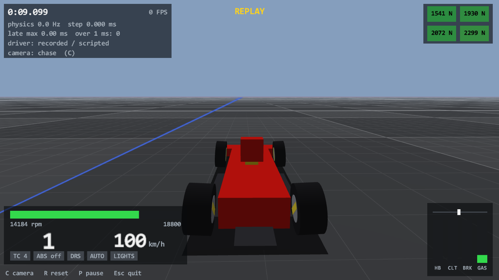

# First drive (Task 11)

## Resume here

State after the last commit (kept up to date with every commit):

- **Everything of Task 11 is built and checked**; this report is complete. Nothing is half done.
- The crate is `crates/rustyac-game` (`target/release/rustyac.exe`). Its checks: `cargo test --release -p
  rustyac-game` (33 unit tests, 5 replay tests) and `tools/chassis_compare/target/release/chassis_compare
  game-replay [--dir <folder>]`. The review's 22 points are all dealt with (section 4.6).
- Scratch of this task (git-ignored): `re/scratch/task11/` (`spec_*.md` are the three briefs read from the
  disassembly, `timing_*.log` / `shm_*.csv` the check outputs, `patch_cc.py` the patch that added `game-replay`).
- If work continues: the open questions of section 8 are the list; the next tasks named by the task text
  (contacts, track loading, AC's renderer) were deliberately not started.

## 1. Summary

rustyAC can be driven. `rustyac.exe` opens a window, puts the Rust F2004 on an endless flat road and lets you
drive it with the keyboard or the Xbox pad, in real time.

- The car is exactly the `VanillaCar` of Task 10. The game only hands it the driver's controls and the session's
  values (26 °C air, 30 °C road, grip 1.0, no wind) and reads its state. No physics code was changed.
- The physics runs on its own thread at AC's 333 Hz (3 ms steps) on a fixed schedule; the picture is drawn at the
  display's rate from the last two steps, blended.
- Input is read the way AC reads it: the gamepad and keyboard classes of `acs.exe` (`JoypadCarControl`,
  `KeyboardCarControl`) and its wheel class (`DICarControl`) were ported from the disassembly, and your own AC
  `controls.ini` is the bindings file (it is only ever read). The pad steers, accelerates and brakes with AC's own
  dead zone, gamma, speed limit and filter; the keyboard has AC's steering speed rules, throttle ramp with
  wheel-spin back-off and "optimal brake".
- The Rust car's `acpmf_physics` page, and the parts of `acpmf_graphics` / `acpmf_static` that tools need, are
  published under AC's own shared-memory names, so `ac_telemetry.py` reads rustyAC as it reads AC.
- A drive can be recorded (`--record`) and replayed (`--replay`), in the window or without one.
- The picture is a debug view (Direct3D 11): grid ground, the car as boxes with its real wheels, AC's chase and
  cockpit cameras, a text HUD. It is not AC's renderer.

What was proven without a driver: a replay through the program gives bit-identical car states to stepping
`VanillaCar` directly, and to the game's own recordings of all eleven oracle scenarios (70,006 steps); the
physics thread holds 333 Hz for 60 s with no drift; `ac_telemetry.py` reads plausible values at 333 rows/s; the
input code reproduces the numbers computed from AC's machine code; the window opens, draws at 60 FPS and closes.

What nobody has done yet: actually drive it. How the pad *feels* is the one thing no check can say.

## 2. How to drive it

Build (once, about 1.5 minutes the first time) and run, from the repository folder:

```
cargo build --release -p rustyac-game
target\release\rustyac.exe --windowed
```

Without `--windowed` the window is borderless over the whole primary screen. Always use the release build (the
debug build is too slow for 333 Hz). The first run writes `target\release\rustyac_controls.ini` with the bindings
it found; that file is yours to edit, and from then on it is the one that is read (delete it to import AC's
bindings again).

The car appears at the spawn point, drops onto its wheels, rests, and is put into **first gear with the engine
running**. The window must have the keyboard focus to drive; clicking another window pauses the drive.

**Xbox pad** (as found in your AC `controls.ini`, which is `INPUT_METHOD=X360`):

| Control | Does |
|---|---|
| Left stick | steer (AC's shaping: dead zone 0.05, gamma 1.4, speed 0.95, no filter, no speed sensitivity) |
| RT / LT | throttle / brake (linear, as in AC) |
| Y / X | gear up / gear down |
| A | clutch: pedal to the floor while held, and the automatic clutch stands back for as long (a Custom Shaders Patch binding; the original AC pad has no clutch at all) |
| LB | DRS |
| B | KERS / ERS (nothing happens until ERS is ported) and handbrake (the F2004 has none) |
| D-pad right / left | brake bias forward / back one click |
| Left stick press | headlights |
| Right stick press | next camera |
| Back (View) | reset the car to the spawn point |
| Start (Menu) | pause |

Rumble follows AC's rule: the right motor with tyre slip, the left one on kerbs (there are none yet). Off with
`--no-rumble`.

**Keyboard** (first key from AC's file, second key added by rustyAC):

| Key | Does |
|---|---|
| Left / Right, or A / D | steer |
| Up, or W | throttle |
| Down, or S | brake |
| Space, or E | gear up |
| Left Ctrl, or Q | gear down |
| Left Shift | clutch (as the pad's A) |
| F | DRS |
| F9, or B | handbrake |
| K | KERS / ERS (nothing yet) |
| L | headlights |
| Alt+T or Right Ctrl+T (with Shift: down) | traction control level up |
| Alt+A or Right Ctrl+A (with Shift: down) | ABS level up; the F2004 has no ABS |
| Alt+G or Right Ctrl+G | automatic gearbox on / off |
| C | next camera: chase, chase far, cockpit |
| R | reset the car to the spawn point (N: a brand-new car, cold tyres and all; since Task 12 Shift+R is "back onto the track where the car is", see `docs/port/track.md`) |
| P or Pause | pause |
| Esc | quit |

The three commands are AC's own (Ctrl+T, Ctrl+A, Ctrl+G). Of the Ctrl keys only the **right** one makes them
with your bindings: Left Ctrl is your gear-down key, and a Ctrl key that drives does not make a command
(otherwise a downshift while steering left with A would switch the ABS). Since Task 15 **Alt** makes them
too, always, so that a keyboard without a Right Ctrl key (a MacBook's: Option is Alt under Boot Camp) can
type them: Alt+T, Alt+A, Alt+G, with Shift for "down". Alt does not open the window's menu and does not beep.

Which key it is can be chosen in `rustyac_controls.ini` (next to `rustyac.exe`):

```
[RUSTYAC]
COMMAND_MODIFIER=AUTO
```

| Value | The commands are typed with |
|---|---|
| `AUTO` (the default, also when the line is missing) | Alt, or any Ctrl key that is not a driving key |
| `ALT` | Alt only |
| `LCTRL` | Left Ctrl only, also when it is a driving key |
| `RCTRL` | Right Ctrl only |

A `rustyac_controls.ini` written before Task 15 has no such line and behaves as `AUTO`. The bindings printed
at the start name the modifier in use.

Whichever device you touch last drives: with the pad lying untouched the keyboard takes over at the first key,
and the pad takes back at the first button or stick movement. With no pad at all the keyboard simply drives. A
car that ends up on its roof for three seconds, or leaves the world, is put back on the spawn point by itself.

Options:

| Option | Meaning |
|---|---|
| `--car <folder>` | car data folder under `cardata/` or a path (default `ks_ferrari_f2004`); a car with a system that is not ported is refused with the physics crate's own message |
| `--windowed`, `--width`, `--height` | a normal window with that client size (default 1280 x 720) |
| `--no-shm` | do not publish the shared-memory pages |
| `--record <file>` / `--replay <file>` | log the inputs of every physics step / drive from such a file |
| `--auto-shifter`, `--no-auto-clutch` | the automatic gearbox aid on at start; the automatic clutch aid off (it is on, as AC forces it for pad and keyboard) |
| `--camera chase\|cockpit`, `--vsync 0\|1` | camera at start; wait for the display (default 1) |
| `--no-rumble`, `--ffb` | no pad rumble; force feedback to a DirectInput wheel (see 5.4) |
| `--controls <ini>`, `--default-controls` | another bindings file; the built-in layout (neither is written to `rustyac_controls.ini`) |
| `--list-devices` | print the devices found and the active bindings, then stop |
| `--headless`, `--realtime`, `--duration <s>`, `--dump-states <file>`, `--screenshot <png>`, `--at <s>`, `--bench-render`, `--no-focus` | the unattended modes used by the checks (section 4) |

Watching a recorded drive: `target\release\rustyac.exe --windowed --replay oracle\game\car_slalom.ryin` (the
eleven oracle scenarios are there as input files once `chassis_compare game-replay` has run).

## 3. The debug view

What it shows:

- An endless flat ground: 10 m tiles in two greys, grid lines every 1 m (near), 10 m and 100 m, the world's x axis
  in red and z axis in blue through the spawn point, fading into a sky-coloured haze.
- The car: the six collision boxes of the car's `colliders.ini` (floor plates, airbox, front wing), a body box
  between the wheels, a yellow box where the driver's head is, a dark patch on the road under it.
- Four wheels as cylinders of the tyres' real radius and width at the hubs' real positions and angles (so
  steering, camber, suspension travel and body roll are what the physics says), spinning with the physics'
  wheel rotation (a yellow bar across each rim shows it). A tyre past its peak slip turns red.
- Cameras (C, or the pad's right stick press): AC's chase camera 0 (3.0 m behind and 1.4 m above the rear axle,
  rigid in yaw, leaning with the g forces exactly as `CameraDrivableManager::updateChase` does), AC's chase camera 1
  (3.9 m / 1.9 m), and the cockpit view from the car's `DRIVEREYES` point with its `ON_BOARD_PITCH_ANGLE` and the
  field of view of your AC `camera_onboard.ini`.
- HUD: timer since the driver got the car, FPS, physics rate / step time / lateness, which device drives, camera;
  rev bar with the limiter, gear, speed in km/h; lamps for TC (lit while it cuts, with its level), ABS, DRS, the
  automatic gearbox and the headlights; bars for throttle, brake, clutch and handbrake, a steering marker; the four
  tyre loads coloured by slip; PAUSED / REPLAY.

What it does not show: the car's 3D model, a track, kerbs, other cars, shadows, tyre smoke, a cockpit, mirrors,
sound, AC's apps, lap times (there are no laps). Nothing of AC's renderer is in it; the module `render/` is made
to be thrown away. The cockpit view has no head movement and no shake; the chase camera has no glance left /
right / back.



`docs/game/first_drive.png` was drawn off screen (no window) by `rustyac --screenshot`, 9.1 s into the replay of
the oracle's slalom scenario; `first_drive_cockpit.png` is the same moment from the driver's eyes.

## 4. Check results

All run on this PC (AMD Radeon Pro 5500M, Windows 10), release build, without anybody at the controls.

### 4.1 Replay: the game loop does not change the physics

**a) The program against `VanillaCar` stepped directly** (`cargo test --release -p rustyac-game --test replay`):

| Test | What it holds |
|---|---|
| `a_replay_by_the_game_is_the_car_stepped_directly` | A 5,200-step drive (rest, start, shifts, steering, hard braking, DRS, handbrake, headlights, TC / ABS keys, brake-bias clicks, the automatic gearbox, a reset, a new car) is written as an input file and replayed by `rustyac.exe --replay --headless --dump-states`. The same drive is stepped on a `VanillaCar<ScriptedDevice>` with the physics crate alone. After every step the bodies, joints, tyres, counters, brakes, engine, drivetrain, wings, aids and the telemetry page are compared: **5,200 steps, 14,491,000 values, all bit-identical** (through the library and through the exe) |
| `a_recorded_live_drive_replays_to_the_same_car` | A "live" drive: the spawn sequence, then AC's keyboard class with keys pressed by a script (it reads tyre slip and the optimal brake off the car before every step, as the real one does), a reset asked for by the game. What the recorder wrote replays to the same states, **2,600 steps bit-identical**; the car is in first gear with the engine running when the driver gets it |
| `the_clutch_button_holds_the_car_although_the_automatic_clutch_is_on` | AC's pad class with a scripted pad: first gear, flat out, A held: the engine revs past 10,000 rpm and the car stands; let go, it drives off. 1,970 steps, replayed bit-identically |
| `a_changed_input_is_noticed` | One step's steering changed by 0.01: the states differ from that step on (the comparison can fail) |
| `an_unsupported_car_is_refused_with_the_physics_message` | `--car` with a strut-suspension car: the exe stops with the physics crate's own message |

**b) The program against the game's recordings** (`tools/chassis_compare/target/release/chassis_compare
game-replay [--dir <folder>]`, new in this task): the recorded driver controls of a scenario are written as an
input file (`oracle/game/<folder>_<scenario>.ryin`), `rustyac.exe --replay <file> --headless --dump-states -`
replays it, and its dump is compared with the recording exactly as `chassis_compare run` compares its own car:
2,009 chassis values and 272 values of the other systems (with the telemetry page) per step, and the whole force
tape.

| Folder (car) | Steps | Bit-exact | Force calls compared |
|---|---|---|---|
| `oracle/car` (F2004, the eleven scenarios: brake, kerb, two launches, lift-off oversteer, random, settle, slalom, three steady corners) | 70,006 | 100 % | 4,549,282 |
| `car_wc` (F2004 whole-car scenarios) | 13,600 | 100 % | 883,163 |
| `car_pt` (F2004 powertrain scenarios) | 3,334 | 100 % | 216,436 |
| `car_488_gt3`, `car_wc_488` (488 GT3) | 10,200 | 100 % | 438,666 |
| `car_f40` (F40) | 3,400 | 100 % | 140,608 |
| `car_wc_giulia`, `car_wc_exos` | 7,100 | 100 % | 317,350 |
| `car_wc_aids`, `car_wc_abs1`, `car_wc_oldaero`, `car_tight_stops`, `car_fallbacks`, `car_pt_street`, `car_pt_ctrl`, `car_pt_fwd` (the test cars) | 116,844 | 100 % | 7,692,106 |
| **all sixteen folders** | **224,484** | **100 %** | **14,237,611** |

`car_wc_shell` (one recording) is skipped: its script calls the car's lock and penalty functions, which an input
file has no command for. Result tables: `oracle/chassis/results[_<folder>]_game_replay.md`.

### 4.2 Timing

`rustyac --headless --duration 60` twice with the final build: once idle, once replaying the oracle's 60 s
`random` drive in real time while drawing 1280 x 720 frames off screen as fast as the card goes (a far heavier
load than a 60 Hz window). Both published shared memory.

| | Idle car | `random` drive + off-screen drawing |
|---|---|---|
| Steps in wall time | 19,996 in 59.988 s | 20,001 in 60.003 s |
| Rate (AC: 333.33 Hz) | 333.33 Hz | 333.33 Hz |
| Simulated minus wall time at the end | 0.00 ms | 0.00 ms |
| Step time min / avg / max | 0.020 / 0.043 / 0.555 ms | 0.026 / 0.079 / 4.318 ms |
| Start after due time, avg / max | 0.154 / 7.681 ms | 0.226 / 7.030 ms |
| Steps more than 1 ms late / more than a whole step late | 18 / 3 | 10 / 2 |
| Schedule restarts (over 100 ms behind) | 0 | 0 |
| Render | - | 95,074 frames = 1,584 FPS off screen, slowest frame 17.1 ms |

Every step has its due time counted from the start of the run (not from the step before), so a late step is
followed by the next ones at once and nothing accumulates: after 60 s the car has simulated exactly the wall time
that has passed. A step takes 1.5 to 3 % of its 3 ms. The late steps (at most 7.7 ms, 18 of 20,000) are the
operating system holding the thread back while the PC was in use. (The logs print +0.001 ms for the difference:
that was the rounding of the f32 0.003 in the print, since corrected.)

With a real window (`--windowed --no-focus --duration 5`, 960 x 540, opened for five seconds without taking the
keyboard, then closed by the program; done three times during the work, the last time with the final build):
**60.6 FPS** with the display's sync, slowest frame 19.2 ms, physics 333.33 Hz (step avg 0.058 ms, 2 of 1,706
steps more than 1 ms late, none a whole step), the pad driving (the car stood still in first gear at 4,000 rpm:
nobody touched it).

### 4.3 Shared memory

`rustyac --headless --duration 10`, read by `python ac_telemetry.py --duration 5 --print --out
re/scratch/task11/shm_idle.csv` (unchanged script), final build:

```
    1.0s  lap 1     0.0 km/h  gear  1   4000 rpm  gas 0.00  brake 0.00  rows 330
    4.0s  lap 1     0.0 km/h  gear  1   4002 rpm  gas 0.00  brake 0.00  rows 1320
rows: 1668 (unreadable/NaN rows: 0)   duration: 5.0 s -> 333.6 rows/s   missed packets: 0
```

The idle F2004 stands in first gear at 4,000 rpm. The same with a moving car (`rustyac --headless --realtime
--replay oracle/game/car_slalom.ryin`): 1,667 rows in 5.0 s (333.5 rows/s), no missed packet, 42 -> 104 km/h, up
to 15,347 rpm, wheel-load sum 6,379 .. 8,203 N, tyre cores 79-80 °C. A second `rustyac` started meanwhile says
`WARNING: no shared memory: another rustyac.exe is running ...` and runs without publishing; the same message
names Assetto Corsa when `acs.exe` is in the process list.

The pages read back directly:

- static: `smVersion` 1.7, `carModel` ks_ferrari_f2004, `track` rustyac_flat, `maxTorque` 309.0, `maxPower`
  577933.5, `maxRpm` 18800, `maxFuel` 150, `suspensionMaxTravel` 0.16 / 0.16 / 0.30 / 0.30, `tyreRadius` 0.33 x 4
  (the values worked out beforehand from AC's formulas and the car's files), `aidAutoClutch` 1;
- graphics: `status` 2, `currentTime` `0:07:803`, `tyreCompound` `Slick Medium (M)`, `carCoordinates` the body's
  position, `surfaceGrip` 1.0, `packetId` odd and rising by 2 as in AC;
- physics: `gear` 2 (first), `rpms` 4000, `fuel` 80, `airTemp` 26, `roadTemp` 30, wheel loads 1440 / 1440 / 1816 /
  1816 N.

After the exit the pages are gone (nothing holds them); with a reader still attached they stay with `status` 0.
`cargo test --lib shm` holds every member's offset against `docs/map/telemetry.md` (sizes 0x130 and 0x2ac).

### 4.4 Input

`rustyac --list-devices` on this PC:

```
devices:
  keyboard (always there)
  Xbox pad on XInput slot 0 (in use)
  DirectInput JOY=0 "Controller (Xbox One For Windows)" (an Xbox pad's DirectInput twin: read through XInput instead)
  input method of the bindings: X360; whichever device is touched last drives
bindings from C:\Users\thesupersupersigma\Documents\Assetto Corsa\cfg\controls.ini (AC's own, read only)
```

followed by the table of section 2. With no pad the keyboard drives (the recorded-live-drive test drives with the
keyboard class alone; the live driver falls back to it whenever XInput reports no pad).

Unit tests against AC's numbers (`cargo test --release -p rustyac-game --lib`, 33 tests): every test vector of the
briefs that the ported code covers, as f32 bit patterns: stick / trigger / motor-word scaling, the button mask,
the ini conversions, dead zone + gamma, both speed laws, eleven steering steps from lock to lock, the filter,
rumble; keyboard steering limit, the four movement cases at 0 / 20 / 30 m/s, the throttle ramp and its slip
thresholds; wheel axis scaling and latch, lock matching, pedals, paddle debouncing, the force chain. The briefs'
numbers were computed by a reader from the disassembly, the code was written from the formulas: they agreed on
the first run.

### 4.5 Screenshot

`docs/game/first_drive.png` and `first_drive_cockpit.png` (section 3), drawn off screen at 1280 x 720 with 4
samples per pixel on the Radeon; no window was opened for them.

### 4.6 Review

Three read-only reviewers went through the finished crate, each with one question: is the input code what the
disassembly says; can a recorded drive fail to replay, and are loop, timing and shared memory right; is the
Windows / Direct3D / DirectInput code sound. They reported 22 points, none of them a wrong physics result or a
broken replay (the three channels through which the game reaches the car, and the probe the keyboard class reads,
were checked and found complete and free of side effects). All were dealt with:

- **Driving**: a Ctrl key pressed for a command took the car from the pad and shifted down (Left Ctrl is the
  gear-down key of AC's file): modifiers no longer switch the device, and commands want a Ctrl key that does not
  drive. The clutch button did nothing while the automatic clutch was on (the aid overwrites the pedal): the aid
  now stands back while it is held. A device that takes over starts afresh. The built-in layout bound DirectInput
  device 0 by leaving `JOY` out. `--default-controls` and `--controls` are no longer written to
  `rustyac_controls.ini`. One NaN branch of the keyboard's slip test followed the wrong tyre.
- **Window**: Alt or F10 opened the window menu and froze the picture while the car drove on; a window that was
  refused the foreground still counted as focused, so keys typed elsewhere would have driven; dragging the title
  bar did not pause. Ctrl+C and early errors skipped the tidy end (force off, recording, shared-memory status).
  The display could go to sleep during a pad-only drive.
- **Checks' own tools**: a panic on the physics thread would have hung a headless run for ever; the timing
  summary counted one period too few per stretch (it showed +2.9 ms where 0 was meant); `--dump-states` with
  `--realtime` and a negative `--duration` were accepted.
- **Smaller**: the force-feedback cap relied on the wheel's driver (now every force is scaled); the cameras used
  the physics body's axes instead of the 3D model's (half a degree on the F2004); `carModel` took a `--car` path
  as typed; the PNG writer did not report a failed last write.

After the fixes every check of this section was run again; the numbers above are the final build's.

## 5. AC's input handling: what is exact and what is approximated

"Exact" means: ported instruction by instruction from the disassembly of `acs.exe` (addresses in the source),
in the machine code's operation order, and held to the bit patterns of
`re/scratch/task11/spec_pad_keyboard.md` section 10 / `spec_wheel_ffb.md` section 9 by unit tests.

### 5.1 Exact

- **The bindings file**: `controls.ini` with AC's reader rules: a missing key is 0 / "" (-1 for `KEY`), not a
  default; `KEY` is hexadecimal; `XBOXBUTTON` names as in the game's table.
- **Xbox pad** (`X360Joypad`, `JoypadCarControl`): stick and trigger scaling (1/32767, 1/255, no trigger dead
  zone), the button table, `STEER_DEADZONE` + `STEER_GAMMA` (`getAxisValue`, with MSVCR120's `powf`),
  `STEER_SPEED` as a limit per physics step (`dt` is not used, as in the game), `STEER_FILTER`,
  `SPEED_SENSITIVITY` (both the normal and the "legacy" law), the filter state living in the car's own
  `controls.steer`, buttons as levels (the car takes the edge), a button bound to two actions firing both,
  the rumble rule and its "every 11th step" rate.
- **Keyboard** (`KeyboardCarControl`): the steering limit `pi / (1 + v/2)`, `steeringMovement` with its four
  cases (snap, return to centre, same direction with the speed and turn factors, opposite direction), the
  throttle ramp (0.012 per step) and its back-off to 0.65 while a driven tyre is past 0.99 of its peak slip
  (2.0 above 100 km/h), the brake as `RaceEngineer::getOptimalBrake` applied at once, left winning over right,
  the clutch never written.
- **DirectInput wheel** (`DICarControl`, `DIControlAxis`, `DIControlButton`, `Trigger`, `InputDevice`): axis
  range and scaling, the "reports 0 until moved" latch, `MIN` / `MAX`, steering scale / gamma / lock matching /
  speed sensitivity / filter, the 0.02 pedal dead zone, brake gamma, clutch, handbrake, paddle debouncing, the
  vibration mix, and the force chain (centre boost, minimum force, skipped steps, gains).
- **Where the devices are read**: on the physics thread, once per 3 ms step, as in AC.

### 5.2 Approximated or different, on purpose

| What | AC | rustyAC |
|---|---|---|
| Which device drives | one, fixed by `INPUT_METHOD` | all are alive; the one touched last drives (so the keyboard always works). On a switch to the keyboard its steering starts from the car's current steering |
| Keys | `GetAsyncKeyState`, also without window focus, also the "pressed since last asked" bit | only keys held now, only while the window has the focus |
| `expf` in the keyboard steering | MSVCR120's | MSVCR120's when the DLL is on the machine (it is here), else Rust's (can differ in the last bit) |
| Keyboard look-ahead on the AI line (`stepSteer`) | raises the steering limit towards a point on the AI line (through a frozen index: it follows the line's first points only; on a track without a line it uses the world origin) | 0: the limit is the speed rule alone. There is no track. **The one piece of the keyboard feel that is not AC's** |
| Mouse steering | yes | not ported |
| Clutch on the pad and the keyboard | none (always pedal up; the automatic clutch, which both classes force on, overwrites the pedal anyway) | the button of `[__EXT_KEYBOARD_CLUTCH]` (Custom Shaders Patch's name; A in your file) or the clutch key presses it fully; while it is held the automatic clutch aid is switched off step by step (recorded as a command, so it replays) and comes back when it is let go |
| Ctrl+T / Ctrl+A / Ctrl+G | either Ctrl key | not a Ctrl key that is bound as a driving key; Alt as well (`[RUSTYAC] COMMAND_MODIFIER`) |
| Switching device | - | the class that takes over starts afresh: the keyboard's steering from the car's current steering, its throttle ramp from zero, a paddle's debouncing window closed. Shift, Ctrl and Alt alone never take the car away from the pad |
| Pad index | XInput pad 0 only | the first connected of the four |
| Rumble strength above 1 | wraps the 16-bit motor word | kept within 0..1 |
| TC / ABS / brake-bias buttons | flags in `CarControls`, acted on by the game's main thread | acted on at the press, before the next physics step (one level / one click per press) |
| Turbo, engine brake, MGU buttons | bound | read from the file, do nothing (systems not ported) |
| Second keys, reset / pause buttons | - | `[RUSTYAC_KEYS_2]`, `[RUSTYAC_RESET]`, `[RUSTYAC_PAUSE]` in `rustyac_controls.ini` |
| `USE_LEGACY_CODE` for the pad | `system/cfg/assetto_corsa.ini` | `[RUSTYAC] USE_LEGACY_GAMEPAD_CODE` (0, as on this install) |
| The built-in pad layout's shaping numbers (only used when no `controls.ini` exists) | the launcher's preset | remembered values (gamma 2, filter 0.7, speed 0.2, sensitivity 0.5), not checked against an untouched install |

### 5.3 The automatic clutch

Both AC classes switch the automatic clutch on in their constructor (start and shifts), whatever the assists
menu says. rustyAC does the same by default (`auto_clutch=1` in the set-up; `--no-auto-clutch` turns it off,
which then needs the clutch button). The aid's last act in every step is to overwrite the clutch pedal, so in AC
a pedal means nothing while it is on; in rustyAC the aid stands back for as long as the driver holds the clutch
himself, and takes over again (from where it was) when he lets go.

### 5.4 DirectInput devices and force feedback: written, not tried

There was no wheel on the desk. What was run: the device list (your Xbox pad's DirectInput twin is found,
recognised by the `IG_` in its device path and left to XInput), and the arithmetic against AC's numbers. What
was never run on hardware: reading a real wheel, and force feedback.

- A DirectInput device drives only if `[STEER] JOY` / `AXLE` (and `[THROTTLE]`, `[BRAKES]` ...) point at it;
  `JOY` is AC's number, the place in the device list (`--list-devices` prints it). For a steering wheel without
  bindings a common layout is guessed (wheel X, throttle Y, brake Rz) and said so in the console.
- Devices are opened non-exclusive (AC takes every controller exclusively and switches its centring spring off).
- `--ffb` asks for exclusive access to the steering device, switches its centring spring off and sends AC's
  constant force every step, **scaled to 30 % of the wheel's strength** (every force is multiplied by 0.3 before
  it is sent; the device's own gain setting is not relied on). No force when paused, when another device drives,
  on Ctrl+C, or at exit; not-a-number is no force (AC would send full force one way). The damper effect, the soft
  lock (full force past the lock) and the post-processing curve are not ported.
- With `INPUT_METHOD=WHEEL` the three wheel settings the physics reads (`[STEER] FF_GAIN`, `FILTER_FF`,
  `[FF_ENHANCEMENT_2] UNDERSTEER`) go into the session's set-up as in AC. `cfg/user_ff.ini` (the per-car gain) is
  not read: the gain is 1. A wheel's clutch pedal makes the automatic clutch stand back like the pad's button.
- The H-pattern shifter is not ported (the Rust car's controls do not say whether the car supports one).

## 6. How it is put together

```
crates/rustyac-game/
  src/main.rs            the program: modes, wiring
  src/sim.rs             GameSim: the one VanillaCar, spawn, step, events; the driver trait; the spawn sequence
  src/input_file.rs      the --record / --replay file (text header + 40 bytes per step)
  src/dump.rs            the --dump-states file
  src/physics_thread.rs  333 Hz on an absolute schedule, pause, the last two steps for the display, statistics
  src/timer.rs           waiting to a fraction of a millisecond (high-resolution waitable timer + short spin)
  src/view.rs            what the display needs of the car after a step; blending two steps
  src/shm.rs             the three shared-memory pages
  src/input/             ini.rs (controls.ini), bindings.rs, pad.rs, keyboard.rs, wheel.rs, dinput.rs, mod.rs (the live driver)
  src/crt.rs             expf from MSVCR120.dll
  src/window.rs          the Win32 window
  src/render/            the debug renderer: mod.rs (Direct3D 11), scene.rs (shapes, AC's cameras), hud.rs, font.rs
  tests/replay.rs        check 1 and the recorded-live-drive test
```

- **The only way the game touches the car** is `GameSim::step`: commands that run before the step (reset = AC's
  own `Car::forceRotation` + `Car::forcePosition` queued like the game's main thread queues a teleport; a new
  car; a level of TC / ABS; a click of the brake bias; the automatic gearbox aid; the automatic clutch aid off
  while the driver holds the clutch), then `VanillaCar::step` with the driver's device. Live driving, `--replay` and the tests all go through it.
- **The spawn** is the oracle's: `Car::Car`, `forceRotation`, `forcePosition`, the session start with the default
  setup; then 400 steps of rest as the oracle's scenarios wait (1.2 s), 10 steps of the up-shift paddle (first
  gear), 60 steps for the gearbox. These 470 steps go through `Car::controls` like any driver's input, are
  recorded like any other, and run without waiting for the clock (a reset is instant).
- **Record / replay**: a step's record is `Car::controls` as the device left it, the headlight switch, and the
  commands that ran before it. Replaying writes the same controls into the same car, so the same states follow.
  The header holds the car, the seed, the clock and the session's values.
- **Display**: after every step the physics thread publishes the car's poses; a frame blends the last two steps
  by its place in time between them, so it is one step (3 ms) behind the physics. (AC draws the newest state
  unblended; its blending code exists but is switched off in the constructor.)
- **Dependencies**: `windows` (Microsoft's own bindings: the window, Direct3D 11, XInput, DirectInput, shared
  memory, timers; the same API AC's renderer uses) and `png` (writes the screenshot). No window or input crate,
  no engine. `winit` and `gilrs` were not needed: a plain Win32 window gives the handle Direct3D and DirectInput
  want, and XInput is three calls.

## 7. Things to know

- **`controls.ini` is never written.** rustyAC reads `Documents\Assetto Corsa\cfg\controls.ini` and
  `camera_onboard.ini`, and the car's data folder. Its own file is `rustyac_controls.ini` next to the exe.
- **Shared memory** uses AC's names, so rustyAC does not publish while `acs.exe` (or another `rustyac.exe`) runs:
  it says so and drives on. `status` is 2 (live) while driving, 3 while paused, 0 after the exit. The physics page
  is the car's own (bit-exact with the game's in Task 10) and, like the game's, starts 300 steps after the car is
  built. In the graphics and static pages everything about laps, sectors, opponents and the track is constant:
  track `rustyac_flat`, one car, practice session, no lap times, `normalizedCarPosition` 0, player name `Player`.
  `acVersion` says `rustyAC 0.1` (AC's layout version `smVersion` 1.7 is kept).
- **The physics thread** waits with a high-resolution timer and spins for the last quarter millisecond; it does
  not burn a whole core as AC's does (`Sleep(0)` loop). When it falls more than 100 ms behind (a debugger, a
  sleeping laptop) it starts its schedule again from "now" and counts that. It pauses while the window does not
  have the keyboard, while its title bar is being dragged, and on P / Start.
- **The window**: if Windows does not give it the keyboard at start (it then only flashes in the taskbar), the
  drive waits, paused, for a click. Alt and F10 do not open the window menu. Ctrl+C in the console, or closing
  the console, ends the drive tidily (force off, recording finished, shared memory "off"). The display is kept
  awake while the window is open (a pad does not count as activity for Windows).
- **The cameras ride on the car's 3D model axes** as in AC (`GRAPHICS_PITCH_ROTATION`, -0.5 degrees on the F2004),
  not on the physics body's.
- **Your pad's left stick does not rest at the centre**: it reads 2413 of 32767 (0.074), which is outside the
  dead zone of 0.05 in your `controls.ini`, so the car steers 0.006 to the right with the stick let go (the last
  window test ended with `steer 0.0057`). AC does the same with these settings; `STEER_DEADZONE=0.1` in
  `rustyac_controls.ini` would hide it. The triggers rest at 0 and have no dead zone, as in AC.
- **Reset** keeps the tyres' temperatures and wear and the damage, as AC's teleport to the pits does through
  `Car::forcePosition`; N builds a new car (it was Shift+R until Task 12).

## 8. Open questions

1. **How does it feel?** Nothing here could measure that. If the pad steers differently from AC, the first thing
   to compare is the stick: AC's and rustyAC's `controls.steer` for the same stick position can be put side by
   side with `ac_telemetry.py` (`steerAngle`).
2. **Keyboard look-ahead**: with a track and its AI line, port `stepSteer` as it is (frozen index and all), or
   keep the plain speed rule?
3. **The assists menu**: AC takes ABS / TC / stability / automatic gearbox / blip from `assists.ini` and the car's
   setup from the setup screen. rustyAC starts every car with the oracle's defaults (factory aids, default
   setup, automatic clutch on). Should it read `assists.ini` and `race.ini` (temperatures, time) too?
4. **Wheel and force feedback** need a real wheel on the desk before `--ffb` can be trusted (5.4), including the
   sign of the force. Is a 30 % cap the right first value?
5. **`acVersion`** on the static page: `rustyAC 0.1`, or AC's own version text so that every dashboard accepts it?
6. **Full screen** is a borderless window at the desktop's resolution; `--width` / `--height` then do nothing.
   Should they set a lower rendering resolution for the 4 GB card?
7. **Trigger dead zone**: keep AC's none, or add a small one as an option for a worn pad?
8. The spawn point is the world's origin facing +z, as in the oracle. Nothing marks it but the two axis lines.
