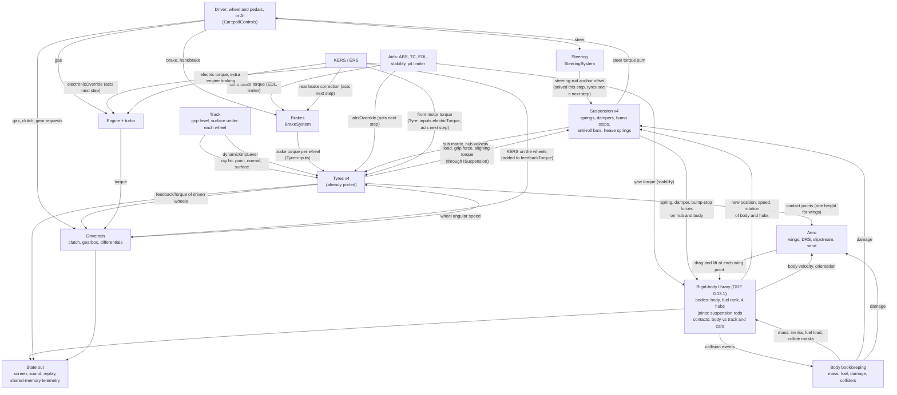

# The whole car: overview and port plan (acs.exe, read-only)

This is the top of the car-physics map. It ties together the per-system maps and proposes the
order to port them. Sources: `acs.exe` 1.16.4 + `acs.pdb`, read through the local index
(`tools/pdb_index.py`, `tools/xref_index.py`, `tools/bulk_decomp.py`, `tools/re_query.py`); the
pseudo-C of every function is in the git-ignored `re/decomp/`, key functions per system in
`re/car/<system>/`. Nothing in the game folder, the Ghidra project or a running game was changed.
No Rust was written.

| Map | What it covers |
|---|---|
| [`physics_engine.md`](physics_engine.md) | the rigid-body library (ODE 0.13.1) and how the game uses it |
| [`car_step.md`](car_step.md) | the full call tree of one physics step, threads, who listens to the step events |
| [`suspension.md`](suspension.md) | the four suspension types, springs, dampers, bump stops, anti-roll bars, heave springs, the `ISuspension` interface |
| [`tyre.md`](tyre.md), [`tyre_ini_keys.md`](tyre_ini_keys.md) | tyres (already ported: `docs/port/tyre_step.md`) and the tyres.ini key table |
| [`drivetrain.md`](drivetrain.md) | engine, turbo, clutch, gearbox, differentials, 4WD, KERS / ERS, shift helpers |
| [`brakes.md`](brakes.md) | brake torque, bias, disc temperatures, handbrake |
| [`aero.md`](aero.md) | wings, ride-height tables, active aero, DRS, slipstream, wind, air density |
| [`body.md`](body.md) | mass, inertia, fuel tank, damage, colliders, teleporting, how to build a `Car` outside the game |
| [`electronics.md`](electronics.md) | traction control, ABS, EDL, stability aid, pit limiter, the generic `DynamicController` |
| [`steering.md`](steering.md) | steering rods and the force-feedback number |
| [`track_surface.md`](track_surface.md) | ground ray cast, `surfaces.ini`, track grip, collision categories |
| [`telemetry.md`](telemetry.md) | the shared-memory pages, field by field, and how to use `f2004_spa_ai.csv` |

The rest of the game (renderer, audio, UI, AI, replay, network …) is mapped shallowly in
[`docs/atlas/`](../atlas/README.md).

---

## 1. Plain-English summary: one physics step, start to finish

1. The game moves every car forward 333 times a second, each time by exactly three thousandths
   of a second, on its own thread, no matter how fast the screen is drawing.
2. Before any car moves, the track works out one number for how much rubber is on the road (more
   laps driven means more grip, within limits), and the wind strength is nudged a little.
3. Each car then asks its driver for steering, throttle, brake, clutch and gear requests. The
   driver is either a person's wheel and pedals or the computer driver, which does all its
   thinking at this moment.
4. The car burns a little fuel, and once a second it re-weighs itself, so an emptier tank makes
   the car lighter and shifts its balance.
5. The brakes turn the pedal into a braking twist for each wheel, split front to rear.
6. Each suspension corner measures how far its wheel has moved up or down and how fast, and
   pushes the wheel and the body apart with its spring, damper and bump stops.
7. Each tyre looks straight down to find the road, works out how hard it is pressed into it and
   how much it is sliding, and pushes the resulting grip forces into its wheel hub.
8. Right after the fourth tyre, the car adds up what the front tyres are doing to the steering
   and sends that to the driver's wheel as force feedback.
9. The wings and the bodywork push down and backwards on the car according to air speed, the
   angle of the air and how close each wing is to the road.
10. The steering moves the inner ends of the steering rods; at the end of this same step the
    wheels are pulled round after them, and the tyres feel the new direction on the next step.
11. The engine makes torque from the throttle and its revs. The clutch, gearbox and differential
    share it out and decide how fast the driven wheels now spin, using the grip the tyres just
    reported.
12. Anti-roll bars push the left and right wheels of an axle towards the same height. The driver
    aids (ABS, traction control, pit limiter) look at the wheels and decide whether to release a
    brake or cut the engine on the next step; the stability help twists the body straight in this
    same step.
13. When every car has handed in all of its pushes and twists, the physics library takes over:
    it finds where car bodies touch the ground, walls or each other, works out the forces in the
    suspension rods that keep every wheel where the geometry allows it to be, and moves every
    part to its new place.
14. Finally the game copies the new state of every car out for the screen, the sound, the replay
    and the telemetry feed, and checks whether a car has crossed a timing line.

---

## 2. Systems and what flows between them



Order inside one car, with addresses (full tree in [`car_step.md`](car_step.md)):

```
PhysicsEngine::step(0.003)                    0x140264760
├─ queued commands from the main thread, Track::step 0x140278d20, stepWind 0x140265380
├─ Car::stepPreCacheValues (every car)        0x1402768c0
├─ Car::step (every car)                      0x140275da0
│   ├─ Car::pollControls                      0x140274e70   driver or AI
│   ├─ air density, fuel burn, Car::updateBodyMass 0x140276c70 (once a second)
│   ├─ steer angle, Autoclutch::step 0x1402b9590, sleeping test, accG
│   ├─ Car::stepThermalObjects                0x1402769f0
│   ├─ Car::stepComponents                    0x1402764d0
│   │    1 BrakeSystem::step     0x14028e640     9 ERS::step              0x1402930e0
│   │    2 EDL::step             0x1402bb460    10 SteeringSystem::step   0x1402b81b0
│   │    3 suspension->step x4   (per type)     11 AutoBlip, AutoShifter, GearChanger
│   │    4 Tyre::step x4         0x140283800    14 Drivetrain::step       0x14026b130
│   │      (force feedback after tyre 3)        15 AntirollBar::step x2   0x1402bb640
│   │    5 HeaveSpring::step x2  0x1402b3960    16 ABS::step              0x14028f610
│   │    6 DRS::step             0x1402b4e60    17 TractionControl::step  0x140290200
│   │    7 AeroMap::step         0x1402b7150    18 SpeedLimiter::step     0x1402bb910
│   │    8 Kers::step            0x1402b7e10    19-29 colliders, setup, telemetry, lap
│   │                                              timing, StabilityControl::step 0x1402bfa50 ...
│   └─ Car::updateColliderStatus 0x140276df0, Car::stepJumpStart 0x140276780
├─ PhysicsCore::step 0x1402cd690: collisions, then dWorldStep 0x1403404c0
└─ step-completed listeners: Car::postStep 0x140275430, remote cars, network
then (still on the physics thread): state snapshot for the main thread, replay frame,
SharedMemoryWriter::updatePhysics 0x140186ef0
```

Things about the order that a port must copy, because they shift effects by one step:

- ABS, traction control and the pit limiter run **after** the brakes, tyres and engine they
  control, so their decisions act on the next step. The same goes for the ERS brake correction.
- Steering rods are moved **after** suspension and tyres have run (the solve of the same step
  turns the wheels, the tyres see it one step later); force feedback is computed in the middle
  of the step, right after the fourth tyre. EDL and the stability yaw torque act in the same step.
- The driver's controls, the kerb vibration and the sleeping test use tyre loads, speed and
  acceleration from the **previous** step.
- Body and fuel-tank mass are refreshed only once per second of physics time.
- The ERP/CFM switch of the suspension joints, `Telemetry`, the drift/penalty helpers and the
  jump-start check exist only for the car with `physicsGUID == 0` (the first car created).
- Several filters use the literal `0.003` instead of the step size they are given
  (`DynamicController`, active aero, turbo lag, engine damage, force feedback).
- With several cars and four or more logical CPUs, `Car::step` of different cars runs on a
  thread pool at the same time; anything one car reads from another (AI awareness, slipstream,
  the 6 m pit test) then depends on thread timing. A single car never uses the pool.
- Computer-driven cars are not the same car as the player's: the AI switches the car's ABS, TC
  and auto-shifter off and uses its own, **always** applies a stability yaw torque on the body,
  and can scale tyre grip (`Tyre::aiMult`). This matters for the recorded AI lap.

---

## 3. Proposed port order

Effort: S = a day or two of the kind of work Tasks 03/04 were, M = about one task, L = several
tasks. "Needs" lists what must exist in Rust first.

| # | Work item | Effort | Needs | Why here |
|---|---|---|---|---|
| 0 | **Whole-car oracle** (`car_oracle`): the game's own `PhysicsEngine`, a flat `Track` and one `Car`, built and stepped in-process like the tyre oracle (**done in Task 06**, `docs/oracle/car_oracle.md`; driving ODE directly for small scenes is not part of it) | M | `tools/tyre_oracle` | It is the measuring stick for every later item, and it proves or disproves section 4.2 before any porting is planned around it |
| 1 | **Rigid-body core, stage 1**: bodies, box mass, finite-rotation integrator, DBall / Ball / Slider / Fixed joints, islands, `A = J·M⁻¹·Jᵀ`, LDLᵀ solve (the equality-only path of ODE's `dWorldStep`) (**done in Task 07**: `crates/rustyac-ode`, report `docs/port/ode_stage1.md`; bit-exact against the game's ODE and the whole-car recordings) | L | Rust maths helpers | Everything that pushes on the car needs bodies; highest technical risk, so do it early |
| 2 | **Body bookkeeping**: body/tank/hub masses, fuel burn and re-weighing, sleeping rule | S | 1 | Small, and the chassis cannot be dropped on its wheels without it |
| 3 | **Suspension**: DWB and STRUT first (112 of 113 cars front, 108 rear), AXLE next (4 cars), ML last (no car uses it); dampers, bump stops, anti-roll bars, heave springs | M | 1, 2, tyre | With the tyres already ported this gives a chassis that sits and rolls |
| 4 | **Steering and the force-feedback number** | S | 3 | A few lines once the rod joints exist |
| 5 | **Brakes** | S | tyre | Independent of bodies; can be done any time |
| 6 | **Engine and 2WD drivetrain**: power curve, limiter, coast, turbo, clutch, gears, LSD, shift timing, auto-clutch / blip / shifter | M | tyre, 5 | Independent of bodies for RWD/FWD cars; closes the loop on driven-wheel speed |
| 7 | **`DynamicController`** (generic lookup controller) | S | `Curve` | Shared by brakes (EBB), differential, turbo, ERS, rear steer, anti-roll bars, active aero |
| 8 | **Aero**: wings, ride-height tables, damage factor, active aero, DRS, air density, slipstream, wind | M | 1, 7, tyre contact points | Only pushes on the body |
| 9 | **Aids**: ABS, TC, EDL, stability yaw torque, pit limiter | S each | 5, 6 | Small timers; order and one-step delays are the whole difficulty |
| 10 | **`Car::step` shell**: controls intake, overrides and penalties, the component order, `postStep`, collider mask | M | 2–9 | Glue; first point where a whole Rust car can be compared with the oracle step by step |
| 11 | **Telemetry page** (`acpmf_physics` layout from a Rust car) | S | 10 | Lets the same checker read AC and rustyAC |
| 12 | **Track surface data**: `surfaces.ini`, name matching, grip level | S | — | Needed for real tracks, not for the flat-ground car |
| 13 | **Rigid-body core, stage 2**: contact joints and the pivoting LCP solver (contact points fed in by hand until stage 3 exists) | M | 1 | The solver half of body-to-ground, wall and car-to-car contact |
| 14 | **Rigid-body core, stage 3**: OPCODE mesh trees; ray-, box- and mesh-against-mesh | L–XL | 13, kn5 track loader | Tyre rays on real tracks; the floor boxes on the road; wall and car-to-car hits |
| 15 | **Collision damage** | S | 13 | A callback on top of contacts |
| 16 | **Rest of the drivetrain**: AWD, AWD2, KERS, ERS | M | 6, 7 | 14 + 7 of 113 cars |
| 17 | **AI driver** (see `docs/atlas/ai_drivers.md`) | L | 10, track spline | Needed to reproduce a recorded AI lap closed-loop |

Two shared pieces come before any of the rows above and are partly done already for the tyre:

- **One ini layer with the game's exact rules**: a missing key reads as 0 (or an empty string),
  and the default set in a constructor survives only where the code tests `hasSection` first
  (each map marks which keys are which); numbered sections (`WING_n`, `CONTROLLER_n`,
  `TURBO_n`, `COLLIDER_n` …) stop at the first gap, except `drs.ini [WING_n]`; a `data.acd` next
  to the folder wins over the folder. Only some files honour a `data_<config>` folder
  (`body.md` section 4), so support the empty config name only.
- **One `Curve` type**: points kept in file order (two shipped brake files are unsorted), linear
  interpolation, clamped ends, an empty curve returns 0; inline `(|x=y|…)` lists and `x|y` files.

Shared state that several systems write in a fixed order within one step, and which a port
should keep as plain fields written in that same order rather than derive: `Tyre::inputs`
(brakes, then brake fade, then EDL; ERS writes the front motor torque for the next step),
`Tyre::absOverride` (the AI in `pollControls`, then ABS late in the step),
`Tyre::status.feedbackTorque`, `angularVelocity` and `isLocked` (tyre and drivetrain both write),
`Car::controls` (provider, `Car::step` overrides, auto-clutch, then auto-blip and auto-shifter
after the brakes and steering have already read the pedals), `Engine::electronicOverride` and
`BrakeSystem::electronicOverride` (written late, consumed and reset by the next step).
The brake torque is combined three different ways (tyre: `max(brake × absOverride, handbrake)`;
drivetrain lock test: their sum; KERS / ERS: their own sums, ERS over the left-rear and
right-front tyre) and each must be copied as it is. Every setup item is written back into the
physics by `SetupManager::step` at position 20, so a setup change acts from the next step.

Order inside `Car::Car` matters as well (`car_step.md`, `body.md`): body and tank first, then
per wheel the suspension and its tyre, heave springs (only if all four corners are DWB), aero,
ERS / KERS, steering, drivetrain, the shift helpers, anti-roll bars, the aids, then the first
body-mass refresh, colliders, and last the setup table, which captures pointers into all of
them. The body must still sit at the origin while the suspensions are built. On a strut car the
simulated car is 20 % of `HUB_MASS` heavier per strut than `TOTALMASS` says (`body.md` 5.1).

Effort per mapped system, as estimated by each map: suspension M, drivetrain M (L with AWD and
hybrids), brakes S, aero M, body M, electronics M (each aid S), steering S, track surface S (its
mesh ray cast is part of stage 3), telemetry S, step glue M, rigid-body library L in total.

Dependency sketch:

```
tyre (done) ──┬─► 5 brakes ──► 6 engine + drivetrain ──► 9 aids ──┐
              │                                                   │
0 oracle ──► 1 rigid bodies ──► 2 body ──► 3 suspension ──► 4 steering ──┼─► 10 Car::step ──► 11 telemetry
                    │                          7 controller ──► 8 aero ──┘          │
                    └─► 13 contacts ──► 14 meshes ──► 15 damage                     └─► 17 AI ──► recorded lap
```

### Recommended next three tasks

1. **Task 06 — the whole-car oracle.** Build AC's own car on a flat plane in-process
   (recipe in 4.2), drive it with scripted controls, and record every step: body and hub
   positions, rotations and velocities, `Car::getPhysicsState`, and a "force tape" (every force
   and torque each system hands to a rigid body, in call order). Deliver golden runs for the
   F2004: drop and settle, standing start, braking, steady turn. If the whole car cannot be made
   to run, fall back to an ODE-only oracle plus per-component oracles (4.1) and say so.
2. **Task 07 — rigid-body core, stage 1, in Rust.** Port the equality-only path of ODE 0.13.1 and
   prove it bit-exact by replaying the oracle's scenes: same bodies, same joints, same force
   tape in, same positions and velocities out, for thousands of steps.
3. **Task 08 — rolling chassis.** Port body mass/fuel, the DWB suspension (plus anti-roll bars,
   heave springs) and steering on top of the new core, plug in the tyres that already exist,
   and match the oracle's F2004 with the engine, brake and aero forces taken from the force tape.

After that: brakes + engine + drivetrain (one task), aero + aids + `Car::step` shell (one task),
then the first full Rust F2004 against the oracle, and only then contacts, meshes and the
recorded Spa lap.

---

## 4. Test strategy

The method stays the one used for the tyre: map `acs.exe` into our own process, let the game's
own functions run on prepared memory, and compare bit patterns.

### 4.1 Per system

| System | Game functions the oracle calls | What has to be faked or prepared | Compare |
|---|---|---|---|
| Rigid bodies (stage 1) | ODE by its public symbols: `dInitODE2` 0x140340bc0, `dWorldCreate` 0x1403401f0, `dBodyCreate` 0x14033ef50, the joint creators, `dWorldStep` 0x1403404c0; or through `ksPhysicsCoreODEFactory::create` 0x1402cb630 and the `IPhysicsCore` / `IRigidBody` slots | nothing (real ODE); thread-local storage must work in the mapped image | position, rotation, linear and angular velocity of every body after every step |
| Body mass / fuel | `RigidBodyODE::setMassBox` 0x1402ce890, `Car::calcBodyMass` 0x14026fb70, `Car::updateBodyMass` 0x140276c70 | a `Car` block with body, tank, four objects answering `getMass`, a clock | masses and inertia read back from ODE |
| Suspension | `Damper::getForce` 0x1402b3280 alone; `Suspension::step` 0x1402c3390, `SuspensionStrut::step` 0x1402c6600, `SuspensionAxle::step` 0x1402c8770, `SuspensionML::step` 0x1402cab00; `HeaveSpring::step` 0x1402b3960, `AntirollBar::step` 0x1402bb640 | recording fake `IRigidBody` objects that return scripted poses and velocities and log every force call; suspension structs filled from `re/types`. Loader, joints and steering reseat need the whole-car oracle | the logged force calls in order, `SuspensionStatus` |
| Steering / FF | `SteeringSystem::step` 0x1402b81b0, `Car::getSteerFF` 0x140272180, `Car::onTyresStepCompleted` 0x140274cd0 | fake suspensions answering `getSteerTorque` and recording `setSteerLengthOffset`; a fake controls provider recording `sendFF` | rod offsets, FF value and its internal state |
| Brakes | `BrakeSystem::BrakeSystem` 0x14026be20 (needed for its file stream member), `BrakeSystem::init` 0x14028d690, `BrakeSystem::step` 0x14028e640 | a zeroed `Car` block with controls, four tyre status blocks, cached speed, ambient temperature | `Tyre::inputs` of all wheels, disc temperatures |
| Engine | `Engine::loadINI`, `Engine::step` 0x1402880e0, `Turbo::step` 0x1402ae7c0 | fake `PhysicsEngine` (temperature, damage rate, time), a `Car` pointer for controls | torque out, boost, limiter flag, engine life, fuel use |
| Drivetrain | `Drivetrain::step` 0x14026b130 (→ `step2WD` 0x1402694e0 / `step4WD` 0x14026a220 / `step4WD_new` 0x14026ad80), `gearUp` / `gearDown` / `setCurrentGear` | a real `Car` from the whole-car oracle, or a fake with controls, four tyres with scripted `feedbackTorque`, session times | engine and shaft speeds, clutch state, gear, wheel angular speeds written back |
| `DynamicController` | constructor 0x1402af330 on real `ctrl_*.ini` files, `eval` 0x1402b0c00 | the car signals its inputs read | output over many steps (the filter has state) |
| Aero | `AeroMap::init` 0x1402b5ca0, `Wing::step` 0x1402b2bc0, `Wing::addDrag` 0x1402b2420, `Wing::addLift` 0x1402b2730, `DRS::step` 0x1402b4e60, `Car::updateAirPressure` 0x140276ae0, `PhysicsEngine::stepWind` 0x140265380 | recording fake body, four tyre contact points, wind, damage levels | angle of attack, coefficients, the logged force and its point |
| Aids | `TractionControl::step` 0x140290200, `ABS::step` 0x14028f610, `EDL::step` 0x1402bb460, `StabilityControl::step` 0x1402bfa50, `SpeedLimiter::step` 0x1402bb910 | fake `Car` block with tyre slip values, engine override reset between calls as `Engine::step` does, recording body for the yaw torque | override values and timers over a few hundred steps |
| Track surface | `Track::step` 0x140278d20, `SurfacesManager::loadSurfaceDefinitions` 0x1401afad0 / `getSurface` 0x1401af340 | a small `Track` block and fake cars with lap counts | grip level, parsed `SurfaceDef`s |
| Step glue | `Car::pollControls` 0x140274e70, `Car::stepPreCacheValues` 0x1402768c0, `Car::updateColliderStatus` 0x140276df0; the whole thing only in the whole-car oracle | scripted controls provider | controls after overrides, cached values |
| Telemetry | `SharedMemoryWriter::updatePhysics` 0x140186ef0 on a fake writer block pointing at the oracle's real `Car`; `Car::getPhysicsState` 0x140270d70 | a 592-byte page buffer; a controls provider with valid RTTI in front of its vtable | the page, byte for byte |

A tool worth building once in Task 06: **recording rigid bodies.** Every Kunos system talks to
ODE only through the `IRigidBody` vtable (`physics_engine.md` 3.5). Copying that vtable and
replacing the force slots with thunks that log and forward gives a per-step list of every force
and torque with the caller's return address. That list checks each ported system on its own
(same calls, same bits) and lets a half-finished Rust car borrow the forces of systems that are
not ported yet.

### 4.2 Running a whole AC `Car` in the oracle on a fake flat track

Judged feasible, not tried. The full dependency inventory is `body.md` section 9; the flat-track
side is `track_surface.md`; the step loop is `car_step.md`. The recipe:

1. Map `acs.exe` as the tyre oracle does (bind `msvcr120`, `msvcp120`, `kernel32`; write 0 to
   `INIReader::useCache`).
2. Work in a scratch tree inside the repo that looks like a tiny game folder:
   `system/cfg/assetto_corsa.ini` with `[PHYSICS_THREADING] THREADS=0` (otherwise the engine
   starts a thread pool on machines with four or more logical CPUs), `system/cfg/tyre_smoke.ini`,
   `content/cars/<car>/data/*` copied from `cardata/` with **no** `data.acd` beside it, and a
   minimal track folder with a small valid `ai/fast_lane.ai`.
3. Construct the real objects: `PhysicsEngine::PhysicsEngine` 0x140262430 (creates the real ODE
   core) → `Track::Track` 0x140277100 → `Track::addSurface` 0x140277e50 with one large flat quad
   and a plain `SurfaceDef` (collision category 1) → `Track::initAISpline` 0x1402782a0.
4. `Car::Car` 0x14026bf00 → `Car::initColliderMesh` 0x140273b20 with a small hand-built mesh →
   `Car::setControllerProvider` 0x140275a70 with a fake provider → `Car::forceRotation`
   0x140270040 and `Car::forcePosition` 0x14026fe10 to drop the car on the plane.
5. Loop: advance the clock by 3 ms and call `PhysicsEngine::step` 0x140264760, or by hand
   `Car::stepPreCacheValues`, `Car::step(0.003)`, `core->step(0.003)`, `Car::postStep`. Call
   `srand` with a fixed seed first.
6. Record after each step: `Car::getPhysicsState` (one 0xb70-byte block), the pose and
   velocities of the body, tank and hubs through `IRigidBody`, and the force tape.

What is known to crash if left out: no mesh collider on the body (`Car::updateColliderStatus`
reads `collisionMeshes[0]` without a check); no controls provider (`Car::step` calls it before
testing for null); the `INIReader` cache left on; a `data.acd` next to the data folder (needs
the decryption key table that only the game's start-up builds). Probable crash: an empty AI
spline in `SplineLocator::step` / `Car::postStep`. Unknown: what `Track::Track` needs from the
Documents folder (`INIReaderDocuments`). `Telemetry::init` 0x1402bc010 only reads its flags
inside `hasSection("TELEMETRY")`, and `DriftModeComponent::init` 0x1402bfda0 reads
`tyre_smoke.ini [TRIGGERS] SLIP_LEVEL`; give both files to be safe.

Two more things to watch in such a run. The rules helpers are live: `LapInvalidator` and
`PenaltyManager` can set a penalty or a black flag, and a black-flagged car is teleported back
to its pit box (a full reset that also refuels) on every step; keep the car on valid surface and
the session "started", or patch those flags. And the single car is car 0, so it always gets the
low-speed ERP 0.9 switch that other cars never get.

If step 3 or 4 cannot be made to work, the fallback is an ODE-only oracle (real `PhysicsCore`,
bodies and joints created through `IPhysicsCore` with the geometry our own loader computes) plus
the per-component oracles of 4.1. That still checks every system, but not their wiring.

### 4.3 Against the recorded lap (`f2004_spa_ai.csv`)

See `telemetry.md` for the field-by-field mapping. What the recording can and cannot do:

- **It was very probably not recorded from the plain game.** The game folder holds a third-party
  patch loader (`dwrite.dll`, 139 MB, and an `extension/` folder installed through Content
  Manager), and the lap shows it: `airDensity` in the file runs from 1.1575 to 1.1717 and follows
  the car's height (ln of density against `posY` is a straight line, r² = 0.9987, scale height
  about 8,400 m), while `acs.exe` computes one constant, `1.2922 − 0.0041 × 14 °C = 1.2348`
  (`PhysicsEngine::getAirDensity` 0x140263a60). So at least the aero forces of that lap were
  computed with about 5.5 % less air than the unpatched game would use, and other differences
  cannot be ruled out. Details: `telemetry.md` 9.5. The bit-level reference is the oracle of the
  unpatched `acs.exe`, not this file; a new lap recorded with the patch switched off would
  remove the doubt (check that `airDensity` then reads a constant 1.2348 at 14 °C).
- It cannot be a bit-level reference: the logger rounded to 4–5 decimals, missed 78 of 117,410
  steps, and did not record clutch, brake temperatures or the car's start state exactly.
- The lap was driven by the AI, so the car had the AI's permanent stability yaw torque, the AI's
  own ABS and throttle limiting and possibly a tyre grip multiplier. Replaying the logged pedals
  and steering into a Rust car is therefore **not** the same experiment unless those AI-side
  effects are reproduced too.
- It needs the real Spa surface (stage 3 of the rigid-body port and a kn5 track loader).
- Useful sooner: short windows (re-synchronise state, replay a second or two, compare the
  trend of wheel loads, speeds, suspension travel), and whole-lap statistics once the car is
  complete.
- Worth doing before then: record a fresh lap with a logger that stores the whole page as raw
  floats and never rounds (the page also holds clutch, brake temperatures, contact points and
  local velocity), ideally with a human-style provider instead of the AI.

---

## 5. Open questions

### 5.1 Choices made while working unattended

1. **Local bulk decompile instead of the Ghidra MCP.** The kawaiidra MCP held the project lock
   and is slow, so the Ghidra project was *copied* into the git-ignored `re/ghidra_copy/`
   (616 MB) and all 7,453 hand-written functions were decompiled from the copy with
   `tools/bulk_decomp.py` (about four minutes). The original project was not opened or changed,
   and the MCP was not used at all in this task.
2. **The call tree got its own file** (`car_step.md`) instead of living in this one.
3. **How the maps were made and checked.** `physics_engine.md` and this file were written by the
   lead; every other map by one subagent, at most six at a time, none of them committing. Each
   map was then attacked by a second, independent reviewer who corrected it in place (658 claims
   checked against the code, 54 found wrong and fixed, 8 of them in the lead's own
   `physics_engine.md`). Three read-only reviewers then looked for contradictions between maps;
   they reported 34, which the lead spot-checked against the pseudo-C and fixed. Every address in
   every document is checked mechanically (`python tools/re_query.py checkdoc <file>`).
4. **`DynamicController` has its reference description in `electronics.md`** (4.6 and 5.9); the
   brakes, drivetrain, aero and steering maps describe only their own use of it.
5. **Unknown suspension `TYPE=COSMIC`** (one mod car in `cardata/`) is not a stock type: the
   stock executable exits on it. It is ignored in the plan; it and `f2004ButBetter` are useful
   only as negative tests for a loader.
6. **`tyre.md` was not rewritten.** It got a section 8 that says which of its open questions the
   new maps answered, and the tyres.ini key table from Task 01 (which lived only in the
   git-ignored `re/`) was copied to [`tyre_ini_keys.md`](tyre_ini_keys.md).

### 5.2 Questions the plan depends on

1. **The recorded lap was very probably made with a third-party patch active** (4.3). Should a new
   lap be recorded from the unpatched game, with a logger that keeps the whole page unrounded?
   Until then the lap is a sanity check, not a reference.
2. **Does the whole-car oracle work?** (4.2) Everything in the order above assumes yes.
3. **Island and row order inside `dWorldStep`** were described from the ODE source, not read from
   the binary. They decide the rounding of the suspension rod forces.
4. **`physicsGUID == 0`**: the joint softness switch and several helpers only run for the first
   car created. That this is always the player's car was not traced.
5. **Body state timing in the telemetry page.** By the code, the velocity in a packet is from
   after the rigid-body step while speed and accG are from before it; the recorded lap does not
   show that offset (`telemetry.md` 5.5). Possibly the patch; one oracle run settles it.
6. **How ordinary setup items become active.** Every setup item is created "not attached"; only
   the gear ratios, the final ratio and (for AI cars) the brake bias are attached by code that
   was found. Where springs, wings and the rest get attached was not found, so it is not yet
   known how a saved setup (or the AI's `ai_default.ini`) reaches the physics.
7. **How fast a steering input turns the wheel.** The rod joint removes only a fraction of its
   length error per step (ERP 0.3, or 0.9 for car 0 below 1 m/s). The response should be measured
   in the oracle before the port relies on a reading of the solver.
8. **`INIReader::getFloat` on a missing key** is assumed by several maps to return 0, and
   **`Curve::getValue`** decides engine torque, wing coefficients and every controller table.
   Both are already ported for the tyre; check them once against the oracle on engine and aero
   data.
9. **Uninitialised `bounce_vel` in body contacts** and the first-contact ray mode make stages 2
   and 3 of the rigid-body port sensitive to details that are not visible in the pseudo-C.
10. **AI-only physics** (stability torque gain 2.0, `Tyre::aiMult`, forces added in
    `AIDriver::stepSuperhuman`, no brake fade, pedals refreshed every fifth step) must be part
    of any comparison with an AI lap.
11. **Sign conventions** (which side is +x, steering sign, stability torque direction, wind
    direction) were left open in several maps; one run of the whole-car oracle settles them all.

Every map ends with its own list of open questions; the list above only repeats the ones that
change the plan.

### 5.2a Answered by the whole-car oracle (Task 06)

The oracle of section 4.2 exists and works: [`docs/oracle/car_oracle.md`](../oracle/car_oracle.md).
Its runs settle these questions of 5.2 (details and numbers in section 4.5 of that report):

- **2**: yes, a whole AC `Car` runs in-process on a fake flat road; the recipe of 4.2 needed three
  additions (`INIReaderDocuments::initialized`, the timer frequency, `physicsTime` after the
  engine constructor).
- **3**: island body order is hub RR, car body, fuel tank, hub LF, hub RF, hub LR; the joint
  blocks are the fuel-tank joint, then the five rods of LF, RF, LR, RR in creation order.
- **5**: by the unpatched code the page's `velocity`, angles and local velocities are one step
  newer than its `speedKmh` and `accG`.
- **11**: car axes are +x left, +y up, +z forward; positive steering input turns right; a right
  turn has negative `localAngularVel.y` and negative `accG.x`; `Car::forceRotation` takes the
  direction of the tail.
- New: the F2004's engine, drivetrain and brakes make no call on any rigid body; asking ODE for
  joint feedback does not change a bit of the simulation; the spawn places the car above its
  rest height (body centre 0.320 m, 0.234 m at rest), so every session starts with a drop.
- New, and needed by every later "new car" in Rust: a session start changes the car before the
  first step. The setup screen selects the tyre compound `tyres.ini [COMPOUND_DEFAULT] INDEX`
  (the constructor leaves compound 0) and sends every `setup.ini` item through its
  whole-number spinners, which rounds them (F2004: 11 values, e.g. front camber 3.0° → 2.9°).
  Section 2.6 of the report has the rule and the check against a real game log.
- New: the game switches collision detection off for the first 250 steps of a session, so the
  body's boxes passing through the road during the spawn drop is the game's behaviour too.

Still open after Task 06: 1, 4 (the oracle's car is car 0 by construction), 6, 7, 8, 9, 10.

Task 07 (`docs/port/ode_stage1.md`) closed the rigid-body side of question 3: the island and
row order were read from the machine code, ported, and are compared in every replayed step.

### 5.3 Not mapped yet

- **Lap timing** (`TimeTransponder`, `TimeLine`, the odd-step time offset) and the **rules
  helpers** stepped inside `Car::stepComponents` (`SplineLocator` internals, `LapInvalidator`'s
  cut rule, `PenaltyManager`, `PerformanceMeter`, `FuelLapEvaluator`, `DriftModeComponent`) have
  only the shallow description in `docs/atlas/misc.md` (sub-areas D and H).
- **`SetupManager` as a whole**: the items are listed system by system, but there is no single
  table, and `SetupManager::load` 0x14028cc90 is described only in passing.
- **The physics `Telemetry` component** (player car only): about 70 named channels
  (`WHEEL_LOAD_LF`, `SUS_TRAVEL_*`, `ENGINE_VEL`, `TOT_LIFT`, `FF_PURE` …) created in
  `Telemetry::init` 0x1402bc010. Not needed for the port, but the list is a ready-made checklist
  of per-step values for the oracle.
- **`RaceEngineer`** (40 of its 51 functions; setup and AI estimates such as ride height, lateral
  grip, optimal brake) and a few large `Car` getters (`getEngagement` 0x140270660,
  `getFrontWheelAngle` 0x140270990).
- **AI data files** (`ai.ini`, `ai_tyres.ini`, track `ai_hints.ini`, AI setups) are only in
  `docs/atlas/ai_drivers.md`.
- **ODE's own code in the binary** (`dWorldStep`, the LCP solver, the colliders) was identified
  by symbol and described from the 0.13.1 source; only `_dDot` was compared instruction by
  instruction.
