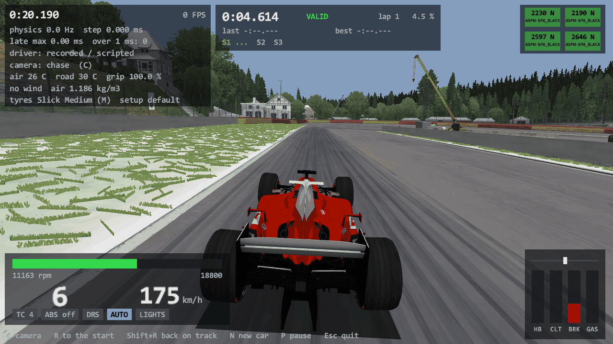
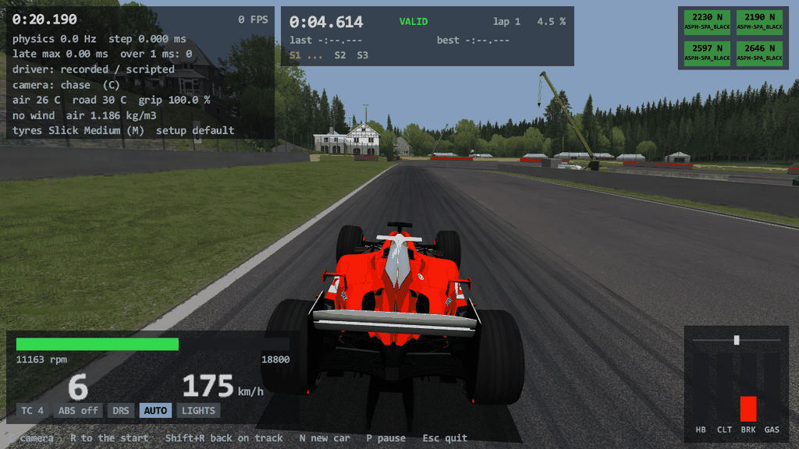
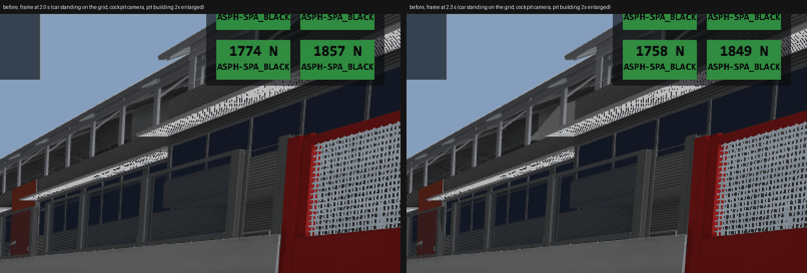
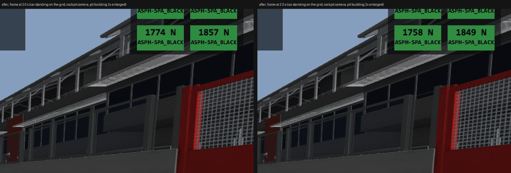
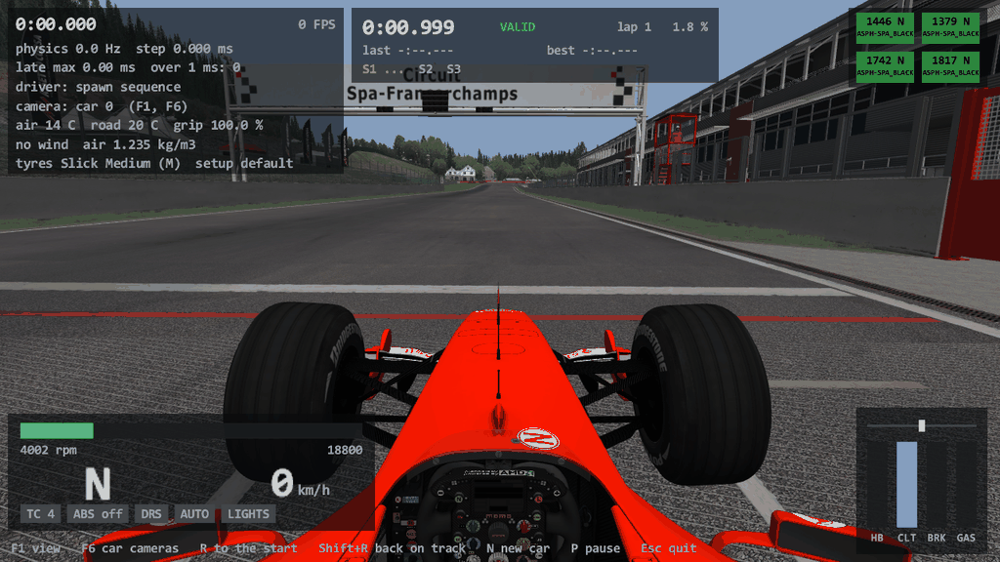

# Task 15: the same conditions as my AC, a lap comparer, debug-view fixes, Alt commands, AC's cameras, cars from data.acd

## Resume here

State after the last commit (kept up to date with every commit):

- **Done.** Everything is on `master`, tagged `v0.15.0`, nothing is pushed.
- All seven parts of `prompts/15_conditions_and_polish.md` are in: A conditions and setups (bit-exact against the
  game on six new scenarios, 47,464 steps), B `tools/compare_laps.py`, C the two debug-view fixes, D the Alt
  command modifier, E AC's camera set, F cars straight from `data.acd`, G the release / CI fixes.
- `cargo test --release --workspace` passes; `cargo clippy --workspace -- -D warnings` is clean.
- The large recordings (`oracle/conditions/*.carrec`, about 700 MB) are **deleted**; section 4.3 says how to make
  them again. The result tables (`oracle/chassis/results_conditions_*.md`) are still on disk (not in git).
- The briefs read from the machine code, the patch scripts and the helper scripts are in the git-ignored
  `re/scratch/task15/` (`spec_conditions.md`, `spec_setups.md`, `spec_acd.md`, `spec_render.md`,
  `spec_cameras.md`, `spec_telemetry.md`, `spec_codemap.md`).
- Nothing is half done. What was decided without asking is in section 9.

## 1. In plain English

**Why rustyAC felt grippier than your AC in some corners.** The physics is the same; the air was not.

1. **Your AC runs with Custom Shaders Patch (CSP), and CSP makes the air thinner with altitude.** Plain
   `acs.exe` knows one formula for the air: density = 1.2922 - 0.0041 x air temperature, the same everywhere.
   Your own recording of real AC (`f2004_spa_ai.csv`, 14 C) shows something else: the density is 1.157 at the top
   of the track and 1.172 at the bottom of Eau Rouge, following the height of the car, and CSP's log says
   "Pit altitude for current track: 418". At 14 C plain AC, and so rustyAC, has 1.2348. **Your real AC has
   5 to 6 % less air: 5 to 6 % less downforce and drag.** In slow corners that is nothing; in the fast ones
   (Eau Rouge, Pouhon, Blanchimont) it is exactly "extra grip in some corners, the rest feels the same".
2. **rustyAC also drove in other weather than your AC**: 26 C air, 30 C road, no wind, against your race.ini's
   14 C, 20 C and a wind of about 10 km/h. That is fixed: rustyAC now reads your race.ini by default. (It makes
   point 1 a little *larger*: colder air is denser. Before this task the gap to your AC was about 1.6 % of
   density, now it is the full 5.8 % until the air is made thin as in CSP.)
3. **Mechanical damage** is off in your AC (`assists.ini`, `DAMAGE=0`) and was on in rustyAC: a hard kerb or a
   floor contact could bend rustyAC's suspension or dent its wings. Now it follows your file.
4. **The setup** was the default in both (your `generic\last.ini`, written by AC when you left the session, is
   bit for bit the default setup), so that was not it. Your saved `spa\god.ini` (wings 10 / 10 instead of
   14 / 25, traction control off, 37 l of fuel, other gears) is a very different car; rustyAC can load it now.
5. **Floor contacts** (Task 13) and **the track's grip** (100 % in your race.ini) were not it.

To try point 1: `rustyac.exe --track spa --windowed --air-density 1.165` drives with CSP-like thin air. That
switch is an experiment, not Assetto Corsa: the bit-exact car is the one without it.

**What is new, part by part:**

- **A. Conditions.** `rustyac.exe` reads AC's own last session (`Documents\Assetto Corsa\cfg\race.ini` and
  `assists.ini`) the way `acs.exe` does: air and road temperature, the track's grip and how it grows per lap,
  the wind (drawn at random as the game draws it), ballast, restrictor, ABS / traction control / stability,
  damage, fuel and tyre wear rates, tyre blankets. `--air`, `--road`, `--grip`, `--wind`, `--wind-dir`,
  `--wind-from-log` change single values; `--no-race-ini` gives the old conditions. `--setup <name>` loads a
  setup saved in AC. The HUD shows all of it. The game's own code and the port agree to the last bit on six new
  recordings.
- **B. Lap comparer.** `tools/compare_laps.py` lays a real-AC lap and a rustyAC lap over each other by position
  on the track and prints, per corner, entry / minimum / exit speed, peak lateral g, steering, gear and the time
  won or lost; `--plot` writes one HTML page with the curves.
- **C. Debug view.** Grass, sand, concrete and the asphalt itself get their real colours (they were drawn with a
  nearly white shading map only). Boards and banners no longer flicker.
- **D. Alt commands.** Alt+T / Alt+A / Alt+G (Shift for down) always work; `[RUSTYAC] COMMAND_MODIFIER` in
  `rustyac_controls.ini` chooses.
- **E. Cameras.** F1 goes through AC's six driving views, F6 through the car's own `cameras.ini` cameras;
  `--camera car0` starts on the one above the helmet.
- **F. Cars from the install.** `--car ks_ferrari_f2004` reads `content\cars\<car>\data.acd` in memory, the way
  AC does; no extracted `cardata\` is needed and nothing is written. AC is found through Steam's library folders.
- **G. Release / CI.** A release can be started by hand for an existing tag; clippy is clean and now fails CI
  on a warning; the empty `--help` folder is gone; `docs/release.md` says releases are normal and "latest".

## 2. Your race.ini against the old defaults

Read from `Documents\Assetto Corsa\cfg\race.ini` and `cfg\assists.ini` as they are today (session: F2004 at
Spa, practice, hot-lap start).

| What | Your files | What `acs.exe` makes of it | rustyAC until now | Changes the car? |
|---|---|---|---|---|
| Air | `[TEMPERATURE] AMBIENT=14` | 14 C: air density 1.2348, tyres and brakes start at it, cooling | 26 C: 1.1856 | **yes**: +4.15 % drag, downforce and engine air; colder tyres |
| Road | `ROAD=20` | 20 C | 30 C | **yes**: tyre surface temperature |
| Track grip | `[DYNAMIC_TRACK] SESSION_START=100 RANDOMNESS=0 LAP_GAIN=1 SESSION_TRANSFER=100` | 100 % from the first step (it could grow 1 % per lap, but 100 % is the top) | 100 %, fixed | no |
| Wind | `[WIND] SPEED_KMH_MIN=10 SPEED_KMH_MAX=10 DIRECTION_DEG=0` | **drawn anew every session**: 8 to 12 km/h from within 20 degrees of 0, then swinging 10 % with a period of a minute. Your last session: 8.005 km/h from 2.54 degrees (AC's `logs\log.txt`) | none | **yes**, a little: a 10 km/h head wind is 3 % more air speed at 300 km/h |
| Weather | `[WEATHER] NAME=3_clear` | looks only; nothing of it reaches the physics in AC 1.16 | - | no |
| Mechanical damage | assists.ini `DAMAGE=0` | rate 0: nothing ever bends or wears | rate 1 | **yes**, after any knock |
| Fuel use, tyre wear | `FUEL_RATE=1`, `TYRE_WEAR=1` | 1, 1 | 1, 1 | no |
| Tyre blankets | `TYRE_BLANKETS=1` | on | on | no |
| ABS, traction control | `ABS=1`, `TRACTION_CONTROL=1` | "as the car has it": on if the car has the system | as the car's file says | no for the F2004 |
| Stability control | `STABILITY_CONTROL=0` | off | off | no |
| Automatic clutch / gearbox | `AUTO_CLUTCH=0`, `AUTO_SHIFTER=0` | the clutch aid is forced on with a pad or keyboard | `--no-auto-clutch`, `--auto-shifter` | (rustyAC keeps its two switches) |
| Penalties | `[RACE] PENALTIES=0` | any number of tyres may leave the track | 2 tyres, then the lap is cut | lap validity only |
| Ballast, restrictor | `[CAR_0] BALLAST=0 RESTRICTOR=0` | none | none | no |
| Tyre compound, fuel | not in race.ini | the car's default compound (medium), `car.ini` fuel (80 l) | the same | no |
| Setup | `[CAR_0] SETUP=` (empty) | `acs.exe` does not read this key at all; the session starts on the default setup | default setup | no |
| **CSP** | active (`[__EXT_PATCH]` in your setups, CSP's log) | **not `acs.exe`**: air density follows altitude: 1.157 to 1.172 at Spa at 14 C | 1.1856 (26 C) | **yes: 5 to 6 % less downforce in your AC than in plain AC** |

Not physics in `acs.exe` (checked in the decompile): `[LIGHTING]`, `[WEATHER]`, `[GROOVE]` (the dark line's
opacity), `[GHOST_CAR]`, `[REPLAY]`, `[OPTIONS]`, `[LAP_INVALIDATOR]`, every `__CM_*` and `__TRACK_*` key (Content
Manager's own). The temperatures stay constant through a session.

## 3. What was built

### 3.1 Conditions (Part A)

`crates/rustyac-physics/src/session.rs`, ported from `RaceManager::initOffline` @ 0x14013a6c0,
`Track::initDynamicTrack` @ 0x140278300, the wind job (lambda @ 0x140133ac0), `ksRand` @ 0x140033770,
`Car::setRestrictor` @ 0x140275d10 and `DrivingAssistManager` @ 0x1400fbd90:

- `RaceIni::from_ini`: the keys of race.ini that reach one car. A missing key reads as 0, as in the game.
- **Temperatures**: two plain stores, before the car is built (tyres, brakes and water start from the air's).
- **Track grip**: the already ported `DynamicTrack` now lives on the car (`RollingChassis::dynamic_track`) and
  is stepped before every car step (`step_session`, where `PhysicsEngine::step` calls `Track::step`): grip =
  start + laps x gain, kept within 85 to 100 %.
- **Wind**: two stages, both with the C runtime's `rand()`. `initOffline` draws a base speed between the file's
  minimum and maximum (each kept within 0 to 40 km/h); the job on the physics thread draws 80 to 120 % of that
  and a direction within 20 degrees. So `10 .. 10` in the file is never 10 km/h. `--wind <km/h>` sets it
  exactly; `--wind-from-log` takes what AC drew in its last session from AC's log.
- **Ballast, restrictor** (only with `[HEADER] VERSION` above 1 and a value above 0), **penalties**.
- `Assists::from_ini`: ABS / traction control (0 off, 1 as the car has it, 2 on), stability, damage / fuel /
  wear rates, blankets.

`rustyac.exe` (`crates/rustyac-game/src/conditions.rs`): race.ini is the default when the file exists (not for
`--replay`: a recorded drive carries its own conditions in its header, with new header lines only when they
differ from the old defaults, so old files still read).

| Option | Meaning |
|---|---|
| `--race-ini [file]` | read AC's last session (the default when it exists), or that file |
| `--no-race-ini` | the built-in conditions: 26 C, 30 C, grip 100 %, no wind, damage on |
| `--air <C>`, `--road <C>` | temperatures |
| `--grip <percent>` | a fixed track grip (as a server sets it: no gain per lap) |
| `--wind <km/h>`, `--wind-dir <deg>` | the wind exactly as given; `--wind 0`: none |
| `--wind-from-log` | the wind AC drew in its last session ("Setting wind ..." in `Documents\Assetto Corsa\logs\log.txt`) |
| `--setup <name or file>` | a saved setup |
| `--air-density <kg/m3>` | **not AC**: a fixed air density, to try CSP's thin air |

The HUD's top left panel has three new lines: `air 14 C  road 20 C  grip 100.0 %`, `wind 8.6 km/h from 13 deg
air 1.235` (the air's density), `tyres Slick Medium (M)  setup god`.

### 3.2 Setups (Part A.4)

In AC a saved setup is loaded only by the setup screen's "Load" button
(`SetupScreen::loadSetupAbsolutePath` @ 0x14017f2c0). `acs.exe` never reads `[CAR_0] SETUP` and never reads
`generic\last.ini` (it only writes it when a session is left).

A file's `[NAME] VALUE=n` is the whole-number position of the screen's spinner of that name, not a physical
value. `SetupManager::load_setup_file` (`crates/rustyac-physics/src/car/setup.rs`) does what the tabs do, in the
screen's order: the gears (`VALUE` = a line of the gear's `.rto` file), the tyre compound, the fuel (whole litres,
at most the tank), the traction-control level (stepped to from the current one), then every other item through
the same spinner arithmetic as the default setup (the port's `apply_setup_screen_defaults`, now shared code).
What the file does not name keeps its value. It is loaded after the default setup and before the first step.

`--setup god` looks for `god.ini` in `Documents\Assetto Corsa\setups\<car>\<track>\`, then `...\generic\`; a path
to a file works too. A non-empty `[CAR_0] SETUP` of race.ini is used the same way (that is rustyAC's addition:
launchers write the key, AC ignores it).

### 3.3 Cars from data.acd (Part F)

- `crates/rustyac-content/src/acd.rs`: `key_from_string` (`ksSecurity::keyFromString` @ 0x1402cfe00) and
  `Acd::decrypt` (`FolderEncrypter::decryptFile` @ 0x14023bdd0), ported from the disassembly (and equal to
  `tools/acd_extract.py`). `acd::read` / `acd::exists` answer for a file of a data folder the way the game does:
  **the archive next to the folder (`<folder>.acd`) wins when it is there**, else the plain file. The decrypted
  bytes live in memory only; nothing is written.
- Every car loader (`IniReader::load`, `Curve::load` and 17 existence checks) goes through
  `rustyac_physics::data::read` / `exists`. A car's data folder is still just a path:
  `...\content\cars\<car>\data`, which on disk only exists as `data.acd`.
- `rustyac.exe --car <x>` looks for: a path (a data folder or a car folder), then `<AC>\content\cars\<x>\data`,
  then `cardata\<x>` (the oracles' test cars). The collider and the 3D model come from the car folder as before.
- `crates/rustyac-content/src/install.rs` finds AC: `AC_ROOT` if set (and only that), else Steam's usual place,
  else every Steam library (`steamapps\libraryfolders.vdf` of the Steam folder the registry names).
- `packaging/HOW_TO_RUN.txt` has no extraction step any more.

### 3.4 Debug view (Part C)

**White grass and dirt.** The ground materials use AC's `ksMultilayer*` shaders. There `txDiffuse` is only a
bright shading map; the colour is four tiled detail textures (`txDetailR/G/B/A`, repeats `multR/G/B/A`) weighted
by the four channels of `txMask`, laid out by world position (by the mesh's uv in `ksMultilayer_objsp`, the
buildings). The renderer drew `txDiffuse` alone: white. It now mixes the layers as the compiled shader does
(`albedo = base x (dG x m.g + dR x m.r + dB x m.b + dA x m.a) x magicMult`, read from the disassembly of
`system\shaders\win\ksMultilayer_fresnel_nm`), does `ksGrass`'s variation map for the blades, and takes each
material's `ksAmbient` / `ksDiffuse` so that blades and ground match. 50 more textures are loaded at Spa (123
instead of 73).

| Before | After |
|---|---|
|  |  |

(`rustyac.exe --track spa --no-race-ini --autodrive --screenshot x.png --at 21.6`, the approach to La Source.)

**Flickering boards.** Three causes, all found in the data and fixed with AC's own state where there is one:

1. Boards and banners are modelled as two faces back to back, 5 mm to 10 cm apart. AC draws one side of every
   mesh (`initCullStates` @ 0x14001b0a0, state 0); the renderer drew both, and the two fought for the same
   pixels. Now one side, as in AC.
2. Decals sit 4 to 5 mm in front of white walls (the pit doors' numbers). The depth buffer could not tell them
   apart at a distance. The depth now runs the other way round (1 near, 0 far), which a float depth buffer
   resolves far better, and the camera's matrix is multiplied in double precision. That part is not AC's.
3. Material state as in AC (`Material::apply` @ 0x14020a6e0): "alpha tested" materials are drawn with alpha to
   coverage (AC has no alpha test at all), blended materials on opaque meshes stay in the first pass with their
   own depth mode, `isTransparent` meshes come second without depth writes.

Measured on a standing car (cockpit camera on the grid, three frames 0.3 s apart, HUD masked): pixels that
change between frames went from 3,205 to 369 (what is left is the idling car's own shake).

| Before: the roof boards are white speckle, different in each frame | After |
|---|---|
|  |  |

### 3.5 Keys (Parts D and E)

| Key | Does |
|---|---|
| Alt+T, Alt+A, Alt+G (with Shift: down) | traction control, ABS, automatic gearbox: always. A Ctrl key that is not a driving key works too |
| F1, or C, or the pad's right stick press | next view: chase, chase 2, bonnet, bumper, dash, cockpit (AC's F1 cycle; AC's pad camera button is its F1 too) |
| F6 | the car's own cameras (`data/cameras.ini`, at most six, each with its own field of view); the first press shows the one last used, each further press the next; F1 goes back to the driving view |

`rustyac_controls.ini`: `[RUSTYAC] COMMAND_MODIFIER=AUTO` (Alt, or a Ctrl key that does not drive), `ALT`,
`LCTRL` or `RCTRL`. A file written before this task has no such line and behaves as `AUTO`. Alt does not open
the window's menu and does not beep (`WM_SYSCHAR` is swallowed); Alt+F4 still closes.

`--camera cockpit|chase|chase2|bonnet|bumper|dash|car0..car5`. The view from your screenshot is the F2004's
`[CAMERA_0]` (`POSITION=0.0036,1.0791,-0.4076` in the 3D model's frame = 0.85 m above and 7 cm behind the centre
of mass, looking 10 degrees down the nose, field of view 60):



Ported from `ACCameraManager::setMode` @ 0x1400340d0, `CameraDrivableManager::update` @ 0x1400c6a30 (bonnet
@ 0x1400c6ba0, bumper @ 0x1400c6df0, dash @ 0x1400c7b50), `CarAvatar::initCameraCar` @ 0x1400d47c0 and
`CameraCarManager::update` @ 0x1400c47d0. The driver's model is not drawn, so the helmet is missing from the
picture.

## 4. Oracle results

### 4.1 Conditions and setups: the game's code against the port

`tools/car_oracle` got six scenarios (`spa_cold_green_wind`, `spa_hot_optimum`, `spa_user`, `spa_setup`,
`spa_setup_launch`, `spa_green_laps`). What runs in the game's own code: `Track::initDynamicTrack` (it reads a
`cfg/race.ini` written into the scratch root), `ksRand` and `Speed::fromKMH` for the wind's base, the wind job
itself (called with a hand-made `RaceManager`: two numbers and the way to the engine), `PhysicsEngine::setWind`,
`Car::setBallastKG`, `Car::setRestrictor`, and for the setup `SetupManager::load` @ 0x14028cc90 (the loader the
AI's setups go through), `Tyre::setCompound`, `Car::setRequestedFuel`, `TractionControl::cycleMode`, then the
game's `SetupManager::step`. The temperatures are two stores (as in the game). `tools/chassis_compare` hands the
port only what race.ini says (the limits of the wind, the four grip numbers, the setup file): the port draws the
wind and works out the grip itself, with the same `rand()` sequence.

Free run, the whole car in Rust, given only the driver's controls (`oracle/chassis/results_conditions_whole.md`):

| Scenario | What | Steps | Bit-exact | Values compared per step | Force calls compared |
|---|---|---|---|---|---|
| `spa_cold_green_wind` | 8 C air, 11 C road; grip 88 % +-3 % drawn, +0.5 % per lap; wind drawn from 12..26 km/h around 130 degrees (the game drew 10.54 km/h from 142.35 degrees) | 8,001 | 100 % | 2,412 | 527,646 |
| `spa_hot_optimum` | 36 C air, 48 C road; grip 100 %; 25 kg ballast, restrictor 60 | 8,001 | 100 % | 2,412 | 522,932 |
| `spa_user` | your race.ini: 14 C, 20 C, grip 100 %, wind 10..10 km/h at 0 degrees (drawn: 8.77 km/h from 12.35 degrees) | 8,001 | 100 % | 2,412 | 527,290 |
| `spa_setup` | your `spa\god.ini` (the game writes 25 values in the first step: wings, diff, rods, camber, toe, packers, seven gears, final ratio; fuel 37 l; traction control off) at Eau Rouge; the car spins off after 5 s, traction control being off | 1,668 | 100 % | 2,412 | 104,725 |
| `spa_setup_launch` | the same file with traction control left on, the 24 s launch drive to La Source | 8,001 | 100 % | 2,412 | 522,782 |
| `spa_green_laps` | grip 86 % +-2 % drawn, +1.25 % per lap, over eight timing lines and two counted laps (the grip changes twice) | 13,792 | 100 % | 2,412 | 902,644 |
| **all** | | **47,464** | **100 %** | | **3,108,019** |

`rustyac.exe` itself replaying the same recordings (`chassis_compare game-replay --dir oracle/conditions`): five
scenarios, 33,672 steps, 100 % bit-exact (`spa_green_laps` is skipped, as `spa_timing` always was: its script
teleports the car).

What is mirrored, not run by the game's code: the setup screen is GUI code that cannot be built in the oracle.
`SetupManager::load` gives the same item values for a file whose values are inside the spinners' ranges (true
for your three files); the clamp to the range and the gear table of the `.rto` files are the port's reading of
the screen's code (`re/scratch/task15/spec_setups.md`), not held against running game code.

### 4.2 Cars from data.acd

`target\release\acd_check.exe` (new, `crates/rustyac-physics/src/bin/acd_check.rs`), over the whole install:

- 123 cars have a `data.acd`. For the 112 that also have an extracted `cardata\<car>` folder, **every one of
  the 6,565 files decrypted in memory is byte-identical** to the extracted file. (One mod archive holds two Lua
  files twice under the same name; the game takes the first, the extractor kept the last. No physics reads them.)
- 61 of them are cars the port drives: built from `data.acd` and from `cardata\`, each driven 300 steps on the
  flat road, **all 36,764,700 traced values have the same bits**. The other 51 are refused by the port with the
  same words from both sources (35 not double wishbone, 8 four-wheel drive, 6 hybrid, 2 rear-wheel steering).
- 11 installed cars have no extracted folder to compare with.
- A 26 s autodrive at Spa recorded with the car from `data.acd` replays to the same 123,836,030-byte state dump
  from the extracted folder.

### 4.3 Making the recordings again

```
cargo build --release --manifest-path tools\car_oracle\Cargo.toml
cargo build --release --manifest-path tools\chassis_compare\Cargo.toml
set O=tools\car_oracle\target\release\car_oracle.exe
%O% run --track spa --scenario spa_cold_green_wind --out oracle\conditions
%O% run --track spa --scenario spa_hot_optimum --out oracle\conditions
%O% run --track spa --scenario spa_user --out oracle\conditions
%O% run --track spa --scenario spa_green_laps --out oracle\conditions
%O% run --track spa --scenario spa_setup --out oracle\conditions --setup "%USERPROFILE%\Documents\Assetto Corsa\setups\ks_ferrari_f2004\spa\god.ini"
%O% run --track spa --scenario spa_setup_launch --out oracle\conditions --setup re\scratch\task15\god_tc4.ini
tools\chassis_compare\target\release\chassis_compare.exe run --dir oracle\conditions
tools\chassis_compare\target\release\chassis_compare.exe game-replay --dir oracle\conditions
target\release\acd_check.exe
```

(one `car_oracle run` at a time; about a minute and 25 to 200 MB each. `god_tc4.ini` is `god.ini` with
`[TRACTION_CONTROL] VALUE=4`.)

## 5. Comparing a real-AC lap with a rustyAC lap

### 5.1 A fair pair

Both programs fill the same shared memory, so **only one of them may run at a time**, and `ac_telemetry.py`
records either.

1. **The same conditions.** Set the session up in AC (Content Manager) as you like; rustyAC reads the same
   race.ini afterwards. Two things are drawn at random in AC:
   - the wind: use `--wind-from-log` in rustyAC (it takes the wind AC printed into its log for the session you
     just drove), or set the wind to 0 in AC;
   - the track's grip when `RANDOMNESS` is not 0: use a preset without randomness ("Optimum" is 100 / 0).
2. **The same setup.** Either the default in both, or save the setup in AC and give its name: `--setup god`.
3. **The same aids**: traction control and ABS level, and the automatic gearbox (rustyAC: `--auto-shifter`,
   Alt+G; the automatic clutch is on in both with a pad).
4. **CSP out of the physics.** In Content Manager, Settings, Custom Shaders Patch:
   - untick "Active" altogether for the comparison. This is the sure way: CSP thins the air with altitude (5 to
     6 % at Spa) even with a Kunos car;
   - or, with CSP on: leave rustyAC's air thin too with `--air-density 1.165` (Spa at 14 C; read the column
     `airDensity` of your AC recording for another day or track), and switch **Gamepad FX** off if it is on (it
     reshapes the pad's steering) and do not use a car with CSP "extended physics".
5. **The same tyres at the same point**: both from a fresh session (blankets on), the same lap number.

### 5.2 The commands

```
rem 1. real AC: start the recorder, then drive three laps in AC, then close AC
python ac_telemetry.py --laps 3 --out re\scratch\laps\ac.csv

rem 2. rustyAC in the same session (race.ini is read by itself), with AC's wind
target\release\rustyac.exe --track spa --windowed --wind-from-log
rem    ... and in a second console, before driving:
python ac_telemetry.py --laps 3 --out re\scratch\laps\rusty.csv

rem 3. compare the fastest complete lap of each
python tools\compare_laps.py re\scratch\laps\ac.csv re\scratch\laps\rusty.csv --name-a AC --name-b rustyAC --plot re\scratch\laps\laps.html
```

Add `--setup <name>` to step 2 for a saved setup, `--air-density 1.165` if CSP stayed on in step 1.
`--lap-a N` / `--lap-b N` pick other laps (the `lap` column), `--track auto` finds the corners of another track
from lap A's lateral g, `--corners <track>\data\sections.ini` takes a track's own section list.

### 5.3 What it prints

One row per corner (Spa: 20 rows; AC's sections cut where the car changes direction): position from / to, then
for A and B the entry, minimum and exit speed, the peak lateral g (averaged over about 10 m), the largest
steering, the lowest gear and the time spent in the corner, with B minus A for the minimum speed and the time.
Under the table: the time difference over the whole compared stretch and how much of it is in the corners, the
lap times, and the three corners with the largest difference in minimum speed. A line `NOT A FAIR PAIR` appears
when the air or road temperatures of the two recordings differ. `--plot` adds a page with speed, lateral g,
steering and the running time difference against track position, the corners shaded, values under the pointer.

How the laps are lined up: by `trackPos`. The position and the lap clock are written once a frame (the rest of a
row 333 times a second), so only the first row of each new position is used; a lap that begins before the line
(a hot-lap start) is cut where the position starts again from 0; the time base is the game's own lap clock.

### 5.4 Tested on

- `f2004_spa_ai.csv` (real AC, AC's AI, three laps): lap 0 against lap 2 gives -0.408 s over the lap by the
  position-aligned clocks, against -0.409 s by the game's own lap times (1:51.408 and 1:50.999).
- A 90 s rustyAC `--autodrive` recording (`rustyac.exe --track spa --autodrive --headless --duration 100` with
  `ac_telemetry.py --duration 90`): a part lap (0 to 59.5 % of the track) is compared over the shared stretch. The
  line follower is slow (La Source 59 against 71 km/h), so the numbers say nothing about grip; they show that a
  rustyAC recording reads and lines up.
- `ac_telemetry_20261007_030103.csv` (rustyAC before Task 12, no track): refused with "the track position never
  moves".

## 6. Tests and checks

- `cargo test --release --workspace`: all pass. New: the session files and the wind's draws (5 tests), the
  archive (3) and the install lookup (2), the command modifier (1), the cameras (3: the car's cameras, bonnet /
  bumper / dash, F1 and F6), the projection and the precise matrix product, the session in a drive's header (1),
  AC's wind line and the setup lookup (2).
- The older recordings and golden files are untouched: a session without the new settings computes what it did
  (the golden tests pass; a default drive writes no new header line).
- CI has no Assetto Corsa: the new tests need none; `acd_check` and the oracles are tools, not tests.

## 7. Release and CI (Part G)

- `release.yml`: `workflow_dispatch` with a `tag` input. A run started by hand checks the tag's form, checks the
  tag out (a tag that does not exist stops there), and then does the same steps as a pushed tag: tag =
  `Cargo.toml` version, the release must not exist yet, build, test, package, publish with `--latest`. Your change
  (b62f8f8: not a pre-release, always latest) is kept.
- `ci.yml`: the clippy step fails the run on a warning. The 40 warnings: one real simplification each in
  `rustyac-game`, `rustyac-ode` (`collide_btl.rs`, same logic), two type aliases; everything else sits in code that
  follows the game's machine code (comparisons a NaN must fall through the game's way, `x * -1.0`, operand
  order) and carries an `#[allow]` with its reason.
- `docs/release.md` describes both, and "Starting a release by hand".
- The empty `--help` folder in the repo root is removed (it was never in git).

## 8. Files

| | |
|---|---|
| `crates/rustyac-physics/src/session.rs` | race.ini, assists.ini, the wind's draws, `MsvcRand` |
| `crates/rustyac-physics/src/car/setup.rs` | `load_setup_file`, `load_gear_ratios`, the spinner shared with the default setup |
| `crates/rustyac-physics/src/car/chassis.rs` | `dynamic_track`, `step_session`, `set_restrictor`, `load_setup`, `air_density_override` |
| `crates/rustyac-physics/src/car/replay.rs` | `Conditions` of a recording |
| `crates/rustyac-physics/src/data/mod.rs` | `read` / `exists`: archive or folder |
| `crates/rustyac-physics/src/bin/acd_check.rs` | the archive against the extracted folders |
| `crates/rustyac-content/src/acd.rs`, `install.rs` | `data.acd` in memory; where AC is |
| `crates/rustyac-game/src/conditions.rs` | the session of a live drive, the new options |
| `crates/rustyac-game/src/input_file.rs` | `Session` and its header lines |
| `crates/rustyac-game/src/render/` | `models.rs` (material layers and state), `mod.rs` (shader, states, passes), `scene.rs` (cameras, reversed depth) |
| `crates/rustyac-game/src/input/bindings.rs`, `window.rs` | the command modifier |
| `tools/compare_laps.py` | the lap comparer |
| `tools/car_oracle/src/` | the six scenarios, `--setup` |

## 9. Open questions (decided without asking)

1. **CSP's thin air.** The evidence is your own files (the `airDensity` column of `f2004_spa_ai.csv` follows the
   car's height; CSP's log names the track's altitude). Which CSP setting does it, and whether CSP also changes
   the engine's air with it, I could not read from CSP (it is not in `acs.exe`). `--air-density` applies the value
   to both aero and engine, as `acs.exe` would with a different `getAirDensity`. It is a constant: CSP's value
   moves 1.3 % around the lap. If you want the altitude law itself in rustyAC (as a clearly marked CSP mode),
   that is a small follow-up.
2. **The wind is drawn at random by default, like the game** (a new one every launch, printed and shown in the
   HUD, stored in a recording's header). Reproducible: `--wind <km/h> --wind-dir <deg>`, `--wind-from-log`,
   `--wind 0`.
3. **race.ini does not choose the car and the track.** `--car` and `--track` still do (race.ini's are printed).
   Starting whatever AC ran last could start a car the port refuses.
4. **`[CAR_0] SETUP` is honoured** although `acs.exe` ignores it (Content Manager writes it). Yours is empty.
5. **`AUTO_CLUTCH`, `AUTO_BLIP`, `AUTO_SHIFTER` of assists.ini are not applied**: rustyAC keeps `--no-auto-clutch`
   and `--auto-shifter` (and forces the gearbox aid for `--autodrive`). ABS, traction control, stability and
   the rates are applied.
6. **The session type stays rustyAC's**: `--spawn hotlap` arms the first lap (AC's hot-lap mode). Your race.ini
   is a practice session spawned on the hot-lap point, where AC does not arm it. Lap timing only.
7. **A setup is loaded before the first step**, as if "Load" were pressed before the car moves. In AC it is
   pressed in the pits some frames later; the final values are the same.
8. **Not ported in the setup loader**: gear sets (`USE_GEARSET` cars), the ABS / turbo / ERS / engine-brake
   spinners, pit-stop presets (`.sp`), and the gear tab's rule for a default ratio that is not in its `.rto`
   table. The F2004 needs none.
9. **`--car` prefers the install over `cardata\`** for a name that is in both (proven identical). A renamed car
   folder cannot be decrypted (the key is the folder's name; AC fails the same way).
10. **The clippy fixes**: where clippy's rewrite could change what a NaN does or an operand order, an `#[allow]`
    with the reason instead of the rewrite.
11. **Debug view**: the two light strengths (sky 1.2, sun 2.0) stand in for the weather's colours, which are not
    read. Reversed depth and the double-precision matrix are the renderer's own cure, not AC's. The game's
    order inside the transparent pass is the file's; the renderer keeps far-to-near there.
12. **C is F1.** The pad's camera button and C both do AC's F1; the car cameras are on F6 only.
13. **Alt+A while A steers** (the second key set): the A key still steers left for the length of the press, as
    Right Ctrl+A always did. Alt+Left Shift+T also presses the clutch (Left Shift is the clutch key); Right Shift
    does not.
14. **Why the v0.14.0 tag did not start the Release workflow** is not known (the file is valid and CI ran). The
    manual trigger is the way round it; if it happens again, the push itself is worth a look (GitHub starts no
    tag workflow when more than three tags are pushed at once).
15. **The lap comparer's Spa table** is cut at the direction changes of AC's AI lap in the F2004; another car's
    line moves those cuts by a few metres.
