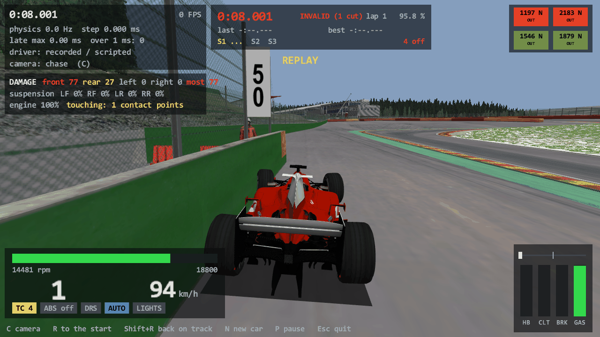

# Task 13: the car body touches things (ODE contacts)

## Resume here

State after the last commit (kept up to date with every commit):

- **Done.** Everything is on `master`, nothing is pushed.
- The car's body now collides with Spa's meshes in the port and in `rustyac.exe`: floor boxes on the road and the
  kerbs, the collider mesh against walls and barriers, and against the road when the car is rolled over.
- Checked against the game, all **bit-exact**: 250,000 random poses over Spa (section 3.1), eight small worlds
  stepped 3,000 times each (3.2), nine whole-car scenarios, 58,672 steps (3.3), `rustyac.exe` itself on eight of
  them (3.4), and the older recordings (3.5). `cargo test --release --workspace` passes, with three new golden
  excerpts (a 60 km/h wall hit, a 283 km/h wall hit, a rollover).
- Nothing is half done. What is still missing by design (car against car, loose objects, pit-stop repairs) is in
  section 6; the choices made without asking are in section 7.
- The large recordings (`oracle/collide/*.carrec`, `oracle/track/*.carrec`, about 1.4 GB) are **deleted**; section 8
  says how to make them again. The small result tables (`oracle/collide/*.md`, `oracle/chassis/results_collide_*.md`)
  and the input files of the crash scenarios (`oracle/game/collide_*.ryin`, 27 to 800 KB each) are still on disk
  (the folder is not in git).
- The briefs read from the machine code, the patch scripts and the helper scripts are in the git-ignored
  `re/scratch/task13/`.

## 1. In plain English

Until now the car's body was a ghost: only the tyres met the track. Now the body is solid, the way it is in
Assetto Corsa:

- **The floor.** Six flat boxes under the car (from `colliders.ini`) touch the road and the kerbs. The game only
  keeps such a contact when it pushes nearly straight up as seen from the car (so the boxes hold the floor off the
  road but never catch on a wall), and it gives it a soft, low-friction material.
- **The body.** One simple mesh (`collider.kn5`, 100 triangles for the F2004) touches walls and barriers. The game
  switches it on for the road as well when the car lies on its side or roof, so a flipped car rests on its mesh.
- **Damage.** Every contact with something that is not ground is measured by its closing speed in km/h. The game
  keeps the largest value per zone of the car (front, rear, left, right) and overall. A corner's suspension is
  bent when both of its zones were hit; above 150 km/h the engine is dead until the car is repaired. Dented zones
  also change the wings (that part existed already).
- **A session's start.** For the first 0.75 s (250 steps) the game looks for no contacts at all.

All of this is in the Rust car and gives the same bits as the game, step after step, including a 283 km/h hit
into the barrier before Blanchimont, a slide along a wall, the floor striking the road in Eau Rouge, and a car
put down on its roof. The game program `rustyac.exe` was checked on its own as well: it replays the recorded
crashes bit for bit.

Three things that were not expected:

1. **`bounce_vel` is never set by the game.** It is whatever was on the stack. For floor contacts that is always
   zero; for wall contacts it is the upper half of a memory address (a number so tiny that it almost never
   matters). Section 4.
2. **A sleeping car hangs in the air.** A car that the game has put to sleep and that is then put down above the
   road stays there until the throttle wakes it. The rollover scenario had to allow for that.
3. **One of ODE's routines uses the processor's approximate reciprocal** (`rcpps`). Its last bits differ between
   Intel and AMD processors, so there the game itself is not the same on every PC. Section 7, point 2.

## 2. What is ported

Addresses are in `acs.exe` 1.16.4. "As compiled" means the machine code was read, not ODE's source: the order of
every sum and the exact form of every comparison are the game's.

### ODE (`crates/rustyac-ode`, BSD-3-Clause)

| File | What | Functions of the game |
|---|---|---|
| `geom.rs` | Moving geoms (a box, a mesh, with an offset on a body), simple spaces with ODE's list order (a geom that is moved goes to the front of its space), the broad phase and `dCollide`'s dispatch | `dCreateBox` 0x14034a320, `dCreateTriMesh` 0x14034b0f0, `dGeomSetBody` 0x140344620, `dGeomSetOffsetPosition` 0x140344800, `dGeomSetOffsetRotation` 0x140344870, `dGeomSetRotation` 0x1403448c0, `dGeomMoved` 0x140342f80, `computePosr` 0x1403434c0, `dxBox::computeAABB` 0x140346e50, `dxSpace::add` 0x140342980, `dxSimpleSpace::cleanGeoms` 0x1403429d0, `::collide` 0x140342b10, `::collide2` 0x140342a60, `collideAABBs` 0x140342c60, `dSpaceCollide` 0x140343090, `dSpaceCollide2` 0x1403430a0, `dCollide` 0x140344120 |
| `collide_btl.rs` | Box against triangle mesh | `dCollideBTL` 0x14038a3d0, `_cldTestSeparatingAxes` 0x140388ef0, `_cldTestFace` 0x140388e30, `_cldTestEdge` 0x140388cd0, `_cldClipping` 0x140387a40, `_cldClipPolyToPlane` 0x140387880, `GenerateContact` 0x140387560, `FetchTriangle` 0x140346770 |
| `opcode_obb.rs` | OPCODE's box-against-tree query (which triangles a box may touch, in the order of the walk) | `dQueryBTLPotentialCollisionTriangles` 0x14038a630, `OBBCollider::Collide` 0x140370500, `InitQuery` 0x140370680, `_Collide` 0x140373190, `VolumeCollider::_Dump` 0x1403956c0, `InvertPRMatrix` 0x1403954a0, `Matrix4x4::operator*` 0x1403542a0 |
| `collide_ttl.rs` | Mesh against mesh: the contacts of each pair of triangles, merged through a hash of 0.1 mm cells | `dCollideTTL` 0x14038c0d0, `TriTriContacts` 0x14038be80, `FindTriangleTriangleCollision` 0x14038b3e0, `BuildPlane` 0x14038b060, `ClipConvexPolygonAgainstPlane` 0x14038b150, `PlaneClipSegment` 0x14038baf0, `PushNewContact` 0x14038bbe0, `AllocNewContact` 0x14038af40, `AddContactToNode` 0x14038ae90, `FreeExistingContact` 0x14038b9a0, `UpdateContactKey` 0x14038c000 |
| `opcode_tree.rs` | OPCODE's tree-against-tree query (which pairs of triangles meet, in the order of the walk) | `AABBTreeCollider::Collide` 0x140354770 and 0x140354910, `InitQuery` 0x140355630, `_Collide` 0x140356e20, `_CollideTriBox` 0x1403632a0, `_CollideBoxTri` 0x14035f8f0, `CoplanarTriTri` 0x140354d10 (box-box, triangle-box and triangle-triangle tests are inlined in these) |
| `contact.rs`, `joint.rs` | The contact joint, joint groups | `dxJointContact::getInfo1` 0x14034e810, `getInfo2` 0x14034e970, `getSureMaxInfo` 0x14034f490, `dJointCreateContact` 0x14033fee0, `dJointGroupCreate` 0x14033ffc0, `dJointGroupEmpty` 0x140340040 |
| `lcp.rs`, `matrix.rs` | The pivoting solver for rows with limits (a contact pushes, never pulls; friction is bounded) | `dSolveLCP` 0x140392260, `dLCP::dLCP` 0x140391cf0, `transfer_i_to_C` 0x140394550, `transfer_i_from_N_to_C` 0x1403941b0, `transfer_i_from_C_to_N` 0x140394030, `pN_plusequals_ANi` 0x1403932f0, `solve1` 0x1403936f0, `_dLDLTAddTL` 0x14034bda0, `_dLDLTRemove` 0x14034c420, `_dRemoveRowCol` 0x14034c910 |
| `step.rs` | The stepper with limited rows: joints without limits first (in reversed order), the others after them in island order; `lo`, `hi`, `findex` | `dWorldStep` 0x1403404c0 |

### The game's own code (`crates/rustyac-physics`, "Ported from Assetto Corsa")

| File | What | Functions of the game |
|---|---|---|
| `car/body.rs` | The physics core's collision side: the dynamic space and its sub-spaces, colliders on a body, the pass of a step, which pairs may touch, the two contact materials | `PhysicsCore::step` 0x1402cd690, `collisionStep` 0x1402cbf90, `nearCallback` 0x1402ccc70, `onCollision` 0x1402ccda0, `getDynamicSubSpace` 0x1402cc920, `resetCollisions` 0x1402cd570, `setNoCollisionSteps` 0x1402cd660, `RigidBodyODE::addBoxCollider` 0x1402cddb0, `addMeshCollider` 0x1402ce080, `setMeshCollideMask` 0x1402ce9c0 |
| `car/colliders.rs` | `colliders.ini`, `collider.kn5` (first mesh of the first node, `GRAPHICS_OFFSET`, `GRAPHICS_PITCH_ROTATION`), `Car::bounds` | `CarColliderManager::loadINI` 0x1402a37a0, `CarAvatar::makeBodyMatrix` 0x1400d8ec0, `Car::initColliderMesh` 0x140273b20 |
| `car/chassis.rs` | The mesh's mask every step, the collision callback (closing speed, damage zones, suspension damage, engine, events), repair, the 250 steps | `Car::updateColliderStatus` 0x140276df0, `PhysicsEngine::onCollisionCallBack` 0x140264020, `Car::onCollisionCallBack` 0x140274650, `Car::setDamageLevel` 0x140275b20, `Car::resetSuspensionDamageLevel` 0x140275970, `PhysicsEngine::setSessionInfo` 0x140264560 |
| (already there, now exercised and re-checked against the machine code) | Suspension damage, the dead engine, `carDamage` in shared memory | `Suspension::setDamage` 0x1402c31e0, `resetDamage` 0x1402c31d0, `getDamage` 0x1402c1500, `Engine::blowUp` 0x140285a30, `SharedMemoryWriter::updatePhysics` 0x140186ef0 |

How the game uses ODE, for the record:

- **Two passes that take turns.** On even steps the game collides the moving things with each other, on odd steps
  with the track. Each pass has its own group of contact joints, emptied just before it is filled again, so a
  contact lives for two steps.
- **Categories.** Track surfaces are 1, walls 2, the car 4. A floor box only meets category 1. The car's mesh
  meets walls and other cars (mask `0x1e`), without other cars while it is in the pit lane (`0x1a`), and also the
  road (`| 1`) while the body's up axis points less than 0.25 upwards.
- **Materials.** A floor box on the track: friction 0.1, no bounce, soft (`soft_erp` 0.714, `soft_cfm` 0.00095),
  and dropped unless the contact normal's y in the car's own frame is at least 0.9. Everything else: friction
  0.25, bounce 0.01, `soft_cfm` 0.0001.
- **At most 32 contacts** per pair against the track, 4 between two moving things.

### `rustyac.exe` (`crates/rustyac-game`)

- The car gets its collider mesh from the game's folder (`content/cars/<car>/collider.kn5`); without it only the
  floor boxes exist and walls do not stop the car.
- A session starts with 250 steps without contacts, as in the game.
- `R` (back to the start) and `Shift+R` (back on the track) repair the car as AC's teleport does: the five zones to
  zero, the four suspensions straight, and (inside the teleport itself) a new engine.
- A car that lies on its roof or side is still put back automatically, but only after it has been at rest for 3 s
  (1,000 steps below 0.5 m/s and 0.5 rad/s); while it slides or tumbles it is left alone.
- The debug view shows a damage panel: the five zones, suspension damage per corner, engine life, and how many
  contact points the car is touching at the moment. `carDamage` in the shared memory page was already right.



`docs/game/spa_barrier.png` (270 KB) was drawn off screen by `rustyac.exe`, 8 s into the replay of the wall-slide
scenario: the F2004 along the barrier before the Bus Stop at 94 km/h, one contact point, front zone 77.

## 3. Results

### 3.1 Collision micro-oracle: random poses over Spa

`car_oracle collide --track spa`: the track's 455 physics meshes and the F2004's colliders in the game's own
`PhysicsCore` (mapped from `acs.exe`) and in the port. For every pose both run the collision pass of a step.

| Kind of pose | Poses | `dCollide` pairs | Pairs that touch | Contacts | Identical pairs | Contact joints after the pass | Box contacts the game dropped | Identical passes |
|---|---|---|---|---|---|---|---|---|
| floor boxes: at ride height over the road, nearly level | 50,001 | 1,944,276 | 160,625 | 1,643,976 | 100 % | 1,098,683 | 592,885 | 100 % |
| floor boxes: nose or tail down by up to 15 degrees | 33,334 | 1,300,668 | 83,049 | 694,084 | 100 % | 436,333 | 289,086 | 100 % |
| floor boxes: rolled by up to 25 degrees | 33,334 | 1,298,946 | 80,527 | 757,471 | 100 % | 507,528 | 280,816 | 100 % |
| floor boxes: sunk into the road by up to 30 cm | 33,333 | 1,295,478 | 100,323 | 996,602 | 100 % | 548,137 | 478,942 | 100 % |
| floor boxes: over a kerb | 33,332 | 1,574,592 | 171,865 | 1,683,377 | 100 % | 998,792 | 696,066 | 100 % |
| floor boxes: any orientation | 16,666 | 645,984 | 57,999 | 357,810 | 100 % | 97,168 | 270,469 | 100 % |
| collider mesh: next to a wall, upright | 16,668 | 35,877 | 14,893 | 168,303 | 100 % | 169,986 | 489 | 100 % |
| collider mesh: at a wall, any orientation | 16,666 | 35,608 | 11,652 | 147,814 | 100 % | 149,137 | 15,103 | 100 % |
| collider mesh: upside down on the road | 8,333 | 69,158 | 17,402 | 265,061 | 100 % | 295,221 | 94,932 | 100 % |
| collider mesh: on its side on the road | 8,333 | 69,255 | 16,336 | 232,147 | 100 % | 261,460 | 136,082 | 100 % |
| **all** | **250,000** | **8,269,842** | **714,671** | **6,946,645** | **8,269,842 (100 %)** | **4,562,445** | **2,854,870** | **250,000 (100 %)** |

A pair is identical when both sides give the same number of contacts in the same order with the same bits of
position, normal and depth, the same geoms and the same triangle numbers. A pass is identical when the contact
joints it leaves are the same in the same order, with the same contact and material. All 455 meshes were touched.
**No difference.**

### 3.2 Small synthetic worlds, stepped freely

`car_oracle collide-worlds --steps 3000`: each world is built in the game's `PhysicsCore` and in the port and both
are stepped on their own (collision pass, then `dWorldStep`). Compared every step: position, quaternion, linear
and angular velocity of every body, and the contact joints.

| World | What | Steps | Steps with contacts | Contact joints (sum, most at once) | Bit-exact steps |
|---|---|---|---|---|---|
| `box_rest` | a box put down on a flat mesh, left to rest | 3,000 | 2,993 | 34,920, 14 | 100 % |
| `box_slide` | a box sliding and turning over a sloped mesh until friction stops it | 3,000 | 2,953 | 20,633, 14 | 100 % |
| `box_bounce` | a box dropped with spin from 1.4 m onto bumps | 3,000 | 2,749 | 29,729, 21 | 100 % |
| `car_floor` | the F2004's six floor boxes on one body, thrown along a bumpy mesh at 54 km/h | 3,000 | 708 | 6,752, 39 | 100 % |
| `mesh_push` | a box-shaped mesh sliding on a floor mesh into a wall mesh at 50 km/h | 3,000 | 2,979 | 17,854, 12 | 100 % |
| `mesh_tumble` | the F2004's collider mesh dropped upside down and tumbling over bumps | 3,000 | 2,785 | 15,841, 11 | 100 % |
| `car_wall` | floor boxes and collider mesh on one body: sliding on its floor into a wall at 72 km/h, at an angle | 3,000 | 2,977 | 45,462, 20 | 100 % |
| `two_meshes` | (extra) two bodies with meshes, one slides into the other: the even pass, two-body contact joints | 3,000 | 2,968 | 41,863, 19 | 100 % |

24,000 steps, 639,162 rows with limits, 708,161 pivots of the solver; it gave up 9 times with ODE's
"LCP internal error, s <= 0", on both sides in the same steps with the same result. A second run
(`--hybrid`) hands the port the game's contact joints before each `dWorldStep`, which checks the contact joint,
the stepper and the solver on their own: also no difference.

### 3.3 The whole car

`car_oracle run --track spa --collide --scenario <name>` records the game's own car with the real collider mesh
and the track's real categories; `chassis_compare run --dir oracle/collide` steps the whole Rust car from step 0
with nothing but the driver's controls and compares every step.

| Scenario | What | Steps | Bit-exact steps | First divergence |
|---|---|---|---|---|
| `settle_floor` | flat floor: the car put down and left to settle on its wheels and floor boxes | 667 | 100 % | none |
| `spa_wall_low` | towards La Source at 60 km/h and straight on where the road turns: into the wall | 4,667 | 100 % | none |
| `spa_wall_high` | flat out towards Blanchimont, a little wheel to the outside: into the barrier at 283 km/h | 6,667 | 100 % | none |
| `spa_wall_gravel` | the same run straight on: over the run-off and into the barrier at 195 km/h, one corner first | 6,667 | 100 % | none |
| `spa_wall_slide` | off the road at 100 km/h at a shallow angle and along the wall | 6,001 | 100 % | none |
| `spa_bottoming` | flat out through Eau Rouge: the floor on the road in the compression | 5,334 | 100 % | none |
| `spa_kerb_strike` | the Bus Stop much too fast, deep over its inner kerbs | 5,334 | 100 % | none |
| `spa_rollover` | put down on its roof 0.8 m above the road, five seconds later on its side | 3,334 | 100 % | none |
| `spa_lap` | a minute of a lap along the AI line, with walls and the 250 steps without contacts | 20,001 | 100 % | none |
| **all** | | **58,672** | **58,672 (100 %)** | |

Compared per step: the 2,009 chassis values and the force tape as before, 496 values of the other systems (366 on
the flat floor), among them the new ones: the number of contact joints, a hash over all of them, the first six in
full (position, normal, depth, the two geoms, the triangle numbers, the material), the collision pass's counter and
parity, the two collision clocks, the five damage zones, the four suspensions' damage, engine life, the mesh's
mask, and the collision events the car pushed on the engine's queue (how many, a hash over all their fields, the
closing speed and group of the first and the last).

What the scenarios exercise (counted on the Rust car):

| Scenario | Steps with floor-box contact joints | Steps with collider-mesh contact joints (first at step) | Most contact joints in a step / in all steps | Collision callbacks (= events) / highest damaging closing speed | Steps with limited rows / rows / solver pivots | Damage zones at the end (front, rear, left, right, most) | Suspension damage at the end (LF, RF, LR, RR) | Engine life at the end |
|---|---|---|---|---|---|---|---|---|
| `settle_floor` | 12 | 0 | 4 / 48 | 24 / - | 12 / 144 / 96 | 0, 0, 0, 0, 0 | 0, 0, 0, 0 | 1000 |
| `spa_bottoming` | 672 | 0 | 25 / 4,770 | 2,385 / - | 672 / 14,310 / 7,821 | 0, 0, 0, 0, 0 | 0, 0, 0, 0 | 1000 |
| `spa_kerb_strike` | 58 | 0 | 19 / 498 | 249 / - | 58 / 1,494 / 897 | 0, 0, 0, 0, 0 | 0, 0, 0, 0 | 1000 |
| `spa_lap` | 528 | 0 | 27 / 3,512 | 1,756 / - | 528 / 10,536 / 5,952 | 0, 0, 0, 0, 0 | 0, 0, 0, 0 | 1000 |
| `spa_rollover` | 0 | 2,071 (765) | 16 / 11,603 | 5,806 / - | 2,071 / 34,809 / 58,397 | 0, 0, 0, 0, 0 | 0, 0, 0, 0 | 1000 |
| `spa_wall_gravel` | 160 | 64 (4,369) | 22 / 1,542 | 771 / 190 km/h | 182 / 4,626 / 3,429 | 190.0, 166.3, 0, 2.2, 190.0 | 0, 0.79, 0, 0.65 | -100 |
| `spa_wall_high` | 300 | 208 (4,243) | 28 / 3,082 | 1,541 / 155 km/h | 428 / 9,246 / 6,410 | 135.7, 154.9, 0, 0, 154.9 | 0, 0, 0, 0 | -100 |
| `spa_wall_low` | 10 | 184 (4,023) | 9 / 444 | 222 / 52 km/h | 194 / 1,332 / 1,260 | 52.0, 11.8, 0, 0, 52.0 | 0, 0, 0, 0 | 1000 |
| `spa_wall_slide` | 400 | 1,106 (2,161) | 12 / 4,648 | 2,324 / 77 km/h | 1,474 / 13,944 / 11,578 | 77.4, 52.2, 0, 0, 77.4 | 0, 0, 0, 0 | 1000 |

(The road is ground: resting on it, also on the roof, damages nothing. In `spa_wall_high` the car meets the
barrier at 283 km/h but at an angle: the closing speed along the contact normal, which is what the game counts,
peaks at 155 km/h. Engine life -100 is the game's "blown up".)

### 3.4 The game program itself

`chassis_compare game-replay --dir oracle/collide` turns a recording's driver controls into an input file and lets
`rustyac.exe --replay <file> --headless --dump-states -` run it; the program's car is compared with the recording
exactly as above.

| Scenario | Steps | Bit-exact steps |
|---|---|---|
| `settle_floor` | 667 | 100 % |
| `spa_bottoming` | 5,334 | 100 % |
| `spa_kerb_strike` | 5,334 | 100 % |
| `spa_lap` | 20,001 | 100 % |
| `spa_wall_gravel` | 6,667 | 100 % |
| `spa_wall_high` | 6,667 | 100 % |
| `spa_wall_low` | 4,667 | 100 % |
| `spa_wall_slide` | 6,001 | 100 % |
| `spa_rollover` | 3,334 | not run: an input file cannot put the car down in the air |
| **all** | **55,338** | **55,338 (100 %)** |

### 3.5 What was bit-exact before still is

Recorded without collisions, replayed with today's code:

| Recordings | Steps | Bit-exact |
|---|---|---|
| `oracle/car` (the flat-road whole-car scenarios; the old `settle_floor` is skipped, see section 7 point 9) | 70,006 | 100 % |
| `oracle/car_wc` | 13,600 | 100 % |
| `oracle/car_pt` | 3,334 | 100 % |
| `oracle/car_tight_stops` | 52,005 | 100 % |
| Spa without collisions, recorded again: `spa_launch`, `spa_eau_rouge`, `spa_kerbs`, `spa_grass`, `spa_timing` | 38,068 | 100 % |

### 3.6 Golden tests

`cargo test --release --workspace` has three new excerpts in `crates/rustyac-physics/tests/golden/` (112 KB, 112 KB
and 182 KB), each starting at a moment without a contact joint, a little before the collider mesh first touches:

| File | Steps | What happens in it |
|---|---|---|
| `collide_spa_wall_low_3993_200.chgold` | 3,993 to 4,192 | the 60 km/h hit at La Source; 170 steps with contact joints |
| `collide_spa_wall_high_4213_200.chgold` | 4,213 to 4,412 | the 283 km/h hit before Blanchimont; the engine blows up, the zones fill; 166 steps with contact joints |
| `collide_spa_rollover_745_340.chgold` | 745 to 1,084 | the car lands on its roof, bounces twice and comes to rest; 176 steps with contact joints |

The test replays them from the saved state and compares the bodies and a hash over every compared value
(contacts, damage and events included). It also checks that the same excerpt with a ghost body fails, and that a
collider mesh one millimetre longer fails. The track and the collider mesh come from the game's folder; without
it (or without `cardata/`) the tests print `NOT TESTED: ...` and pass. A unit test in the game crate covers the
"put back only after three seconds at rest" rule.

## 4. What `bounce_vel` turned out to be

The game fills in a contact's material in `PhysicsCore::onCollision` and never writes `bounce_vel`. The contact
joint reads it when the material bounces: a contact only bounces if the bodies part faster than `bounce_vel`. So
the game reads four bytes of stack that the function it called just before, `dCollide`, left behind. What those
bytes are was followed through the machine code:

- **A floor box on the track** (`dCollideBTL`): the bytes are the upper half of what was in register `r12` when
  the collider was entered. `PhysicsEngine::step` sets `r12` to zero and nothing on the way changes it, so in the
  game the value is always **0**. These contacts have no bounce anyway, so the value is never used.
- **The collider mesh against anything** (`dCollideTTL`): the bytes are the **upper half of the memory address of
  the car's mesh geom**. For a heap address that is a small whole number (for example `0x174`, `0x1b8`, `0x28c` in
  three runs here), which read as a float is a positive number below 5e-41. It changes from run to run. It only
  decides anything when two bodies part at a speed that is itself that tiny, which did not happen once in the
  recordings.

So the value is deterministic for boxes and, for meshes, random in a range that practically never matters. The
port has both as fields of the physics core (`box_bounce_vel`, `mesh_bounce_vel`), **0 by default**. The oracle
reads the value the game's joints really had in a run and writes it into the recording's header; the comparison
gives it to the port, so the check is exact also where it could matter. (Run inside the test program rather than
the game, the box value is the upper half of the test program's own `r12`; that is recorded too.)

## 5. Performance

Measured on this PC (Radeon Pro 5500M), which was in use at the time; the frame rates in particular vary with
that.

| What | Result |
|---|---|
| The collision pass alone, 250,000 poses over Spa | the game's own code 0.076 ms per pass, the port 0.104 ms |
| `rustyac.exe`, as fast as it can (no drawing), the 283 km/h wall hit, 20 s | 0.26 ms per physics step |
| the same, the slide along the wall, 18 s | 0.27 ms per step |
| the same, a minute of a lap (floor contacts only) | 0.18 ms per step |
| `rustyac.exe` in real time, drawing off screen at 1280 x 720, the 283 km/h wall hit | physics 333.33 Hz; step time average 0.150 ms, worst 2.363 ms; no step a whole step late; 478 frames per second, slowest frame 15.6 ms |
| the same, the slide along the wall (1,106 steps touching it) | step time average 0.213 ms, worst 1.914 ms; 331 frames per second, slowest frame 33.9 ms |
| the same, a minute of a lap | step time average 0.291 ms, worst 2.616 ms; 249 frames per second, slowest frame 33.9 ms |

A step has 3 ms. A crash costs about 0.1 ms per step on average and no step came near the limit because of one
(the worst steps are of the same size with and without a crash: the operating system, not the contacts).

## 6. What is still missing

- **Car against car.** The even pass, contact joints between two bodies and at most four contacts per pair are
  ported and checked (the `two_meshes` world), but there is only one car. A second car needs the car's own number
  (`physicsGUID`: its sub-space and the event's first field), the game's rule for which side of a contact a car is
  (decided once for all cars), and the pit-lane rule that reads the other cars' places.
- **Loose objects** (category `0x10`, cones and the like) and **remote cars** (category 8): they do not exist.
- **Deformation.** The game's physics has none; what looks dented in AC is drawn from the damage zones. The port
  has the zones and nothing draws them. No crash sounds either (the events are produced and compared, nothing
  listens).
- **Repairs in the pits**, the pit-stop time, a session change while the program runs (the first session is
  right).
- Suspension damage for the other suspension types (strut, multi-link, live axle): only the double wishbone
  exists in the port.
- In ODE: a joint that has rows with limits and rows without in one (a hinge with stops, say). The game's car has
  none; the stepper stops with a message if it meets one.
- The rollover in the game program was not watched from start to finish without a driver: the physics is checked
  (the scenario above), the three-second rule has its own test, the two were not run together.

## 7. Open questions and the choices made without asking

1. **`bounce_vel`** is 0 in the port unless a recording says otherwise (section 4). The game's real value for the
   mesh is a random tiny number; copying "random" is not possible, 0 is its most likely effect.
2. **`rcpps`.** ODE's `_dLDLTRemove` (used when the solver takes a row out again) is compiled with the
   processor's approximate reciprocal for blocks of eight. The port uses the same instruction, so on this PC it is
   the game bit for bit. Intel and AMD give different last bits for that instruction, so a recording made on one
   brand may not replay exactly on the other once a crash uses that routine. That is true of the game itself. On
   a processor that is not x86 the port falls back to the exact reciprocal.
3. **`spa_wall_high` was changed** to reach the speed the task asks for: straight on, the run-off slows the car to
   195 km/h before the barrier. It now gets a little wheel towards the outside and arrives at 283 km/h. The
   straight-on run is kept as `spa_wall_gravel` because it is the only one that bends a suspension.
4. **The rollover scenario** puts the car down at steps 400 and 1,900 and gives a second of throttle each time,
   because a sleeping car put down in the air stays there (the game's behaviour, copied).
5. **At La Source the car stops about five metres before the yellow barrier you see**: Spa's physical wall stands
   there. This is the track's data, the same in the game (that scenario is bit-exact).
6. **Task 12, question 11 (names as raw bytes): done.** Names in `.kn5` files are kept as bytes, compared and
   looked up as bytes and only made into text to be shown. Two places still need text: the physics takes a mesh's
   surface and a helper's meaning from the name the way the game does (its decoder stops at the first byte that is
   not UTF-8), and a file name out of `models.ini` has to become a Windows path (bytes that are not UTF-8 are read
   as Latin-1 there).
7. **Task 12, question 12 (pictures): done.** The three Spa pictures and the new one are 258 to 294 KB each, still
   1280 x 720, with a palette of 128 to 256 colours.
8. **The collision events** are compared through the game's own queue (emptied every step by the oracle with the
   queue's own pop function). The second event of the game, `Car::evOnCollisionEvent`, has no listener in the
   oracle and is not compared; its values are the same closing speed and the same points.
9. **The old `settle_floor` recording** (in `oracle/car`, from before this task) is skipped: its header does not
   say what the floor was. The new one in `oracle/collide` is bit-exact.
10. **An input file can carry an oracle recording's collision set-up** (`oracle_collide` and four more keys), so
    that `rustyac.exe` can replay such a recording. Files a player records are not affected.
11. **`Car::bounds`** (the box around the collider mesh) is computed as the game does, but nothing in the game's
    own code reads it; nothing in the port does either.
12. **The time budget** (4 to 5 hours) was exceeded by a wide margin, over three sittings: mesh against mesh with
    its two tree walks was most of it.
13. Extra, beyond the task: the `two_meshes` world, `spa_wall_gravel`, the hybrid run of the worlds, the
    `--boxes-only` switch of the pose oracle, the damage and contact table of `chassis_compare`.

## 8. How to run the checks again

In PowerShell, from the repository's folder:

```
cargo test --release --workspace

# the tools (each has its own target folder)
cargo build --release --manifest-path tools\car_oracle\Cargo.toml
cargo build --release --manifest-path tools\chassis_compare\Cargo.toml

# 3.1 and 3.2
tools\car_oracle\target\release\car_oracle.exe collide --track spa
tools\car_oracle\target\release\car_oracle.exe collide-worlds --steps 3000
tools\car_oracle\target\release\car_oracle.exe collide-worlds --steps 3000 --hybrid

# 3.3: record (9 to 300 MB each, one after the other), then compare
tools\car_oracle\target\release\car_oracle.exe run --scenario settle_floor --collide --out oracle\collide
foreach ($s in 'spa_wall_low','spa_wall_high','spa_wall_gravel','spa_wall_slide','spa_bottoming','spa_kerb_strike','spa_rollover','spa_lap') {
    tools\car_oracle\target\release\car_oracle.exe run --scenario $s --track spa --collide --out oracle\collide
}
tools\chassis_compare\target\release\chassis_compare.exe run --dir oracle\collide

# 3.4: the game program against the same recordings (also writes oracle\game\collide_*.ryin)
cargo build --release -p rustyac-game
tools\chassis_compare\target\release\chassis_compare.exe game-replay --dir oracle\collide

# the golden excerpts, from the recordings
tools\chassis_compare\target\release\chassis_compare.exe excerpt-collide
```

To try a crash in the game:

```
# drive it yourself, into any barrier; the damage panel is at the top left; R and Shift+R repair
target\release\rustyac.exe --track spa

# or watch a recorded one: the 283 km/h hit comes 12.7 s in (--windowed: a window, not full screen)
target\release\rustyac.exe --replay oracle\game\collide_spa_wall_high.ryin --windowed

# or one picture of it, off screen
target\release\rustyac.exe --replay oracle\game\collide_spa_wall_slide.ryin --screenshot shot.png --at 8
```
