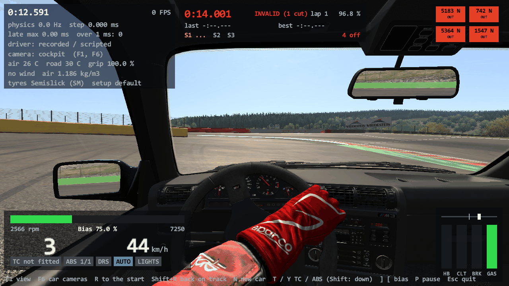
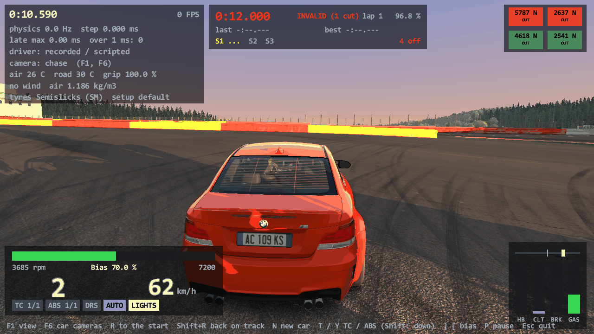
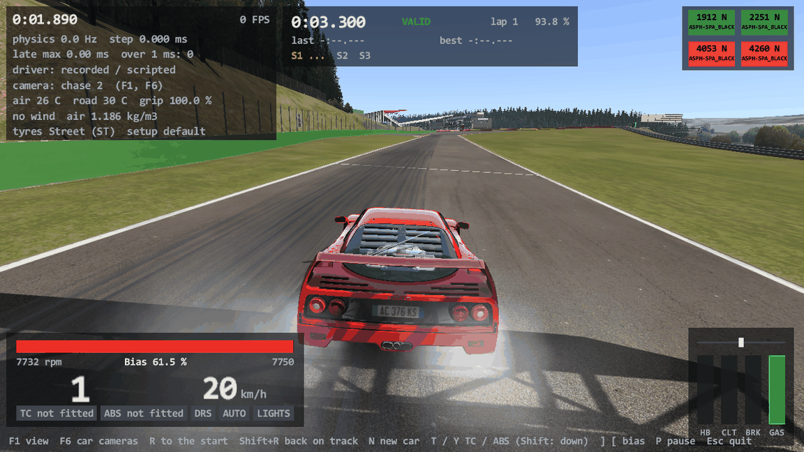
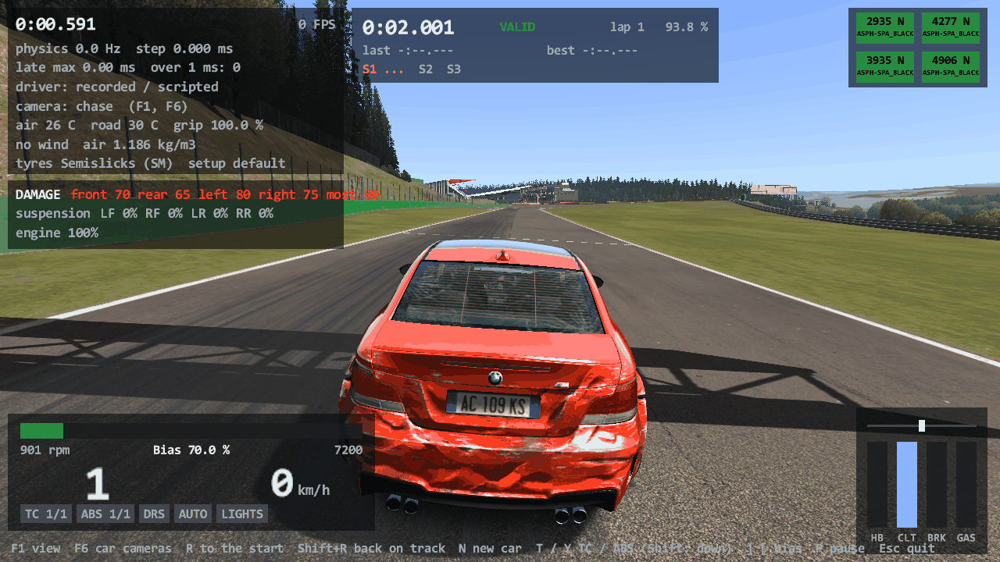

# Task 21: AC's real renderer, part 2 (the whole car)

## Resume here

State after the last commit (kept up to date with every commit):

- **The task is finished** but for the points listed under "Not done" in section 1 and the open questions of
  section 8. Version 0.21.0, tag `v0.21.0`.
- The task text is `prompts/21_renderer_car.md`. The next task is Task 22 (the picture after the scene:
  multisampling, post-processing, the game's HUD); its checklist is section 7.
- To pick the work up again: section 9 has the checks; `sh re/scratch/task21/batch.sh` runs the 27 proof
  sequences (about 25 minutes), `sh re/scratch/task20/batch.sh` the 21 frames of Task 20.
- On disk, git-ignored: `re/scratch/task21/` (the reader agents' specs `spec_*.md` with their disassembly
  listings, the patch scripts `p_*.py`, the batch script and its results, oracle output in `out/`), the
  recorded car states in `oracle/audio/` and `oracle/render_tapes/` (written by
  `re/scratch/task21/record_tapes.sh` with `car_oracle run … --audio-tape`).

## 1. Plain-English summary

Task 20 drew the track and the car's body the way Assetto Corsa does. This task adds everything else the game
hangs on a car, ported from `acs.exe` one object at a time:

- **the driver**, with his hands turning the wheel, changing gear, and his head moving;
- **the cockpit**: needles, the digital displays and shift lights, the gear lever's shake, the car's own
  animations (doors, wings, pop-up headlights), turning objects such as fans;
- **lights**: headlights, brake lights, pop-up lights, glowing brake discs, dirt on the tyres;
- **damage**: scratches and dents that grow with the impact, glass that cracks, body parts that hang and shake;
- **wheels and suspension details**: blurred rims and tyres at speed, the rods and arms that aim at each other
  (`DIR_` nodes);
- **what the car leaves on the world**: its flat ground shadow, skid marks, tyre smoke, grass smoke and bits of
  grass, engine smoke, exhaust flames;
- **reflections and mirrors**: the reflection map that follows the car, the mirrors in the cockpit and on the
  doors, and the "virtual mirror" at the top of the screen.

"The same as the game" was measured, not judged by eye. The render oracle runs the game's own code for each of
these objects and the Rust port side by side, feeds both the same car states 60 times a second, and compares
every frame twice: the list of every command sent to the graphics card (5,000 to 7,000 a frame), and every
pixel of the picture. **All 27 new proof sequences (2,353 frames) are identical in both**, and the 21 frames of
Task 20 still are. Random things (smoke, the gear lever's shake, flames) are identical too, because the game's
random number source was found and ported: it is the C runtime's `rand()`, and both sides start it from the
same number.

`rustyac.exe` now draws all of it. The L key (AC's own headlight key) switches the lights, the brake lights
follow the pedal, damage comes from the physics, F11 (AC's own key) shows the virtual mirror, and mirrors,
smoke and the following reflection map are read from your `video.ini`.

**Not done** (each is also in section 7 or 8):

1. `DigitalPanels` (the extra display pages some cars have) and three kinds of display item (`RPM_GRAPH`,
   `DELTA_GRAPH`, `GEAR_TX`) are not ported. The plain digital instruments are.
2. The high-quality mirror (`[MIRROR] HQ=1`, a multisampled target) is not ported; the plain mirror is drawn
   in its place and `rustyac.exe` says so.
3. Flames of "version 1" (cars without `flame_presets.ini`) are not ported: no car of the game has them.
4. There are no wipers and no reverse lights to port: plain `acs.exe` has no code for either (section 8).
5. `CarFakeShadow`'s first-run generator (`generateFakeShadow`, which makes `body_shadow.png` for a car that
   has none) is not ported; such a car has no ground shadow and a line says so.
6. Several things are per-frame code of `CarAvatar::update` written out by hand in the oracle's harness rather
   than run from the game whole (section 3).

## 2. What is ported (addresses are `acs.exe`)

All of it is in `crates/rustyac-render/src/`. Sizes are the game's `operator new` sizes.

| File | What | Addresses |
|---|---|---|
| `state.rs` | The game's whole `CarPhysicsState` (0xb70 bytes, the game's layout, read and written byte for byte), `SurfaceDef`, `TyreThermalState` | filled by `Car::getPhysicsState` 0x140270d70 |
| `gl.rs` | `GLRenderer`, the immediate-mode drawer (quads, lines, its ladder of vertex buffers) | ctor 0x1401fdfe0, `begin` 0x1401fe800, `vertex3f` 0x1401ffc20, `end` 0x1401fe870 |
| `scene.rs` | `NodeEvent` handlers, nodes with their own `render` (`RenderableObject`) | `NodeEvent::render` 0x14021e5c0 |
| `fake_shadow.rs` | `CarFakeShadow` (0x158): the body's and the four wheels' flat shadows on the ground plane | ctor 0x1400e0d80, `onNodeRenderEvent` 0x1400e22b0, `setFromHeadingUp` 0x1400602f0 |
| `blur.rs` | `BlurredObjects` (0x78), `TyreBlur` (0x120) | 0x1400c35d0 / 0x1400c43b0, 0x1401cf760 / 0x1401cfdb0 |
| `damage.rs` | `VisualDamageManager` (0xd0): scratches, cracked glass, hanging parts | ctor 0x1401d2890, `update` 0x1401d56f0 |
| `lights.rs` | `CarBrakeLights` (0xf0), `AnimatedLights` (0x88), `BrakeDiscGraphics` (0x148), `DynamicCarEffects` (0x88) | 0x1400ddbb0 / 0x1400e0450, 0x14005a850 / 0x14005aef0, 0x14005ca40 / 0x14005d930, 0x140091230 / 0x140091ac0 |
| `constrained.rs` | `ConstrainedObjectsManager` (0x78): `DIR_` nodes | ctor 0x140076d10, `updateConstraints` 0x140077320 |
| `animator.rs` | `.ksanim` version 1 (matrices turned into quaternion and position), mode-0 players, `AnimationBlender`, the matrix lerp | `QuatPos::from_matrix`, `XMQuaternionRotationMatrix` |
| `driver.rs` | `DriverModel`: both models, `driver_base_pos.knh`, skins, steering, shifting, head, visibility | `CarAvatar::initDriver` 0x1400d7380, `DriverModel::update` 0x1400fb5d0, `setVisible` 0x1400fb5a0 |
| `cockpit.rs` | `AnalogInstruments` (0x490), `GearShiftShake` (0x128), `CarAnimations` (0xa8), `RotatingObjects` (0x78) | 0x140056480 / 0x140059770, 0x1401048f0 / 0x140104ca0, 0x140060ba0 / 0x140062160, 0x1400ba560 / 0x1400bae20 |
| `digital.rs` | `DigitalInstruments` (0xc8): 21 kinds of text item, 16 kinds of light, 7 kinds of LED series, `StringBlitter3D`, `TextNode` | ctor 0x1400eb030, `update` 0x1400f0520 |
| `skid.rs` | `SkidMarkBuffer` (0x198), `DynamicBuffer`, `CarAvatar::updateSkidMarks` | 0x14018f2d0, 0x1401900c0, 0x1401905e0, 0x14021c360, 0x1400dd780 |
| `particles.rs` | `ParticleSystem` (0x1b0), `ParticleGenerator` (0xb0), `TyreSmoke` (0xa8), `EngineSmoke` (0x90) | 0x14025fbc0, `step` 0x140260df0, `render` 0x1402607e0, `generateParticle` 0x1402611c0, 0x1401d0000 / 0x1401d0b80, 0x140092de0 / 0x1400935e0 |
| `flames.rs` | `Flames` (0x158, version 2), `BackfireParams` and the backfire test at the head of `CarAvatar::update` | ctor 0x1400ff990, `drawFlame` 0x1401014e0, `onNodeRenderEvent` 0x140103aa0, `update` 0x1401046a0, handler 0x140100070, `checkBackfire` 0x1400d26b0, `createBillboard` 0x14007cf30, `createTarget` 0x14005ff50 |
| `mirror.rs` | `MirrorTextureRenderer` (0x68), `CameraMirror`, `CarMirrorManager` (0x78), `VirtualMirrorRenderer` (0x78) | 0x140113c40 / 0x140114410, 0x14021bd80 / 0x14021bf30, 0x1400e5f20 / 0x1400e6fc0, 0x1401d1ea0; the test of `Sim::renderScene` 0x14019e570 |
| `cubemap.rs`, `forward.rs` | The cube map that follows the car (`FACES_PER_FRAME`, `FARPLANE`) | `CubeMapRenderer::render`, `Sim::initCubemaps` 0x1401997a0 |
| `car.rs` | `CarAvatar`: `init3D` 0x1400d3b90, `initCommonPostPhysics` 0x1400d6190, `onPostLoad` 0x1400d92b0, `update` 0x1400db830 in the game's order, `setVisible` 0x1400dade0, the remaining `lods.ini` rules (`DRIVER_HR`) | |

What was found on the way, and matters to anyone reading the game:

- **The random source** is the C runtime's `rand()` (MSVCR120: `s = s * 214013 + 2531011; (s >> 16) & 0x7fff`),
  called directly, eleven times per smoke particle, once per flame group, and by the gear lever's shake and the
  blinking displays. It is kept per thread; the game seeds the main thread from the clock, so the game itself
  never draws the same smoke twice. The port has it as `Graphics::crt_rand`; the oracle seeds both sides with 21.
- **The game's clock (`Game::gameTime.now`) is in milliseconds** where the smoke generators expect seconds, so
  the "frequency" of smoke at Normal, High and Ultra never limits anything: one particle per wheel per frame.
- **Removing dead particles skips one**: after a particle is taken out, the one that moved into its place is not
  looked at until the next frame. Ported as it is.
- **The flash presets of the flames are read three times over** (a loop that does not use its counter), so every
  flash is drawn three times. Ported as it is.
- **Damage glass is not hidden**: it is always drawn, with a material variable (`glassDamage`) at 0 until the
  impact passes a threshold. That removed the cracked rear window the 1M had in Task 20.
- **Disc glow is not from temperature**: it follows the brake pedal and the wheel's speed.
- **Skid marks only exist with `WORLD_DETAIL` above 0.** This PC's `video.ini` has 0, so `rustyac.exe` draws
  none here, as the game would not.
- **The mirror picture is not flipped by code**: it is a plain backwards camera; the mirror glass's texture
  coordinates do the flipping (and the virtual mirror's quad draws its left edge with u = 1).
- **A discarded vertex buffer keeps what the driver had in it.** The game maps a 24-vertex buffer with
  "discard" and writes 18; the other 6 are leftovers that changed from run to run. The command logger now
  starts such a buffer from zeros on both sides (`gpulog.rs`), which changes no pixel.

## 3. The oracle: how "the same" is measured

`tools/render_oracle` (Task 20) maps `acs.exe` into its own process on the software rasteriser (WARP) and calls
the game's functions by address. New in this task:

- **Sequences.** `render_oracle compare --car <c> --tape <file.audiotape> [--tape-from <frame>] [--frames <n>]`
  feeds both sides the game's own `CarPhysicsState` records (60 a second, written by `car_oracle run …
  --audio-tape`: the game's physics driving a scenario), runs every object's `update` and draws every frame.
  Each frame's command log and picture are compared; `--dump <i,j>` writes those frames whole.
- **The game's objects are the game's.** For every class of section 2 the harness allocates the block, calls the
  game's constructor and, each frame, the game's `update` (and `render`, through the scene graph), on a zeroed
  `Game`, `Sim` and `CarAvatar` that hold just the fields those functions read (`tools/render_oracle/src/ac_car.rs`
  lists each field with its offset).
- **Options** on top of the Task 20 profile: `--smoke <0..5>`, `--mirror <size>`, `--mirror-smoke`,
  `--virtual-mirror`, `--cubemap-faces <0..6>`, `--cubemap-far <m>`, `--sun <angle>`, and
  `--set name=value[@frame],…` which writes over the car's state (lights, flash, brake, gas, gear, rpm, limiter,
  kmh, fuel, turbo, water, kers, pit, dirt, damage).
- **Views**: `chase`, `far`, `side`, `rear`, `front`, and from the driver's eyes `onboard` and `dash`.
- **The same random numbers and the same clock**: both sides call `srand(21)` (`ksRandomize` 0x14004b290) and
  take the game time of frame *i* as *i* x 1000/60 ms. The Documents folder is a stand-in inside the scratch
  folder on both sides (the game's `SHGetFolderPathW` import is answered by the harness), so nothing of your own
  settings is read.

What the harness writes by hand, from the disassembly, instead of running the game's function whole (both sides
get the same): the order of `CarAvatar::init3D` and `initCommonPostPhysics`; the first lines of
`CarAvatar::update` (in-pit-lane flag, the backfire test's call and its handlers, the body matrix, the steering
wheel and driver-visibility block); the creation of the skid-mark buffers; the mirror test of
`Sim::renderScene`; the camera. `Sim::Sim`, `TrackAvatar` and the camera managers do not run.

## 4. Results

### New sequences (every frame compared; WARP, 1280 x 720)

| # | Sequence | Frames | Calls (per frame) | Draws | Command log | Pixels |
|---|---|---|---|---|---|---|
| 1 | spa, F2004 lap, dash camera, mirrors 512 (driver, wheel display, shift lights) | 59 | 421,339 (6542 to 7201) | 70,121 | identical | identical |
| 2 | magione, E30 lap, cockpit camera, mirrors 512 (driver, needles, three mirrors) | 59 | 373,524 (6300 to 6353) | 65,323 | identical | identical |
| 3 | monza, 1M lap, cockpit camera (driver, needles, digital items) | 59 | 273,169 (4604 to 4654) | 38,999 | identical | identical |
| 4 | monza, F40 lap, dash camera (needles, .ksanim v1 car) | 39 | 182,899 (4680 to 4712) | 25,744 | identical | identical |
| 5 | spa at night (SUN_ANGLE 84), 1M, headlights + brake lights + reverse gear, rear camera | 29 | 192,899 (6644 to 6664) | 31,867 | identical | identical |
| 6 | spa at night (SUN_ANGLE 84), 1M, headlights, front camera | 29 | 200,134 (6889 to 6929) | 33,408 | identical | identical |
| 7 | monza at night (SUN_ANGLE 84), F40, pop-up headlights coming out (.ksanim v1) | 49 | 320,244 (6531 to 6608) | 53,875 | identical | identical |
| 8 | spa, E30, lights flashing and brake lights by day, rear camera | 29 | 166,093 (5675 to 5814) | 26,968 | identical | identical |
| 9 | spa, 1M hard stops, side camera (glowing discs, brake lights) | 89 | 532,108 (5709 to 6146) | 80,177 | identical | identical |
| 10 | magione, E30 hard stops, side camera (glowing discs) | 69 | 371,151 (5284 to 5613) | 62,998 | identical | identical |
| 11 | spa, F2004 into the wall, chase (damage, hanging parts) | 59 | 298,136 (4981 to 5107) | 43,753 | identical | identical |
| 12 | spa, 1M along the wall, front camera (scratches, broken glass) | 59 | 303,610 (5136 to 5155) | 45,751 | identical | identical |
| 13 | spa, E30 along the wall, chase (scratches, broken glass) | 59 | 337,356 (5679 to 5859) | 53,940 | identical | identical |
| 14 | spa, 1M fully damaged at rest, front camera | 9 | 38,178 (4242 to 4242) | 5,481 | identical | identical |
| 15 | spa, F2004 launch, 7 s, chase (tyre smoke Normal, skid marks, virtual mirror, smoke in the mirror) | 419 | 2,509,896 (5771 to 6237) | 376,717 | identical | identical |
| 16 | spa, 1M launch, 6 s, side camera (tyre smoke Ultra, skid marks) | 359 | 1,822,511 (4895 to 5266) | 270,677 | identical | identical |
| 17 | spa, F2004 over the grass, chase (grass smoke and pieces, dirt on the tyres) | 119 | 518,492 (3888 to 4501) | 69,595 | identical | identical |
| 18 | spa, F2004 lifting off, rear camera (backfire flames) | 149 | 796,474 (5179 to 5518) | 122,674 | identical | identical |
| 19 | monza, F40 lap, rear camera (flames, smoke Normal) | 299 | 1,439,415 (4773 to 4976) | 202,006 | identical | identical |
| 20 | monza, 1M lap, chase, mirrors 512 and the virtual mirror | 39 | 203,715 (5199 to 5252) | 28,152 | identical | identical |
| 21 | magione, E30 lap, dash camera, mirrors 256 | 39 | 242,762 (6153 to 6265) | 41,692 | identical | identical |
| 22 | spa, F2004 lap, chase, cube map following the car (6 faces a frame) | 29 | 303,632 (10416 to 10524) | 49,217 | identical | identical |
| 23 | monza, 1M lap, chase, cube map following the car (2 faces a frame) | 29 | 162,234 (5481 to 5664) | 22,700 | identical | identical |
| 24 | magione, E30 lap, far camera (ground shadows, wheel blur, DIR_ nodes) | 39 | 131,838 (3353 to 3420) | 23,710 | identical | identical |
| 25 | spa, F2004 kerb strike, side camera (suspension, DIR_ nodes, ground shadows) | 59 | 288,975 (4838 to 4999) | 42,354 | identical | identical |
| 26 | imola, 488 GT3 lap, dash camera (digital display, driver) | 39 | 237,653 (6029 to 6132) | 34,841 | identical | identical |
| 27 | magione, 250 GTO over a kerb, cockpit camera (needles, driver) | 39 | 198,273 (5033 to 5181) | 30,964 | identical | identical |

**27 of 27 sequences identical in command log and pixels, 2,353 frames in all.**

Cars: F2004, E30, 1M, and the F40 (`.ksanim` version 1 pop-up lights, flames), the 488 GT3 (digital display)
and the 250 GTO. Cars with `DIR_` nodes: E30 (8 nodes), F2004 (2). There is no car with wipers to show: the
game has no wiper code (section 8).

### The 21 frames of Task 20, run again at the end

| # | Frame | Calls and draws (game, port) | Command log | Pixels |
|---|---|---|---|---|
| 1 | spa, no car, chase | 2327 calls and 484 draws of the game, 2327 calls and 484 draws of the port | identical | identical |
| 2 | monza, no car, chase | 1925 calls and 389 draws of the game, 1925 calls and 389 draws of the port | identical | identical |
| 3 | magione, no car, chase | 1624 calls and 359 draws of the game, 1624 calls and 359 draws of the port | identical | identical |
| 4 | laguna seca, no car, chase | 2442 calls and 527 draws of the game, 2442 calls and 527 draws of the port | identical | identical |
| 5 | spa, F2004 at rest, chase | 5348 calls and 834 draws of the game, 5348 calls and 834 draws of the port | identical | identical |
| 6 | spa, F2004 turning (92 deg, 64 km/h), cockpit | 5785 calls and 956 draws of the game, 5785 calls and 956 draws of the port | identical | identical |
| 7 | spa, F2004 at 227 km/h, chase, sun 40 | 6262 calls and 1073 draws of the game, 6262 calls and 1073 draws of the port | identical | identical |
| 8 | spa, F2004 at 227 km/h, into the sun | 5981 calls and 947 draws of the game, 5981 calls and 947 draws of the port | identical | identical |
| 9 | monza, 1M at rest, chase | 4562 calls and 642 draws of the game, 4562 calls and 642 draws of the port | identical | identical |
| 10 | monza, 1M turning (-286 deg, 38 km/h), cockpit | 5494 calls and 878 draws of the game, 5494 calls and 878 draws of the port | identical | identical |
| 11 | monza, 1M at 168 km/h, far camera | 3582 calls and 616 draws of the game, 3582 calls and 616 draws of the port | identical | identical |
| 12 | monza, 1M turning, chase, sun 40 | 6323 calls and 1022 draws of the game, 6323 calls and 1022 draws of the port | identical | identical |
| 13 | magione, E30 at rest, chase | 5208 calls and 860 draws of the game, 5208 calls and 860 draws of the port | identical | identical |
| 14 | magione, E30 turning (-88 deg, 51 km/h), cockpit | 5858 calls and 1042 draws of the game, 5858 calls and 1042 draws of the port | identical | identical |
| 15 | magione, E30 at 131 km/h, into the sun | 6128 calls and 1046 draws of the game, 6128 calls and 1046 draws of the port | identical | identical |
| 16 | magione, E30 turning, chase, sun 40 | 6010 calls and 1071 draws of the game, 6010 calls and 1071 draws of the port | identical | identical |
| 17 | laguna seca, E30 at rest, chase | 5226 calls and 804 draws of the game, 5226 calls and 804 draws of the port | identical | identical |
| 18 | laguna seca, E30 turning (-311 deg, 38 km/h), cockpit | 5882 calls and 962 draws of the game, 5882 calls and 962 draws of the port | identical | identical |
| 19 | laguna seca, F2004 at 113 km/h (-19 deg), chase, sun 40 | 5855 calls and 961 draws of the game, 5855 calls and 961 draws of the port | identical | identical |
| 20 | laguna seca, F2004 at 243 km/h, into the sun, sun 40 | 5973 calls and 944 draws of the game, 5973 calls and 944 draws of the port | identical | identical |
| 21 | magione, E30 at rest, chase, shadows -1, cube map 0, world detail 0 (the video.ini of this PC) | 5146 calls and 845 draws of the game, 5146 calls and 845 draws of the port | identical | identical |

**21 of 21 identical.**

Every one of these frames now draws more than it did in Task 20 (the driver, shadows, lights, instruments, the
damage materials), on both sides.

### The golden tests (no game code; NOT TESTED without AC or WARP)

| Test | Frame | Lines | Draws | Log hash (a failure if other) | Pixel hash (a note if other) |
|---|---|---|---|---|---|
| `golden` (Task 20) | Magione, no car, chase | 1624 | 359 | `0xc4d48c2d20a02840` | `0x624b188b7f99c384` |
| `golden_car` (new) | Magione, E30 after 14 s of driving, chase, smoke Normal, mirrors 512 | 5059 | 820 | `0x2102bd772ce7b800` | `0xc4f1fdfac428a971` |

Both pass here. The new frame's car state is `crates/rustyac-render/tests/data/e30_magione.pose` (written by rustyAC's own
physics). The oracle compared that very frame with the game (`render_oracle compare --track magione --view chase --car
bmw_m3_e30 --pose crates/rustyac-render/tests/data/e30_magione.pose --smoke 3 --mirror 512`): command log and pixels
identical, and the test's log is the oracle's port log but for the frame's name and the back buffer's bind flags (5 lines).

## 5. Screenshots (hardware graphics card, off screen) and how to drive

Made by `rustyac.exe` on the Radeon Pro 5500M, without a window. The overlays are rustyAC's own HUD.

| Picture | Command |
|---|---|
|  | `rustyac.exe --car bmw_m3_e30 --track spa --no-race-ini --autodrive --at 14 --lead-in 2 --camera cockpit --screenshot cockpit.png` |
|  | `rustyac.exe --car bmw_1m --track spa --no-race-ini --sun 86 --show-lights --autodrive --at 12 --lead-in 1 --screenshot night.png` |
|  | `rustyac.exe --car ferrari_f40 --track spa --no-race-ini --flat-out --no-auto-clutch --at 3.3 --lead-in 3.3 --camera chase2 --screenshot burnout.png` |
|  | `rustyac.exe --car bmw_1m --track spa --no-race-ini --show-damage 70,65,80,75,80 --at 2 --screenshot crash.png` |

Next to the Task 20 ones (`renderer_core_*.png`). Notes on them: the cockpit shows the driver, the needles and
the three mirrors; the "night" is `SUN_ANGLE` 86, past sunset (80), which is as dark as plain AC's lighting
gets; the burnout has no skid marks because this PC's `video.ini` has `WORLD_DETAIL=0`; the crash picture sets
the damage levels by hand (`--show-damage`), the scratches, the cracked glass and the hanging bumper are the
renderer's.

Driving (`target\release\rustyac.exe --car <car> --track <track>`), what is new:

| Key or option | What it does |
|---|---|
| **L** | headlights (AC's `ACTION_HEADLIGHTS`); brake lights follow the pedal by themselves |
| **F11** | the virtual mirror on or off (AC's own key; needs mirrors in `video.ini`) |
| F1, F6 | the views, as before; the mirrors are drawn for the cockpit and dash views |
| `--virtual-mirror` | the virtual mirror on from the start |
| `--mirror-size <n>` | the mirror texture's width whatever `video.ini` says (0: no mirrors) |
| `--cube-faces <0..6>` | faces of the reflection map drawn per frame whatever `video.ini` says |
| `--sun <angle>` | the sun's angle whatever `race.ini` says (-80 sunrise, 80 sunset) |
| `--lead-in <s>`, `--flat-out`, `--show-lights`, `--show-damage f,r,l,r,c` | for `--screenshot` only: draw the last seconds frame by frame first; hold the throttle down; lights on; damage levels |

Read from `Documents\Assetto Corsa\cfg\video.ini`: `[EFFECTS] SMOKE` (0 off to 5), `RENDER_SMOKE_IN_MIRROR`,
`[MIRROR] SIZE` (0: no mirrors at all), `[CUBEMAP] FACES_PER_FRAME` and `FARPLANE`, `[ASSETTOCORSA]
WORLD_DETAIL` (skid marks need more than 0), `HIDE_ARMS`, `HIDE_STEER`, `LOCK_STEER`; and from `gameplay.ini`
`[VIRTUAL_MIRROR] ACTIVE`. Nothing is ever written there.

## 6. Performance

This PC: i9-9980HK, Radeon Pro 5500M, 1280 x 720, off screen, not waiting for the display, 20 s of
`--autodrive` in the F2004 each
(`rustyac.exe --car ks_ferrari_f2004 --track <track> --camera <view> --no-race-ini --autodrive --headless --duration 20 --bench-render --mirror-size <0|512> --cube-faces <0|6>`).
Settings: this PC's `video.ini` (world detail 0, anisotropic 2, smoke Ultra, no post-processing) with one sample
per pixel, shadows 2048, cube map 512.

| Track | View | Mirrors | Cube map faces per frame | Frame rate | Slowest frame | Draw calls / triangles (last frame) |
|---|---|---|---|---|---|---|
| Spa | chase | off | 0 | 168 FPS (6.0 ms) | 29.9 ms | 649 / 1.13 M |
| Spa | chase | off | 6 | 101 FPS (9.9 ms) | 22.6 ms | 1316 / 2.07 M |
| Spa | chase | 512 | 0 | 134 FPS (7.5 ms) | 57.3 ms | 650 / 1.13 M |
| Spa | chase | 512 | 6 | 90 FPS (11.1 ms) | 15.9 ms | 1316 / 2.07 M |
| Spa | cockpit | off | 0 | 143 FPS (7.0 ms) | 17.1 ms | 643 / 1.10 M |
| Spa | cockpit | off | 6 | 81 FPS (12.4 ms) | 15.5 ms | 1305 / 2.04 M |
| Spa | cockpit | 512 | 0 | 123 FPS (8.2 ms) | 12.3 ms | 824 / 1.38 M |
| Spa | cockpit | 512 | 6 | 91 FPS (11.0 ms) | 21.9 ms | 1486 / 2.32 M |
| Nordschleife | chase | off | 0 | 93 FPS (10.8 ms) | 12.8 ms | 684 / 1.43 M |
| Nordschleife | chase | off | 6 | 66 FPS (15.2 ms) | 53.6 ms | 1342 / 2.98 M |
| Nordschleife | chase | 512 | 0 | 124 FPS (8.1 ms) | 17.4 ms | 686 / 1.43 M |
| Nordschleife | chase | 512 | 6 | 78 FPS (12.9 ms) | 40.7 ms | 1343 / 2.99 M |
| Nordschleife | cockpit | off | 0 | 104 FPS (9.6 ms) | 32.8 ms | 725 / 1.53 M |
| Nordschleife | cockpit | off | 6 | 60 FPS (16.7 ms) | 34.5 ms | 1381 / 3.09 M |
| Nordschleife | cockpit | 512 | 0 | 72 FPS (13.8 ms) | 16.7 ms | 877 / 1.94 M |
| Nordschleife | cockpit | 512 | 6 | 57 FPS (17.6 ms) | 20.3 ms | 1530 / 3.49 M |

The numbers move by a fifth from run to run on this laptop (it was warm from an hour of software rendering; in
three rows the run with mirrors is the faster one). What they do show: the following cube map at six faces a frame
doubles the draw calls and costs about a third to a half of the frame rate; the mirror costs about 180 draw
calls in the cockpit and one draw call (the virtual mirror is off, the texture is not redrawn) in the chase
view. Against Task 20 (Spa chase 199 FPS, cockpit 158) the whole car costs roughly 10 to 15 % with mirrors and the
following cube map off. Nothing was made faster at the cost of exactness.

## 7. What Task 22 still needs

Carried over from Task 20, with what this task leaves:

- [ ] Multisampling (`AASAMPLES`, `AAQUALITY`) and the resolve; FXAA.
- [ ] Post-processing (`[POST_PROCESS]`: the HDR target, filters, glare, depth of field, rays of god, heat
      shimmer), motion blur, saturation. With HDR on, the virtual mirror's colour is 0.3 instead of 1 (ported,
      not reachable yet).
- [ ] The game's own HUD and fonts drawn by its renderer (rustyAC's HUD is its own pass on top). The fonts of
      the dashboard displays (`StringBlitter3D`) are already ported.
- [x] ~~Removing the debug view and its options~~ **The debug view stays** (decided for Task 22): it is kept
      as a fast "potato" picture and a physics debugging aid behind `--debug-view`, with its options
      (`--boxes`, `--texture-size`, `--no-textures`).
- [ ] Track life: dynamic objects, pit crew, flags, clouds, crowds (`StaticParticleSystem`, which shares the
      particle shader), track grooves, the ideal line (the mirror hides it), more than one car (every car's
      mirror shows the focused car's rear view; the smoke caps at 4000 particles above 25 cars).
- [ ] The high-quality mirror (`[MIRROR] HQ`: a multisampled target, a resolve, the whole transparent pass).
- [ ] `DigitalPanels` and the display items `RPM_GRAPH`, `DELTA_GRAPH`, `GEAR_TX`; the LED series
      `DRS_SERIE`, `KERS_LOAD_SERIE`, `POWER_918`, `KERS_RECHARGE_SERIE`.
- [ ] Flames version 1; `CarFakeShadow::generateFakeShadow`.
- [ ] Replays and the pause menu as the car's objects see them (the flags exist on `CarAvatar`:
      `replay_mode`, `replay_scale`, `pause_menu`; nothing sets them yet).
- [ ] The traction-control and ABS levels and the air temperature on the dashboard displays (`CarAvatar` has
      `tc_level`, `abs_level`, `ambient_temperature`; `rustyac.exe` does not fill them yet).
- [ ] The own texture reader made bit-identical to D3DX, if that is wanted.

## 8. Open questions (choices made without asking)

1. **Wipers and reverse lights.** Plain `acs.exe` has no code for either: no string, no class, no light type
   that reads the gear. Wipers are a Custom Shaders Patch feature. So there is nothing to port and no "car with
   wipers" in the proof. The night sequence does run with reverse gear selected, and both sides light nothing
   for it.
2. **Skid marks on this PC.** `video.ini` here has `WORLD_DETAIL=0`, and the game makes no skid-mark buffers
   then. `rustyac.exe` follows the file, so you see none until that value is above 0. Should it force them on?
3. **The cockpit camera of Task 20's proof frames (`eyes`) is not where the game's is**: it left out
   `GRAPHICS_OFFSET` and looked from above the roof. Those frames still match (both sides get the same camera);
   the new views `onboard` and `dash` use the right place.
4. **Picture-only switches.** `--show-lights`, `--show-damage`, `--flat-out` and `--lead-in` exist so that
   `--screenshot` can show lights, damage and smoke without somebody driving. They do not touch the physics.
5. **Two copies of "fuel in the exhaust".** The sound (`rustyac-audio`) and the flames (`rustyac-render`) each
   run the backfire test with their own counter. In the game they share one, which the flames empty. With
   flames showing, the sound's next backfire can therefore come a little earlier than the game's. Joining them
   means the sound crate reading the renderer's counter (or the game crate owning it); not done here so as not
   to change the proven sound.
6. **`rand()` in `rustyac.exe` starts from 1**, the C runtime's default, not from the clock as the game does.
   Smoke looks the same every run. Say if you want it seeded from the time.
7. **The harness substitutions** of section 3: hand-written head of `CarAvatar::update`, creation order, the
   mirror test. They were written from the disassembly and both sides share them, so a mistake there would not
   show as a difference.
8. **The logger zeroes discarded buffers** (section 2, last point). It is the only place where the two sides'
   logs are made equal by the tool rather than by the port; the bytes in question are never drawn.
9. **Smoke with `SMOKE` missing from `video.ini`.** The game treats a missing key as 0 (off) but a missing file
   as Normal. Ported like that.
10. **Reader agents** (Sonnet, high effort, three at a time, reading only) wrote the specs in
    `re/scratch/task21/`. Two of fourteen were cut off by a usage limit; the mirror spec was run again, the
    `CarAvatar` frame-order spec was not (that order was read directly instead).
11. **Test cars without flame textures** (`f2004ButBetter` and the other made-up cars): the game stops with an
    error on such a car; `rustyac.exe` prints a warning and draws it without flames.
12. `README.md` had a change of yours that was not committed; it was left alone.

## 9. Checks to run again

```
cargo clippy --workspace --locked -- -D warnings
cargo test --release --workspace --locked
cargo build --release --locked
for m in tools/*/Cargo.toml; do cargo build --release --locked --manifest-path $m; done
cargo test --release -p rustyac-render --test golden --test golden_car -- --nocapture
sh re/scratch/task21/batch.sh          # the 27 sequences, about 25 minutes; one: sh re/scratch/task21/batch.sh "launch"
sh re/scratch/task20/batch.sh          # the 21 frames of Task 20
```

Do not run two `render_oracle compare` at once: they share the scratch game folder and its `video.ini`.
