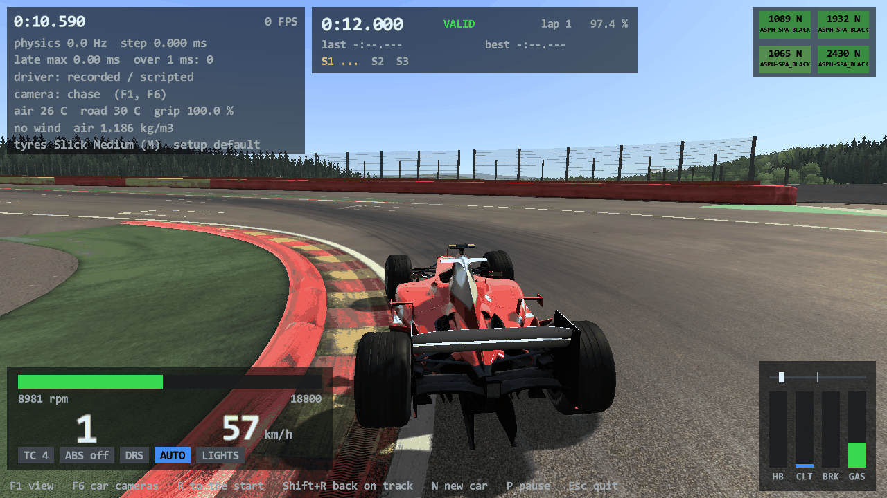
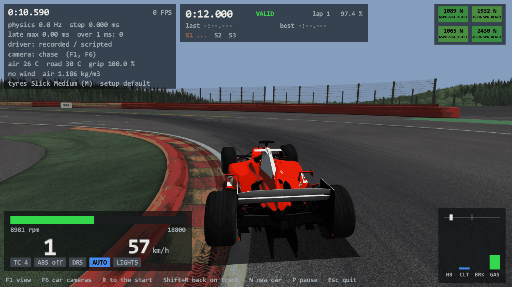
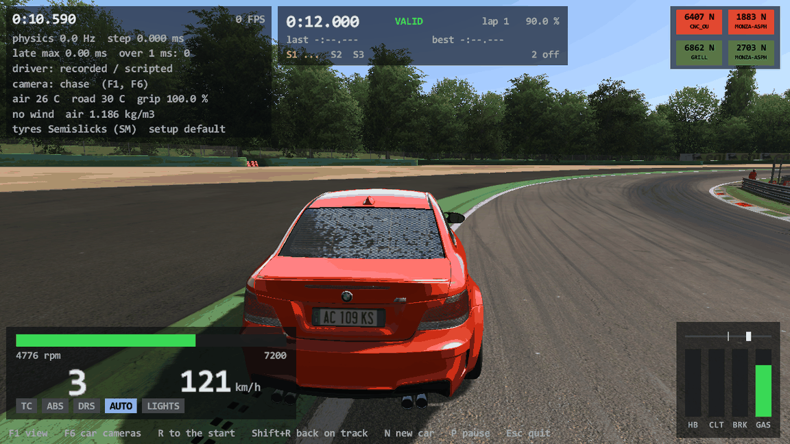
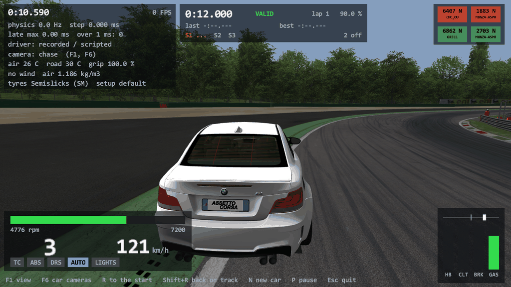
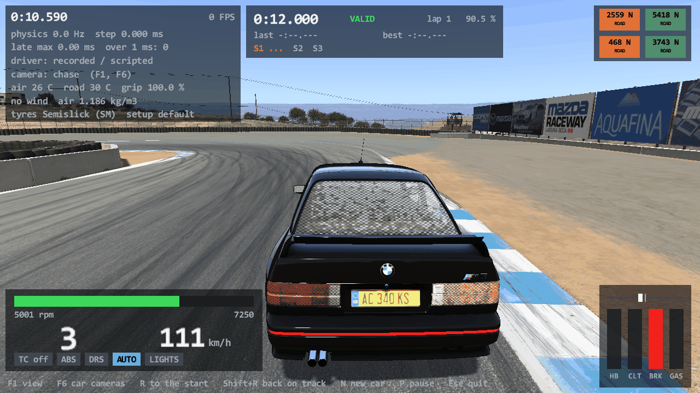
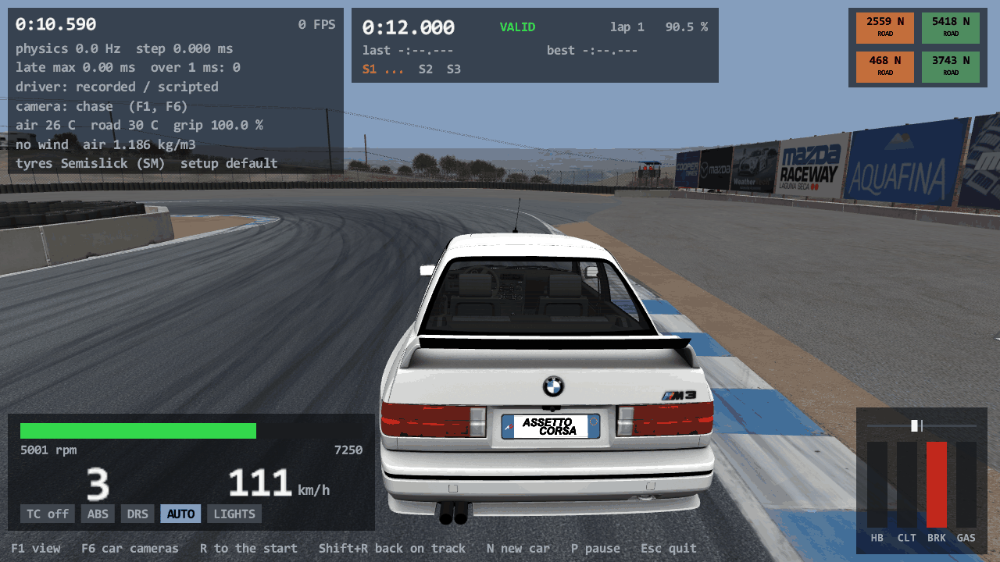

# Task 20: AC's real renderer, part 1 (shaders, materials, lighting, sky, shadows, the car)

## Resume here

State after the last commit (kept up to date with every commit):

- **Done.** Everything is on `master`, nothing is pushed. The version is 0.20.0 and the tag `v0.20.0` is on
  the last commit. Nothing is half done.
- What exists: `crates/rustyac-render` (the port: kgl, `GraphicsManager`, shaders, textures, materials, kn5
  loading, the scene graph, the cameras and their passes, lighting, sky, the static cube map, the car with its
  LODs, wheels, steering wheel, animated suspensions and skinned meshes, and the Direct3D command log), the
  game side (`crates/rustyac-game/src/render/ac.rs` and `picture.rs`, the options in `cli.rs`), the oracle
  (`tools/render_oracle`: `run --side ac|port`, `compare`), the golden test
  (`crates/rustyac-render/tests/golden.rs`).
- Checks to run again: section 9.
- On disk, git-ignored: `re/scratch/task20/` (`spec_1_kgl.md` … `spec_12_skinned.md` are the briefs read from
  the machine code, `patch_*.py` the patch scripts, `batch.sh` the 21 proof frames with `batch_result.txt`,
  `poses/*.pose` the car states of the proof frames, `perf.txt` the benchmark lines). The oracle's logs and
  pictures (`re/scratch/task20/out/`, `shots/`) were deleted at the end; `batch.sh` makes them again in about
  six minutes. The oracle's scratch game folder is `re/scratch/render_oracle/root/` (made by the oracle itself).
- Section 7 is the list of what Task 21 and 22 still need; section 8 the choices made without asking.

## 1. Plain-English summary

**rustyAC now draws its picture the way Assetto Corsa does.** Until this task the game was shown in a "debug
view": the track and the car with one home-made shader, flat light, no shadows. Now `rustyac.exe` loads the
game's own compiled shaders, textures and models from your install and drives the graphics card with the same
commands, in the same order, as `acs.exe`: the same materials, the same sun and sky for the chosen weather,
the same three shadow maps, the same reflections cube map, the same car with its levels of detail, turning
wheels, moving suspension arms and steering wheel.

How sure is "the same"? Assetto Corsa's renderer was run from `acs.exe` itself inside a test program, on
Windows' software graphics card (so that two runs give the same pixels), and every command it sent to
Direct3D was written down. The port did the same frame the same way. On 21 frames (four tracks, three cars,
standing and driving, outside and cockpit cameras, looking into the sun, two times of day) the two command
lists are **identical line for line** (up to 5,943 commands per frame) and the two pictures are
**identical in every byte**.

What is not there yet (Tasks 21 and 22): the driver, mirrors, tyre smoke, skid marks, reflections that follow
the car, brake discs that glow, lights, the damage and blur meshes handled as the game does, anti-aliasing,
post-processing. Options of `video.ini` that need those print one line and count as off.

The old picture is still there, and stays: `--debug-view` (a fast picture for slow machines and a
physics debugging aid). On this PC the new renderer makes 122 to 199 frames a second
off screen (the debug view: about 400): it draws about three times more per frame (three shadow maps and the
real materials).

No file of Assetto Corsa is in the repository or in a release: shaders, textures and models are read from the
player's own install when the program runs.

## 2. What is ported (addresses are `acs.exe`)

All of it is in `crates/rustyac-render/src/`, 7,000 lines, GPL. Files ported 1:1 carry the second header line.

| File | What | The game's code |
|---|---|---|
| `kgl.rs` | the thin layer over Direct3D 11: device and swap chain, the blend / depth / cull state objects, samplers, render targets, the shadow depth targets, constant, vertex and index buffers, the cube map target, reading the screen back | `kglInit` 0x1400184b0, `createDepthBuffer` 0x14001acc0, `initBlendStates` 0x14001aeb0, `initCullStates` 0x14001b0a0, `kglSetDefaultState` 0x140018920, `kglSetBlendState` 0x140018ff0, `kglSetDepthState` 0x140019020, `kglSetCullState` 0x140019050, `kglSetViewport` 0x140018ee0, `kglCreateSampler` 0x140018be0, `kglSetRenderTarget` 0x140018d20, `KGLRenderTarget` 0x1400232d0, `kglSetShader` 0x140019dc0, `kglCreateCBuffer` 0x140019870 |
| `shader.rs` | `ShaderManager`: the game's `.fxo` pairs and `_meta.ini` from `system/shaders/win`, reflection of constant buffers, variables and textures (`D3DReflect`), the three input layouts, `CBuffer` | `ShaderManager::getShader` 0x140227b40, `KGLShader::loadShaderBinary` 0x14001f0c0, `reflectVars` 0x14001f5f0, `getInputLayout` 0x14001eb00, `CBuffer::init` 0x140219990, `set` 0x140219a50, `commit` 0x140219920, `ShaderVariable::set` 0x140209600 |
| `graphics.rs` | `GraphicsManager`: `video.ini` and `graphics.ini`, the cached state setters, the four system constant buffers (camera 0, per object 1, lighting 2, shadow maps 3) and their commit order, world / view / projection, screen-space mode, begin and end of a frame | `GraphicsManager::GraphicsManager` 0x140201620, `loadVideoSettings` 0x1400c18d0, `beginScene` 0x140202580, `endScene` 0x140202850, `setBlendMode` 0x1402044e0, `setCullMode` 0x140204510, `setDepthMode` 0x140204580, `setShader` 0x140204a00, `setTexture` 0x140204c70, `setVB` 0x140204cf0, `commitShaderChanges` 0x1402026a0, `compile` 0x1402026e0, `drawPrimitive` 0x1402027f0 |
| `texture.rs`, `texture_fallback.rs` | `KGLTexture` and `ResourceStore`; textures are made by the player's `d3dx11_43.dll` exactly as the game calls it (from memory with the game's load info, from a file with none); without that DLL an own DDS reader and WIC | `KGLTexture::KGLTexture` 0x140023820 and 0x140023970, `ResourceStore::getTexture` 0x1402000d0, `getTextureFromBuffer` 0x140200250 |
| `material.rs` | `Material`, its variables and per-material constant buffers, `Material::apply`, the plain material filter and the shadow-map one (`ksShadowGen`, `ksShadowGenAT`, `ksShadowGenSKIN`) | `Material::Material` 0x140209970, `setShader` 0x14020b700, `createCBuffers` 0x14020a940, `apply` 0x14020a6e0, `MaterialFilter::apply` 0x140219d90, `MaterialFilterSM::apply` 0x140229a00 |
| `model.rs` | `KN5IO`: textures (with the skin override folders), materials, nodes, meshes, skinned meshes and their bones | `KN5IO::load` 0x1402151a0, `loadBinaryV2` 0x140215aa0, `loadTexture` 0x1402171a0, `getSkinOverridenTexturePath` 0x140214f90 |
| `scene.rs` | the scene graph: `Node`, `Mesh`, `SkinnedMesh`, `NodeBoundingSphere`, `NodeEvent`; world matrices; visibility (layer, LOD distances, frustum, pass); the bounding frustum | `WorldMatrixTraverser::traverse` 0x14021abf0, `Node::render` 0x14020e510, `Mesh::compile` 0x140225f00, `Mesh::render` 0x1402261a0, `SkinnedMesh::compile` 0x14022c910, `render` 0x14022cdc0, `updateBonesBuffer` 0x14022ce90, `NodeBoundingSphere::render` 0x140218b80, `CameraMeshFilter::isVisible` 0x140219af0, `BoundingFrustum::setMatrix` 0x140229290 |
| `camera.rs`, `forward.rs` | `Camera`, `CameraShadowMapped` (three cascades: split distances, the light's matrix per cascade, the shadow pass), `CameraForward` (cube-map step, shadow maps, opaque pass, sky, transparent pass) | `Camera::getPerspectiveMatrix` 0x14020ef00, `getViewMatrix` 0x14020eff0, `renderCamera` 0x14020f5d0, `CameraShadowMapped::shadowMapPass` 0x14020d6a0, `createShadowMapMatrix` 0x14020c790, `renderPass` 0x14020cf20, `setShadowMapsSplits` 0x14020d5f0, `CameraForward::render` 0x14021fc40, `setCubemapSize` 0x1402201b0 |
| `cubemap.rs` | the reflection cube map, drawn once at load from `content/objects3D/cubemap_model.kn5` (or the track's own) and the sky | `CubeMapRenderer::render` 0x14021edb0, `Sim::initStaticCubemap` 0x14019a2a0 |
| `lighting.rs`, `sky.rs` | the sun from `SUN_ANGLE` and the track's `lighting.ini`, the colour curves, the weather preset (`weather.ini`, `colorCurves.ini`), fog; the generated sky dome and its shader | `GraphicsManager::updateLightingSetttings` 0x140205190, `loadLightingSettings` 0x140203250, `WeatherGenerator::loadPreset` 0x140227260, `WeatherManager::applyCustomWeather` 0x1401d8110, `RaceManager::initLighting` 0x14013a3d0, `SkyBox::SkyBox` 0x14021c790, `SkyBox::render` 0x14021d0d0, `ShapeBuilder::buildHemiSphere` 0x1402267d0 |
| `car.rs` | `CarAvatar::init3D` as far as the picture of a parked or driven car needs it: the four LOD files and `lods.ini`, LOD and cockpit switching by distance, the body matrix, hubs, wheels, rims and their blurred twins by wheel speed, the steering wheel, `SuspensionAvatar` (arms that follow the physics) | `CarAvatar::makeBodyMatrix` 0x1400d8ec0, `initCommon` 0x1400d56e0, `makeTyresDoubleFacedShadows` 0x1400d9020, `CarLodManager::loadLod` 0x1400e4370, `initNoBodyNodes` 0x1400e3fa0, `updateLodVisibility` 0x1400e5810, `SuspensionAvatar::addModel` 0x1401b32b0, `update` 0x1401b3840 |
| `animator.rs` | `SuspensionAnimator` (cars with `USE_ANIMATED_SUSPENSIONS=1`, the F2004): `.ksanim` files, key-frame blending with DirectXMath's slerp, arctangent and sine ported lane by lane | `SuspensionAnimator::addModel` 0x1401b14f0, `update` 0x1401b25a0, `Animation::load` 0x140207b30, `quatpos::lerp` 0x140208d30, `XMQuaternionSlerpV` 0x140107300, `XMVectorATan` 0x140107670, `XMVectorSin` 0x140107790 |
| `gpulog.rs` | not the game's: the command log (section 3) | |

Things found on the way that the port follows:

- `PvsProcessor` is never used on this path. Draws happen at once, depth first in scene-graph order.
- Constant buffers are written with `UpdateSubresource` and bound to the vertex stage, then the pixel stage.
  The commit order is camera (slot 0), lighting (2), per object (1), shadow maps (3).
- The per-object buffer holds the world matrix of the last `Node::render`: a mesh is drawn with its parent's.
  A skinned mesh then writes the identity, so the second of two skinned siblings is drawn with the identity.
- A skinned mesh's bone buffer is `bones * 64` bytes at slot 13, not the 3,520 bytes the shader declares; it
  is written before every draw; its matrices are not transposed. Bones found while the file is read come
  before the ones found afterwards.
- `0.017453f` is the game's degrees-to-radians number, not pi / 180.
- The sky dome is generated (`buildHemiSphere(10, 12)`), not a model.
- The static cube map is drawn with the camera at the origin, and a "splash" frame has to come before it.
- Nodes of a track whose name starts with `AC_` are hidden. A track's `texture` folder overrides kn5 textures.
- A model file from a newer kn5 version needs the file's own key told to `KN5IO` first.
- With `SHADOW_MAP_SIZE=-1` and `[CUBEMAP] SIZE=0` (values Content Manager writes for the Custom Shaders
  Patch, and what this PC's `video.ini` has) plain `acs.exe` draws everything in shadow and reflects nothing.
  The port does the same when told to follow the file to the letter (frame 21 of section 4).

## 3. The oracle: how "the same" is measured

`tools/render_oracle` (GPL, built on `tools/car_oracle`'s loader, which it shares as a module).

**The game's side.** `acs.exe` is mapped into the test process (never run as a game, no running process is
touched). Its imports of `d3d11`, `dxgi`, `d3dcompiler_43` and `d3dx11_43` are bound to the real DLLs. The
program then calls the game's own constructors and methods by address: `GraphicsManager`, `ShaderManager`,
`KN5IO`, `CameraForward`, `SkyBox`, the lighting and weather functions, `Sim::initStaticCubemap`, and for the
car `CarAvatar::init3D`'s objects (`CarLodManager`, `SuspensionAvatar` or `SuspensionAnimator`,
`NodeBoundingSphere`) on hand-made `Game`, `Sim` and `CarAvatar` blocks. The device is WARP, the swap chain is
on a window that is never shown.

**The port's side.** The same frame with `rustyac-render`, a process of its own, the same kind of device.

**The command log** (`rustyac_render::gpulog`). A stand-in for the device context sits between the renderer
and Direct3D on both sides and writes one line per call. Objects are named by what they are, not by where they
are in memory: a state object by its description, a shader by a hash of its bytecode, a buffer by size, kind
and a hash of its content (every byte written by `UpdateSubresource` or `Unmap` is in the line), a texture by
its description and a hash of its pixels read back from the card, a render target by its description. Each log
starts with the whole bound state. Two logs are compared as text.

**Three comparisons per frame:** the state calls of start-up; the one-time render of the reflection cube map
(308 calls, 18 draws); the frame itself, the second one drawn (the first one goes by so that the logged frame
starts from a frame's leftovers, as in the game). Then the back buffer is read back and compared byte by byte
(1280 x 720, RGBA, 3,686,400 bytes).

**The car's state** goes into both sides from one file (`.pose`: the body's matrix, four hub matrices, four
wheel matrices, four wheel speeds, the steering angle; 149 floats), written by
`rustyac.exe --screenshot x.png --at <s> --pose-out x.pose` from the Rust physics.

**What the harness does itself on the game's side** (the game's own code for these needs the whole `Sim`):
the list of track models and their placement, the two numbers of the track's `lighting.ini`, the camera's
matrix and lens, the order of the `init3D` steps, the steering wheel's angle product. Both sides get these from
the same Rust code, so a mistake there would not show as a difference: section 8.

### The Task 20 profile

The proof runs on these settings, the same on both sides. The oracle writes this `cfg/video.ini` into its
scratch game folder:

```
[VIDEO]         WIDTH=1280 HEIGHT=720 REFRESH=60 FULLSCREEN=0 VSYNC=0 AASAMPLES=1 AAQUALITY=0
                ANISOTROPIC=8 SHADOW_MAP_SIZE=2048 FPS_CAP_MS=0 INDEX=0
[REFRESH]       VALUE=60
[CAMERA]        MODE=DEFAULT
[ASSETTOCORSA]  HIDE_ARMS=0 HIDE_STEER=0 LOCK_STEER=0 WORLD_DETAIL=5
[EFFECTS]       MOTION_BLUR=0 RENDER_SMOKE_IN_MIRROR=0 SMOKE=0 FXAA=0
[POST_PROCESS]  ENABLED=0 QUALITY=0 FILTER=default GLARE=0 DOF=0 RAYS_OF_GOD=0 HEAT_SHIMMER=0 FXAA=0
[MIRROR]        HQ=0 SIZE=0
[CUBEMAP]       SIZE=512 FACES_PER_FRAME=0 FARPLANE=0
[SATURATION]    LEVEL=100
```

So: no post-processing, no motion blur, one sample per pixel, no mirror, no smoke, a 512 cube map that draws no
face per frame (only the one-time render at load), shadows on at 2048, every track detail layer, 8x anisotropic
filtering. Weather `3_clear`, `SUN_ANGLE` -16 unless the frame says otherwise.

## 4. Results

`sh re/scratch/task20/batch.sh` (git-ignored; each line is one
`render_oracle compare --track … --view … [--car … --pose …] [--sun …]`). Cars: the Ferrari F2004 (animated
suspension, no skinned mesh), the BMW M3 E30 (strut front, physics-driven arms, one skinned mesh), the BMW 1M
(strut front, multilink rear, two skinned meshes under one node). The Porsche 911 GT3 R of Task 17 is not
installed on this PC; the 1M stands in as the strut / multilink car.

| # | Frame | Calls (game = port) | Draws | Command log | Pixels (WARP) |
|---|---|---|---|---|---|
| 1 | Spa, no car, chase | 2327 | 484 | identical | identical |
| 2 | Monza, no car, chase | 1925 | 389 | identical | identical |
| 3 | Magione, no car, chase | 1624 | 359 | identical | identical |
| 4 | Laguna Seca, no car, chase | 2442 | 527 | identical | identical |
| 5 | Spa, F2004 at rest, chase | 4946 | 809 | identical | identical |
| 6 | Spa, F2004 turning (wheel 92°, 64 km/h), cockpit | 5410 | 933 | identical | identical |
| 7 | Spa, F2004 at 227 km/h, chase, sun angle 40 | 5813 | 1044 | identical | identical |
| 8 | Spa, F2004 at 227 km/h, camera looking into the sun | 5489 | 913 | identical | identical |
| 9 | Monza, 1M at rest, chase | 4399 | 645 | identical | identical |
| 10 | Monza, 1M turning (wheel -286°, 38 km/h), cockpit | 5205 | 860 | identical | identical |
| 11 | Monza, 1M at 168 km/h, far camera (second level of detail) | 3085 | 559 | identical | identical |
| 12 | Monza, 1M turning, chase, sun angle 40 | 5921 | 993 | identical | identical |
| 13 | Magione, E30 at rest, chase | 5139 | 876 | identical | identical |
| 14 | Magione, E30 turning (wheel -88°, 51 km/h), cockpit | 5645 | 1037 | identical | identical |
| 15 | Magione, E30 at 131 km/h, camera looking into the sun | 5943 | 1053 | identical | identical |
| 16 | Magione, E30 turning, chase, sun angle 40 | 5756 | 1063 | identical | identical |
| 17 | Laguna Seca, E30 at rest, chase | 5157 | 820 | identical | identical |
| 18 | Laguna Seca, E30 turning (wheel -311°, 38 km/h), cockpit | 5735 | 966 | identical | identical |
| 19 | Laguna Seca, F2004 at 113 km/h (wheel -19°), chase, sun angle 40 | 5407 | 932 | identical | identical |
| 20 | Laguna Seca, F2004 at 243 km/h, into the sun, sun angle 40 | 5481 | 910 | identical | identical |
| 21 | Magione, E30 at rest, chase, this PC's `video.ini` values (shadows -1, cube map 0, world detail 0, anisotropic 2) | 5077 | 861 | identical | identical |

21 of 21. In every run the start-up state calls (29) and the static cube map's log (308 calls and 18 draws;
302 in frame 21) are the same on both sides too.

"Cockpit" is a camera at the car's `DRIVEREYES` with the cockpit camera's lens (56°, near plane 0.05 m) and
shadow ranges; it switches the car to its high-detail cockpit. The poses at speed come from the Rust physics
driving itself (`--autodrive`), so the suspension is loaded and the wheels spin (the blurred rims are on).

**Textures without `d3dx11_43.dll`: not bit-identical.** The port's own reader (`texture_fallback.rs`) keeps a
DDS file's mip maps as stored and makes missing ones with a box filter; D3DX completes every chain with its
own filter. Measured on frame 3 (`compare --own-textures`): the draw calls are the same, the textures' hashes
are not, 128,320 of 921,600 pixels differ. The picture looks right; it is not the game's to the bit.
`d3dx11_43.dll` comes with the DirectX runtime every Assetto Corsa install needs, so the fallback is for a PC
without the game's prerequisites.

**Golden test.** `crates/rustyac-render/tests/golden.rs` draws frame 3 through the library alone and holds its
command log (1,624 lines, 359 draws) to a stored hash; the picture's hash is compared too and a difference is
reported as a note (WARP belongs to Windows and may change). The log is the oracle's log of frame 3 except for
one number (the back buffer is a plain texture here, a swap chain's there), and the picture's hash is the
oracle's. Without an Assetto Corsa install, `d3dx11_43.dll` or WARP it prints NOT TESTED and passes.

## 5. Screenshots (hardware graphics card, off screen) and how to drive

Left: AC's renderer. Right: the old debug view, same moment (12 s into `--autodrive`). The HUD on top is
rustyAC's own.

| | AC's renderer | `--debug-view` |
|---|---|---|
| Spa, F2004 |  |  |
| Monza, BMW 1M |  |  |
| Laguna Seca, BMW M3 E30 |  |  |

Made with (and the same with `--debug-view`):

```
target\release\rustyac.exe --car ks_ferrari_f2004 --track spa --no-race-ini --autodrive --at 12 --screenshot spa.png
target\release\rustyac.exe --car bmw_1m --track monza --no-race-ini --autodrive --at 12 --screenshot monza.png
target\release\rustyac.exe --car bmw_m3_e30 --track ks_laguna_seca --no-race-ini --autodrive --at 12 --screenshot laguna.png
```

The cracked rear window of the 1M in the picture is the car's damage glass, which the game hides until the
car is hit: Task 21 (section 7).

**Driving:**

```
cargo build --release
target\release\rustyac.exe --car ks_ferrari_f2004 --track spa               AC's renderer (the default)
target\release\rustyac.exe --car ks_ferrari_f2004 --track spa --debug-view  the old debug view
target\release\rustyac.exe --car ks_ferrari_f2004 --track spa --warp        AC's renderer on the software rasteriser (slow)
target\release\rustyac.exe --car bmw_m3_e30 --track magione --gpu-log frame.gpulog   also write the command log of the second frame
target\release\rustyac.exe --car bmw_m3_e30 --track magione --video-ini-exact        follow video.ini to the letter (see below)
```

`rustyac.exe` reads `Documents\Assetto Corsa\cfg\video.ini` and the game's `system\cfg\graphics.ini` as the
game does. Each option it cannot honour yet prints one line and counts as off: `AASAMPLES` above 1 and
post-processing and motion blur (Task 22), mirrors, smoke and a cube map that follows the car (Task 21). Two
values that only make sense with the Custom Shaders Patch are replaced, with a line saying so:
`SHADOW_MAP_SIZE` below 0 becomes 2048 and `[CUBEMAP] SIZE` of 0 becomes 512; `--video-ini-exact` keeps the
file's values (everything in shadow, no reflections, as plain `acs.exe` would draw it). Without a `race.ini`
the weather is `3_clear` and the sun angle -16. If AC's renderer cannot start (no game folder, no Direct3D 11),
a warning is printed and the debug view is drawn. `--screenshot`, `--autodrive`, replays, the HUD, the sound
and the window work as before.

## 6. Performance

This PC: i9-9980HK, Radeon Pro 5500M, 1280 x 720, off screen, not waiting for the display, 20 s of
`--autodrive` in the F2004 each
(`rustyac.exe --car ks_ferrari_f2004 --track <track> --camera <view> --no-race-ini --autodrive --headless --duration 20 --bench-render [--debug-view]`).
Settings: this PC's `video.ini` (world detail 0, anisotropic 2, no post-processing) with the replacements of
section 5: one sample per pixel, shadows 2048, cube map 512 drawn once.

| Track | View | AC's renderer | Slowest frame | Draw calls / triangles (last frame) | Debug view (4 samples per pixel) | Slowest frame |
|---|---|---|---|---|---|---|
| Spa | chase | 199 FPS (5.0 ms) | 6.8 ms | 639 / 1.20 M | 403 FPS (2.5 ms) | 13.4 ms |
| Spa | cockpit | 158 FPS (6.3 ms) | 7.8 ms | 638 / 1.18 M | 364 FPS (2.7 ms) | 19.1 ms |
| Nordschleife | chase | 122 FPS (8.2 ms) | 8.6 ms | 541 / 1.29 M | 408 FPS (2.5 ms) | 18.8 ms |
| Nordschleife | cockpit | 137 FPS (7.3 ms) | 10.1 ms | 677 / 1.53 M | 405 FPS (2.5 ms) | 18.8 ms |

In a window with the display's vertical sync: 59.4 FPS (Magione, E30). The new renderer costs two to three
times the debug view's frame, as expected: every mesh in range is drawn up to four times (three shadow maps and
the main pass) with the game's materials, and every state change is the game's. Nothing was made faster at the
cost of exactness.

## 7. What Task 21 and Task 22 still need

**Task 21 is done: `docs/port/renderer_car.md` has what it ported and the list that is current.** The list
below is as Task 20 left it.

Task 21 (the rest of the scene):

- [ ] The driver (`DriverModel`, its animations, hiding arms and steering wheel by `video.ini`): the same
      `SkinnedMesh` code, already ported.
- [ ] `ConstrainedObjectsManager` (the `DIR_` nodes: push rods, steering arms that aim at another node). The
      oracle stubs the game's `addModel` and the port has none, so such nodes stay where the model has them
      on both sides: not compared yet.
- [ ] Damage meshes and damage glass (hidden until hit), the body's blur meshes, `[MESH_...]` rules of
      `lods.ini` beyond the ones the proof cars use.
- [ ] Lights (head, brake, reverse; the emissive variable set by code), brake disc glow, the digital
      instruments and analogue needles, the shift lights, wipers.
- [ ] The car's flat ground shadows and `CAR_SHADOWS`, skid marks, tyre smoke and other particles
      (`NodeEvent` callbacks are empty so far).
- [ ] The cube map that follows the car (`FACES_PER_FRAME` above 0), mirrors (`[MIRROR]`).
- [ ] Track life: dynamic objects, `AC_` helper logic beyond hiding, pit crew, flags, clouds, track grooves,
      the seasonal track adjustments, more than one car.
- [ ] `proview_nodes.ini`: the game writes it into the car's folder on first load; the port never writes into
      the game's folder and computes the list each time.
- [ ] `.ksanim` version 1 files (only version 2 is read, which is what the proof cars have).
- [ ] `PvsProcessor` if a later path does use it (it is dead code on this one).

Task 22 (the picture after the scene):

- [ ] Multisampling (`AASAMPLES`, `AAQUALITY`) and the resolve; FXAA.
- [ ] Post-processing (`[POST_PROCESS]`: the HDR target, filters, glare, depth of field, rays of god, heat
      shimmer), motion blur, saturation.
- [ ] The game's own HUD and fonts drawn by its renderer (rustyAC's HUD is its own pass on top).
- [x] ~~Removing the debug view and its options~~ **The debug view stays** (decided for Task 22): it is kept
      as a fast "potato" picture and a physics debugging aid behind `--debug-view`, with its options
      (`--boxes`, `--texture-size`, `--no-textures`).
- [ ] The own texture reader made bit-identical to D3DX (mip chains and their filter), if that is wanted.

## 8. Open questions (choices made without asking)

1. **CSP values in `video.ini`.** This PC's file has `SHADOW_MAP_SIZE=-1` and `[CUBEMAP] SIZE=0`. Plain
   `acs.exe` would give a picture all in shadow. `rustyac.exe` uses 2048 and 512 and says so;
   `--video-ini-exact` follows the file. Is that the default you want?
2. **The third proof car** is the BMW 1M, because the Porsche 911 GT3 R is not installed here (its folder has
   only `ui`). The made-up `gt3_multilink` test car of Task 17 has no model.
3. **What the oracle's harness substitutes** (section 3): the track's model list and placement, the two
   `lighting.ini` numbers, the camera, the order of `init3D`'s steps and the steering wheel's angle are given to
   both sides by Rust code written from the disassembly, not produced by the game's own `Sim`, `TrackAvatar`,
   `CarAvatar::init3D` and camera managers running whole. The chase and cockpit lenses and shadow ranges are
   read from `CameraDrivableManager` (0x1400c7120, 0x1400c7b50) but the cockpit's far plane and field of view
   as the running game sets them were not confirmed against a live game.
4. **The static cube map's camera** stands at the origin in the game's code as read; that is what both sides
   do. On a track far from the origin it reflects the small cube-map model, not the track.
5. **Reader agents wrote their briefs** into git-ignored `re/scratch/task20/spec_*.md`. "Reading and reviewing
   only" was taken to mean no code and no repository file from them; never more than three ran at once.
6. **`SkinnedMesh` is ported in this task** although the driver, its main user, is Task 21: without it the
   E30 and the 1M were three and six draw calls short of the game (the gear lever's gaiter).
7. **The pixel hash of the golden test is a note, not a failure**, because WARP is part of Windows. The command
   log's hash is a failure.
8. **Poses come from the Rust physics**, not from a recording of the game: the proof is about the renderer
   given a car state, and both sides get the same one.
9. `docs/release.md` and `README.md` were not rewritten beyond what this task changes; `packaging/HOW_TO_RUN.txt`
   and `LICENSING.md` name the new renderer, crate and tool.

## 9. Checks to run again

```
cargo clippy --workspace --locked -- -D warnings
cargo test --release --workspace --locked
cargo build --release --locked
for m in tools/*/Cargo.toml; do cargo build --release --locked --manifest-path $m; done
cargo test --release -p rustyac-render --test golden -- --nocapture
tools/render_oracle/target/release/render_oracle.exe compare --track spa --view chase --out re/scratch/task20/out
tools/render_oracle/target/release/render_oracle.exe compare --track magione --view eyes --car bmw_m3_e30 --pose re/scratch/task20/poses/e30_magione_turn.pose --out re/scratch/task20/out
sh re/scratch/task20/batch.sh          # all 21 frames, about six minutes; one frame: sh re/scratch/task20/batch.sh "monza, 1M at rest"
```

`compare` options: `--track <folder> [--layout <name>] --view chase|cockpit|free|eyes|sun|far
[--car <folder> --pose <file> [--skin <name>]] [--sun <SUN_ANGLE>] [--weather <folder>] [--capture <n>]
[--shadow-size <n>] [--cubemap-size <n>] [--world-detail <n>] [--anisotropic <n>] [--own-textures] [--loose]`.
It prints "command log: IDENTICAL" and "pixels: IDENTICAL" or the first lines that differ, and leaves both
logs and both pictures in `--out`.
