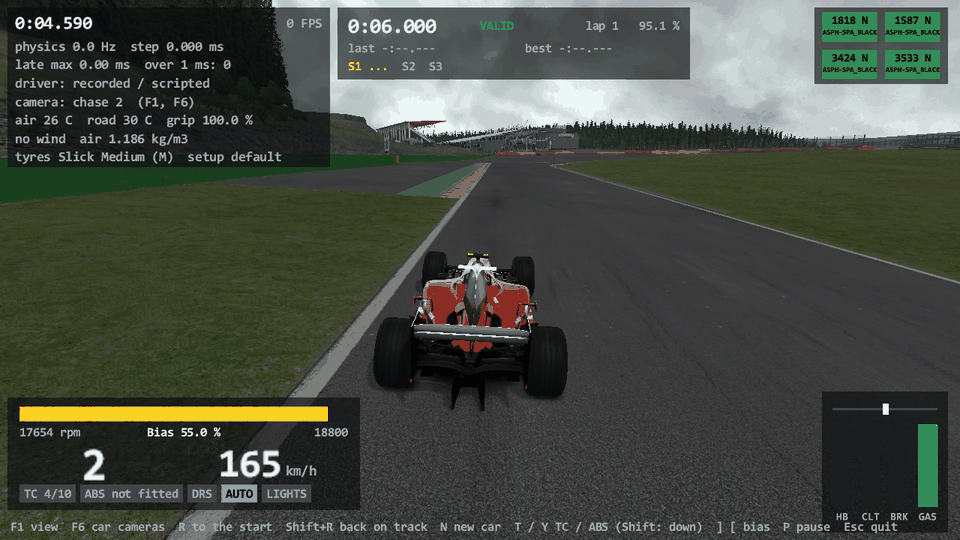
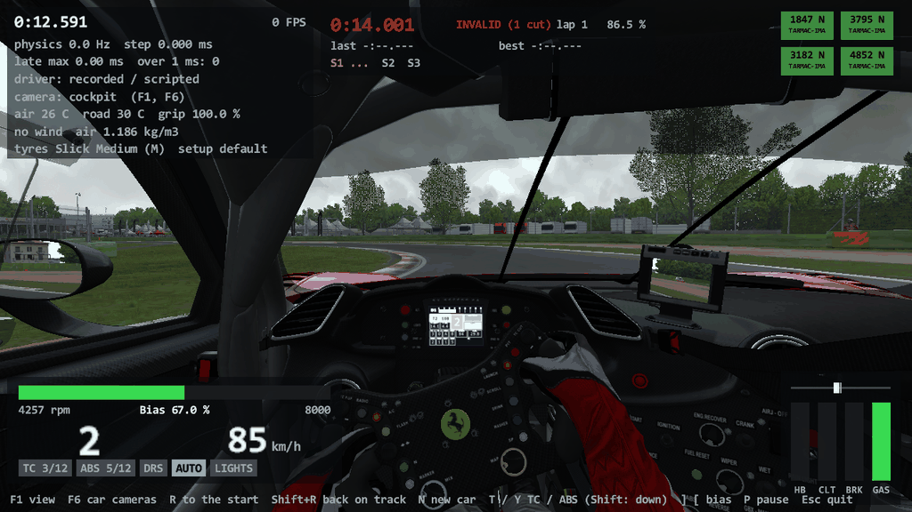
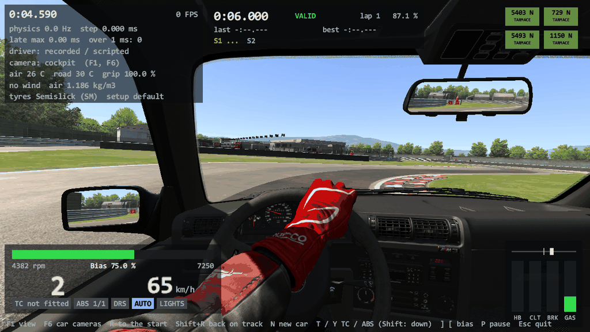

# Task 22: AC's real renderer, part 3 (the rest of the scene)

## Resume here

State after the last commit (kept up to date with every commit):

- **The task is finished** but for the points of section 8 ("Not done") and the open questions of section 9. Version 0.22.0, tag `v0.22.0`.
- The task text is `prompts/22_renderer_scene.md`. The next task is Task 23 (post-processing, MSAA / FXAA,
  HDR, motion blur); its checklist is section 7. What this task did not get to is section 8.
- To pick the work up again: section 10 has the checks. `sh re/scratch/task22/batch.sh` runs the 23 new proof
  sequences (about 25 minutes), `sh re/scratch/task21/batch.sh` the 27 of Task 21, `sh re/scratch/task20/batch.sh`
  the 21 frames of Task 20.
- On disk, git-ignored: `re/scratch/task22/` (the nine reader briefs `spec_*.md` with their disassembly
  listings, the patch scripts `p_*.py`, `batch.sh` and its results, `bench.sh`, the made-up test cars in
  `cars/`, oracle output in `out/`).

## 1. Plain-English summary

Tasks 20 and 21 drew the track, the sky and the whole car the way Assetto Corsa does. This task adds what else
the game puts into the picture before post-processing, each part ported from `acs.exe` and then measured
against the game's own code:

- **Clouds.** The weathers with clouds (4 to 7) now have them: 40 to 50 flat pictures on a sphere around the
  camera that always face it, drift slowly, and also show in the mirrors and in the reflections. They are placed
  by the game's random numbers, so the same seed gives the same sky.
- **The moving sun.** The game moves the sun, the lighting's clock and the clouds with the time (`SunAnimator`).
  That was missing: the sun stood still. It moves now.
- **Crowds.** The people in the grandstands (up to 28,800 on one track) are upright pictures scattered over
  hidden meshes of the track; they turn to face the camera. They are always in the same places: the game
  restarts its random numbers from 0 for them.
- **Track grooves.** The dark rubber line gets more visible with the laps driven (or with the grip of a
  "dynamic" track).
- **Loose objects and drifting objects.** Cones and marker boards were invisible in AC's renderer (only the
  debug view drew them); they show and move now. The hot-air balloons over the Nordschleife (and the like on
  other tracks) drift across the sky.
- **Dashboards.** Every kind of display item and light the game knows is in: the rev bar and the delta bar,
  the gear shown as a lit picture, the DRS and KERS light rows, race position, push-to-pass, fuel use, g
  forces and more, and the extra display "panels" (`DigitalPanels`). The traction-control level, the ABS level
  and the air temperature on the dash are the car's real ones now.
- **The high-quality mirror** (`[MIRROR] HQ=1`): smoother (as many samples as your `AASAMPLES`), sees twice as
  far, and shows smoke, glass and flames.
- **Old-style exhaust flames** ("version 1", for a car without `flame_presets.ini`), and **ground shadows for a
  car that has none**: the game draws five small pictures of the car from below and saves them into the car's
  folder. rustyAC draws the same five pictures but never writes into the game's folder: it keeps them next to
  its own program.
- **Pause and replay.** While you pause (P), smoke, damage wobble and the display lights freeze and the rest
  keeps moving, exactly as in the game. A `--replay` is treated as the game treats its replays (P pauses the
  replay itself).
- **Loose ends of Task 21.** Sound and flames now share the one "fuel in the exhaust" counter, as in the game.
  The picture's random numbers start from the clock in normal play, and a recording stores the number so that
  its replay draws the same smoke and clouds.

"The same as the game" was measured the same way as before: the render oracle runs the game's own code and the
Rust port side by side on the same inputs and compares every command sent to the graphics card and every
pixel. **All 23 new sequences (1,413 frames) are identical in both**, the 27 sequences of
Task 21 and the 21 frames of Task 20 still are, and the 18 sound drives of Task 19 still give the game's
calls. Two mistakes in the readers' notes were caught by that comparison and fixed (section 2).

**The debug view stays.** `--debug-view` is kept as a fast picture for slow machines and as a physics
debugging aid; the two older reports that said it would be removed were corrected.

**Not done** (section 8 has the details): the pit crew and the pit box marker, the ideal line, the 3D start
lights, the ghost car and the time-attack gates, the rods of the classic F1 cars' suspension
(`SuspensionGraphics`), and a few dashboard items that no installed car uses were ported from the notes but
not measured against the game. There are no flags to port: plain `acs.exe` has no 3D flags at all.

## 2. What is ported (addresses are `acs.exe`)

All of it is in `crates/rustyac-render/src/`. Sizes are the game's `operator new` sizes.

| File | What | Addresses |
|---|---|---|
| `panels.rs` (new) | `DigitalPanels` (0xd8): race position and push-to-pass digits, the push-to-pass light. `DisplayNode` (0x168): the textured quad the panels, the graphs and `GEAR_TX` are drawn with | ctor 0x1400820f0, `initPanels` 0x140082740, `update` 0x140083f70; `DisplayNode::render` 0x1400f74a0, `drawBase` 0x1400f6fb0, `drawBaseInverted` 0x1400f70e0, `drawTop` 0x1400f7210, `drawTopInverted` 0x1400f7360; `DigitalLed` type 0x14 0x1400f5460 / 0x1400f6200 |
| `digital.rs` | The display items `RPM_GRAPH`, `DELTA_GRAPH`, `GEAR_TX` (a `DisplayNode` each), `TURBO_LEVEL`, `TOTAL_LAPS`, `EST_LAPS`, `FUEL_CONS`, `GFORCES`, `KERS_LOAD`, `POSITION_CAR`, `POSITION_COUNT`, `P2P_DASH`, `FUEL_PERC`; the LED series `DRS_SERIE`, `KERS_LOAD_SERIE`, `POWER_918`, `KERS_RECHARGE_SERIE` | `DigitalItem::DigitalItem` 0x1400f0690, `DigitalItem::update` 0x1400f3190, `DigitalLed::update` 0x1400f6200 (types 8, 0xb, 0x11, 0x12), series loops 0x1400eec46, 0x1400ef046, 0x1400efa76, 0x1400efe06 |
| `car.rs` | What the displays read beside the physics state (`getTCMode` 0x1400d3820, `getABSMode`, the air temperature of `PhysicsEngine`, `wingsStatus`, `CarPhysicsInfo`), `updateERSCharge` 0x1400dd330; the pause and replay events (`Sim::evOnPauseModeChanged`, `evOnReplayStatusChanged`); `onStartReplay` 0x1400d9400 / `onStopReplay` 0x1400d9520 | |
| `sky.rs` | Clouds: `SkyBox::updateCloudsGeneration` 0x14021db00, `updateCloudsAnimation` 0x14021dad0, `renderClouds` 0x14021d4b0. `SunAnimator` (0x88): ctor 0x1401ad890, `update` 0x1401adc10 | |
| `crowds.rs` (new) | Crowds: `CameraFacing::CameraFacing` 0x14005e640, `StaticParticleSystem` (0x1b8) ctor 0x14025e8b0, `finalize` 0x14025efb0, `render` 0x14025f550, `Triangle::computeArea` 0x14020bcb0. Grooves: `DynamicTrackManager` (0x90) ctor 0x1401ccc20, `update` 0x1401cdba0, `setGrooveMeshVisibility` 0x1401cdb60. Drifting objects: `TrackAvatar::initDynamicObjects` 0x1401c9840, `updateDynamicObjects` 0x1401ccb30, `ksRandVec3f` 0x1401cc4e0 | |
| `scene.rs`, `cubemap.rs`, `graphics.rs` | Loose objects switched on again (`TrackAvatar::TrackAvatar` 0x1401c5250 after `processPhysicsNode` 0x1401cc5e0); `GraphicsManager::currentCubeMap` and the two handlers of `Sim::initCubemaps` that hide the grooves while a cube map is drawn (0x1401969f0, 0x140196bc0); the manager's own `GLRenderer` (32 vertices, `GraphicsManager+0x380`) | |
| `mirror.rs`, `kgl.rs` | The high-quality mirror: the multisampled target, far plane 800, the whole transparent pass, `kglResolveRenderTarget` 0x140019650 | `MirrorTextureRenderer` ctor 0x140113c40, `render` 0x140114410 |
| `flames.rs` | Flames version 1: `loadTextures` 0x140103620, `loadFlames` 0x140101f90, the backfire handler 0x140100070, `update` 0x1401046a0, `drawFlame` 0x1401010a0 | |
| `fake_shadow.rs` | `CarFakeShadow::generateFakeShadow` 0x1400e1430, in memory (`FakeMaterialFilter`, a render context without a camera) | |
| `particles.rs`, `lights.rs` | `TyreSmoke::onReplayStatusChanged` 0x1401d0ad0, `EngineSmoke`'s handler 0x1400934c0 and its second (replay) state, `DynamicCarEffects::updateReplayMode` 0x140091e40 and its handler 0x1400916c0, the shared pause handler 0x1401d46d0 | |

`rustyac-math` got the DLL's double-precision `cos` (the version 1 flames' wobble). In `rustyac-game`:
`render/ac.rs` (everything wired into `rustyac.exe`), `view.rs` (wing angles, KERS / ERS allowances, the
drivetrain's torque and ratio for the displays), `input_file.rs` (`render_seed` in a recording's header).

What was found on the way, and matters to anyone reading the game:

- **There are no 3D flags.** `FlagManager` only draws icons on the HUD; the binary has no flag, marshal or
  banner object.
- **`srand` is called in six places.** `Sim::Sim` seeds the main thread with `timeGetTime()`; the crowd
  constructor then calls `srand(0)`, scatters its people, and ends with `srand(GetTickCount64())` (only when the
  track has a `camera_facing.ini`; otherwise the main thread is left at seed 0). The physics thread seeds itself
  from `timeGetTime()` at its first step. So crowds never change, and everything drawn after the track is loaded
  depends on the tick count.
- **Clouds are generated twice**; the second set is the one you see, the first only decides when the seven
  cloud textures are made.
- **`CLOUD_SPEED` of race.ini does nothing visible**: it feeds a number no shader reads. The drift comes from
  `TIME_MULT` and each cloud's own speed.
- **No car of the game shows a `DigitalPanels` panel in plain AC**: the only car with the file (a mod) names a
  parent node its models do not have. The proof uses a made-up `digital_panels.ini` for that car.
- **The game clock never stops.** Pause and replay speed are applied object by object: some objects are
  switched off by an event, some multiply their time step by the replay's speed, some ignore both.
- **Two reader notes were wrong and the oracle showed it**: the flames' version was decided by a reader that
  says "yes" for a missing file (fixed: the game's own file-exists rule), and the animated suspension does use
  the replay-scaled time step for the wheels' spin (the note said the value was computed and never read).
- **The command logger mis-named a texture** that sat at the address of a released buffer; it now asks the
  resource what it is (`gpulog.rs`). No pixel or call changed.
- **Generated ground shadows are white-on-black silhouettes** of the car from 10 m below, 512 x 512 for the
  body and 64 x 64 per wheel; the game shows no ground shadow at all in the session that generates them.

## 3. The oracle: what is new

`tools/render_oracle` (Tasks 20 and 21) maps `acs.exe` into its own process on the software rasteriser (WARP)
and calls the game's functions by address. New in this task:

- **The game's own objects for the new parts**: `DigitalPanels`, `DynamicTrackManager`, `CameraFacing` (with
  its `StaticParticleSystem`s), `TrackAvatar::initDynamicObjects` / `updateDynamicObjects`, the cube map's two
  groove handlers, `SkyBox::updateCloudsAnimation`, the HQ branch of `MirrorTextureRenderer`, flames version 1,
  and `CarFakeShadow`'s generator (its constructor now runs after the static cube map, as in the game).
- **Made-up test cars**: `--car-data <folder>` lays files over a real car's data on both sides (an empty file
  takes one away). Used for the panels, flames version 1 and the missing `body_shadow.png`. The game's side
  only ever writes into the oracle's scratch folder.
- **More `--set` names**: `session pos tc abs air wing kersmax ersmax kerskj kerscharge perf laps p2p p2pn pause
  replay rscale rstatus`. `pause` and `rstatus` fire the game's own handlers of `Sim::evOnPauseModeChanged` and
  `evOnReplayStatusChanged`, and an object the game would not update (its `isActive` is off) is not updated.
- **Options**: `--weather`, `--time-mult`, `--mirror-hq <samples>`, `--view sky` (from 3.5 km up).
- **Generated shadows**: the five pictures the game saved (PNG files in the scratch folder) are decoded and
  compared with the port's five, next to the command log of the generation.
- **Seeds**: both sides start `rand()` from 22 after the crowds (where the game takes the tick count) and from
  21 before the car, as in Task 21.

What the harness still writes by hand is listed in `renderer_car.md` section 3; new on that list: the fake
`TrackAvatar` and `Sim` blocks the track objects read, and the order "crowds, then sky, then weather, then car".

## 4. Results

### New sequences (every frame compared; WARP, 1280 x 720)

| # | Sequence | Frames | Calls (per frame) | Draws | Command log | Pixels | Shadow pictures |
|---|---|---|---|---|---|---|---|
| 1 | spa, heavy clouds drifting (TIME_MULT 400), F2004 lap, chase, mirror 512 + virtual mirror, cube map 2 faces a frame | 179 | 1,585,896 (8361 to 9237) | 246,736 | identical | identical |  |
| 2 | monza, light clouds drifting (TIME_MULT 2000), WORLD_DETAIL 3, 1M lap, far camera | 119 | 363,309 (2865 to 3480) | 50,702 | identical | identical |  |
| 3 | spa, mid clouds, no car, far camera (one frame) | 1 | 2904 | 538 | identical | identical |  |
| 4 | spa, crowds and grooves (laps 0, 4, 30), F2004 lap, chase, mirror 512 + virtual mirror, cube map 2 faces | 119 | 845,377 (6828 to 7461) | 126,939 | identical | identical |  |
| 5 | imola, crowds at WORLD_DETAIL 3, grooves (2 laps), E30 lap, far camera | 89 | 302,850 (3398 to 3412) | 46,181 | identical | identical |  |
| 6 | monza, crowds, grooves (10 laps), mid-clear clouds drifting, 1M lap, side camera | 89 | 485,804 (5388 to 5599) | 71,966 | identical | identical |  |
| 7 | laguna seca, loose objects (cones) shown, crowds, mid clouds, no car (one frame) | 1 | 2951 | 575 | identical | identical |  |
| 8 | magione, Formula Lithium with a made-up digital_panels.ini (race position, push-to-pass digits and light, P2P_DASH, POSITION_CAR), pause at frame 30 | 39 | 243,698 (6223 to 6266) | 32,273 | identical | identical |  |
| 9 | imola, 488 GT3, dash camera: RPM_GRAPH through its range, TC level 3, ABS level 5, air 12.7 | 29 | 181,156 (6184 to 6306) | 26,152 | identical | identical |  |
| 10 | spa, F2004, dash camera: TC_LEVEL 4 then 0 (off), air 31 | 29 | 188,460 (5954 to 6579) | 31,143 | identical | identical |  |
| 11 | magione, Aventador SV, dash camera: GEAR_TX through R, N, 1, 4 (the neutral delay) | 49 | 235,628 (4759 to 4857) | 30,800 | identical | identical |  |
| 12 | magione, McLaren P1, cockpit: DRS_SERIE with the wing at 5, 18, 27, 33 degrees, AMBIENT_TEMP 5.5 | 39 | 175,900 (4479 to 4538) | 22,802 | identical | identical |  |
| 13 | spa, F138, dash camera: KERS_LOAD_SERIE from empty to full, wing 3 then 20 | 39 | 254,287 (5839 to 6673) | 41,774 | identical | identical |  |
| 14 | spa, SF70H, dash camera: KERS_LOAD_SERIE inverted (ERS), from full to empty | 39 | 267,392 (6318 to 7063) | 43,866 | identical | identical |  |
| 15 | spa, F2004 launch, chase: HQ mirror (4 samples) with smoke in it, virtual mirror | 59 | 368,187 (6175 to 6333) | 56,847 | identical | identical |  |
| 16 | magione, E30 lap, cockpit: HQ mirror (4 samples), light clouds | 39 | 271,873 (6959 to 6990) | 45,826 | identical | identical |  |
| 17 | monza, F40 lap, chase: HQ mirror 256 (2 samples), smoke, flames, virtual mirror | 59 | 353,151 (5925 to 6037) | 52,035 | identical | identical |  |
| 18 | spa, F2004 without flame_presets.ini (flames version 1, three png textures) lifting off, rear camera | 149 | 810,500 (5287 to 5558) | 123,491 | identical | identical |  |
| 19 | magione, E30 without body_shadow.png: the five generated pictures and the frames after (first run: no shadow yet) | 9 | 50,001 (5544 to 5572) | 8,520 | identical | identical | the game's |
| 20 | spa, F2004 (animated suspension) without body_shadow.png: the five generated pictures and the frames after | 9 | 51,581 (5712 to 5745) | 8,135 | identical | identical | the game's |
| 21 | spa, F2004 launch with smoke: pause menu (40..60), replay mode begun (80), playing, paused (100), slow motion (115), ended (135) | 159 | 846,470 (5252 to 5444) | 125,428 | identical | identical |  |
| 22 | monza, 1M hard stops, side camera: replay mode, paused (20..40: discs' glow gate, blur), fast forward x2 (40..60) | 69 | 371,852 (5270 to 5487) | 56,635 | identical | identical |  |
| 23 | nordschleife, no car, from 3.5 km above: a hot-air balloon of [DYNAMIC_OBJECT_n] drifting (one frame after three updates) | 1 | 1187 | 209 | identical | identical |  |

**23 of 23 identical in command log and pixels, 1,413 frames in all.** "Shadow pictures" in
the last column: the generation's command log and the five generated pictures are the game's.

### The 27 sequences of Task 21, run again at the end

| # | Sequence | Frames | Calls (per frame) | Draws | Command log | Pixels |
|---|---|---|---|---|---|---|
| 1 | spa, F2004 lap, dash camera, mirrors 512 (driver, wheel display, shift lights) | 59 | 427,711 (6650 to 7309) | 70,534 | identical | identical |
| 2 | magione, E30 lap, cockpit camera, mirrors 512 (driver, needles, three mirrors) | 59 | 376,592 (6352 to 6405) | 65,500 | identical | identical |
| 3 | monza, 1M lap, cockpit camera (driver, needles, digital items) | 59 | 280,308 (4725 to 4775) | 39,471 | identical | identical |
| 4 | monza, F40 lap, dash camera (needles, .ksanim v1 car) | 39 | 187,618 (4801 to 4833) | 26,056 | identical | identical |
| 5 | spa at night (SUN_ANGLE 84), 1M, headlights + brake lights + reverse gear, rear camera | 29 | 196,031 (6752 to 6772) | 32,070 | identical | identical |
| 6 | spa at night (SUN_ANGLE 84), 1M, headlights, front camera | 29 | 203,266 (6997 to 7037) | 33,611 | identical | identical |
| 7 | monza at night (SUN_ANGLE 84), F40, pop-up headlights coming out (.ksanim v1) | 49 | 326,173 (6652 to 6729) | 54,267 | identical | identical |
| 8 | spa, E30, lights flashing and brake lights by day, rear camera | 29 | 169,225 (5783 to 5922) | 27,171 | identical | identical |
| 9 | spa, 1M hard stops, side camera (glowing discs, brake lights) | 89 | 541,720 (5817 to 6254) | 80,800 | identical | identical |
| 10 | magione, E30 hard stops, side camera (glowing discs) | 69 | 374,670 (5335 to 5664) | 63,205 | identical | identical |
| 11 | spa, F2004 into the wall, chase (damage, hanging parts) | 59 | 304,508 (5089 to 5215) | 44,166 | identical | identical |
| 12 | spa, 1M along the wall, front camera (scratches, broken glass) | 59 | 309,982 (5244 to 5263) | 46,164 | identical | identical |
| 13 | spa, E30 along the wall, chase (scratches, broken glass) | 59 | 343,728 (5787 to 5967) | 54,353 | identical | identical |
| 14 | spa, 1M fully damaged at rest, front camera | 9 | 39,150 (4350 to 4350) | 5,544 | identical | identical |
| 15 | spa, F2004 launch, 7 s, chase (tyre smoke Normal, skid marks, virtual mirror, smoke in the mirror) | 419 | 2,555,148 (5879 to 6345) | 379,650 | identical | identical |
| 16 | spa, 1M launch, 6 s, side camera (tyre smoke Ultra, skid marks) | 359 | 1,861,283 (5003 to 5374) | 273,190 | identical | identical |
| 17 | spa, F2004 over the grass, chase (grass smoke and pieces, dirt on the tyres) | 119 | 531,344 (3996 to 4609) | 70,428 | identical | identical |
| 18 | spa, F2004 lifting off, rear camera (backfire flames) | 149 | 812,566 (5287 to 5626) | 123,717 | identical | identical |
| 19 | monza, F40 lap, rear camera (flames, smoke Normal) | 299 | 1,475,594 (4894 to 5097) | 204,398 | identical | identical |
| 20 | monza, 1M lap, chase, mirrors 512 and the virtual mirror | 39 | 208,434 (5320 to 5373) | 28,464 | identical | identical |
| 21 | magione, E30 lap, dash camera, mirrors 256 | 39 | 244,767 (6204 to 6317) | 41,809 | identical | identical |
| 22 | spa, F2004 lap, chase, cube map following the car (6 faces a frame) | 29 | 302,153 (10365 to 10473) | 48,869 | identical | identical |
| 23 | monza, 1M lap, chase, cube map following the car (2 faces a frame) | 29 | 164,119 (5546 to 5729) | 22,758 | identical | identical |
| 24 | magione, E30 lap, far camera (ground shadows, wheel blur, DIR_ nodes) | 39 | 133,827 (3404 to 3471) | 23,827 | identical | identical |
| 25 | spa, F2004 kerb strike, side camera (suspension, DIR_ nodes, ground shadows) | 59 | 295,347 (4946 to 5107) | 42,767 | identical | identical |
| 26 | imola, 488 GT3 lap, dash camera (digital display, driver) | 39 | 243,698 (6184 to 6287) | 35,270 | identical | identical |
| 27 | magione, 250 GTO over a kerb, cockpit camera (needles, driver) | 39 | 200,262 (5084 to 5232) | 31,081 | identical | identical |

**27 of 27 identical, 2,353 frames.**

### The 21 frames of Task 20, run again at the end

| # | Sequence | Frames | Calls (per frame) | Draws | Command log | Pixels |
|---|---|---|---|---|---|---|
| 1 | spa, no car, chase | 1 | 2435 | 491 | identical | identical |
| 2 | monza, no car, chase | 1 | 2046 | 397 | identical | identical |
| 3 | magione, no car, chase | 1 | 1675 | 362 | identical | identical |
| 4 | laguna seca, no car, chase | 1 | 2533 | 533 | identical | identical |
| 5 | spa, F2004 at rest, chase | 1 | 5456 | 841 | identical | identical |
| 6 | spa, F2004 turning (92 deg, 64 km/h), cockpit | 1 | 5893 | 963 | identical | identical |
| 7 | spa, F2004 at 227 km/h, chase, sun 40 | 1 | 6370 | 1080 | identical | identical |
| 8 | spa, F2004 at 227 km/h, into the sun | 1 | 6088 | 954 | identical | identical |
| 9 | monza, 1M at rest, chase | 1 | 4683 | 650 | identical | identical |
| 10 | monza, 1M turning (-286 deg, 38 km/h), cockpit | 1 | 5615 | 886 | identical | identical |
| 11 | monza, 1M at 168 km/h, far camera | 1 | 3702 | 624 | identical | identical |
| 12 | monza, 1M turning, chase, sun 40 | 1 | 6444 | 1030 | identical | identical |
| 13 | magione, E30 at rest, chase | 1 | 5259 | 863 | identical | identical |
| 14 | magione, E30 turning (-88 deg, 51 km/h), cockpit | 1 | 5909 | 1045 | identical | identical |
| 15 | magione, E30 at 131 km/h, into the sun | 1 | 6179 | 1049 | identical | identical |
| 16 | magione, E30 turning, chase, sun 40 | 1 | 6061 | 1074 | identical | identical |
| 17 | laguna seca, E30 at rest, chase | 1 | 5386 | 819 | identical | identical |
| 18 | laguna seca, E30 turning (-311 deg, 38 km/h), cockpit | 1 | 5975 | 968 | identical | identical |
| 19 | laguna seca, F2004 at 113 km/h (-19 deg), chase, sun 40 | 1 | 5948 | 967 | identical | identical |
| 20 | laguna seca, F2004 at 243 km/h, into the sun, sun 40 | 1 | 6066 | 950 | identical | identical |
| 21 | magione, E30 at rest, chase, shadows -1, cube map 0, world detail 0 (the video.ini of this PC) | 1 | 5148 | 845 | identical | identical |

**21 of 21 identical.**

Every one of these draws more than it did before (crowds, grooves, loose objects, the 488 GT3's rev bar), on
both sides.

### Sound: the 18 drives of Task 19 (the shared counter)

The picture's car now runs the one backfire test and the sound takes its trigger from it
(`CarSound::picture_backfire`); without a picture (the audio oracle, a WAV written headless) the sound tests
by itself, as before. `sh re/scratch/task19/compare_all.sh`, run again:

| Car | Track | Drive | Camera | Frames | FMOD calls | Call log, port with the game's answers | Game twice | Port free | Level: game against itself | Level: game against port | |
|---|---|---|---|---|---|---|---|---|---|---|---|
| ks_ferrari_f2004 | spa | `spa_launch` | cockpit | 1440 | 534,008 | **identical** | identical | identical | 0.17 dB rms, 0.70 dB at most | 0.28 dB rms, 1.07 dB at most | FAIL |
| ks_ferrari_f2004 | spa | `spa_launch` | chase | 1440 | 529,820 | **identical** | identical | identical | 0.25 dB rms, 1.23 dB at most | 0.12 dB rms, 0.29 dB at most | FAIL |
| ks_ferrari_f2004 | spa | `spa_launch` | trackside | 1440 | 529,294 | **identical** | differs | differs | 0.04 dB rms, 0.11 dB at most | 0.13 dB rms, 0.25 dB at most | FAIL |
| ks_ferrari_f2004 | spa | `spa_grass` | cockpit | 960 | 354,436 | **identical** | identical | identical | 0.49 dB rms, 1.26 dB at most | 0.34 dB rms, 0.88 dB at most | FAIL |
| ks_ferrari_f2004 | spa | `spa_kerb_strike` | cockpit | 960 | 357,034 | **identical** | identical | identical | 0.11 dB rms, 0.32 dB at most | 0.17 dB rms, 0.29 dB at most | FAIL |
| ks_ferrari_f2004 | spa | `spa_wall_gravel` | chase | 1200 | 441,499 | **identical** | identical | identical | 0.64 dB rms, 2.33 dB at most | 0.67 dB rms, 2.02 dB at most | FAIL |
| ks_ferrari_f2004 | spa | `spa_wall_high` | trackside | 1200 | 443,149 | **identical** | identical | identical | 0.10 dB rms, 0.33 dB at most | 0.21 dB rms, 0.48 dB at most | FAIL |
| ks_ferrari_f2004 | - | `pt_shifter` | cockpit | 720 | 158,406 | **identical** | identical | identical | 0.09 dB rms, 0.16 dB at most | 0.13 dB rms, 0.32 dB at most | FAIL |
| ks_ferrari_f2004 | - | `pt_protect` | cockpit | 600 | 132,118 | **identical** | identical | identical | 0.11 dB rms, 0.23 dB at most | 0.17 dB rms, 0.31 dB at most | FAIL |
| ks_ferrari_f2004 | - | `brake` | chase | 960 | 211,860 | **identical** | identical | identical | 0.05 dB rms, 0.16 dB at most | 0.15 dB rms, 0.45 dB at most | FAIL |
| bmw_m3_e30 | - | `wc_stops` | cockpit | 780 | 166,277 | **identical** | identical | identical | 0.19 dB rms, 0.47 dB at most | 0.19 dB rms, 0.47 dB at most | FAIL |
| vrc_formula_alpha_2026 | - | `hy_deploy` | cockpit | 1800 | 444,628 | **identical** | identical | identical | 0.21 dB rms, 1.11 dB at most | 0.20 dB rms, 1.09 dB at most | FAIL |
| vrc_formula_alpha_2026 | spa | `spa_hybrid_timing` | chase | 2896 | 1,145,273 | **identical** | identical | identical | 0.09 dB rms, 0.28 dB at most | 0.18 dB rms, 0.74 dB at most | FAIL |
| ferrari_f40 | monza | `trk_lap` | cockpit | 3400 | 1,429,392 | **identical** | identical | identical | 1.10 dB rms, 3.53 dB at most | 0.74 dB rms, 1.91 dB at most | FAIL |
| bmw_m3_e30 | magione | `trk_lap` | chase | 7731 | 2,552,307 | **identical** | identical | identical | 0.68 dB rms, 2.72 dB at most | 0.67 dB rms, 2.47 dB at most | FAIL |
| ks_ferrari_488_gt3 | imola | `trk_lap` | cockpit | 8988 | 3,604,373 | **identical** | identical | identical | 0.33 dB rms, 1.43 dB at most | 0.43 dB rms, 2.34 dB at most | ok |
| ks_ferrari_f2004 | spa | `trk_lap` | cockpit | 9080 | 3,345,144 | **identical** | identical | identical | 0.16 dB rms, 0.68 dB at most | 0.17 dB rms, 1.14 dB at most | FAIL |
| ks_ferrari_250_gto | magione | `trk_kerb_strike` | cockpit | 960 | 325,325 | **identical** | identical | identical | 0.11 dB rms, 0.27 dB at most | 0.02 dB rms, 0.07 dB at most | ok (1 run(s) repeated: FMOD crashed) |
| **18 drives** | | | | | | **18 identical** | | | | | 2 ok |

**The call logs are the proof**: in all 18 drives every FMOD call, argument and returned value of the port is
the game's ("identical" in the first log column), as in Task 19. **The tool's last column says FAIL for 16
drives, and that is not the port's sound**: the tool also wants the two WAV files to be equally long, and in
this run the files differ by one or two mix blocks (3,200 bytes, 1/60 s) from run to run, in five drives
between two runs of the game's own code. The levels are inside the tool's tolerance in every drive. In Task 19
the lengths came out equal; FMOD's clock-less mix is known not to repeat (`docs/port/audio.md`), and the game's
side crashed once inside `fmod64.dll` as it did then (that drive was run again). An open point, see section 9.

The audio oracle's game side has no `Flames` object, so it proves the sound's own path (unchanged). That the
shared counter is emptied at the same frames as the game's is proven by the render oracle: its flame sequences
(Task 21's 18 and 19, and the version 1 one here) run the game's own `checkBackfire` and `Flames` and match frame
for frame.

### A recording with a seed of its own

`rustyac.exe --car ks_ferrari_f2004 --track spa --no-race-ini --autodrive --headless --duration 8 --render-seed
2718281828 --record drive.ryin` (the number stands for the clock's): the header has `render_seed=2718281828`;
the live run's last state and the replay's are the same (3126 steps, 63.6 km/h, x -200.40 y 12.390 z -448.68);
two headless replays give byte-identical state dumps (43,921 lines); two `--screenshot` replays give
byte-identical pictures. The physics never draws from the picture's generator: its own numbers (wind, grip,
suspension) come from the recording's `seed` and stored conditions, as before.

### The golden tests (no game code; NOT TESTED without AC or WARP)

| Test | Frame | Lines | Draws | Log hash (a failure if other) | Pixel hash (a note if other) |
|---|---|---|---|---|---|
| `golden` (Task 20) | Magione, no car, chase | 1624 | 359 | `0xc4d48c2d20a02840` | `0x624b188b7f99c384` |
| `golden_car` (Task 21) | Magione, E30, chase, smoke Normal, mirrors 512 | 5059 | 820 | `0x2102bd772ce7b800` | `0xc4f1fdfac428a971` |
| `golden_scene` (new) | the same, with heavy clouds, crowds, grooves, loose objects and the HQ mirror (4 samples) | 5283 | 840 | `0x827b6b23e6d6c9e0` | `0xb48298d680871e36` |

All three pass here. The new frame was compared with the game by the oracle (`render_oracle compare --track
magione --view chase --car bmw_m3_e30 --pose crates/rustyac-render/tests/data/e30_magione.pose --smoke 3 --mirror
512 --mirror-hq 4 --weather 7_heavy_clouds`: command log and pixels identical), and the test's log is the
oracle's port log but for the frame's name and the back buffer's bind flags (5 lines).

Also run at the end: `cargo clippy --workspace --locked -- -D warnings` (clean), the two wasm clippy runs
(clean), `cargo test --release --workspace --locked` (all pass), `cargo build --release --locked` for the
workspace and every tool.

## 5. Screenshots (hardware graphics card, off screen) and how to drive

Made by `rustyac.exe` on the Radeon Pro 5500M, without a window. The overlays are rustyAC's own HUD.

| Picture | Command |
|---|---|
|  | `rustyac.exe --car ks_ferrari_f2004 --track spa --no-race-ini --autodrive --at 6 --lead-in 0.5 --camera chase2 --weather 5_light_clouds --world-detail 5 --sun 20 --screenshot spa.png` |
|  | `rustyac.exe --car ks_ferrari_488_gt3 --track imola --no-race-ini --autodrive --at 14 --lead-in 1 --camera cockpit --weather 5_light_clouds --world-detail 5 --screenshot cockpit.png` |
|  | `rustyac.exe --car bmw_m3_e30 --track magione --no-race-ini --autodrive --at 6 --lead-in 0.5 --camera cockpit --mirror-size 512 --mirror-hq 1 --screenshot mirror.png` |

Notes: the first has the light clouds and the crowd in the grandstand at La Source ahead; the second the 488
GT3's display with its rev bar (`RPM_GRAPH`), TC 3 and ABS 5, and clouds; the third the high-quality mirror with
four samples. No installed car shows a `DigitalPanels` panel in plain AC (section 2), so there is no hardware
picture of one; the oracle's sequence 8 draws them on a made-up file.

**This PC's `video.ini` has `WORLD_DETAIL=0`.** With that the game (and so rustyAC) makes no clouds, no crowds
and no skid marks. `--world-detail 5` shows them.

Driving (`target\release\rustyac.exe --car <car> --track <track>`), what is new:

| Key or option | What it does |
|---|---|
| **P** | the pause menu's pause while driving (smoke, damage and display lights freeze, the sun stops); during a `--replay` the replay's own pause |
| `--weather <name>` | a folder of `content\weather` whatever race.ini says: `4_mid_clear`, `5_light_clouds`, `6_mid_clouds`, `7_heavy_clouds` have clouds |
| `--time-mult <n>` | race.ini `TIME_MULT`: how fast the sun and the clouds move (1: real time) |
| `--world-detail <0..5>` | `WORLD_DETAIL` whatever `video.ini` says (clouds and skid marks need 1, crowds 3 to 5) |
| `--mirror-hq <0|1>` | the high-quality mirror whatever `video.ini` says |
| `--render-seed <n>` | what the picture's `rand()` starts from (default: the clock while driving, 1 for `--screenshot` and `--headless`, the recording's for `--replay`) |
| `--debug-view` | the debug view, as before: it stays |

Read from race.ini (unless `--no-race-ini`): `[WEATHER] NAME`, `[LIGHTING] SUN_ANGLE`, `TIME_MULT`,
`CLOUD_SPEED`, `[GROOVE] MAX_LAPS`, `STARTING_LAPS`. Read from `video.ini`: also `[MIRROR] HQ` and `AASAMPLES`
(for the HQ mirror's target). Written: nothing there. A car without `body_shadow.png` gets its five shadow
pictures written to `rustyac_cache\shadows\<car>\` next to `rustyac.exe`.

## 6. Performance

This PC: i9-9980HK, Radeon Pro 5500M, 1280 x 720, off screen, not waiting for the display, 20 s of
`--autodrive` in the F2004 each (`sh re/scratch/task22/bench.sh`:
`rustyac.exe --car ks_ferrari_f2004 --track <track> --camera <view> --no-race-ini --autodrive --audio-null --headless --duration 20 --bench-render --mirror-size <0|512> --cube-faces <0|6>`).
Settings: this PC's `video.ini` (world detail 0, anisotropic 2, smoke Ultra, no post-processing) with one sample
per pixel, shadows 2048, cube map 512. "Task 21" is that report's table.

| Track | View | Mirrors | Cube map faces per frame | Extra | Frame rate | Slowest frame | Draw calls / triangles (last frame) | Task 21 |
|---|---|---|---|---|---|---|---|---|
| Spa | chase | off | 0 |  | 202 FPS (5.0 ms) | 7.1 ms | 649 / 1.13 M | 168 FPS, 649 / 1.13 M |
| Spa | chase | off | 6 |  | 116 FPS (8.6 ms) | 12.2 ms | 1300 / 2.02 M | 101 FPS, 1316 / 2.07 M |
| Spa | chase | 512 | 0 |  | 166 FPS (6.0 ms) | 12.9 ms | 650 / 1.13 M | 134 FPS, 650 / 1.13 M |
| Spa | chase | 512 | 6 |  | 114 FPS (8.8 ms) | 18.4 ms | 1300 / 2.02 M | 90 FPS, 1316 / 2.07 M |
| Spa | cockpit | off | 0 |  | 170 FPS (5.9 ms) | 12.8 ms | 643 / 1.10 M | 143 FPS, 643 / 1.10 M |
| Spa | cockpit | off | 6 |  | 111 FPS (9.0 ms) | 19.0 ms | 1289 / 1.99 M | 81 FPS, 1305 / 2.04 M |
| Spa | cockpit | 512 | 0 |  | 147 FPS (6.8 ms) | 8.2 ms | 824 / 1.38 M | 123 FPS, 824 / 1.38 M |
| Spa | cockpit | 512 | 6 |  | 112 FPS (8.9 ms) | 12.0 ms | 1471 / 2.26 M | 91 FPS, 1486 / 2.32 M |
| Nordschleife | chase | off | 0 |  | 124 FPS (8.1 ms) | 8.6 ms | 701 / 1.43 M | 93 FPS, 684 / 1.43 M |
| Nordschleife | chase | off | 6 |  | 79 FPS (12.7 ms) | 14.4 ms | 1349 / 2.97 M | 66 FPS, 1342 / 2.98 M |
| Nordschleife | chase | 512 | 0 |  | 130 FPS (7.7 ms) | 7.5 ms | 702 / 1.43 M | 124 FPS, 686 / 1.43 M |
| Nordschleife | chase | 512 | 6 |  | 81 FPS (12.3 ms) | 12.9 ms | 1346 / 2.95 M | 78 FPS, 1343 / 2.99 M |
| Nordschleife | cockpit | off | 0 |  | 127 FPS (7.9 ms) | 16.2 ms | 746 / 1.53 M | 104 FPS, 725 / 1.53 M |
| Nordschleife | cockpit | off | 6 |  | 79 FPS (12.7 ms) | 18.8 ms | 1391 / 3.05 M | 60 FPS, 1381 / 3.09 M |
| Nordschleife | cockpit | 512 | 0 |  | 113 FPS (8.8 ms) | 9.1 ms | 893 / 1.93 M | 72 FPS, 877 / 1.94 M |
| Nordschleife | cockpit | 512 | 6 |  | 73 FPS (13.7 ms) | 22.9 ms | 1539 / 3.45 M | 57 FPS, 1530 / 3.49 M |
| Spa | chase | off | 0 | world detail 5, heavy clouds | 150 FPS (6.7 ms) | 37.3 ms | 657 / 1.17 M |  |
| Spa | cockpit | off | 0 | world detail 5, heavy clouds | 148 FPS (6.8 ms) | 13.4 ms | 650 / 1.14 M |  |
| Nordschleife | chase | off | 0 | world detail 5, heavy clouds | 105 FPS (9.5 ms) | 18.1 ms | 706 / 1.45 M |  |
| Nordschleife | cockpit | off | 0 | world detail 5, heavy clouds | 107 FPS (9.3 ms) | 19.5 ms | 750 / 1.55 M |  |

Against Task 21's table the frame rates are a fifth higher across the board, most likely the machine (that table was measured warm, after an hour of software rendering) and not a faster renderer: draw calls and triangles are the same but for the Nordschleife's loose objects (about 17 more draws; they were hidden before) and a slightly smaller cube map pass (the grooves are hidden in it). With `WORLD_DETAIL` 5 and the heavy clouds (50 clouds, the crowds, skid marks) Spa loses about a quarter of its frame rate in the chase view for 8 more draw calls: the crowds are 7,350 camera-facing quads rewritten every frame on the CPU, as in the game. Nothing was made faster at the cost of exactness.

## 7. What Task 23 needs

Carried over, with what this task found:

- [ ] Multisampling (`AASAMPLES`, `AAQUALITY`) and the resolve; FXAA. The HQ mirror already makes a multisampled
      target and resolves it (`Kgl::resolve_render_target`); the crowds draw with alpha to coverage (blend mode
      2), which only shows its effect with multisampling.
- [ ] Post-processing (`[POST_PROCESS]`: the HDR target, filters, glare, depth of field, rays of god, heat
      shimmer), saturation. With HDR on: the virtual mirror's colour is 0.3 instead of 1, the display colours
      and the version 1 flames' intensity are not brought down to 1 (`getLDRColor`, the clamp in `loadFlames`),
      the cloud colour is not multiplied by `HDR_OFF_MULT`. All ported, none reachable yet.
- [ ] Motion blur: `CameraForward::renderBlurred` 0x14021fde0 draws the `BLURRED` branch (track, skid marks,
      ground shadows, crowds, the pit crew's node) apart from `UNBLURRED`; the sky and the crowds are in it.
- [ ] `Sim::initHDRLevels` 0x140199b00 and `PostProcessEffectsUpdater` (made in `Sim::createCamera`).
- [ ] `SunAnimator` writes `lighting.gameTime` and `cloudOffset` every frame (in the lighting buffer now); a
      post-processing shader may read them.
- [ ] The 3D start lights are driven from `StartingLights::renderHUD` (the HUD pass), one frame late: they
      belong with the HUD.
- [ ] The game's own HUD and fonts (rustyAC's HUD is its own pass on top).
- [ ] The own texture reader made bit-identical to D3DX, if that is wanted.
- [ ] What section 8 lists.

## 8. Not done

1. **The pit crew's visuals.** The lollipop men (`LollipopCrew` 0x140112bf0: a model and three animations per
   car in the pits), the static crew meshes (`AC_CREW_<n>*`, which stay hidden), the pit box marker
   (`pit_indicator.kn5`) and the mechanics (`PitStop` 0x1400a55d0, `PitCrew` 0x1400a0b80). Brief:
   `re/scratch/task22/spec_5_track_survey.md` sections 4.3 and 4.4.
2. **The ideal line** (`IdealLine` 0x140109d10, shader `ksIdealLine`; section 4.2 of the brief). The mirror
   already hides it.
3. **The 3D start lights and the track semaphore** (`StartingLights` 0x1401a1a20, `StartingTrackSemaphore`
   0x1401a37a0; section 4.5).
4. **The ghost car and the time-attack gates** (sections 4.8, 4.9). More than one car in general.
5. **`SuspensionGraphics`** (0x1401b39d0: the rods of seven classic cars; section 4.10).
6. **Dashboard kinds that are ported but not measured**: `DELTA_GRAPH`, `POWER_918`, `KERS_RECHARGE_SERIE`,
   `TURBO_LEVEL`, `TOTAL_LAPS`, `EST_LAPS`, `FUEL_CONS`, `GFORCES`, `KERS_LOAD`, `POSITION_COUNT`, `FUEL_PERC`.
   No installed car uses the first three; the others were written from the Task 21 brief's table. Measured:
   `RPM_GRAPH`, `GEAR_TX`, `POSITION_CAR`, `P2P_DASH`, `TC_LEVEL`, `ABS_LEVEL`, `AMBIENT_TEMP`, `DRS_SERIE`,
   `KERS_LOAD_SERIE`, `DigitalPanels`. `rustyac.exe` does not feed `FUEL_CONS` (it shows `--.-`), push-to-pass
   or a race position (one car, practice).
7. **New-session handlers**: the drifting objects are not re-scattered and the smoke is not cleared when a new
   session starts (N).
8. **Replay transport beyond play and pause.** Slow motion, fast forward and the stop are ported and measured
   (sequences 21 and 22), but `rustyac.exe --replay` only plays and pauses.
9. **The generated shadows are made again at every start** (a moment's work); nothing looks whether the
   cache folder already has them.
10. **Sound and flames together against the game in one run.** See section 4: the join is proven in two
    halves, not by one oracle that has both.

## 9. Open questions (choices made without asking)

1. **Where rustyAC keeps generated shadows.** Next to the program: `rustyac_cache\shadows\<car>\`. The game
   shows no ground shadow in the session that generates them; rustyAC loads them at once. Say if it should
   behave like the game's first session instead.
2. **The seed.** Normal play takes the clock for the picture's `rand()`; `--screenshot`, `--headless`, the
   oracles and the tests keep 1 (or their own fixed numbers); a recording stores it as `render_seed` (a file
   without the key replays with 1, as before). In the game one stream on the main thread serves the picture
   and some physics set-up draws (wind, suspension), so a picture option would move physics numbers there.
   rustyAC keeps them apart on purpose: the physics draws from the recording's `seed` and stored conditions, so
   replays stay bit-exact whatever is drawn. The crowds always start from 0, as in the game.
3. **A `--replay` is "replay mode" for the car's objects but the sun keeps its live motion.** The game takes
   the sun's angle from the recorded frames; a rustyAC replay is the drive run again, so the live formula gives
   the same angle. A paused replay stops the sun.
4. **Losing the window's focus counts as the pause menu** for the picture (rustyAC stops the physics then; the
   game has no such state).
5. **The session rustyAC reports to the displays** is practice with one car (position 1). `TOTAL_LAPS` shows
   `---`.
6. **`TIME_MULT` without a race.ini** (`--no-race-ini`): 1, and the clouds drift. The game makes no
   `SunAnimator` at all when race.ini has no `[LIGHTING]`; rustyAC follows that when the file exists.
7. **A cloud's texture index one past the end** (one draw in 32,768): the game reads the vector's spare room;
   the port takes the last texture.
8. **The HQ mirror with `AASAMPLES=1`**: the game resolves a one-sample target (not valid Direct3D, works on
   this card). Ported as it is. The oracle's HQ sequences use 4 and 2 samples for the mirror only.
9. **Frames are capped at 0.2 s** for everything that moves by the frame time (`GameTime::update`), as in the
   game.
10. **Reader agents** (Sonnet, high effort, three at a time, reading only) wrote the nine briefs in
    `re/scratch/task22/`. All nine came back complete. Two of their statements were wrong (section 2); both
    were found by the oracle.
11. **The sound oracle's WAV lengths.** They now differ by a block or two between runs (section 4), also
    between two runs of the game itself, which makes the tool's verdict FAIL although every call is the game's.
    Only `crates/rustyac-audio/src/sim.rs` changed in the sound crate (12 lines: where the backfire trigger
    comes from). I did not find out why the lengths moved since Task 19; a look at the tool's length rule (or at
    what loads samples in the background) is a small follow-up.
12. **The time budget.** The task ran about 3 hours; the final proof runs (Task 20, 21 and 22 batches) used the final oracle build, the performance table and the sound drives ran on a quiet machine.
13. `README.md` had a change of yours that was not committed; it was left alone.

## 10. Checks to run again

```
cargo clippy --workspace --locked -- -D warnings
cargo test --release --workspace --locked
cargo build --release --locked
for m in tools/*/Cargo.toml; do cargo build --release --locked --manifest-path $m; done
cargo test --release -p rustyac-render --test golden --test golden_car --test golden_scene -- --nocapture
sh re/scratch/task22/batch.sh          # the 23 new sequences, about 25 minutes; one: sh re/scratch/task22/batch.sh "clouds"
sh re/scratch/task21/batch.sh          # the 27 sequences of Task 21
sh re/scratch/task20/batch.sh          # the 21 frames of Task 20
sh re/scratch/task19/compare_all.sh    # the 18 sound drives (on a quiet machine)
sh re/scratch/task22/bench.sh          # the performance table (on a quiet machine)
```

Do not run two `render_oracle compare` on the same scratch folder at once; a second one needs its own
`--root` (as `O=<exe copy> ROOT=re/scratch/render_oracle/root2 sh re/scratch/task22/batch.sh` does).
