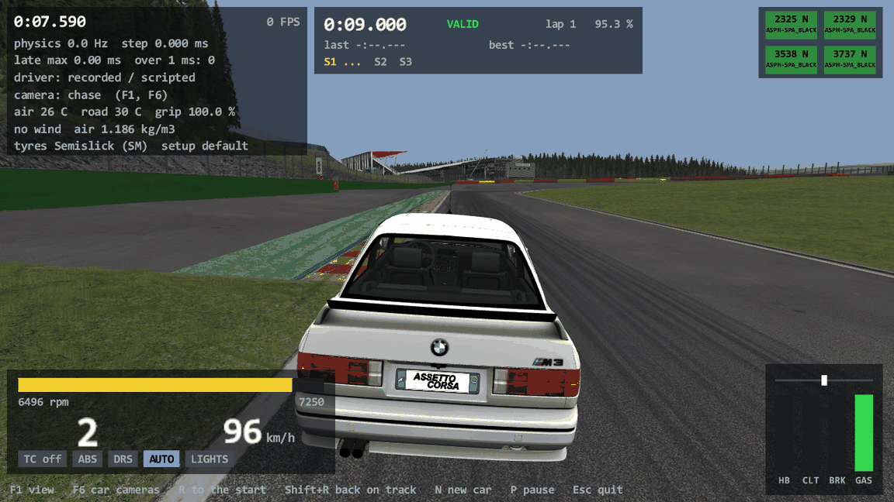
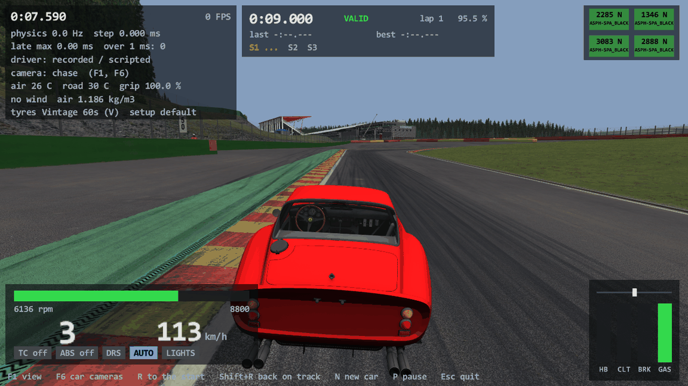

# Task 17: every suspension, rear-wheel steering and the old tyre model

## Resume here

**State: Task 17 is complete.** Everything of the task brief
(`prompts/17_suspensions_rearsteer_oldtyre.md`) is ported, compared with the game and committed
on `master`; version 0.17.0.

Nothing is left open that blocks later work. If something has to be checked again:

| What | Command (from the repository folder) |
|---|---|
| All tests (the four new golden excerpts need `cardata/bmw_m3_e30`, `ks_ferrari_250_gto`, `ks_ferrari_812_superfast`, `formula_k`; they print NOT TESTED without) | `cargo test --release --workspace --locked` |
| Refused cars | `target\release\acd_check.exe --refused` |
| Suspension micro-oracle (needs the game) | `tools\car_oracle\target\release\car_oracle.exe sus-micro --car bmw_m3_e30 --count 20000` |
| Brush curve + loaded tyre values (needs the game) | `tools\tyre_oracle\target\release\tyre_oracle.exe coverage --car cardata\formula_k --n 20000` |
| A whole old tyre, twelve scripted runs per axle | `tools\tyre_oracle\target\release\tyre_oracle.exe run --car cardata\formula_k --axle both --scenario all --check --out re\scratch\task17\tyre_k` |
| Record a car and hold the Rust car against it | `car_oracle.exe run --car <car> --scenario wc_spirited --out oracle\t17_<car>`, then `chassis_compare.exe run --dir oracle\t17_<car>` |
| The batches used here | `re/scratch/task17/record_sus.sh`, `compare_sus.sh`, `record_col.sh`, `record_k.sh`, `tyres_sdk.sh` (git-ignored) |

The recordings (8.6 GB) were deleted after the last comparison; the small input files of the
`rustyac.exe` replays stay in `oracle/game/t17_*.ryin`. `cardata/formula_k` is a copy of the sdk's
`sdk\dev\content\cars\formula_k\data` (without the "conflicted copy" file); `cardata/gt3_multilink`
is written by `chassis_compare test-car`. Briefs read from the machine code (git-ignored):
`re/scratch/task17/spec_strut.md`, `spec_axle.md`, `spec_ml.md`, `spec_rearsteer.md`,
`spec_oldtyre.md`, `spec_tooling.md`.

---

## 1. Summary in plain English

- **Every car the plain game can load now loads in rustyAC: 119 of the 123 installed cars**
  (83 before). The four that stay refused cannot run in plain Assetto Corsa either: the three
  `_csp` cars (their suspension type `COSMIC` belongs to Custom Shaders Patch) and
  `urd_darche_992_23` (its data files are encrypted for Custom Shaders Patch).
- **Three more suspension types.** A car's wheel can now hang on a strut (30 cars, the BMW M3
  E30 among them), on a rigid rear axle (4 cars, such as the Ferrari 250 GTO) or on a multilink
  (no car of the game, but cars made by others), besides the double wishbone of before.
- **Rear-wheel steering** (Ferrari 812 Superfast, Porsche Panamera): the rear wheels steer a
  little by a rule that looks at the steering wheel, the throttle, how much the rear tyres slide
  and the speed.
- **The old tyre model** (tyres.ini `VERSION` below 10): the tyre code the game used before its
  version 1.5. The kart of the game's sdk (`formula_k`) and all 130 tyre sets of the sdk use it,
  and so do many cars made by others.
- **Everything is the game's own arithmetic, bit for bit.** Checked three ways:
  - small pieces alone: the game's own suspension objects and the game's own tyre curve against
    the port on 100,000 random samples and 2.46 million random calls, all identical;
  - whole cars driven freely from the first step: eight cars, 75 recordings, 386,848 steps on a
    flat road and on Spa (launch, braking, slalom, kerbs, Eau Rouge, wall hits), every one of
    about 2,500 values per step and 16.6 million force calls identical;
  - `rustyac.exe` itself replays the E30, the 812, the 250 GTO and the kart identically.
- Speed is unchanged: a physics step takes about 0.1 ms of the 3 ms it has.

Screenshots (drawn off screen by `rustyac.exe`, the car driving itself on Spa):





---

## 2. What is ported

All in `crates/rustyac-physics/src`. Each suspension class sits behind the existing
`SuspensionModel` slot (AC's `ISuspension`), chosen by `[FRONT]` / `[REAR] TYPE` in
suspensions.ini in the game's order of tests (`STRUT`, `DWB`, `ML`, `AXLE`).

### 2.1 `SuspensionStrut` → `car/suspension_strut.rs` (`VanillaStrut`)

| AC function | Address | What |
|---|---|---|
| `SuspensionStrut::SuspensionStrut` | 0x1402c38d0 | one `rand()` for the damage direction, loader, mirroring, hub (80 % of `HUB_MASS`) and strut body (20 %, box 0.05 x 0.5 x 0.2 m) |
| `loadINI` | 0x1402c4ee0 | `STRUT_CAR`, `STRUT_TYRE`, the lower arm and steering points, rim offset, spring, damper, `[DAMAGE]` |
| `attach`, `setPositions` | 0x1402c4100, 0x1402c6210 | two lower-arm rods and the steering rod (hub), a slider (strut body to hub along the strut), a ball joint (car body to strut body at the top mount) |
| `step` | 0x1402c6600 | spring and damper along the strut, packer, bump stops |
| `setSteerLengthOffset` | 0x1402c6540 | steering, toe, bent toe after a crash |
| `addForceAtPos`, `addTorque`, `addLocalForceAndTorque`, `getSteerBasis` | 0x1402c3d60, 0x1402c4060, 0x1402c3e80, 0x1402c4d70 | the tyre's forces and the steering torque |
| `setDamage`, `resetDamage`, `getDamage`, `setERPCFM` | 0x1402c6160, 0x1402c6150, 0x1402c46b0, 0x1402c61b0 | |
| `PhysicsCore::createSliderJoint`, `createBallJoint` | 0x1402cc3f0, 0x1402cc010 | in `car/body.rs` (the joints themselves were already in `rustyac-ode`) |

Things the game does that are easy to "tidy up" and were copied as they are:
- the damper speed of a strut has the opposite sign to every other type, so `DAMP_BUMP` acts
  while the strut gets longer;
- the bump stops are a fixed 500,000 N/m with no "is it zero" test: `BUMPSTOP_UP = 0` puts a
  bump stop at the design height;
- `stop()` stops the hub only, the strut body keeps its speed; the constructor sets no
  ERP / CFM on the joints, and a slider ignores the ERP it is given later.

### 2.2 `SuspensionAxle` → `car/suspension_axle.rs` (`VanillaAxle`)

| AC function | Address | What |
|---|---|---|
| `Car::Car` (the part) | 0x14026bf00 | `Car::rigidAxle` is created before any hub (third body of the car); `[AXLE] TORQUE_REACTION`; `AXLE` on a front wheel is the game's `exit(1)` and is refused with the game's own words: `ERROR: Cannot create suspension type: AXLE  for wheel:0` |
| `SuspensionAxle::SuspensionAxle` | 0x1402c6b90 | Left (wheel 2) builds the body and the `LINK_COUNT` rods, Right (wheel 3) only reads its numbers; no `rand()` |
| `setPositions` / `attach` | 0x1402c86e0, 0x1402c7fb0 | |
| `step` | 0x1402c8770 | spring from the seat on the axle to a point 0.2 m above it on the body, sideways leaf spring, bump stops, damper |
| `getHubWorldMatrix`, `getVelocity`, `getMass`, the force entries | 0x1402c8440, 0x1402c85a0, 0x1402c84c0, 0x1402c7f00, 0x1402c7fa0, 0x1402c7f10 | the wheel is rigidly on the axle line: no camber, no toe |
| the shared empty / `return 0` slots | 0x140017870, 0x14044f230 | no steering, no damage, `getPackerRange` 0 |
| `Drivetrain::step2WD` (the tail) | 0x1402694e0 | the torque reaction: gearbox torque x `TORQUE_REACTION` twists the body one way about its roll axis and the axle the other way (`car/drivetrain.rs`) |
| `Car::initHeaveSprings` | 0x140273f40 | heave springs only when all four wheels are double wishbones (`car/chassis.rs`) |
| `CarAvatar::initPhysics` (the part) | 0x1400d7660 | the telemetry's bump-stop offset is 0 for a wheel that is not on a double wishbone (`car/telemetry.rs`) |

Copied as they are: bump stops fixed at 500,000 N/m (`BUMP_STOP_RATE` is read and not used);
the damper speed is measured at the wheel end, the force acts at the spring seat.

### 2.3 `SuspensionML` → `car/suspension_ml.rs` (`VanillaMultilink`)

| AC function | Address |
|---|---|
| `SuspensionML::SuspensionML`, `loadINI`, `setPositions` | 0x1402c8e20, 0x1402c9970, 0x1402ca9d0 |
| `step` | 0x1402cab00 |
| `setSteerLengthOffset`, `getSteerBasis` | 0x1402caa40, 0x1402c97e0 |
| `addForceAtPos`, `addTorque`, `addLocalForceAndTorque` | 0x1402c91d0, 0x1402c9380, 0x1402c92f0 |
| `setDamage`, `resetDamage`, `getDamage`, `getHubWorldMatrix` | 0x1402ca980, 0x1402ca970, 0x1402c9450, 0x1402c96c0 |

Read from the disassembly throughout (the map's section had parts from pseudo-C). Five free rods
`JOINT0..4_CAR / _TYRE`; rod 4 steers, rods 0 and 2 give the steering axis. No bump stops, the
spring may pull, no damper fall-backs, `[DAMAGE]` is never read (a multilink never bends),
`setERPCFM` is the empty function.

### 2.4 Rear-wheel steering → `car/chassis.rs` (`SteeringSystem`)

`SteeringSystem::init` 0x1402b80d0 loads `ctrl_4ws.ini` into a `DynamicController` when the file
exists; `SteeringSystem::step` 0x1402b81b0 evaluates it once per step and hands the same value
(metres of rod shift) to `setSteerLengthOffset` of both rear wheels. It is speed dependent
because the files make it so: the two cars' controllers multiply a steering-angle table by a
throttle, a rear-slip-angle and a speed table, each with its own smoothing. On such a car rear
toe and rear crash damage reach the geometry every step. No other controller file of a stock
car was found that the game reads and the port ignores (the survey is in `spec_rearsteer.md`).

### 2.5 The old tyre model → `tyre/brush.rs`, `tyre/vanilla_tyre.rs`, `data/tyres_ini.rs`

| AC function | Address | Port |
|---|---|---|
| `Tyre::addTyreForces` | 0x14027e1a0 | `VanillaTyre::add_tyre_forces` |
| `Tyre::stepRelaxationLength` | 0x140284a40 | `step_relaxation_length` |
| `Tyre::getDY`, `getDX`, `getCamberedDy` | 0x1402803d0, 0x140280240, 0x140280080 | `get_dy`, `get_dx`, `get_cambered_dy` |
| `Tyre::step` (the version test and the old feedback torque) | 0x140283800 | `step` |
| `BrushSlipProvider` (constructor, `getSlipForce`, `calcMaximum`, `recomputeMaximum`) | 0x1402b2f80, 0x1402b3190, 0x1402b3090, 0x1402b3230 | `BrushSlipProvider` |
| `BrushTyreModel` (`solve`, `solveV5`, `getCFFromSlipAngle`) | 0x1402cb3c0, 0x1402cb4e0, 0x1402cb380 | `BrushTyreModel` |
| `Tyre::initCompounds` (the brush part), `generateCompoundNames` | 0x140280800, 0x14027f7a0 | `tyres_ini.rs` |

The `TyreModel` slot stays what it is in the game: AC's `ITyreModel` with the SCTM in it, used
from `VERSION` 10 on. The old path does not go through that interface in the game either; it
runs inside the tyre and takes its slip curve from the `BrushSlipProvider`, which now sits next
to `VanillaSctm` in the `tyre` module. The old thermal and wear code is the same code as the new
(the three version tests in `stepThermalModel` were already in the port); only its inputs
differ.

How the old path differs from the new one, as found in the machine code:
- one combined slip from the lagged sliding velocity of the contact patch (camber adds sideways
  slip), instead of a slip angle and a slip ratio through the SCTM;
- the slip ratio is `-(sliding speed / road speed)`, not relaxed;
- no aligning torque is applied: the grip force acts a "pneumatic trail" ahead of the contact
  point instead;
- below `VERSION` 5 the force never falls after the peak (the curve is asked with a fall-off
  level of 1);
- `[VIRTUALKM] USE_LOAD` has no effect;
- the game calls the SCTM once with partly uninitialised input and throws the result away: not
  ported.

### 2.6 Tools

- `tools/car_oracle`: records any of the four suspension classes (per-class offsets, the strut
  body, the rigid axle, ball and slider joints, call-site labels of the three new `step`
  functions); new command `sus-micro`; new option `--damage f,r,l,r,c` (bodywork dented at the
  start).
- `tools/chassis_compare`: takes each car's bodies and joints from the recording
  (`replay::CarLayout`); `test-car` writes the made-up multilink car `gt3_multilink`;
  `excerpt17` writes the four golden files.
- `tools/tyre_oracle`: `coverage` compares the brush members and calls the game's brush curve on
  random inputs for every compound; `run --check` works for old tyres.
- `crates/rustyac-physics/tests/golden/*.chgold`: the header key `bodies=` for a car that does
  not have six rigid bodies.

---

## 3. Results

### 3.1 Suspension micro-oracle

`car_oracle sus-micro --car <car> --count 20000`: the game's own suspension objects of one car
against the port's. Before every sample both sides get the same random state (pose and
velocity of every body, spring, packer, bump stops, rod length, toe, camber, damper), then one
function of one wheel is called on both and everything it can touch is compared: return
values, the force calls with the accumulators after each, travel / damper speed / steer torque,
every joint's anchors, every body. Every eighth sample all four suspensions step and one
`dWorldStep` follows on both sides.

| Car | Suspensions (LF RF LR RR) | Bodies / joints | Samples | Bit-exact |
|---|---|---|---|---|
| `bmw_m3_e30` | STRUT STRUT DWB DWB | 8 / 21 | 20,000 | 20,000 |
| `ks_audi_sport_quattro` | STRUT STRUT STRUT STRUT | 10 / 21 | 20,000 | 20,000 |
| `ks_ferrari_250_gto` | DWB DWB AXLE AXLE | 5 / 15 | 20,000 | 20,000 |
| `gt3_multilink` (made up) | ML ML ML ML | 6 / 21 | 20,000 | 20,000 |
| `ks_ferrari_812_superfast` | DWB DWB DWB DWB | 6 / 21 | 20,000 | 20,000 |

The calls, with the E30's sample counts (the other cars' are alike; an axle is not asked for
`getSteerBasis`, which raises an exception on purpose in the game):

| Call | Samples | Bit-exact |
|---|---|---|
| `step` | 2546 | 2546 |
| `addForceAtPos` (without and with the steer torque) | 1707 | 1707 |
| `addTorque` | 853 | 853 |
| `addLocalForceAndTorque` | 914 | 914 |
| `setSteerLengthOffset` | 874 | 874 |
| `setDamage`, `resetDamage` | 1796 | 1796 |
| `setERPCFM` | 889 | 889 |
| `attach`, `stop` | 1711 | 1711 |
| `getHubWorldMatrix`, `getPointVelocity`, `getHubAngularVelocity`, `getVelocity`, `getSteerBasis`, `getBasePosition` | 5390 | 5390 |
| `getMass` / `getDamage` / `getSteerTorque` / `getK` / `getPackerRange` | 820 | 820 |
| `dWorldStep` after a step of all four | 2500 | 2500 |

The check can fail: with the port's spring rate one bit off (`SUS_MICRO_FAULT=1`) 364 of 2,000
samples differ.

### 3.2 Brush tyre micro-oracle and the sdk tyres

`tyre_oracle coverage`: per tyres.ini, every loaded value of the game's `Tyre::init` against the
port's loader, then the game's `BrushSlipProvider::getSlipForce`, `calcMaximum`,
`BrushTyreModel::solve` and `solveV5` on random inputs (4,000 per compound: normal slip and
load, no slip, slip far past the peak, zero and negative load, NaN). `tyre_oracle run --check`:
the game's whole `Tyre::step` against the port on scripted input sequences.

| Data | tyres.ini | VERSION | Compounds | Loaded values (different) | Brush calls (bit-exact) | Whole-tyre runs: steps (bit-exact) |
|---|---|---|---|---|---|---|
| sdk `formula_k` | 1 | 7 | 6 | 812 (0) | 24,000 (24,000) | 10 runs: 45,000 (45,000) |
| sdk `v1.5_tyres_ac` | 100 | 7 | 458 | 60,502 (0) | 1,832,000 (1,832,000) | 1,000 runs: 4,500,000 (4,500,000) |
| sdk `old_1.0_tyres_ac` | 30 | 3 | 150 | 19,970 (0) | 600,000 (600,000) | 300 runs: 1,350,000 (1,350,000) |
| **all** | **131** | | **614** | **81,284 (0)** | **2,456,000 (2,456,000)** | **1,310 runs: 5,895,000 (5,895,000)** |

The runs per set are `random`, `golden_mix`, `cornering`, `brake_lockup` and `overheat` on both
axles. `formula_k` was also run through all twelve scenarios (`warmup`, `brake_lockup`,
`wheelspin`, `cornering`, `liftoff`, `blankets`, `bump`, `overheat`, `random`, `tester`,
`nan_inputs`, `golden_mix`) on both axles: 24 runs, 97,800 steps, all identical (in
`nan_inputs` identical with NaN = NaN: the bits of a NaN cannot be matched).

The sdk's v1.5 folders hold only tyres.ini; the `.lut` files they name were taken from the
installed car of the same name. 19 sets have no such car and ran with empty curves on both
sides (the game and the port agree there too). The 30 old sets are the only stock data for
`VERSION` below 5 (`solve`, `XMU`, generated compound names).

### 3.3 Whole cars, free-running from step 0

`car_oracle run` records the game's own car; `chassis_compare run` drives the whole Rust car
with nothing but the driver's controls and compares every step. Flat road: `pt_autoshift`
(launch through the gears, brake to a stop, launch again), `wc_stops` (two flat-out runs ended
by full stops, the second while steering), `wc_spirited` (a growing slalom with throttle
bursts). Spa: `spa_launch` (start and La Source), `spa_kerbs`, `spa_eau_rouge` (the corner),
and with the body's collisions on `spa_kerb_strike`, `spa_wall_gravel`, `spa_wall_low`,
`spa_wall_high`, `spa_wall_slide`.

| Car | What | Where | Scenario | Steps | Bit-exact | Values per step (chassis + other systems) | Force calls |
|---|---|---|---|---|---|---|---|
| `bmw_m3_e30` | strut front, DWB rear | flat road | `pt_autoshift` | 4001 | 100 % (4001/4001) | 2121 + 267 | 164554 |
| `bmw_m3_e30` | strut front, DWB rear | flat road | `wc_spirited` | 4001 | 100 % (4001/4001) | 2121 + 299 | 165665 |
| `bmw_m3_e30` | strut front, DWB rear | flat road | `wc_stops` | 4334 | 100 % (4334/4334) | 2121 + 299 | 178964 |
| `bmw_m3_e30` | strut front, DWB rear | Spa | `spa_eau_rouge` | 5334 | 100 % (5334/5334) | 2121 + 371 | 221719 |
| `bmw_m3_e30` | strut front, DWB rear | Spa | `spa_kerbs` | 6667 | 100 % (6667/6667) | 2121 + 371 | 278774 |
| `bmw_m3_e30` | strut front, DWB rear | Spa | `spa_launch` | 4504 | 100 % (4504/4504) | 2121 + 371 | 188337 |
| `bmw_m3_e30` | strut front, DWB rear | Spa, collisions on | `spa_kerb_strike` | 5334 | 100 % (5334/5334) | 2121 + 464 | 225860 |
| `bmw_m3_e30` | strut front, DWB rear | Spa, collisions on | `spa_wall_gravel` | 6667 | 100 % (6667/6667) | 2121 + 464 | 277744 |
| `bmw_m3_e30` | strut front, DWB rear | Spa, collisions on | `spa_wall_high` | 6667 | 100 % (6667/6667) | 2121 + 464 | 277744 |
| `bmw_m3_e30` | strut front, DWB rear | Spa, collisions on | `spa_wall_low` | 4667 | 100 % (4667/4667) | 2121 + 464 | 197992 |
| `bmw_m3_e30` | strut front, DWB rear | Spa, collisions on | `spa_wall_slide` | 6001 | 100 % (6001/6001) | 2121 + 464 | 260426 |
| `bmw_m3_e30` | strut front, DWB rear | Spa, collisions on, bodywork dented at the start | `spa_wall_slide` | 6001 | 100 % (6001/6001) | 2121 + 464 | 260435 |
| `ks_toyota_gt86` | strut front, DWB rear | flat road | `pt_autoshift` | 4001 | 100 % (4001/4001) | 2121 + 267 | 164542 |
| `ks_toyota_gt86` | strut front, DWB rear | flat road | `wc_spirited` | 4001 | 100 % (4001/4001) | 2121 + 299 | 166678 |
| `ks_toyota_gt86` | strut front, DWB rear | flat road | `wc_stops` | 4334 | 100 % (4334/4334) | 2121 + 299 | 177838 |
| `ks_toyota_gt86` | strut front, DWB rear | Spa | `spa_eau_rouge` | 5334 | 100 % (5334/5334) | 2121 + 371 | 221454 |
| `ks_toyota_gt86` | strut front, DWB rear | Spa | `spa_kerbs` | 6667 | 100 % (6667/6667) | 2121 + 371 | 283207 |
| `ks_toyota_gt86` | strut front, DWB rear | Spa | `spa_launch` | 4816 | 100 % (4816/4816) | 2121 + 371 | 201716 |
| `ks_toyota_gt86` | strut front, DWB rear | Spa, collisions on | `spa_kerb_strike` | 5334 | 100 % (5334/5334) | 2121 + 464 | 227409 |
| `ks_toyota_gt86` | strut front, DWB rear | Spa, collisions on | `spa_wall_gravel` | 6667 | 100 % (6667/6667) | 2121 + 464 | 276552 |
| `ks_audi_sport_quattro` | strut all round, 4WD | flat road | `pt_autoshift` | 4001 | 100 % (4001/4001) | 2233 + 297 | 171190 |
| `ks_audi_sport_quattro` | strut all round, 4WD | flat road | `wc_spirited` | 4001 | 100 % (4001/4001) | 2233 + 329 | 171190 |
| `ks_audi_sport_quattro` | strut all round, 4WD | flat road | `wc_stops` | 4334 | 100 % (4334/4334) | 2233 + 329 | 183942 |
| `ks_audi_sport_quattro` | strut all round, 4WD | Spa | `spa_eau_rouge` | 5334 | 100 % (5334/5334) | 2233 + 401 | 229862 |
| `ks_audi_sport_quattro` | strut all round, 4WD | Spa | `spa_kerbs` | 4167 | 100 % (4167/4167) | 2233 + 401 | 179706 |
| `ks_audi_sport_quattro` | strut all round, 4WD | Spa | `spa_launch` | 4155 | 100 % (4155/4155) | 2233 + 401 | 178509 |
| `ks_audi_sport_quattro` | strut all round, 4WD | Spa, collisions on | `spa_kerb_strike` | 5334 | 100 % (5334/5334) | 2233 + 494 | 236767 |
| `ks_audi_sport_quattro` | strut all round, 4WD | Spa, collisions on | `spa_wall_gravel` | 6667 | 100 % (6667/6667) | 2233 + 494 | 288546 |
| `ks_audi_sport_quattro` | strut all round, 4WD | Spa, collisions on | `spa_wall_high` | 6667 | 100 % (6667/6667) | 2233 + 494 | 288546 |
| `ks_audi_sport_quattro` | strut all round, 4WD | Spa, collisions on | `spa_wall_low` | 4667 | 100 % (4667/4667) | 2233 + 494 | 204763 |
| `ks_audi_sport_quattro` | strut all round, 4WD | Spa, collisions on | `spa_wall_slide` | 6001 | 100 % (6001/6001) | 2233 + 494 | 271057 |
| `ks_audi_sport_quattro` | strut all round, 4WD | Spa, collisions on, bodywork dented at the start | `spa_wall_slide` | 6001 | 100 % (6001/6001) | 2233 + 494 | 270926 |
| `ks_ferrari_250_gto` | DWB front, rigid axle rear | flat road | `pt_autoshift` | 4001 | 100 % (4001/4001) | 1822 + 267 | 169708 |
| `ks_ferrari_250_gto` | DWB front, rigid axle rear | flat road | `wc_spirited` | 4001 | 100 % (4001/4001) | 1822 + 299 | 173496 |
| `ks_ferrari_250_gto` | DWB front, rigid axle rear | flat road | `wc_stops` | 4334 | 100 % (4334/4334) | 1822 + 299 | 186184 |
| `ks_ferrari_250_gto` | DWB front, rigid axle rear | Spa | `spa_eau_rouge` | 3427 | 100 % (3427/3427) | 1822 + 371 | 147430 |
| `ks_ferrari_250_gto` | DWB front, rigid axle rear | Spa | `spa_kerbs` | 6667 | 100 % (6667/6667) | 1822 + 371 | 291772 |
| `ks_ferrari_250_gto` | DWB front, rigid axle rear | Spa | `spa_launch` | 4185 | 100 % (4185/4185) | 1822 + 371 | 182229 |
| `ks_ferrari_250_gto` | DWB front, rigid axle rear | Spa, collisions on | `spa_kerb_strike` | 5334 | 100 % (5334/5334) | 1822 + 464 | 238271 |
| `ks_ferrari_250_gto` | DWB front, rigid axle rear | Spa, collisions on | `spa_wall_gravel` | 6667 | 100 % (6667/6667) | 1822 + 464 | 290823 |
| `ks_ferrari_250_gto` | DWB front, rigid axle rear | Spa, collisions on | `spa_wall_high` | 6667 | 100 % (6667/6667) | 1822 + 464 | 290823 |
| `ks_ferrari_250_gto` | DWB front, rigid axle rear | Spa, collisions on | `spa_wall_low` | 4667 | 100 % (4667/4667) | 1822 + 464 | 206668 |
| `ks_ferrari_250_gto` | DWB front, rigid axle rear | Spa, collisions on | `spa_wall_slide` | 6001 | 100 % (6001/6001) | 1822 + 464 | 271419 |
| `ks_ferrari_250_gto` | DWB front, rigid axle rear | Spa, collisions on, bodywork dented at the start | `spa_wall_slide` | 6001 | 100 % (6001/6001) | 1822 + 464 | 271464 |
| `ks_ferrari_812_superfast` | DWB, rear-wheel steering | flat road | `pt_autoshift` | 4001 | 100 % (4001/4001) | 2009 + 267 | 166362 |
| `ks_ferrari_812_superfast` | DWB, rear-wheel steering | flat road | `wc_spirited` | 4001 | 100 % (4001/4001) | 2009 + 299 | 166362 |
| `ks_ferrari_812_superfast` | DWB, rear-wheel steering | flat road | `wc_stops` | 4334 | 100 % (4334/4334) | 2009 + 299 | 179488 |
| `ks_ferrari_812_superfast` | DWB, rear-wheel steering | Spa | `spa_eau_rouge` | 4481 | 100 % (4481/4481) | 2009 + 371 | 187747 |
| `ks_ferrari_812_superfast` | DWB, rear-wheel steering | Spa | `spa_kerbs` | 6667 | 100 % (6667/6667) | 2009 + 371 | 278306 |
| `ks_ferrari_812_superfast` | DWB, rear-wheel steering | Spa | `spa_launch` | 3754 | 100 % (3754/3754) | 2009 + 371 | 156835 |
| `ks_ferrari_812_superfast` | DWB, rear-wheel steering | Spa, collisions on | `spa_kerb_strike` | 5334 | 100 % (5334/5334) | 2009 + 464 | 231791 |
| `ks_ferrari_812_superfast` | DWB, rear-wheel steering | Spa, collisions on | `spa_wall_gravel` | 6667 | 100 % (6667/6667) | 2009 + 464 | 282914 |
| `ks_porsche_panamera` | DWB, rear-wheel steering, 4WD | flat road | `pt_autoshift` | 4001 | 100 % (4001/4001) | 2009 + 294 | 166104 |
| `ks_porsche_panamera` | DWB, rear-wheel steering, 4WD | flat road | `wc_spirited` | 4001 | 100 % (4001/4001) | 2009 + 326 | 166104 |
| `ks_porsche_panamera` | DWB, rear-wheel steering, 4WD | flat road | `wc_stops` | 4334 | 100 % (4334/4334) | 2009 + 326 | 179186 |
| `ks_porsche_panamera` | DWB, rear-wheel steering, 4WD | Spa | `spa_eau_rouge` | 4976 | 100 % (4976/4976) | 2009 + 398 | 208686 |
| `ks_porsche_panamera` | DWB, rear-wheel steering, 4WD | Spa | `spa_kerbs` | 6667 | 100 % (6667/6667) | 2009 + 398 | 278192 |
| `ks_porsche_panamera` | DWB, rear-wheel steering, 4WD | Spa | `spa_launch` | 3845 | 100 % (3845/3845) | 2009 + 398 | 160785 |
| `ks_porsche_panamera` | DWB, rear-wheel steering, 4WD | Spa, collisions on | `spa_kerb_strike` | 5334 | 100 % (5334/5334) | 2009 + 491 | 230988 |
| `ks_porsche_panamera` | DWB, rear-wheel steering, 4WD | Spa, collisions on | `spa_wall_gravel` | 6667 | 100 % (6667/6667) | 2009 + 491 | 278107 |
| `gt3_multilink` | made-up: multilink all round | flat road | `pt_autoshift` | 4001 | 100 % (4001/4001) | 2009 + 275 | 172436 |
| `gt3_multilink` | made-up: multilink all round | flat road | `wc_spirited` | 4001 | 100 % (4001/4001) | 2009 + 307 | 173384 |
| `gt3_multilink` | made-up: multilink all round | flat road | `wc_stops` | 4334 | 100 % (4334/4334) | 2009 + 307 | 186482 |
| `gt3_multilink` | made-up: multilink all round | Spa | `spa_eau_rouge` | 5334 | 100 % (5334/5334) | 2009 + 379 | 232039 |
| `gt3_multilink` | made-up: multilink all round | Spa | `spa_kerbs` | 6667 | 100 % (6667/6667) | 2009 + 379 | 289806 |
| `gt3_multilink` | made-up: multilink all round | Spa | `spa_launch` | 8001 | 100 % (8001/8001) | 2009 + 379 | 349482 |
| `gt3_multilink` | made-up: multilink all round | Spa, collisions on | `spa_kerb_strike` | 5334 | 100 % (5334/5334) | 2009 + 472 | 237634 |
| `gt3_multilink` | made-up: multilink all round | Spa, collisions on | `spa_wall_gravel` | 6667 | 100 % (6667/6667) | 2009 + 472 | 292008 |
| `gt3_multilink` | made-up: multilink all round | Spa, collisions on, bodywork dented at the start | `spa_wall_slide` | 6001 | 100 % (6001/6001) | 2009 + 472 | 274649 |
| `formula_k` | old tyres (VERSION 7), DWB | flat road | `pt_autoshift` | 4001 | 100 % (4001/4001) | 2009 + 305 | 176694 |
| `formula_k` | old tyres (VERSION 7), DWB | flat road | `wc_spirited` | 4001 | 100 % (4001/4001) | 2009 + 337 | 179846 |
| `formula_k` | old tyres (VERSION 7), DWB | flat road | `wc_stops` | 4334 | 100 % (4334/4334) | 2009 + 337 | 189580 |
| `formula_k` | old tyres (VERSION 7), DWB | Spa | `spa_eau_rouge` | 5334 | 100 % (5334/5334) | 2009 + 409 | 241525 |
| `formula_k` | old tyres (VERSION 7), DWB | Spa | `spa_kerbs` | 3160 | 100 % (3160/3160) | 2009 + 409 | 141027 |
| `formula_k` | old tyres (VERSION 7), DWB | Spa | `spa_launch` | 8001 | 100 % (8001/8001) | 2009 + 409 | 364474 |
| **all** | | | | **386848** | **386848** | | **16631924** |

### 3.4 Wall hits and suspension damage

| Car | Scenario | Steps with collider-mesh contact joints (first at step) | Collision callbacks / highest closing speed | Damage zones at the end (front, rear, left, right, centre) | Suspension damage at the end (LF, RF, LR, RR) |
|---|---|---|---|---|---|
| `bmw_m3_e30` | `spa_kerb_strike` | 54 (4991) | 137 / 54 km/h | 48.2, 54.2, 0.0, 0.0, 54.2 | 0.00, 0.00, 0.00, 0.00 |
| `bmw_m3_e30` | `spa_wall_gravel` | 0 | 0 / 0 km/h | 0.0, 0.0, 0.0, 0.0, 0.0 | 0.00, 0.00, 0.00, 0.00 |
| `bmw_m3_e30` | `spa_wall_high` | 0 | 0 / 0 km/h | 0.0, 0.0, 0.0, 0.0, 0.0 | 0.00, 0.00, 0.00, 0.00 |
| `bmw_m3_e30` | `spa_wall_low` | 0 | 0 / 0 km/h | 0.0, 0.0, 0.0, 0.0, 0.0 | 0.00, 0.00, 0.00, 0.00 |
| `bmw_m3_e30` | `spa_wall_slide` | 1702 (2221) | 1450 / 31 km/h | 31.2, 16.5, 0.0, 0.0, 31.2 | 0.00, 0.00, 0.00, 0.00 |
| `bmw_m3_e30` | `spa_wall_slide` (dented at the start) | 1422 (2221) | 1063 / 31 km/h | 70.0, 65.0, 80.0, 75.0, 80.0 | 0.28, 0.26, 0.26, 0.24 |
| `ks_toyota_gt86` | `spa_kerb_strike` | 122 (4605) | 200 / 61 km/h | 61.0, 0.0, 0.0, 0.0, 61.0 | 0.00, 0.00, 0.00, 0.00 |
| `ks_toyota_gt86` | `spa_wall_gravel` | 0 | 0 / 0 km/h | 0.0, 0.0, 0.0, 0.0, 0.0 | 0.00, 0.00, 0.00, 0.00 |
| `ks_audi_sport_quattro` | `spa_kerb_strike` | 534 (4155) | 571 / 75 km/h | 74.6, 0.0, 0.0, 0.0, 74.6 | 0.00, 0.00, 0.00, 0.00 |
| `ks_audi_sport_quattro` | `spa_wall_gravel` | 0 | 0 / 0 km/h | 0.0, 0.0, 0.0, 0.0, 0.0 | 0.00, 0.00, 0.00, 0.00 |
| `ks_audi_sport_quattro` | `spa_wall_high` | 0 | 0 / 0 km/h | 0.0, 0.0, 0.0, 0.0, 0.0 | 0.00, 0.00, 0.00, 0.00 |
| `ks_audi_sport_quattro` | `spa_wall_low` | 0 | 0 / 0 km/h | 0.0, 0.0, 0.0, 0.0, 0.0 | 0.00, 0.00, 0.00, 0.00 |
| `ks_audi_sport_quattro` | `spa_wall_slide` | 1734 (2221) | 2429 / 55 km/h | 55.4, 18.7, 0.8, 0.0, 55.4 | 0.00, 0.00, 0.00, 0.00 |
| `ks_audi_sport_quattro` | `spa_wall_slide` (dented at the start) | 1726 (2221) | 2512 / 55 km/h | 70.0, 65.0, 80.0, 75.0, 80.0 | 0.00, 0.00, 0.00, 0.00 |
| `ks_ferrari_250_gto` | `spa_kerb_strike` | 32 (4389) | 144 / 52 km/h | 52.0, 15.7, 44.6, 0.0, 52.0 | 0.07, 0.00, 0.00, 0.00 |
| `ks_ferrari_250_gto` | `spa_wall_gravel` | 0 | 0 / 0 km/h | 0.0, 0.0, 0.0, 0.0, 0.0 | 0.00, 0.00, 0.00, 0.00 |
| `ks_ferrari_250_gto` | `spa_wall_high` | 0 | 0 / 0 km/h | 0.0, 0.0, 0.0, 0.0, 0.0 | 0.00, 0.00, 0.00, 0.00 |
| `ks_ferrari_250_gto` | `spa_wall_low` | 0 | 0 / 0 km/h | 0.0, 0.0, 0.0, 0.0, 0.0 | 0.00, 0.00, 0.00, 0.00 |
| `ks_ferrari_250_gto` | `spa_wall_slide` | 1414 (2249) | 1471 / 28 km/h | 28.4, 10.3, 12.4, 0.0, 28.4 | 0.00, 0.00, 0.00, 0.00 |
| `ks_ferrari_250_gto` | `spa_wall_slide` (dented at the start) | 1374 (2251) | 1365 / 24 km/h | 70.0, 65.0, 80.0, 75.0, 80.0 | 0.28, 0.26, 0.00, 0.00 |
| `ks_ferrari_812_superfast` | `spa_kerb_strike` | 1117 (3701) | 789 / 72 km/h | 71.7, 0.0, 0.0, 0.0, 71.7 | 0.00, 0.00, 0.00, 0.00 |
| `ks_ferrari_812_superfast` | `spa_wall_gravel` | 102 (5561) | 524 / 96 km/h | 96.2, 52.6, 0.0, 45.9, 96.2 | 0.00, 1.00, 0.00, 0.46 |
| `ks_porsche_panamera` | `spa_kerb_strike` | 835 (3835) | 890 / 66 km/h | 65.7, 0.0, 0.0, 0.0, 65.7 | 0.00, 0.00, 0.00, 0.00 |
| `ks_porsche_panamera` | `spa_wall_gravel` | 0 | 0 / 0 km/h | 0.0, 0.0, 0.0, 0.0, 0.0 | 0.00, 0.00, 0.00, 0.00 |
| `gt3_multilink` | `spa_kerb_strike` | 469 (4103) | 1060 / 80 km/h | 80.1, 0.0, 0.0, 0.0, 80.1 | 0.00, 0.00, 0.00, 0.00 |
| `gt3_multilink` | `spa_wall_gravel` | 36 (6145) | 139 / 18 km/h | 17.9, 0.0, 0.0, 0.0, 17.9 | 0.00, 0.00, 0.00, 0.00 |
| `gt3_multilink` | `spa_wall_slide` (dented at the start) | 1482 (2173) | 1928 / 59 km/h | 70.0, 65.0, 80.0, 75.0, 80.0 | 0.00, 0.00, 0.00, 0.00 |

`spa_wall_gravel` was written for a fast car: the slower cars are not at the barrier when the
scenario ends (the 812 is: its right front corner bends fully and the right rear by 46 %, and
on that car the bent rear toe reaches the geometry every step through the rear steering). For
a strut and an axle car with bent suspension the wall slide was recorded a second time with the
bodywork dented at the start (`--damage 70,65,80,75,80`): the first contact then bends the
corners (E30: 0.28, 0.26, 0.26, 0.24 of the most; 250 GTO: both front corners, the axle never).
The Quattro and the multilink stay at 0 in both: the Quattro's suspensions.ini has no
`[DAMAGE]` section, so its gain and maximum are 0, and a multilink never reads one.

### 3.5 Golden tests

`crates/rustyac-physics/tests/chassis_golden.rs`, 300 steps each out of the slalom, whole car:

| File | Car | Bodies | Bytes |
|---|---|---|---|
| `strut_e30_wc_spirited_2400_300.chgold` | `bmw_m3_e30` | 8 | 192,870 |
| `axle_250gto_wc_spirited_2400_300.chgold` | `ks_ferrari_250_gto` | 5 | 145,498 |
| `rearsteer_812_wc_spirited_2400_300.chgold` | `ks_ferrari_812_superfast` | 6 | 161,523 |
| `oldtyre_formula_k_wc_spirited_2400_300.chgold` | `formula_k` | 6 | 161,664 |

Three tests: the files read back and round-trip; the cars match the game; a steering input one
bit off is noticed on every one of the four. Without `cardata/<car>` they print NOT TESTED.
`tyre/brush.rs` has two unit tests that need nothing (the constants' bits, the shape of the
curve).

### 3.6 `rustyac.exe`

`chassis_compare game-replay`: the program itself replays the recording's inputs and its dump
is compared like the Rust car above. All bit-exact:

| Car | Recordings |
|---|---|
| `bmw_m3_e30` | `pt_autoshift`, `wc_stops`, `wc_spirited`, `spa_launch`, `spa_kerbs`, `spa_eau_rouge`, `spa_kerb_strike`, `spa_wall_gravel` |
| `ks_ferrari_812_superfast` | `pt_autoshift`, `wc_stops`, `wc_spirited` |
| `ks_ferrari_250_gto` | `pt_autoshift`, `wc_stops`, `wc_spirited` |
| `formula_k` | `pt_autoshift`, `wc_stops`, `wc_spirited` |

---

## 4. Refused cars before and after

`acd_check --refused` builds every installed car out of its `data.acd` and drives it 300 steps.

**Before (v0.16.0): 83 load, 40 refused.**

| Reason then | Cars |
|---|---|
| strut front, double wishbone rear (25) | `abarth500`, `abarth500_s1`, `alfa_romeo_giulietta_qv`, `alfa_romeo_giulietta_qv_le`, `bmw_1m`, `bmw_1m_s3`, `bmw_m3_e30`, `bmw_m3_e30_drift`, `bmw_m3_e30_dtm`, `bmw_m3_e30_gra`, `bmw_m3_e30_s1`, `bmw_m3_e92`, `bmw_m3_e92_drift`, `bmw_m3_e92_s1`, `bmw_m3_gt2`, `bmw_z4`, `bmw_z4_drift`, `bmw_z4_gt3`, `bmw_z4_s1`, `ks_alfa_mito_qv`, `ks_audi_a1s1`, `ks_bmw_m235i_racing`, `ks_ford_mustang_2015`, `ks_toyota_gt86`, `ruf_yellowbird` |
| strut front and rear (4) | `ks_alfa_romeo_155_v6`, `ks_audi_sport_quattro`, `ks_audi_sport_quattro_rally`, `ks_audi_sport_quattro_s1` |
| double wishbone front, strut rear (1) | `ks_alfa_romeo_4c` |
| rigid rear axle (4) | `ks_alfa_romeo_gta`, `ks_ferrari_250_gto`, `ks_maserati_250f_12cyl`, `ks_maserati_250f_6cyl` |
| rear-wheel steering (2) | `ks_ferrari_812_superfast`, `ks_porsche_panamera` |
| `TYPE=COSMIC` (3) | `vrc_formula_alpha_2025_csp`, `vrc_formula_alpha_2026_csp`, `vrc_formula_beta_2024_csp` |
| no readable suspension type (1) | `urd_darche_992_23` |

**After (v0.17.0): 119 load, 4 refused.**

| Car | Message | Why it stays |
|---|---|---|
| `vrc_formula_alpha_2025_csp`, `vrc_formula_alpha_2026_csp`, `vrc_formula_beta_2024_csp` | `ERROR: Cannot create suspension type: COSMIC  for wheel:0 (COSMIC is Custom Shaders Patch's own suspension: this car needs CSP)` | as the task says: CSP only. The first part is the plain game's own message before its `exit(1)` |
| `urd_darche_992_23` | `ERROR: Cannot create suspension type:   for wheel:0 (the file has no readable sections: this car's data is encrypted for Custom Shaders Patch)` | every file in its `data.acd` is one comment line of scrambled text that only CSP can read; the plain game finds no `TYPE` and exits the same way. Nothing was decrypted |

So the goal is met with one more car than the three named ones, and that car is a CSP-only car
too. The 113 cars with an extracted folder give the same bits from the archive and from the
folder in all 69,023,100 compared values.

---

## 5. How to drive the new cars

`rustyac.exe` is `target\release\rustyac.exe` after `cargo build --release` (or the exe of the
release zip). Any car of the install by its folder name:

```
rustyac.exe --car bmw_m3_e30 --track spa
rustyac.exe --car ks_ferrari_812_superfast --track spa
rustyac.exe --car ks_ferrari_250_gto --track spa
```

An old-tyre car: the kart of the game's sdk is not an installed car, so give its folder:

```
rustyac.exe --car "C:\Program Files (x86)\Steam\steamapps\common\assettocorsa\sdk\dev\content\cars\formula_k" --track spa
```

Without `--track spa` the car stands on the endless flat road. A car made by somebody else with
`TYPE=ML` or old tyres works the same way (`--car <its folder name>` when it is installed,
`--car <path>` otherwise). To watch a car drive itself: add `--autodrive`.

---

## 6. Performance

`rustyac.exe --car <car> --track spa --autodrive --headless --duration 20 --no-race-ini`, the
physics thread at the game's 333.33 Hz; step time of 6,660 steps:

| Car | What | Step time min / avg / max, ms |
|---|---|---|
| `ks_ferrari_f2004` | double wishbone (as before) | 0.024 / 0.107 / 0.748 |
| `bmw_m3_e30` | struts front (8 bodies) | 0.048 / 0.094 / 1.293 |
| `ks_audi_sport_quattro` | struts all round, 4WD (10 bodies) | 0.036 / 0.108 / 0.769 |
| `ks_ferrari_250_gto` | rigid rear axle (5 bodies) | 0.030 / 0.093 / 0.683 |
| `ks_ferrari_812_superfast` | rear-wheel steering | 0.023 / 0.098 / 0.708 |
| `formula_k` | old tyres | 0.036 / 0.086 / 0.703 |

No step was late by a whole step in any run. The whole Rust car replays a recording at about 4,000
steps a second in `chassis_compare` (every value compared), the same as before.

---

## 7. Open questions and choices made

1. **`urd_darche_992_23` stays refused.** Its data is encrypted for Custom Shaders Patch; the
   rules of the task forbid decrypting CSP content, and the plain game cannot load the car
   either. It is the one car in the list besides the three named ones.
2. **Multilink: two numbers the game never initialises.** `SuspensionML` reads `packerRange` and
   `bumpStopRate` that neither its constructor nor its loader writes (the game runs on whatever
   the memory block held, until a setup writes them). The port starts both at 0 (no packer). For
   the comparison the oracle writes 0 into the game's four uninitialised members right after the
   car is built; that is the only place where the game's own state is touched. The micro-oracle
   then sets both to random values on both sides, so the packer branch is compared too.
3. **Rigid axle: `staticCamber` and `packerRange` are uninitialised in the game** and read by
   nothing but the setup screen. The port has 0.
4. **No multilink car exists in the game.** `gt3_multilink` is the Ferrari 488 GT3 with every
   corner turned into `TYPE=ML` (the five rods are its wishbone arms and steering rod). It has
   no folder in the game, so for the wall hits it borrows the 488's collider mesh: a file
   `collider_from.txt` in its data folder, read by `colliders::load` only when the car has no
   collider of its own. That hook is in the physics crate and does nothing for a real car.
5. **The "usual scenario set" for cars that are not the F2004.** The flat-road `steady_corner`,
   `slalom` and `kerb` scenarios are scripts for the F2004's revs. Used instead: `pt_autoshift`,
   `wc_stops`, `wc_spirited` on the flat road and `spa_launch`, `spa_kerbs`, `spa_eau_rouge` on
   Spa (the steady corner and the kerbs are Spa's). Car-independent flat-road twins of the three
   were not written.
6. **Suspension damage in a wall hit** needed help for the slow cars (section 3.4): the new
   `--damage` option dents the bodywork at the start. The damage code itself is also covered by
   the micro-oracle (`setDamage` / `resetDamage` / `setSteerLengthOffset`, about 2,700 samples a car).
7. **`VERSION` 1, 2, 4, 5, 6, 8 and 9 tyres** have no stock data. Their branches (rolling
   resistance by slip angle and ratio for 1, the rim radius default below 3, the thermal split
   of 5 and 6, the default fall-off below 7) are ported from the machine code, and the brush
   functions themselves are compared directly whatever the version, but no whole tyre of those
   versions was run against the game. Made-up tyres.ini files would close this.
8. **Granular surfaces.** On a surface with `granularity` the old path uses another curve and
   writes grip 1.0 into the track's surface object, where it stays for every later step and
   tyre. No surface the game loads has granularity; the tyre rig has one, and there the port
   matches because the write holds for the rest of the tyre's step. The lasting change of the
   track's surface is not modelled.
9. **`Car::torqueModeEx`.** Nothing in the game sets it, so the two "reaction torque" branches
   of the axle code in `Drivetrain::step2WD` are not ported (as in earlier tasks).
10. **Micro-oracle worlds.** The "synthetic worlds" are random states and random setup numbers
    on five cars (four real, one made up), not random pick-up geometries. The loaders are
    covered by the whole-car recordings instead (every joint anchor is a compared value).
11. **The old `TyreModel` question.** The task asked for the old tyre "behind the `TyreModel`
    slot, next to `VanillaSctm`". In the game the old path does not go through `ITyreModel` at
    all, so the port keeps the game's structure: the version picks the path inside the tyre,
    and the old path's curve is the `BrushSlipProvider` type in the same module. A mod that
    wants another old-style curve replaces that type's `get_slip_force`.
12. **Golden files are 145 to 193 KB each** (a strut car has more bodies and joints per step).
    The earlier ones are of the same size class; shorter stretches would make them smaller.
13. **Maps not rewritten.** `docs/map/suspension.md` and `docs/map/tyre.md` still say what was
    known before this task; the corrections found (the sign and divisor of the old slip ratio,
    `getSlipForce` reading only slip and load, the constructor not storing `xu`, the dead SCTM
    call, the axle's `getSteerBasis` exception) are in this report and in the briefs.
