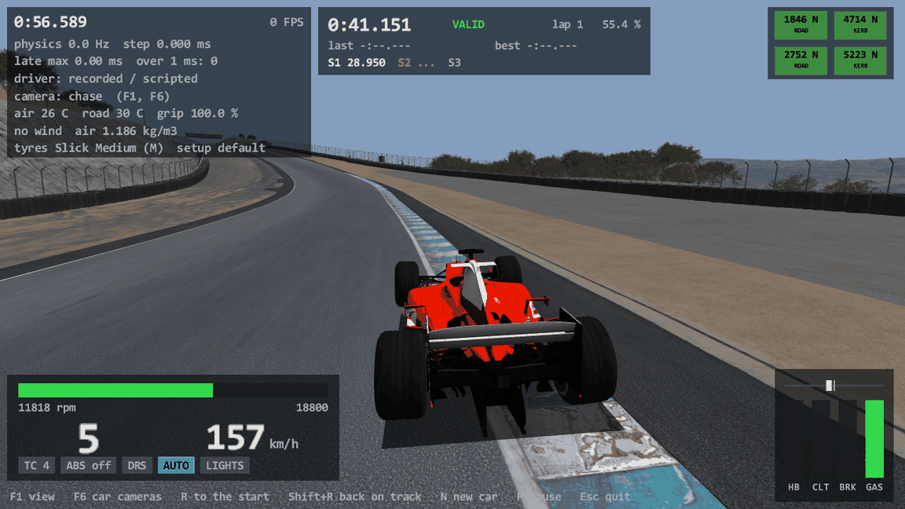
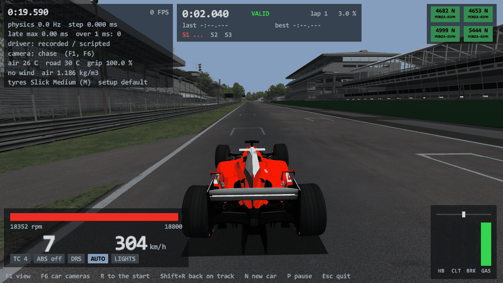
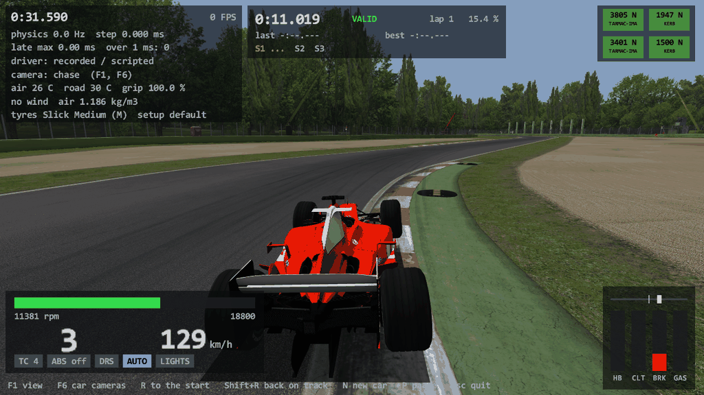
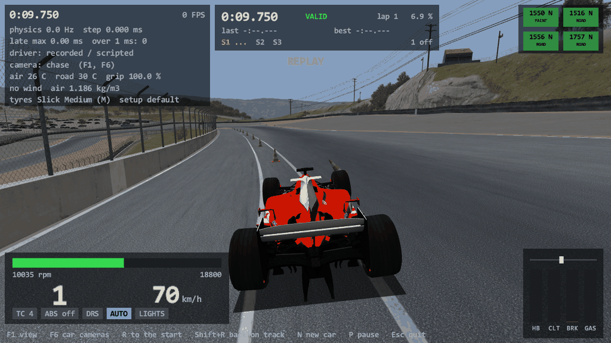

# Task 18: every track and layout

## Resume here

State after the last commit (kept up to date with every commit):

- **Done.** Everything is on `master`, nothing is pushed. The version is 0.18.0 and the tag `v0.18.0` is on the last commit. Nothing is half done.
- What exists: track lookup and refusals (`crates/rustyac-physics/src/track/catalog.rs`), the loader's new parts
  (`track/loader.rs`: `ROTATION`, missing models, loose objects), the AI line's grid builder (`track/spline.rs`),
  the ray modes (`crates/rustyac-ode/src/collision.rs`), loose objects in the car's world
  (`car/body.rs`: `create_track_object`, `step_track_objects`, `reset_track_objects`), the game side
  (`crates/rustyac-game`: `--track` by name, `--layout`, `--list-tracks`, objects in the picture, the `objects
  home` event), the oracle (`tools/car_oracle/src/{track,track_driver,game}.rs`: `--layout`, the game's own
  `PhysicsObject`s, the scenarios `trk_lap`, `trk_kerb_strike`, `trk_run`, `trk_run_full`, `trk_object`,
  `trk_green_lap`, `rays --space0 / --late`), the comparison (`tools/chassis_compare`: `track_layout`,
  `track_objects`, the object table, `excerpt18`) and two tools (`track_survey.exe`, `track_info.exe`).
- Checks to run again: section 10. All pass at the last commit.
- The big recordings (`oracle/t18*_*/*.carrec`, up to 0.9 GB each) were **deleted** after each comparison. What
  stays on disk (git-ignored): the result tables `oracle/chassis/results_t18*_*.md`, the ray results
  `oracle/track/rays_*.md`, the input files `oracle/game/t18*_*.ryin`. Committed: two golden excerpts
  (`crates/rustyac-physics/tests/golden/track_magione_*.chgold`) and four pictures (`docs/port/tracks_*.png`).
- Scratch of this task (git-ignored): `re/scratch/task18/` (`spec_*.md` are the three briefs read from the
  machine code, `review_code.md` and `doc_refresh.md` what the two reading passes found, `patch_*.py` the patch
  scripts, `batch*.sh`, `rays_all.sh`, `tables.py`, `rays_table.py`, `perf.ps1`, `fill_report.py` the helpers
  that made the tables of this report).
- Section 8 is the list of what is still missing; section 9 the choices made without asking.

## 1. Plain-English summary

**Every track and layout that plain Assetto Corsa can load now loads in rustyAC, drives, and times laps, and
on every one that was tested the car does exactly what the game's car does, to the last bit.**

Your game folder has 23 track folders with 54 entries in the track menu (a track without layouts is one
entry, a track with layouts one per layout). **44 of them load and drive. 10 are refused with the reason**:
five are menu entries of tracks you do not own (Barcelona and Brands Hatch: only their menu pictures are
installed), five are the "FA 2026" mod layouts, which only Custom Shaders Patch can read (section 6).

What you can do now that you could not before:

- **Pick any track by name**: `--track laguna`, `--track "Laguna Seca"` or `--track ks_laguna_seca` all work. A
  name that fits two tracks, a track that is not there, or one that is refused gives a clear message.
- **Pick a layout**: `--track ks_nurburgring --layout layout_sprint_a`. Without `--layout` the layout of your
  last session in the game is taken when it was on the same track (race.ini's `CONFIG_TRACK`), else the
  track's first layout. `--list-tracks` prints every track and layout with the command that drives it.
- **Knock over cones.** 13 of your tracks have loose objects (282 in all: cones, marker boards, Laguna Seca's
  distance boards). They are now in the world as in the game: asleep until the car's body hits them, then they
  fly, tumble, land and come to rest. `R` (back to the start) puts them back, as a new session does in the game.
- **Drive point-to-point tracks** (the Trento-Bondone hill climb, the Nordschleife tourist layout): the clock
  starts at the start gate and the run is listed when you pass the finish gate.

What was built or finished (the details are in section 4):

- Layouts: each layout's own model list, surfaces, AI line and DRS zones, found the way `acs.exe` finds them.
- The gaps the Spa task left in the track loader: a model turned by `ROTATION`, a model file that is missing,
  AI lines older than version 7, the search grid the game builds for an AI line that has none, the "ray without
  an end", meshes that sit directly in the top collision space, and meshes added after the first ray was cast.
- Loose objects, from the file to the solver to the picture.
- The oracle (the test program that runs the game's own code) learned layouts, loose objects, point-to-point
  gates, whole laps, and three odd ways of building a track that only exist to test the ray code.

What was proven (section 5):

- **The rays, on every track.** 200,000 rays on each of the 44 layouts, cast by the game's own code and by the
  port: **8,800,000 rays, every answer identical**. 17,487 of the 17,504 physical meshes
  of all layouts together were hit at least once, and the game's surface for every mesh name is the port's.
- **The car, on every one of the 44 layouts.** The game's car was driven by a script, and the Rust car was
  given only the pedals and the wheel:
  - on the test set (Monza, Imola, Laguna Seca, Magione, two layouts of the Nürburgring, the Trento-Bondone
    hill climb) with the Ferrari F2004 and the BMW M3 E30: a launch and a whole timed lap (on the hill climb
    a timed run), a kerb taken far too fast, a drive into a loose object, and flat out down the pit lane;
  - on every other layout with the F2004: a launch and a whole lap, timed by the game (every lap was counted
    but one: on the longest layout, the Nordschleife's 25 km endurance one, the script's eight minutes ran
    out 300 m before the line); on the two tracks without laps a short drive by the clock (the Drift track
    has no racing line, the drag strips are one straight); and beyond that, with the F2004: Spa again, now with its six loose objects in the world (two of the old wall and kerb drives and an object hit), an object with a scaled node at Monza 1966, the jump run on the Nordschleife's tourist layout, and a lap of Imola in other weather on a green track.

  **2,752,168 steps in 89 drives: zero differences**, in every number of the car, every
  tyre ray, the lap and sector times, every contact, and the position, rotation and speed of every loose
  object. (One number of the game is left out on the drag strips, because the game itself reads it from
  memory that is not its own: point 6 below.)
- **The program.** `rustyac.exe` replayed 86 of those drives on its own and got the same states
  every time (the other three have a jump in them, which a replay file cannot hold).
- **A second track in the tests.** Two short excerpts of the F2004 on Magione (the end of a lap with the
  game's lap time, and a kerb strike with the floor on the kerb) are now part of `cargo test` (they print NOT
  TESTED without the game's folder).

Six things that were not expected:

1. **A loose object weighs 1 kg and spins like a 1 m cube, whatever it is.** The game gives every cone and
   every board the same mass and the same inertia; only its shape (its own little mesh) differs. And the tyres
   do not feel them at all: only the car's body does, so a wheel drives through a cone.
2. **The "FA 2026" layouts cannot run without Custom Shaders Patch.** Their `surfaces.ini` has
   `WAV_PITCH=extended-0`, which plain `acs.exe` cannot read as a number; it stops there. rustyAC refuses them
   and says so.
3. **The order in which the game's sort leaves equal numbers matters.** The search grid of an AI line holds
   the ten nearest points of each 10 m cell, and points at the same distance are common. Only the exact sort
   routine of the game's compiler puts them in the game's order; an ordinary sort gets one cell in 300 wrong.
   The port now builds grids identical to the ones stored in the game's own files (checked cell by cell).
4. **Nothing in the game takes you back to the start of a hill climb.** At the finish gate the run is listed
   and the clock stops at zero until you pass the start gate again. Getting back is the player's business (in
   rustyAC: `R`).
5. **One brief read the machine code wrong, and the test caught it.** For meshes added after the first ray the
   first reading said "the new mesh can hide behind an old box". The micro-oracle showed 11 rays in 200,000
   that the game answered differently, the disassembly was read again, and the real rule is simpler: the group
   that got the new mesh is asked first from then on.
6. **On a drag strip the game shows a sector time that is not a time.** A drag strip has one timing line.
   When the car crosses it the game takes "the first sector's time" from the second entry of a list that has
   only one: it reads whatever lies behind the list in memory (in one drive: the bits of the number 0.1).
   Lap time and everything in the car are right; only that one display number is garbage, in the game itself.
   The port has 0 there, and the comparison leaves that one value out on one-line tracks.

What is not there: other cars on the track, the pit stop, and Custom Shaders Patch. The scripted test driver
cannot finish the Trento-Bondone climb in the F2004 (a narrow road and a simple driver hit a wall after
32 s); its run there was tested with a jump from 40 s in to just before the finish. The E30, driven more slowly, did the whole climb: 17.1 km through both gates, 320,118 steps, the game's own run time 15:53.922, and not one difference (`rustyac.exe` replayed that one too).

## 2. How to drive a track

Build once, then run from the repository folder:

```
cargo build --release -p rustyac-game
target\release\rustyac.exe --list-tracks
```

`--list-tracks` prints one line per track and layout, already written as the options to use, and the refused
ones with their reason. The tracks of the test set:

| Track | Command |
|---|---|
| Monza | `target\release\rustyac.exe --track monza --windowed` |
| Imola | `target\release\rustyac.exe --track imola --windowed` |
| Laguna Seca | `target\release\rustyac.exe --track ks_laguna_seca --windowed` (or `--track laguna`) |
| Magione | `target\release\rustyac.exe --track magione --windowed` |
| Nürburgring GP | `target\release\rustyac.exe --track ks_nurburgring --layout layout_gp_a --windowed` |
| Nürburgring Sprint | `target\release\rustyac.exe --track ks_nurburgring --layout layout_sprint_a --windowed` |
| Trento-Bondone (hill climb) | `target\release\rustyac.exe --track trento-bondone --windowed` |
| Nordschleife, tourist layout (point to point) | `target\release\rustyac.exe --track ks_nordschleife --layout touristenfahrten --windowed` |
| Spa | `target\release\rustyac.exe --track spa --windowed` |

Add `--car bmw_m3_e30` (or any other car folder name) for another car, `--autodrive` to watch the simple
built-in driver, `--spawn pit` or `--spawn start` to start somewhere else. Everything of
`docs/port/track.md` section 2 (keys, HUD) still holds. New or changed:

| Option / key | Does |
|---|---|
| `--track <name>` | the folder's name (`ks_laguna_seca`), the name the game's menu shows (`"Laguna Seca"`), or a part of either that fits one track only (`laguna`); a folder path still works |
| `--layout <name>` | the layout (`layout_gp_a`); a part that fits one layout works too (`sprint_a`). Without it: the layout of race.ini when its track is this one, else the first layout that can be driven (a line says which) |
| `--list-tracks` | every track and layout with its command, and the refused ones with the reason |
| `R` | back to the start as before, and now the track's loose objects go back to their places too |
| `N` | a new car as before; now also a new session for the track's grip: the part of the laps' gain that race.ini's `SESSION_TRANSFER` says is kept |

On a point-to-point track the lap panel shows the run: the clock stands at zero until the start gate, runs
until the finish gate, the run is then listed as a lap, and the clock stays at zero until you are back
through the start gate (`R` takes you to the start).

Pictures drawn off screen by the program itself (`--autodrive --screenshot <png> --at <seconds>`):









`tracks_laguna_seca.png` (the Corkscrew, 58 s into the drive), `tracks_monza.png` (the main straight at
304 km/h), `tracks_imola.png` (on the kerb at 129 km/h) and `tracks_laguna_cone.png` (the replay of the
loose-object drive, a quarter of a second after the car's nose hit the cone at the right).

## 3. The survey

`target\release\track_survey.exe` loads every entry the way the game does and prints this table. "By" is
Kunos unless the menu file names another author or the layout has a Custom Shaders Patch `extension` folder.
Surfaces are the physical meshes per surface `KEY` of `surfaces.ini`. Timing lines are the lap and sector
lines (`AC_TIME_n`); a point-to-point track has a start and a finish gate on top (`AC_AB_...`). No installed
kn5 is encrypted, no track keeps its data in an archive, no node rotation comes from Euler angles (the game's
kn5 loader never builds one: the only Euler rotation is `ROTATION` of the models file), and no mesh sits in
sub-space 0.

| Track / layout | By | kn5 files / size | Physics meshes | Surfaces (meshes per `KEY`) | Spawn sets | Timing lines | AI line | Pit boxes | Loose objects | DRS zones | Unusual |
|---|---|---|---|---|---|---|---|---|---|---|---|
| `drift` | Kunos | 1 / 179 MB | 64 (57074 tris, 9 spaces) | GRASS 39, KERB 9, ROAD 8, WALL 8 | HOTLAP_START 1, PIT 18, START 2 | 2 | v3, no points | 18 | 0 | 0 | no AI line |
| `imola` | Kunos | 4 / 398 MB | 375 (512096 tris, 35 spaces) | CARPET 13, CONCRETE 4, CUTCONC 5, CUTGRA 1, GRASS 32, KERB 35, KRB2CUT 5, KRBCUT 1, OUT 1, PITS-IMA 7, ROAD 20, SAND 37, TARMAC-IMA 82, TARMAC-IMB 43, WALL 89 | HOTLAP_START 1, PIT 24, START 24 | 3 | v7, 3166 points, 4864 m; pit lane line | 24 | 0 | 1 |  |
| `ks_barcelona / layout_gp` | Kunos | | | | | | | | | | **refused**: not installed: models_layout_gp.ini is missing: only the menu entry of a layout that is not owned (a DLC) |
| `ks_barcelona / layout_moto` | Kunos | | | | | | | | | | **refused**: not installed: models_layout_moto.ini is missing: only the menu entry of a layout that is not owned (a DLC) |
| `ks_barcelona / layout_moto_fa_2026` | Kunos | | | | | | | | | | **refused**: not installed: none of its 9 model files is there (1.kn5 ...): the track it is a layout of is not installed |
| `ks_black_cat_county / layout_int` | Kunos | 5 / 463 MB | 593 (434049 tris, 97 spaces) | CUT 4, OFF 105, OLD 6, PITS 2, ROAD 226, WALL 250 | HOTLAP_START 1, PIT 24, START 24 | 3 | v7, 4192 points, 6420 m; pit lane line | 24 | 3 | 0 |  |
| `ks_black_cat_county / layout_long` | Kunos | 5 / 463 MB | 594 (434083 tris, 97 spaces) | CUT 4, OFF 105, OLD 6, PITS 2, ROAD 226, WALL 251 | HOTLAP_START 1, PIT 24, START 24 | 3 | v7, 7284 points, 11177 m; pit lane line | 24 | 3 | 0 |  |
| `ks_black_cat_county / layout_short` | Kunos | 5 / 462 MB | 594 (434191 tris, 97 spaces) | CUT 4, OFF 105, OLD 6, PITS 2, ROAD 226, WALL 251 | HOTLAP_START 1, PIT 24, START 24 | 3 | v7, 4213 points, 6453 m; pit lane line | 24 | 3 | 0 |  |
| `ks_brands_hatch / gp` | Kunos | | | | | | | | | | **refused**: not installed: models_gp.ini is missing: only the menu entry of a layout that is not owned (a DLC) |
| `ks_brands_hatch / indy` | Kunos | | | | | | | | | | **refused**: not installed: models_indy.ini is missing: only the menu entry of a layout that is not owned (a DLC) |
| `ks_drag / drag1000` | Kunos | 3 / 148 MB | 28 (52518 tris, 7 spaces) | ROAD 25, START 1, WALL 2 | HOTLAP_START 1, PIT 2, START 2 | 1 | v7, 1539 points, 2469 m; pit lane line | 2 | 0 | 0 |  |
| `ks_drag / drag200` | Kunos | 3 / 148 MB | 28 (52518 tris, 7 spaces) | ROAD 25, START 1, WALL 2 | HOTLAP_START 1, PIT 2, START 2 | 1 | v7, 1539 points, 2469 m; pit lane line | 2 | 0 | 0 |  |
| `ks_drag / drag2000` | Kunos | 3 / 148 MB | 28 (52518 tris, 7 spaces) | ROAD 25, START 1, WALL 2 | HOTLAP_START 1, PIT 2, START 2 | 1 | v7, 1539 points, 2469 m; pit lane line | 2 | 0 | 0 |  |
| `ks_drag / drag400` | Kunos | 3 / 148 MB | 28 (52518 tris, 7 spaces) | ROAD 25, START 1, WALL 2 | HOTLAP_START 1, PIT 2, START 2 | 1 | v7, 1539 points, 2469 m; pit lane line | 2 | 0 | 0 |  |
| `ks_drag / drag500` | Kunos | 3 / 148 MB | 28 (52518 tris, 7 spaces) | ROAD 25, START 1, WALL 2 | HOTLAP_START 1, PIT 2, START 2 | 1 | v7, 1539 points, 2469 m; pit lane line | 2 | 0 | 0 |  |
| `ks_highlands / layout_drift` | Kunos | 10 / 586 MB | 250 (516171 tris, 99 spaces) | CONCRETE 7, GRASS 31, KERB 2, PAVE 27, PITCONC 1, PITPAV 7, ROAD 105, WALL 70 | HOTLAP_START 1, PIT 24, START 24 | 3 | v7, 3386 points, 5164 m; pit lane line | 24 | 0 | 1 | `ROTATION` on 1 model(s) |
| `ks_highlands / layout_int` | Kunos | 10 / 721 MB | 250 (516219 tris, 99 spaces) | CONCRETE 7, GRASS 31, KERB 2, PAVE 27, PITCONC 1, PITPAV 7, ROAD 105, WALL 70 | HOTLAP_START 1, PIT 24, START 24 | 2 | v7, 5336 points, 8150 m; pit lane line | 24 | 0 | 1 | `ROTATION` on 1 model(s) |
| `ks_highlands / layout_long` | Kunos | 10 / 868 MB | 252 (516297 tris, 99 spaces) | CONCRETE 7, GRASS 31, KERB 2, PAVE 27, PITCONC 1, PITPAV 7, ROAD 105, WALL 72 | HOTLAP_START 1, PIT 24, START 24 | 3 | v7, 7718 points, 12177 m; pit lane line | 24 | 0 | 1 | `ROTATION` on 1 model(s) |
| `ks_highlands / layout_short` | Kunos | 9 / 490 MB | 251 (516163 tris, 99 spaces) | CONCRETE 7, GRASS 31, KERB 2, PAVE 27, PITCONC 1, PITPAV 7, ROAD 105, WALL 71 | HOTLAP_START 1, PIT 24, START 24 | 3 | v7, 1100 points, 1709 m; pit lane line | 24 | 0 | 1 | `ROTATION` on 1 model(s) |
| `ks_laguna_seca` | Kunos | 10 / 804 MB | 244 (358516 tris, 27 spaces) | ASPHNEW 3, CNCGREEN 2, CNCPTS 2, CONCRETE 20, CURB 5, CUTGRV 8, DRAIN 5, GRAVEL 11, KERB 10, PAINT 4, PITS 3, RCVTP 1, RDOLD 1, ROAD 139, SAND 11, WALL 19 | HOTLAP_START 1, PIT 24, START 24 | 3 | v7, 2331 points, 3559 m; pit lane line | 24 | 33 | 1 |  |
| `ks_monza66 / full` | Kunos | 8 / 605 MB | 241 (365616 tris, 23 spaces) | GRASS 35, KERB 5, OUT 1, PIT-MNZHIST 2, ROAD 22, SAND 1, TARMHIST 52, WALL 123 | HOTLAP_START 1, PIT 25, START 25 | 3 | v7, 6478 points, 10020 m; pit lane line | 25 | 13 | 0 | 12 loose objects with a scaled node; 2 starting bound(s) |
| `ks_monza66 / junior` | Kunos | 7 / 479 MB | 175 (231669 tris, 23 spaces) | GRASS 21, KERB 4, OUT 1, PIT-MNZHIST 2, SAND 1, TARMHIST 52, WALL 94 | HOTLAP_START 1, PIT 25, START 25 | 3 | v7, 1566 points, 2396 m; pit lane line | 25 | 13 | 0 | 12 loose objects with a scaled node |
| `ks_monza66 / road` | Kunos | 8 / 505 MB | 175 (231649 tris, 23 spaces) | GRASS 21, KERB 4, OUT 1, PIT-MNZHIST 2, SAND 1, TARMHIST 52, WALL 94 | HOTLAP_START 1, PIT 25, START 25 | 3 | v7, 3728 points, 5759 m; pit lane line | 25 | 13 | 0 | 12 loose objects with a scaled node |
| `ks_nordschleife / endurance` | Kunos | 17 / 915 MB | 1687 (1298233 tris, 146 spaces) | ASPH-NURB 136, CARPET 13, CNC-KLN 2, CNC-KRS 11, CONCRETE 18, CRB 1, CURB 162, CUTGRA 13, CUTKRB 6, GRASS 184, GRS-CUT-B 2, KERB 65, OUT 6, PAINT 1, PITS 7, PTRMBL 1, ROAD 67, SAND 26, TRM-NRM 753, WALL 213 | HOTLAP_START 1, PIT 24, START 24 | 3 | v7, 16401 points, 25358 m; pit lane line | 24 | 35 | 1 | `ROTATION` on 1 model(s) |
| `ks_nordschleife / endurance_cup` | Kunos | 17 / 865 MB | 1686 (1298279 tris, 146 spaces) | ASPH-NURB 136, CARPET 13, CNC-KLN 2, CNC-KRS 11, CONCRETE 18, CRB 1, CURB 162, CUTGRA 13, CUTKRB 6, GRASS 184, GRS-CUT-B 2, KERB 65, OUT 9, PAINT 1, PITS 7, PTRMBL 1, ROAD 66, SAND 26, TRM-NRM 753, WALL 210 | HOTLAP_START 1, PIT 24, START 24 | 3 | v7, 15374 points, 24316 m; pit lane line | 24 | 25 | 1 | `ROTATION` on 1 model(s) |
| `ks_nordschleife / nordschleife` | Kunos | 12 / 723 MB | 1315 (823668 tris, 146 spaces) | CARPET 1, CNC-KLN 2, CNC-KRS 11, CONCRETE 3, CRB 1, CURB 149, CUTGRA 13, GRASS 147, PITS 3, PTRMBL 1, ROAD 29, SAND 6, TRM-NRM 753, WALL 196 | HOTLAP_START 1, PIT 24, START 24 | 3 | v7, 13323 points, 20801 m; pit lane line | 24 | 14 | 1 |  |
| `ks_nordschleife / touristenfahrten` | Kunos | 10 / 712 MB | 1318 (840531 tris, 146 spaces) | CARPET 1, CNC-KLN 2, CNC-KRS 11, CONCRETE 3, CRB 1, CURB 150, CUTGRA 13, GRASS 148, PITS 4, PTRMBL 1, ROAD 29, SAND 6, TRM-NRM 752, WALL 197 | HOTLAP_START 1, PIT 32 | 0 + A to B: **point-to-point** | v7, 13323 points, 20801 m; pit lane line | 32 | 14 | 1 |  |
| `ks_nurburgring / layout_gp_a` | Kunos | 8 / 463 MB | 368 (474765 tris, 43 spaces) | ASPH-NURB 135, CARPET 12, CONCRETE 15, CURB 13, CUTKRB 6, GRASS 37, GRS-CUT-B 2, KERB 63, OUT 10, PAINT 1, PITS 4, ROAD 36, SAND 20, TRM-CUT-A 1, WALL 13 | HOTLAP_START 1, PIT 24, START 24 | 3 | v7, 3307 points, 5078 m; pit lane line | 24 | 21 | 2 | `ROTATION` on 1 model(s) |
| `ks_nurburgring / layout_gp_b` | Kunos | 8 / 478 MB | 370 (474929 tris, 43 spaces) | ASPH-NURB 136, CARPET 12, CONCRETE 15, CURB 13, CUTKRB 6, GRASS 37, GRS-CUT-B 2, KERB 65, OUT 10, PAINT 1, PITS 4, ROAD 36, SAND 20, WALL 13 | HOTLAP_START 1, PIT 24, START 24 | 3 | v7, 3321 points, 5067 m; pit lane line | 24 | 23 | 2 | `ROTATION` on 1 model(s) |
| `ks_nurburgring / layout_sprint_a` | Kunos | 8 / 452 MB | 366 (474861 tris, 43 spaces) | ASPH-NURB 135, CARPET 12, CONCRETE 15, CURB 13, CUTKRB 6, GRASS 37, GRS-CUT-B 2, KERB 63, OUT 10, PAINT 1, PITS 4, ROAD 36, SAND 20, TRM-CUT-A 1, WALL 11 | HOTLAP_START 1, PIT 24, START 24 | 2 | v7, 2325 points, 3567 m; pit lane line | 24 | 21 | 2 | `ROTATION` on 1 model(s) |
| `ks_nurburgring / layout_sprint_b` | Kunos | 8 / 468 MB | 368 (475025 tris, 43 spaces) | ASPH-NURB 136, CARPET 12, CONCRETE 15, CURB 13, CUTKRB 6, GRASS 37, GRS-CUT-B 2, KERB 65, OUT 10, PAINT 1, PITS 4, ROAD 36, SAND 20, WALL 11 | HOTLAP_START 1, PIT 24, START 24 | 2 | v7, 2330 points, 3560 m; pit lane line | 24 | 23 | 2 | `ROTATION` on 1 model(s) |
| `ks_red_bull_ring / layout_gp` | Kunos | 10 / 504 MB | 367 (424660 tris, 27 spaces) | ASPMID 35, ASPOLD 12, ASPRBRING 128, BUMP 3, CONCRETE 31, CURB 17, CUT 2, GRASS 21, GRILLE 17, GRL_PT 8, GRSPTS 1, KERB 19, PAINT 4, PITS 17, ROAD 6, RUMBLE 10, SAND 12, WALL 24 | HOTLAP_START 1, PIT 24, START 24 | 3 | v7, 2811 points, 4287 m; pit lane line | 24 | 11 | 2 |  |
| `ks_red_bull_ring / layout_gp_fa_2026` | Kunos | | | | | | | | | | **refused**: made for Custom Shaders Patch only (rustyAC is plain Assetto Corsa): acs.exe cannot read its data/surfaces.ini ([SURFACE_0] WAV_PITCH=extended-0: invalid stof argument) and would stop there |
| `ks_red_bull_ring / layout_national` | Kunos | 10 / 500 MB | 368 (424706 tris, 27 spaces) | ASPMID 35, ASPOLD 12, ASPRBRING 128, BUMP 3, CONCRETE 31, CURB 17, CUT 2, GRASS 21, GRILLE 17, GRL_PT 8, GRSPTS 1, KERB 19, PAINT 4, PITS 17, ROAD 6, RUMBLE 10, SAND 12, WALL 25 | HOTLAP_START 1, PIT 24, START 24 | 2 | v7, 1478 points, 2317 m; pit lane line | 24 | 11 | 1 |  |
| `ks_silverstone / gp` | Kunos | 10 / 580 MB | 435 (627568 tris, 36 spaces) | BUMP 4, CARPET 15, CONCOUU 2, CRB-CUT-B 1, CURB 7, GRASS 49, GRS-CUT-A 1, GRS-CUT-B 4, KERB 78, OUT 36, PIT-SILV 6, SAND 26, TARMSIL_A_ 91, TARMSIL_B_ 35, TRM-CUT-B 2, WALL 78 | HOTLAP_START 1, PIT 24, START 24 | 3 | v7, 3870 points, 5804 m; pit lane line | 24 | 24 | 2 | 7 loose objects with a scaled node |
| `ks_silverstone / gp_fa_2026` | Kunos | | | | | | | | | | **refused**: made for Custom Shaders Patch only (rustyAC is plain Assetto Corsa): acs.exe cannot read its data/surfaces.ini ([SURFACE_0] WAV_PITCH=extended-0: invalid stof argument) and would stop there |
| `ks_silverstone / international` | Kunos | 9 / 580 MB | 439 (635146 tris, 36 spaces) | BUMP 4, CARPET 15, CONCOUU 2, CRB-CUT-B 1, CURB 7, GRASS 50, GRS-CUT-A 1, GRS-CUT-B 4, KERB 79, OUT 37, PIT-SILV 6, SAND 26, TARMSIL_A_ 93, TARMSIL_B_ 35, TRM-CUT-B 2, WALL 77 | HOTLAP_START 1, PIT 24, START 24 | 2 | v7, 1924 points, 2945 m; pit lane line | 24 | 26 | 1 | 7 loose objects with a scaled node |
| `ks_silverstone / national` | Kunos | 8 / 543 MB | 425 (626410 tris, 36 spaces) | BUMP 4, CARPET 15, CRB-CUT-B 1, CURB 7, GRASS 48, GRS-CUT-A 1, GRS-CUT-B 4, KERB 78, OUT 29, PIT-SILV 11, SAND 26, TARMSIL_A_ 90, TARMSIL_B_ 35, TRM-CUT-B 2, WALL 74 | HOTLAP_START 1, PIT 24, START 24 | 2 | v7, 1630 points, 2600 m; pit lane line | 24 | 25 | 1 | 7 loose objects with a scaled node |
| `ks_silverstone1967` | Kunos | 6 / 429 MB | 236 (395214 tris, 34 spaces) | ASPH_SILV 137, CONCRETE 1, GRASS 36, OUT 24, PITS_SILV 1, ROAD 3, WALL 34 | HOTLAP_START 1, PIT 20, START 20 | 3 | v7, 3066 points, 4746 m; pit lane line | 20 | 41 | 0 |  |
| `ks_vallelunga / classic_circuit` | Kunos | 4 / 434 MB | 318 (169193 tris, 26 spaces) | CARPET 1, CONCRETE 26, CURB 16, GRASS 19, GRS-CUT-A 4, KERB 18, OUT 2, PITS-VAL 3, ROAD 143, SAND 17, WALL 69 | HOTLAP_START 1, PIT 24, START 24 | 3 | v7, 2030 points, 3180 m; pit lane line | 24 | 14 | 1 |  |
| `ks_vallelunga / club_circuit` | Kunos | 4 / 429 MB | 316 (168971 tris, 26 spaces) | CARPET 1, CONCRETE 26, CURB 16, GRASS 19, GRS-CUT-A 4, KERB 18, OUT 2, PITS-VAL 3, ROAD 143, SAND 17, WALL 67 | HOTLAP_START 1, PIT 24, START 24 | 2 | v7, 1092 points, 1720 m; pit lane line | 24 | 10 | 1 |  |
| `ks_vallelunga / extended_circuit` | Kunos | 4 / 434 MB | 316 (169099 tris, 26 spaces) | CARPET 1, CONCRETE 26, CURB 16, GRASS 19, GRS-CUT-A 4, KERB 18, OUT 2, PITS-VAL 3, ROAD 143, SAND 17, WALL 67 | HOTLAP_START 1, PIT 24, START 24 | 3 | v7, 2614 points, 4031 m; pit lane line | 24 | 6 | 1 |  |
| `ks_zandvoort` | Kunos | 4 / 419 MB | 164 (157562 tris, 20 spaces) | CURB 17, GRASS 20, GRAVEL 1, KERB 9, OUT 19, PAINT 1, PITS 3, SAND 13, TRAV 7, TRM-ZNDV 18, WALL 56 | HOTLAP_START 1, PIT 18, START 18 | 2 | v7, 2695 points, 4190 m; pit lane line | 18 | 8 | 2 |  |
| `magione` | Kunos | 2 / 304 MB | 292 (367952 tris, 18 spaces) | CONCRETE 5, CURB 13, CUT 2, GRASS 29, KERB 9, OUT 11, PEN-GRS-A 1, PEN-GRS-B 1, PITLANE 3, ROAD 2, SAND 7, TARMACA 51, TARMACB 18, TARMACC 29, TARMACD 11, TARMACE 20, WALL 80 | HOTLAP_START 1, PIT 18, START 18 | 2 | v7, 1754 points, 2456 m; pit lane line | 18 | 0 | 1 |  |
| `montreal` | mod | 5 / 296 MB | 223 (78952 tris, 14 spaces) | CUT 5, GRASS 61, KERB 32, PITS 12, ROAD 110, SAND 2, WALL 1 | HOTLAP_START 1, PIT 40, START 40 | 3 | v7, 2728 points, 4288 m; pit lane line | 40 | 0 | 0 | has `side_l/r.csv` (older than the AI line: not used) |
| `montreal / montreal_fa_2026` | mod | | | | | | | | | | **refused**: made for Custom Shaders Patch only (rustyAC is plain Assetto Corsa): acs.exe cannot read its data/surfaces.ini ([SURFACE_0] WAV_PITCH=extended-0: invalid stof argument) and would stop there |
| `monza` | Kunos | 7 / 427 MB | 328 (447783 tris, 27 spaces) | CARPET 6, CNC_OU 1, CONCRETE 21, CURB 27, GRASS 18, GRILL 1, ILLCONC 4, KERB 9, MONZA-ASPH 89, OUT 14, PEN-ASPH-A 1, PEN-ASPH-B 1, PEN-ASPH-C 1, PEN-ASPH-D 1, PEN-CNC-A 2, PEN-CNC-D 1, PEN-GRS-B 2, PEN-GRS-D 1, PITS-MNZ 4, ROAD 24, SAND 11, TARM_OU 1, WALL 88 | HOTLAP_START 1, PIT 26, START 26, TIME_ATTACK 1 | 3 | v7, 3750 points, 5759 m; pit lane line | 26 | 20 | 2 |  |
| `monza / monza_fa_2026` | mod | | | | | | | | | | **refused**: made for Custom Shaders Patch only (rustyAC is plain Assetto Corsa): acs.exe cannot read its data/surfaces.ini ([SURFACE_0] WAV_PITCH=extended-0: invalid stof argument) and would stop there |
| `mugello` | Kunos | 4 / 379 MB | 555 (478334 tris, 38 spaces) | CARPET 13, CONCRETE 19, CURB 19, CUTRD 1, GRASS 19, GRS-CUT 1, KERB 66, OUT 17, PITS-MUG 2, ROAD 4, SAND 18, TARMAC-MUG-A 163, WALL 213 | HOTLAP_START 1, PIT 24, START 24 | 3 | v7, 3374 points, 5197 m; pit lane line | 24 | 8 | 1 |  |
| `spa` | Kunos | 6 / 505 MB | 455 (588295 tris, 45 spaces) | ASPH-CUT-B 3, ASPH-SPA_BLACK 138, ASPH-SPA_BLUE 11, ASPH-SPA_GREEN 9, ASPH-SPA_RED 11, ASPH-SPA_VIOLET 9, BLOCK-CONCR 8, CARPET 15, CONCRETE 26, CRP-CUT-A 1, CRP-CUT-B 1, CURB 19, GRASS 30, GRILLE 27, GRS-CUT-A 1, GRS-CUT-B 2, KERB 14, OUT 25, PITSPA 10, SAND 7, WALL 88 | HOTLAP_START 1, PIT 24, START 24 | 3 | v7, 4470 points, 6946 m; pit lane line | 24 | 6 | 2 |  |
| `spa / spa_fa_2026` | mod | | | | | | | | | | **refused**: made for Custom Shaders Patch only (rustyAC is plain Assetto Corsa): acs.exe cannot read its data/surfaces.ini ([SURFACE_0] WAV_PITCH=extended-0: invalid stof argument) and would stop there |
| `trento-bondone` | Kunos | 1 / 179 MB | 317 (1376338 tris, 163 spaces) | CONCRETE 21, GRASS 82, TRM-TN-A 24, TRM-TN-B 33, TRM-TN-C 74, WALL 83 | HOTLAP_START 1, PIT 4, START 4 | 1 + A to B: **point-to-point** | v7, 11082 points, 17184 m; pit lane line | 4 | 0 | 0 |  |
| `vhe_interlagos / gp` | mod | 11 / 408 MB | 137 (121699 tris, 2 spaces) | CARPET 1, CURB 3, GRASS 1, KERB 3, OUTER 17, PITLANE 3, ROAD 6, SAND 1, WALL 102 | HOTLAP_START 1, PIT 23, START 23 | 3 | v7, 2680 points, 4225 m; pit lane line | 23 | 0 | 2 | has a CSP `extension` folder (ignored); CSP `.vao-patch` files (ignored); has `side_l/r.csv` (older than the AI line: not used) |
| `vhe_interlagos / norm` | mod | 11 / 398 MB | 137 (121699 tris, 2 spaces) | CARPET 1, CURB 3, GRASS 1, KERB 3, OUTER 17, PITLANE 3, ROAD 6, SAND 1, WALL 102 | HOTLAP_START 1, PIT 23, START 23 | 3 | v7, 2680 points, 4225 m; pit lane line | 23 | 0 | 2 | has a CSP `extension` folder (ignored); CSP `.vao-patch` files (ignored); `side_l/r.csv` newer than the AI line: the game recomputes the track limits at load (not ported; here it gives the stored ones again) |

What is unusual, in words:

- **Layouts**: 12 of the 23 folders have layouts only, and three more (Montreal, Monza, Spa) have a mod
  layout next to the track itself. Each layout has its own `models_<layout>.ini`, `data` and `ai` folder; the
  kn5 files are shared between the layouts of a track.
- **Point to point**: `trento-bondone` and `ks_nordschleife / touristenfahrten` (start and finish gates). The
  five `ks_drag` layouts have one line only (the finish; the game's drag mode does its own timing).
- **Loose objects**: 13 folders, 282 objects. `ks_monza66` and `ks_silverstone` have objects whose node is
  scaled (the game's body ignores the scale).
- **No AI line**: `drift` (its file is version 3 with no points). **No pit lane grid**: every `pit_lane.ai`
  but the drag strip's stores no search grid (the game builds one and never searches it).
- **`ROTATION`**: only on models without physics (start lights and the like) on Highlands, the Nordschleife
  endurance layouts and the Nürburgring.
- **`side_l.csv` / `side_r.csv`**: `montreal` and `vhe_interlagos` have them. When they are newer than the AI
  line the game works the track limits out again at load and saves the line; by the file dates of this PC
  that is the case for `vhe_interlagos / norm` only, and there the game's own code, run in the oracle, wrote
  back a file that is byte for byte the one it read (section 8).
- **Mods**: `montreal` and `vhe_interlagos` load as plain tracks (their Custom Shaders Patch extras are
  ignored); the six `..._fa_2026` layouts do not (section 6).

The test set picked from it: Monza, Imola, Laguna Seca and Magione as asked; `ks_nurburgring` with two
layouts (`layout_gp_a`, `layout_sprint_a`) as the multi-layout track; `trento-bondone` as the point-to-point
track; Laguna Seca, Monza and the Nürburgring GP layout for the loose objects. Extra, with the F2004 only: `spa` (the old wall and kerb scenarios again, now with loose objects, and an object hit), `ks_monza66 / full` (an object with a scaled node), `ks_nordschleife / touristenfahrten` (the second point-to-point track) and `imola` again (a lap in other conditions). And, since there
was time: a lap (or a short drive) with the F2004 on every one of the other layouts.

## 4. What is ported

Addresses are of `acs.exe` 1.16.4. "Already there" means the code existed since Task 12 or 13 and was now
run against the game for the first time.

**Finding and refusing tracks (`crates/rustyac-physics/src/track/catalog.rs`; own work)**

The game has nothing like it: its launcher writes `[RACE] TRACK` and `CONFIG_TRACK` into race.ini and
`RaceManager::initOffline` 0x14013a6c0 hands them to `Sim::loadTrack` 0x14019a4c0. `catalog::installed`
lists the menu entries, `catalog::find` resolves what the user typed, `catalog::check` refuses what plain
Assetto Corsa cannot load (section 6).

**Layouts (`track/loader.rs`, `rustyac-content/src/track_files.rs`)**

| What | From |
|---|---|
| `content/tracks/<t>/models_<layout>.ini`, the data folder `content/tracks/<t>/<layout>/data` (surfaces, DRS zones, starting bounds), the AI folder `.../<layout>/ai`; without a layout `models.ini` or `<t>.kn5` and the folders in the track folder itself | `TrackAvatar::init3D` 0x1401c8740, `Track::Track` 0x140277100, `TrackAvatar::getDataFolder` 0x1401c8060, `DRSManager::DRSManager` 0x140278ea0 (already there; now run on 33 layouts) |
| `[MODEL_n]` up to the first missing number; `ROTATION` in degrees (heading about -Y, pitch, roll) turns the top node of the model, `POSITION` always replaces its translation; the physics vertices are never moved | `TrackAvatar::init3D`, `mat44f::createFromEuler` 0x140118ef0, `mat44f::createFromAxisAngle` 0x1400571a0, `DirectX::XMMatrixMultiply` 0x140056cf0 |
| A `MODEL_n` whose file is missing is left out (the game loads an empty node in its place and goes on); a track of which every model is missing is refused | `KN5IO::load` 0x1402151a0, `Model::load` 0x140217d30 |

**The AI line (`track/spline.rs`)**

| What | From |
|---|---|
| Files below version 7: the header is read; a line without points (the Drift track) is the game's empty line; one with points is refused with the reason (the game rebuilds such a line at load and saves it as version 7, with functions that were not read) | `AISpline::loadFast` 0x1402a83c0, `AISpline::loadVersion6` 0x1402a85b0, `AISplineRecorder::load` 0x1402952c0, `AISplineRecorder::save` 0x140296ae0 |
| The search grid for a version-7 line that stores none: 10 m cells over the line's extent plus 350 m, each with the ten points nearest to its middle seen from above | `InterpolatingSpline::loadGrid` 0x1401f31a0, `InterpolatingSpline::buildGrid` 0x1401ef980, `Spline::closestPointIndicesFlat` 0x1401edb00 |
| The sort that orders those points, move for move (Visual Studio 2013's `std::sort`: median of three or nine, three-way partition, insertion sort below 33 elements) | `std::_Sort` 0x1401ecaa0, `_Unguarded_partition` 0x1401ecc70, `_Median` 0x1401ec810, `_Insertion_sort1` 0x1401ec6a0 |
| A message when the side files are newer than the line (the game then recomputes the limits; not ported) | `AISplineRecorder::load` |

**Rays (`crates/rustyac-ode/src/collision.rs`, `geom.rs`)**

| What | From |
|---|---|
| The ray without an end: a length of exactly `f32::MAX` takes OPCODE's other walk (another box test, and no "nearer than the end" test on the triangle) | `RayCollider::Collide` 0x140366ed0, `RayCollider::InitQuery` 0x1403670b0, `RayCollider::_RayStab` 0x1403685f0 |
| A mesh with sub-space id 0 is a member of the static space itself, asked in its own place among the sub-spaces | `PhysicsCore::getStaticSubSpace` 0x1402ccac0, `dxSimpleSpace::collide2` 0x140342a60 |
| A mesh added after a ray: its sub-space, if it was clean, goes to the head of the static space's list and is asked first from then on | `dxSpace::add` 0x140342980 (it ends in `dGeomMoved` of the space), `dGeomMoved` 0x140342f80, `dxSpace::dirty` 0x140342e80, `dxSimpleSpace::cleanGeoms` 0x1403429d0 |

Nothing in `acs.exe` casts a ray of length `f32::MAX` (the lengths are 3, 2, 100, 10 and 5 m), no installed
track puts a mesh in sub-space 0 (it takes a wall mesh named `-10000...`), and the game makes every mesh
before its first ray. All three are in the port for whoever calls it another way, and are checked against
the game's code by the micro-oracle's own odd tracks (section 5.1).

**Point-to-point timing (`track/timing.rs`; already there)**

`TrackAvatar::initTimeLines` 0x1401cbc90 (the gates `AC_AB_START_L/R`, `AC_AB_FINISH_L/R`, the drag strips'
`AC_OPEN_FINISH_L/R`), `Track::addTimeLine` 0x140278040 (a start or finish gate makes the track "open" and
adds no sector), `TimeTransponder::step` 0x1402911f0 (open track: the start gate zeroes clock and cuts, the
finish gate counts the run as a valid lap, between runs the clock is held at zero), `TimeTransponder::isValid`
0x140290980 (always valid on an open track). The brief re-read all of it against the listing and found no
difference; it is now also compared with the game step by step (`trk_run`). How a run ends: at the finish
gate, with the lap list entry. The reset to the start: none in the game; `R` in `rustyac.exe`.

**Loose track objects**

| File | What | From |
|---|---|---|
| `track/loader.rs`, `track/mod.rs` (`TrackObjectDef`) | Which nodes: every node whose name starts with `AC_POBJECT`, in the order of the models and of each model's tree; it is an object when its first child is a mesh. Kept: the node's own matrix and that mesh's vertices and triangles as stored | `TrackAvatar::TrackAvatar` 0x1401c5250 (its end), `Node::findChildrenByPrefix` 0x14020e050, `TrackObject::TrackObject` 0x1401cf1a0 |
| `car/body.rs` (`create_track_object`) | The body: at the node's place, 1 kg with the inertia of a 1 m cube, the mesh as its one collider (category `0x10`, mask `0x1f`, directly in the dynamic space), auto-disable on, asleep. Made before the car's bodies, as the game loads the track before the cars | `PhysicsObject::PhysicsObject` 0x1402ac8a0, `RigidBodyODE::setAutoDisable` 0x1402ce840, `RigidBodyODE::setEnabled` 0x1402ce870, `dBodySetAutoDisableFlag` 0x14033fa00, `dBodyDisable` 0x14033f4a0 |
| `car/body.rs` (`step_track_objects`), `car/chassis.rs` | After every step: mask `0x1f` when the body is awake (it meets track, walls, cars, other objects), `0x0c` when asleep (cars only) | the step handler of each object, lambda 0x1402acb00 |
| `car/body.rs` (`reset_track_objects`) | A new session: position and rotation back to the node's, nothing else (a cone in flight flies on from there) | `TrackObject::resetOrgMatrix` 0x1401cf6d0, `PhysicsObject::setWorldMatrix` 0x1402acb90, the session job lambda 0x1401c6f40 |
| (already there) | Sleeping and waking are ODE's: asleep after 10 steps below 0.01 m/s and 0.01 rad/s while something touches it, woken by a contact with an awake body. Contacts are mesh against mesh with the game's default material (friction 0.25, bounce 0.01), at most 4 per pair with the car, 32 with a track mesh. For the car an object counts as ground: no damage | `dInternalHandleAutoDisabling` 0x140353230, `dxProcessIslands` 0x1403534f0, `dCollideTTL` 0x14038c0d0, `PhysicsCore::onCollision` 0x1402ccda0, `Car::onCollisionCallBack` 0x140274650 |

The car's floor boxes and the tyres' rays never meet an object (their masks and `rayNearCallback` 0x1402cd210
rule it out), so no box-box or box-plane collider is needed, and none was ported.

**Dynamic track and pit lane**

Nothing in either depends on the track, and both were complete: session start grip, random part, lap gain
and transfer (`Track::initDynamicTrack` 0x140278300, the new-session handler 0x140277740, `Track::step`
0x140278d20) and the pit limiter (80 km/h, switched by a pit-lane surface under any tyre). New: `N` in
`rustyac.exe` is a new session, so `SESSION_TRANSFER` now does something; and both are checked on other
tracks against the game (a lap of Imola on a green track in a wind; flat out down the pit lanes of Monza,
Laguna Seca and the Nürburgring; section 5.2) and in `cargo test` (lap gain and transfer on Magione).

**The game (`crates/rustyac-game`)**

`--track` by name, `--layout`, `--list-tracks`, race.ini's `TRACK` / `CONFIG_TRACK`; the track's models of
the chosen layout with `ROTATION` in the picture; loose objects in the picture (up to eight that are not at
home are followed at a time; `TrackObject::update` 0x1401cf720 is the game's version); the input-file event
`objects home`; header keys `layout`, `track_objects`, `session_transfer` (files recorded before this task
have none of them and replay as before).

## 5. Results

### 5.1 The ray: the game's code against the port on every track

`car_oracle rays --track <t> [--layout <l>] --count 200000` (the batch is `re/scratch/task18/rays_all.sh`).
The game's own `Track`, ODE and OPCODE, run inside the test program, and the port are given the same meshes
and the same rays; an answer is identical when both say "no hit" or both hit the same mesh at the same point
with the same normal, bit for bit. A fifth of the rays are rays without an end (`f32::MAX`).

| Track / layout | Physics meshes | Triangles | Sub-spaces | Rays | Hits (game) | Identical answers | of them rays without an end, identical | Meshes hit | Mesh surfaces that differ | Building meshes and trees: game / port, s | The rays: game / port, s | Difference |
|---|---|---|---|---|---|---|---|---|---|---|---|---|
| `drift` | 64 | 57,074 | 9 | 200,000 | 150,280 | 200,000 (100 %) | 40,000 of 40,000 | 64 / 64 | 0 | 0.06 / 0.03 | 0.83 / 0.77 | none |
| `imola` | 375 | 512,096 | 35 | 200,000 | 137,007 | 200,000 (100 %) | 40,000 of 40,000 | 375 / 375 | 0 | 2.15 / 0.32 | 0.79 / 0.69 | none |
| `ks_black_cat_county / layout_int` | 593 | 434,049 | 97 | 200,000 | 149,013 | 200,000 (100 %) | 40,000 of 40,000 | 593 / 593 | 0 | 1.78 / 0.24 | 1.22 / 1.05 | none |
| `ks_black_cat_county / layout_long` | 594 | 434,083 | 97 | 200,000 | 148,764 | 200,000 (100 %) | 40,000 of 40,000 | 594 / 594 | 0 | 2.39 / 0.24 | 1.24 / 1.06 | none |
| `ks_black_cat_county / layout_short` | 594 | 434,191 | 97 | 200,000 | 148,801 | 200,000 (100 %) | 40,000 of 40,000 | 594 / 594 | 0 | 1.39 / 0.24 | 1.22 / 1.05 | none |
| `ks_drag / drag1000` | 28 | 52,518 | 7 | 200,000 | 149,209 | 200,000 (100 %) | 40,000 of 40,000 | 28 / 28 | 0 | 1.46 / 0.03 | 0.22 / 0.19 | none |
| `ks_drag / drag200` | 28 | 52,518 | 7 | 200,000 | 149,209 | 200,000 (100 %) | 40,000 of 40,000 | 28 / 28 | 0 | 1.54 / 0.03 | 0.23 / 0.20 | none |
| `ks_drag / drag2000` | 28 | 52,518 | 7 | 200,000 | 149,209 | 200,000 (100 %) | 40,000 of 40,000 | 28 / 28 | 0 | 1.46 / 0.03 | 0.22 / 0.19 | none |
| `ks_drag / drag400` | 28 | 52,518 | 7 | 200,000 | 149,209 | 200,000 (100 %) | 40,000 of 40,000 | 28 / 28 | 0 | 1.43 / 0.03 | 0.24 / 0.21 | none |
| `ks_drag / drag500` | 28 | 52,518 | 7 | 200,000 | 149,209 | 200,000 (100 %) | 40,000 of 40,000 | 28 / 28 | 0 | 1.43 / 0.03 | 0.25 / 0.21 | none |
| `ks_highlands / layout_drift` | 250 | 516,171 | 99 | 200,000 | 146,263 | 200,000 (100 %) | 40,000 of 40,000 | 250 / 250 | 0 | 1.13 / 0.34 | 0.90 / 0.77 | none |
| `ks_highlands / layout_int` | 250 | 516,219 | 99 | 200,000 | 146,224 | 200,000 (100 %) | 40,000 of 40,000 | 250 / 250 | 0 | 2.10 / 0.31 | 0.89 / 0.78 | none |
| `ks_highlands / layout_long` | 252 | 516,297 | 99 | 200,000 | 145,707 | 200,000 (100 %) | 40,000 of 40,000 | 252 / 252 | 0 | 2.83 / 0.35 | 0.93 / 0.80 | none |
| `ks_highlands / layout_short` | 251 | 516,163 | 99 | 200,000 | 145,998 | 200,000 (100 %) | 40,000 of 40,000 | 251 / 251 | 0 | 0.96 / 0.32 | 0.90 / 0.77 | none |
| `ks_laguna_seca` | 244 | 358,516 | 27 | 200,000 | 146,180 | 200,000 (100 %) | 40,000 of 40,000 | 244 / 244 | 0 | 1.33 / 0.23 | 0.80 / 0.72 | none |
| `ks_monza66 / full` | 241 | 365,616 | 23 | 200,000 | 129,602 | 200,000 (100 %) | 40,000 of 40,000 | 241 / 241 | 0 | 6.19 / 0.23 | 0.69 / 0.63 | none |
| `ks_monza66 / junior` | 175 | 231,669 | 23 | 200,000 | 124,151 | 200,000 (100 %) | 40,000 of 40,000 | 175 / 175 | 0 | 1.46 / 0.15 | 0.64 / 0.57 | none |
| `ks_monza66 / road` | 175 | 231,649 | 23 | 200,000 | 124,020 | 200,000 (100 %) | 40,000 of 40,000 | 175 / 175 | 0 | 2.97 / 0.15 | 0.49 / 0.44 | none |
| `ks_nordschleife / endurance` | 1687 | 1,298,233 | 146 | 200,000 | 147,781 | 200,000 (100 %) | 40,000 of 40,000 | 1686 / 1687 | 0 | 6.32 / 0.70 | 2.41 / 1.95 | none |
| `ks_nordschleife / endurance_cup` | 1686 | 1,298,279 | 146 | 200,000 | 147,795 | 200,000 (100 %) | 40,000 of 40,000 | 1685 / 1686 | 0 | 6.35 / 0.70 | 2.51 / 2.03 | none |
| `ks_nordschleife / nordschleife` | 1315 | 823,668 | 146 | 200,000 | 148,725 | 200,000 (100 %) | 40,000 of 40,000 | 1315 / 1315 | 0 | 4.13 / 0.44 | 1.86 / 1.53 | none |
| `ks_nordschleife / touristenfahrten` | 1318 | 840,531 | 146 | 200,000 | 148,672 | 200,000 (100 %) | 40,000 of 40,000 | 1318 / 1318 | 0 | 4.26 / 0.44 | 1.84 / 1.52 | none |
| `ks_nurburgring / layout_gp_a` | 368 | 474,765 | 43 | 200,000 | 144,470 | 200,000 (100 %) | 40,000 of 40,000 | 367 / 368 | 0 | 1.97 / 0.29 | 1.04 / 0.92 | none |
| `ks_nurburgring / layout_gp_b` | 370 | 474,929 | 43 | 200,000 | 144,683 | 200,000 (100 %) | 40,000 of 40,000 | 369 / 370 | 0 | 2.10 / 0.28 | 2.13 / 1.83 | none |
| `ks_nurburgring / layout_sprint_a` | 366 | 474,861 | 43 | 200,000 | 144,571 | 200,000 (100 %) | 40,000 of 40,000 | 365 / 366 | 0 | 1.77 / 0.43 | 1.62 / 1.43 | none |
| `ks_nurburgring / layout_sprint_b` | 368 | 475,025 | 43 | 200,000 | 144,584 | 200,000 (100 %) | 40,000 of 40,000 | 367 / 368 | 0 | 2.11 / 0.30 | 1.91 / 1.67 | none |
| `ks_red_bull_ring / layout_gp` | 367 | 424,660 | 27 | 200,000 | 154,237 | 200,000 (100 %) | 40,000 of 40,000 | 367 / 367 | 0 | 2.54 / 0.71 | 0.93 / 0.83 | none |
| `ks_red_bull_ring / layout_national` | 368 | 424,706 | 27 | 200,000 | 153,888 | 200,000 (100 %) | 40,000 of 40,000 | 368 / 368 | 0 | 1.79 / 0.26 | 1.15 / 1.02 | none |
| `ks_silverstone / gp` | 435 | 627,568 | 36 | 200,000 | 141,873 | 200,000 (100 %) | 40,000 of 40,000 | 435 / 435 | 0 | 3.50 / 0.41 | 1.08 / 0.95 | none |
| `ks_silverstone / international` | 439 | 635,146 | 36 | 200,000 | 141,430 | 200,000 (100 %) | 40,000 of 40,000 | 439 / 439 | 0 | 2.54 / 0.60 | 1.08 / 0.95 | none |
| `ks_silverstone / national` | 425 | 626,410 | 36 | 200,000 | 141,442 | 200,000 (100 %) | 40,000 of 40,000 | 425 / 425 | 0 | 2.07 / 0.43 | 0.99 / 0.89 | none |
| `ks_silverstone1967` | 236 | 395,214 | 34 | 200,000 | 145,038 | 200,000 (100 %) | 40,000 of 40,000 | 236 / 236 | 0 | 2.01 / 0.25 | 0.91 / 0.79 | none |
| `ks_vallelunga / classic_circuit` | 318 | 169,193 | 26 | 200,000 | 146,364 | 200,000 (100 %) | 40,000 of 40,000 | 318 / 318 | 0 | 1.73 / 0.15 | 0.84 / 0.77 | none |
| `ks_vallelunga / club_circuit` | 316 | 168,971 | 26 | 200,000 | 146,348 | 200,000 (100 %) | 40,000 of 40,000 | 316 / 316 | 0 | 0.65 / 0.14 | 0.85 / 0.76 | none |
| `ks_vallelunga / extended_circuit` | 316 | 169,099 | 26 | 200,000 | 146,567 | 200,000 (100 %) | 40,000 of 40,000 | 316 / 316 | 0 | 1.41 / 0.09 | 1.01 / 0.91 | none |
| `ks_zandvoort` | 164 | 157,562 | 20 | 200,000 | 146,795 | 200,000 (100 %) | 40,000 of 40,000 | 164 / 164 | 0 | 0.77 / 0.10 | 0.71 / 0.66 | none |
| `magione` | 292 | 367,952 | 18 | 200,000 | 147,482 | 200,000 (100 %) | 40,000 of 40,000 | 292 / 292 | 0 | 0.99 / 0.34 | 0.99 / 0.90 | none |
| `montreal` | 223 | 78,952 | 14 | 200,000 | 150,201 | 200,000 (100 %) | 40,000 of 40,000 | 223 / 223 | 0 | 0.94 / 0.04 | 1.12 / 1.10 | none |
| `monza` | 328 | 447,783 | 27 | 200,000 | 141,888 | 200,000 (100 %) | 40,000 of 40,000 | 317 / 328 | 0 | 2.78 / 0.29 | 0.84 / 0.74 | none |
| `mugello` | 555 | 478,334 | 38 | 200,000 | 135,270 | 200,000 (100 %) | 40,000 of 40,000 | 555 / 555 | 0 | 1.84 / 0.46 | 1.07 / 0.95 | none |
| `spa` | 455 | 588,295 | 45 | 200,000 | 146,783 | 200,000 (100 %) | 40,000 of 40,000 | 455 / 455 | 0 | 2.31 / 0.49 | 1.14 / 1.00 | none |
| `trento-bondone` | 317 | 1,376,338 | 163 | 200,000 | 145,485 | 200,000 (100 %) | 40,000 of 40,000 | 317 / 317 | 0 | 5.42 / 1.22 | 0.99 / 0.78 | none |
| `vhe_interlagos / gp` | 137 | 121,699 | 2 | 200,000 | 156,451 | 200,000 (100 %) | 40,000 of 40,000 | 137 / 137 | 0 | 2.01 / 0.10 | 1.74 / 1.70 | none |
| `vhe_interlagos / norm` | 137 | 121,699 | 2 | 200,000 | 156,451 | 200,000 (100 %) | 40,000 of 40,000 | 137 / 137 | 0 | 2.78 / 0.13 | 1.70 / 1.67 | none |
| **all 44** | | | | **8,800,000** | **6,403,329** | **8,800,000 (100.0000 %)** | | | | | | |

The ten refused entries have no row (section 6). The same test on tracks built in ways no real track is
(Magione, 300,000 rays each):

| Built how | Rays | Identical |
|---|---|---|
| every 5th mesh in sub-space id 0 (58 meshes directly in the static space) | 300,000 | 300,000 (100 %) |
| the last 40 % of the meshes added after a first ray was cast | 300,000 | 300,000 (100 %) |
| the last 3 % added after a first ray | 300,000 | 300,000 (100 %) |
| both: every 7th mesh in sub-space 0 and the last 40 % added late | 300,000 | 300,000 (100 %) |

(The first version of the late-mesh rule gave 199,989 of 200,000 here; see the summary, point 5.)

### 5.2 The car: the game's car against the Rust car, free running from step 0

`car_oracle run --track <t> [--layout <l>] --scenario <s> --car <car> --collide` drives the game's own car
(its `Car`, tyres, `Track`, timing, AI line, collision code and loose objects) with a script and records
every step. `chassis_compare run --dir <folder>` then runs the whole Rust car on the Rust track with only
the driver's controls as input (in `trk_run` also the script's one jump, in `trk_object` its "new session")
and compares after every step: the chassis, the other systems, every force call, every contact joint, the
lap timer, and a hash over every loose object's state.

The scenarios (written for any track and any car; the scripted driver's idea of the car's grip is set from
the car's name):

- `trk_lap`: from the hot-lap start a careful launch, over the start line, one whole lap along the AI line,
  three seconds more. The game counts the lap; its lap time and sector times are compared.
- `trk_kerb_strike`: the tightest corner of the lap's last tenth, much too fast and deep over the inner
  kerb. Where it goes wrong the car leaves the road and hits what is there.
- `trk_object`: at 70 km/h along the line, then at the loose object nearest to it. After 14 s the objects
  are put back as a new session does, while the hit one is still awake.
- `trk_run` (point to point): a careful launch through the start gate, 40 s of the road, a jump to 250 m
  before the finish gate, through it. `trk_run_full`: the whole run without the jump.
- `trk_green_lap`: `trk_lap` on a cold day on a green track that gains grip with the lap, in a wind.
- `trk_free`: from the hot-lap start by the clock alone (a careful launch, flat out with a gentle weave, a
  lift, the brakes), for the track without an AI line and for the drag strips.
- `trk_pit`: flat out along the pit lane's own line (`ai/pit_lane.ai`) from its start: the car comes onto the
  track's pit surfaces far above 80 km/h, the limiter cuts the engine and asks for the brakes; a lift, flat
  out again, the brakes.

| Track / layout | Car | Scenario | Steps | Bit-exact steps, free run | First difference | `rustyac.exe` replaying it | Values compared per step (chassis + other systems) | Force calls compared |
|---|---|---|---|---|---|---|---|---|
| `monza` | F2004 | `trk_pit` | 6,667 | 100 % (6667/6667) | none | 100 % (6667/6667) | 2009 + 507 | 424,890 |
| `monza` | F2004 | `trk_kerb_strike` | 5,334 | 100 % (5334/5334) | none | 100 % (5334/5334) | 2009 + 507 | 345,879 |
| `monza` | F2004 | `trk_lap` | 39,761 | 100 % (39761/39761) | none | 100 % (39761/39761) | 2009 + 507 | 2,616,136 |
| `monza` | F2004 | `trk_object` | 7,334 | 100 % (7334/7334) | none | 100 % (7334/7334) | 2009 + 507 | 476,741 |
| `monza` | E30 | `trk_pit` | 6,667 | 100 % (6667/6667) | none | 100 % (6667/6667) | 2121 + 475 | 277,776 |
| `monza` | E30 | `trk_kerb_strike` | 5,334 | 100 % (5334/5334) | none | 100 % (5334/5334) | 2121 + 475 | 221,619 |
| `monza` | E30 | `trk_lap` | 64,854 | 100 % (64854/64854) | none | 100 % (64854/64854) | 2121 + 475 | 2,723,754 |
| `monza` | E30 | `trk_object` | 7,334 | 100 % (7334/7334) | none | 100 % (7334/7334) | 2121 + 475 | 305,679 |
| `imola` | F2004 | `trk_green_lap` | 39,760 | 100 % (39760/39760) | none | 100 % (39760/39760) | 2009 + 496 | 2,619,615 |
| `imola` | F2004 | `trk_kerb_strike` | 5,334 | 100 % (5334/5334) | none | 100 % (5334/5334) | 2009 + 496 | 347,517 |
| `imola` | F2004 | `trk_lap` | 39,370 | 100 % (39370/39370) | none | 100 % (39370/39370) | 2009 + 496 | 2,588,039 |
| `imola` | E30 | `trk_kerb_strike` | 5,334 | 100 % (5334/5334) | none | 100 % (5334/5334) | 2121 + 464 | 221,731 |
| `imola` | E30 | `trk_lap` | 63,420 | 100 % (63420/63420) | none | 100 % (63420/63420) | 2121 + 464 | 2,666,165 |
| `ks_laguna_seca` | F2004 | `trk_pit` | 6,667 | 100 % (6667/6667) | none | 100 % (6667/6667) | 2009 + 507 | 420,862 |
| `ks_laguna_seca` | F2004 | `trk_kerb_strike` | 5,334 | 100 % (5334/5334) | none | 100 % (5334/5334) | 2009 + 507 | 344,919 |
| `ks_laguna_seca` | F2004 | `trk_lap` | 33,082 | 100 % (33082/33082) | none | 100 % (33082/33082) | 2009 + 507 | 2,172,980 |
| `ks_laguna_seca` | F2004 | `trk_object` | 7,334 | 100 % (7334/7334) | none | 100 % (7334/7334) | 2009 + 507 | 479,584 |
| `ks_laguna_seca` | E30 | `trk_pit` | 6,667 | 100 % (6667/6667) | none | 100 % (6667/6667) | 2121 + 475 | 276,926 |
| `ks_laguna_seca` | E30 | `trk_kerb_strike` | 5,334 | 100 % (5334/5334) | none | 100 % (5334/5334) | 2121 + 475 | 225,231 |
| `ks_laguna_seca` | E30 | `trk_lap` | 52,658 | 100 % (52658/52658) | none | 100 % (52658/52658) | 2121 + 475 | 2,210,902 |
| `ks_laguna_seca` | E30 | `trk_object` | 7,334 | 100 % (7334/7334) | none | 100 % (7334/7334) | 2121 + 475 | 305,800 |
| `ks_nurburgring / layout_gp_a` | F2004 | `trk_pit` | 6,667 | 100 % (6667/6667) | none | 100 % (6667/6667) | 2009 + 507 | 419,716 |
| `ks_nurburgring / layout_gp_a` | F2004 | `trk_kerb_strike` | 5,334 | 100 % (5334/5334) | none | 100 % (5334/5334) | 2009 + 507 | 344,663 |
| `ks_nurburgring / layout_gp_a` | F2004 | `trk_lap` | 43,782 | 100 % (43782/43782) | none | 100 % (43782/43782) | 2009 + 507 | 2,880,313 |
| `ks_nurburgring / layout_gp_a` | F2004 | `trk_object` | 7,334 | 100 % (7334/7334) | none | 100 % (7334/7334) | 2009 + 507 | 477,769 |
| `ks_nurburgring / layout_gp_a` | E30 | `trk_pit` | 6,667 | 100 % (6667/6667) | none | 100 % (6667/6667) | 2121 + 475 | 273,264 |
| `ks_nurburgring / layout_gp_a` | E30 | `trk_kerb_strike` | 5,334 | 100 % (5334/5334) | none | 100 % (5334/5334) | 2121 + 475 | 222,392 |
| `ks_nurburgring / layout_gp_a` | E30 | `trk_lap` | 69,444 | 100 % (69444/69444) | none | 100 % (69444/69444) | 2121 + 475 | 2,915,663 |
| `ks_nurburgring / layout_gp_a` | E30 | `trk_object` | 7,334 | 100 % (7334/7334) | none | 100 % (7334/7334) | 2121 + 475 | 305,251 |
| `ks_nurburgring / layout_sprint_a` | F2004 | `trk_kerb_strike` | 5,334 | 100 % (5334/5334) | none | 100 % (5334/5334) | 2009 + 502 | 345,006 |
| `ks_nurburgring / layout_sprint_a` | F2004 | `trk_lap` | 34,047 | 100 % (34047/34047) | none | 100 % (34047/34047) | 2009 + 502 | 2,237,259 |
| `ks_nurburgring / layout_sprint_a` | E30 | `trk_kerb_strike` | 5,334 | 100 % (5334/5334) | none | 100 % (5334/5334) | 2121 + 470 | 222,107 |
| `ks_nurburgring / layout_sprint_a` | E30 | `trk_lap` | 53,276 | 100 % (53276/53276) | none | 100 % (53276/53276) | 2121 + 470 | 2,236,777 |
| `trento-bondone` | F2004 | `trk_kerb_strike` | 5,334 | 100 % (5334/5334) | none | 100 % (5334/5334) | 2009 + 496 | 343,822 |
| `trento-bondone` | F2004 | `trk_run` | 18,449 | 100 % (18449/18449) | none | not replayed (the scenario jumps: an input file cannot teleport) | 2009 + 496 | 1,205,076 |
| `trento-bondone` | E30 | `trk_run_full` | 320,118 | 100 % (320118/320118) | none | 100 % (320118/320118) | 2121 + 464 | 13,447,537 |
| `trento-bondone` | E30 | `trk_kerb_strike` | 5,334 | 100 % (5334/5334) | none | 100 % (5334/5334) | 2121 + 464 | 222,441 |
| `trento-bondone` | E30 | `trk_run` | 20,341 | 100 % (20341/20341) | none | not replayed (the scenario jumps: an input file cannot teleport) | 2121 + 464 | 850,961 |
| `magione` | F2004 | `trk_kerb_strike` | 5,334 | 100 % (5334/5334) | none | 100 % (5334/5334) | 2009 + 491 | 341,656 |
| `magione` | F2004 | `trk_lap` | 28,361 | 100 % (28361/28361) | none | 100 % (28361/28361) | 2009 + 491 | 1,861,677 |
| `magione` | E30 | `trk_kerb_strike` | 5,334 | 100 % (5334/5334) | none | 100 % (5334/5334) | 2121 + 459 | 222,036 |
| `magione` | E30 | `trk_lap` | 42,954 | 100 % (42954/42954) | none | 100 % (42954/42954) | 2121 + 459 | 1,802,805 |
| `drift` | F2004 | `trk_free` | 5,334 | 100 % (5334/5334) | none | 100 % (5334/5334) | 2009 + 491 | 329,233 |
| `drift` | E30 | `trk_free` | 5,334 | 100 % (5334/5334) | none | 100 % (5334/5334) | 2121 + 459 | 215,004 |
| `ks_black_cat_county / layout_int` | F2004 | `trk_lap` | 46,959 | 100 % (46959/46959) | none | 100 % (46959/46959) | 2009 + 507 | 3,091,590 |
| `ks_black_cat_county / layout_long` | F2004 | `trk_lap` | 72,906 | 100 % (72906/72906) | none | 100 % (72906/72906) | 2009 + 507 | 4,804,892 |
| `ks_black_cat_county / layout_short` | F2004 | `trk_lap` | 57,706 | 100 % (57706/57706) | none | 100 % (57706/57706) | 2009 + 507 | 3,801,871 |
| `ks_drag / drag1000` | F2004 | `trk_free` | 5,334 | 100 % (5334/5334) | none | 100 % (5334/5334) | 2009 + 486 | 335,964 |
| `ks_drag / drag1000` | E30 | `trk_free` | 5,334 | 100 % (5334/5334) | none | 100 % (5334/5334) | 2121 + 454 | 218,664 |
| `ks_drag / drag200` | F2004 | `trk_free` | 5,334 | 100 % (5334/5334) | none | 100 % (5334/5334) | 2009 + 485 | 335,964 |
| `ks_drag / drag200` | E30 | `trk_free` | 5,334 | 100 % (5334/5334) | none | 100 % (5334/5334) | 2121 + 454 | 218,664 |
| `ks_drag / drag2000` | F2004 | `trk_free` | 5,334 | 100 % (5334/5334) | none | 100 % (5334/5334) | 2009 + 486 | 335,964 |
| `ks_drag / drag2000` | E30 | `trk_free` | 5,334 | 100 % (5334/5334) | none | 100 % (5334/5334) | 2121 + 454 | 218,664 |
| `ks_drag / drag400` | F2004 | `trk_free` | 5,334 | 100 % (5334/5334) | none | 100 % (5334/5334) | 2009 + 485 | 335,964 |
| `ks_drag / drag400` | E30 | `trk_free` | 5,334 | 100 % (5334/5334) | none | 100 % (5334/5334) | 2121 + 454 | 218,664 |
| `ks_drag / drag500` | F2004 | `trk_free` | 5,334 | 100 % (5334/5334) | none | 100 % (5334/5334) | 2009 + 486 | 335,964 |
| `ks_drag / drag500` | E30 | `trk_free` | 5,334 | 100 % (5334/5334) | none | 100 % (5334/5334) | 2121 + 454 | 218,664 |
| `ks_highlands / layout_drift` | F2004 | `trk_lap` | 43,823 | 100 % (43823/43823) | none | 100 % (43823/43823) | 2009 + 496 | 2,883,579 |
| `ks_highlands / layout_int` | F2004 | `trk_lap` | 47,576 | 100 % (47576/47576) | none | 100 % (47576/47576) | 2009 + 491 | 3,131,077 |
| `ks_highlands / layout_long` | F2004 | `trk_lap` | 71,878 | 100 % (71878/71878) | none | 100 % (71878/71878) | 2009 + 496 | 4,734,518 |
| `ks_highlands / layout_short` | F2004 | `trk_lap` | 20,517 | 100 % (20517/20517) | none | 100 % (20517/20517) | 2009 + 496 | 1,344,358 |
| `ks_monza66 / full` | F2004 | `trk_lap` | 55,472 | 100 % (55472/55472) | none | 100 % (55472/55472) | 2009 + 507 | 3,669,739 |
| `ks_monza66 / full` | F2004 | `trk_object` | 7,334 | 100 % (7334/7334) | none | 100 % (7334/7334) | 2009 + 507 | 475,494 |
| `ks_monza66 / junior` | F2004 | `trk_lap` | 24,161 | 100 % (24161/24161) | none | 100 % (24161/24161) | 2009 + 507 | 1,586,588 |
| `ks_monza66 / road` | F2004 | `trk_lap` | 35,924 | 100 % (35924/35924) | none | 100 % (35924/35924) | 2009 + 507 | 2,364,243 |
| `ks_nordschleife / endurance` | F2004 | `trk_lap` | 160,001 | 100 % (160001/160001) | none | 100 % (160001/160001) | 2009 + 507 | 10,548,976 |
| `ks_nordschleife / endurance_cup` | F2004 | `trk_lap` | 158,999 | 100 % (158999/158999) | none | 100 % (158999/158999) | 2009 + 507 | 10,485,228 |
| `ks_nordschleife / nordschleife` | F2004 | `trk_lap` | 133,344 | 100 % (133344/133344) | none | 100 % (133344/133344) | 2009 + 507 | 8,791,330 |
| `ks_nordschleife / touristenfahrten` | F2004 | `trk_run` | 17,142 | 100 % (17142/17142) | none | not replayed (the scenario jumps: an input file cannot teleport) | 2009 + 502 | 1,055,636 |
| `ks_nurburgring / layout_gp_b` | F2004 | `trk_lap` | 43,038 | 100 % (43038/43038) | none | 100 % (43038/43038) | 2009 + 507 | 2,831,022 |
| `ks_nurburgring / layout_sprint_b` | F2004 | `trk_lap` | 33,366 | 100 % (33366/33366) | none | 100 % (33366/33366) | 2009 + 502 | 2,193,030 |
| `ks_red_bull_ring / layout_gp` | F2004 | `trk_lap` | 33,376 | 100 % (33376/33376) | none | 100 % (33376/33376) | 2009 + 507 | 2,193,652 |
| `ks_red_bull_ring / layout_national` | F2004 | `trk_lap` | 22,033 | 100 % (22033/22033) | none | 100 % (22033/22033) | 2009 + 502 | 1,446,081 |
| `ks_silverstone1967` | F2004 | `trk_lap` | 33,405 | 100 % (33405/33405) | none | 100 % (33405/33405) | 2009 + 507 | 2,198,290 |
| `ks_silverstone / gp` | F2004 | `trk_lap` | 46,152 | 100 % (46152/46152) | none | 100 % (46152/46152) | 2009 + 507 | 3,037,946 |
| `ks_silverstone / international` | F2004 | `trk_lap` | 27,206 | 100 % (27206/27206) | none | 100 % (27206/27206) | 2009 + 502 | 1,788,371 |
| `ks_silverstone / national` | F2004 | `trk_lap` | 24,512 | 100 % (24512/24512) | none | 100 % (24512/24512) | 2009 + 502 | 1,609,848 |
| `ks_vallelunga / classic_circuit` | F2004 | `trk_lap` | 29,732 | 100 % (29732/29732) | none | 100 % (29732/29732) | 2009 + 507 | 1,955,185 |
| `ks_vallelunga / club_circuit` | F2004 | `trk_lap` | 22,741 | 100 % (22741/22741) | none | 100 % (22741/22741) | 2009 + 502 | 1,494,132 |
| `ks_vallelunga / extended_circuit` | F2004 | `trk_lap` | 36,581 | 100 % (36581/36581) | none | 100 % (36581/36581) | 2009 + 507 | 2,406,319 |
| `ks_zandvoort` | F2004 | `trk_lap` | 39,720 | 100 % (39720/39720) | none | 100 % (39720/39720) | 2009 + 502 | 2,613,894 |
| `montreal` | F2004 | `trk_lap` | 36,735 | 100 % (36735/36735) | none | 100 % (36735/36735) | 2009 + 496 | 2,414,497 |
| `mugello` | F2004 | `trk_lap` | 43,929 | 100 % (43929/43929) | none | 100 % (43929/43929) | 2009 + 507 | 2,891,711 |
| `spa` | F2004 | `trk_lap` | 50,444 | 100 % (50444/50444) | none | 100 % (50444/50444) | 2009 + 507 | 3,320,484 |
| `spa` | F2004 | `spa_kerb_strike` | 5,334 | 100 % (5334/5334) | none | 100 % (5334/5334) | 2009 + 507 | 340,830 |
| `spa` | F2004 | `spa_wall_low` | 4,667 | 100 % (4667/4667) | none | 100 % (4667/4667) | 2009 + 507 | 309,779 |
| `spa` | F2004 | `trk_object` | 7,334 | 100 % (7334/7334) | none | 100 % (7334/7334) | 2009 + 507 | 476,211 |
| `vhe_interlagos / gp` | F2004 | `trk_lap` | 35,877 | 100 % (35877/35877) | none | 100 % (35877/35877) | 2009 + 496 | 2,360,834 |
| `vhe_interlagos / norm` | F2004 | `trk_lap` | 35,877 | 100 % (35877/35877) | none | 100 % (35877/35877) | 2009 + 496 | 2,360,834 |
| **all** | | **89 recordings** | **2,752,168** | **2,752,168 (100.0000 %)** | | **86 of 86 bit-exact** | | **161,780,382** |

What the drives covered (counted on the Rust car, which the table above shows to be the game's car):

| Track / layout | Car | Scenario | Driven | Along the lap (0..1) | Tyre-steps per surface | Steps with more than two tyres off / cuts | Lines crossed / laps counted / last lap |
|---|---|---|---|---|---|---|---|
| `monza` | F2004 | `trk_pit` | 662 m, up to 263 km/h | 0.8893 to 0.0045 | MONZA-ASPH 14895, PITS-MNZ 9607, ROAD 2166 | 0 / 0 | 1 / 0 / - |
| `monza` | F2004 | `trk_kerb_strike` | 613 m, up to 186 km/h | 0.8682 to 0.9748 | CURB 585, GRASS 1, MONZA-ASPH 20750 | 0 / 0 | 0 / 0 / - |
| `monza` | F2004 | `trk_lap` | 6839 m, up to 313 km/h | 0.8564 to 0.0439 | CARPET 109, CONCRETE 2, CURB 379, KERB 2510, MONZA-ASPH 155580, ROAD 464 | 0 / 0 | 4 / 1 / 96419 ms |
| `monza` | F2004 | `trk_object` | 382 m, up to 71 km/h | 0.4610 to 0.5274 | GRASS 6778, KERB 2991, MONZA-ASPH 19567 | 1595 / 1 | 0 / 0 / - |
| `monza` | E30 | `trk_pit` | 426 m, up to 136 km/h | 0.8893 to 0.9634 | MONZA-ASPH 26668 | 0 / 0 | 0 / 0 / - |
| `monza` | E30 | `trk_kerb_strike` | 315 m, up to 121 km/h | 0.8682 to 0.9232 | CURB 378, GRASS 547, MONZA-ASPH 20411 | 0 / 0 | 0 / 0 / - |
| `monza` | E30 | `trk_lap` | 6732 m, up to 207 km/h | 0.8564 to 0.0258 | CONCRETE 2, CURB 810, KERB 3925, MONZA-ASPH 253902, ROAD 776 | 0 / 0 | 4 / 1 / 159390 ms |
| `monza` | E30 | `trk_object` | 354 m, up to 70 km/h | 0.4610 to 0.5224 | GRASS 6890, KERB 3598, MONZA-ASPH 18848 | 1648 / 1 | 0 / 0 / - |
| `imola` | F2004 | `trk_green_lap` | 6048 m, up to 312 km/h | 0.8111 to 0.0526 | CARPET 3798, KERB 6625, TARMAC-IMA 104048, TARMAC-IMB 44569 | 0 / 0 | 4 / 1 / 93496 ms |
| `imola` | F2004 | `trk_kerb_strike` | 623 m, up to 186 km/h | 0.8825 to 0.0104 | CARPET 1042, KERB 1662, TARMAC-IMA 18632 | 0 / 0 | 1 / 0 / - |
| `imola` | F2004 | `trk_lap` | 6043 m, up to 313 km/h | 0.8111 to 0.0528 | CARPET 3605, CUTCONC 11, KERB 7051, KRB2CUT 280, KRBCUT 192, TARMAC-IMA 102385, TARMAC-IMB 43954 | 0 / 0 | 4 / 1 / 92341 ms |
| `imola` | E30 | `trk_kerb_strike` | 366 m, up to 150 km/h | 0.8825 to 0.9576 | CARPET 263, KERB 3349, TARMAC-IMA 17724 | 0 / 0 | 0 / 0 / - |
| `imola` | E30 | `trk_lap` | 5940 m, up to 201 km/h | 0.8111 to 0.0320 | CARPET 4790, CONCRETE 261, CUTCONC 11, GRASS 71, KERB 10350, KRB2CUT 1572, KRBCUT 361, TARMAC-IMA 163568, TARMAC-IMB 72696 | 0 / 0 | 4 / 1 / 151695 ms |
| `ks_laguna_seca` | F2004 | `trk_pit` | 415 m, up to 208 km/h | 0.7946 to 0.9145 | CONCRETE 7, CURB 110, GRAVEL 2271, KERB 128, PITS 11457, ROAD 12210, SAND 485 | 0 / 0 | 0 / 0 / - |
| `ks_laguna_seca` | F2004 | `trk_kerb_strike` | 384 m, up to 186 km/h | 0.8532 to 0.9538 | CNCGREEN 210, GRAVEL 65, KERB 110, ROAD 18291, SAND 2660 | 6 / 1 | 0 / 0 / - |
| `ks_laguna_seca` | F2004 | `trk_lap` | 4333 m, up to 290 km/h | 0.8482 to 0.0648 | ASPHNEW 779, CONCRETE 87, CURB 648, KERB 4099, RDOLD 359, ROAD 126355 | 0 / 0 | 4 / 1 / 78661 ms |
| `ks_laguna_seca` | F2004 | `trk_object` | 381 m, up to 71 km/h | 0.0292 to 0.1364 | KERB 521, PAINT 2144, RDOLD 497, ROAD 26174 | 0 / 0 | 0 / 0 / - |
| `ks_laguna_seca` | E30 | `trk_pit` | 413 m, up to 142 km/h | 0.7946 to 0.9142 | GRAVEL 246, KERB 147, PITS 4147, ROAD 22128 | 0 / 0 | 0 / 0 / - |
| `ks_laguna_seca` | E30 | `trk_kerb_strike` | 259 m, up to 112 km/h | 0.8532 to 0.9232 | CNCGREEN 4, CONCRETE 112, ROAD 19119, SAND 2101 | 0 / 0 | 0 / 0 / - |
| `ks_laguna_seca` | E30 | `trk_lap` | 4225 m, up to 165 km/h | 0.8482 to 0.0352 | ASPHNEW 1012, CONCRETE 22, CURB 904, KERB 7168, RDOLD 348, ROAD 201178 | 0 / 0 | 4 / 1 / 127829 ms |
| `ks_laguna_seca` | E30 | `trk_object` | 348 m, up to 70 km/h | 0.0292 to 0.1271 | KERB 23, PAINT 2167, RDOLD 312, ROAD 26834 | 0 / 0 | 0 / 0 / - |
| `ks_nurburgring / layout_gp_a` | F2004 | `trk_pit` | 158 m, up to 165 km/h | 0.8633 to 0.8898 | ASPH-NURB 12961, CURB 76, CUTKRB 1831, GRS-CUT-B 9745, KERB 1777, OUT 278 | 2805 / 1 | 0 / 0 / - |
| `ks_nurburgring / layout_gp_a` | F2004 | `trk_kerb_strike` | 550 m, up to 186 km/h | 0.9064 to 0.0137 | ASPH-NURB 20900, CARPET 77, CONCRETE 98, KERB 261 | 0 / 0 | 1 / 0 / - |
| `ks_nurburgring / layout_gp_a` | F2004 | `trk_lap` | 5778 m, up to 301 km/h | 0.9070 to 0.0442 | ASPH-NURB 169728, CONCRETE 1467, CURB 288, KERB 3645 | 0 / 0 | 4 / 1 / 111930 ms |
| `ks_nurburgring / layout_gp_a` | F2004 | `trk_object` | 382 m, up to 71 km/h | 0.1400 to 0.2161 | ASPH-NURB 25732, GRASS 1775, KERB 1829 | 0 / 0 | 0 / 0 / - |
| `ks_nurburgring / layout_gp_a` | E30 | `trk_pit` | 209 m, up to 91 km/h | 0.8633 to 0.9027 | ASPH-NURB 13807, CURB 194, GRASS 11264, GRS-CUT-B 1174, KERB 196, OUT 33 | 3090 / 2 | 0 / 0 / - |
| `ks_nurburgring / layout_gp_a` | E30 | `trk_kerb_strike` | 209 m, up to 104 km/h | 0.9064 to 0.9468 | ASPH-NURB 16600, GRASS 1704, KERB 3032 | 0 / 0 | 0 / 0 / - |
| `ks_nurburgring / layout_gp_a` | E30 | `trk_lap` | 5674 m, up to 184 km/h | 0.9070 to 0.0243 | ASPH-NURB 269608, CONCRETE 1110, CURB 451, KERB 6607 | 0 / 0 | 4 / 1 / 180102 ms |
| `ks_nurburgring / layout_gp_a` | E30 | `trk_object` | 346 m, up to 70 km/h | 0.1400 to 0.2087 | ASPH-NURB 25685, GRASS 1796, KERB 1855 | 0 / 0 | 0 / 0 / - |
| `ks_nurburgring / layout_sprint_a` | F2004 | `trk_kerb_strike` | 556 m, up to 186 km/h | 0.8671 to 0.0223 | ASPH-NURB 21336 | 0 / 0 | 1 / 0 / - |
| `ks_nurburgring / layout_sprint_a` | F2004 | `trk_lap` | 4263 m, up to 300 km/h | 0.8677 to 0.0621 | ASPH-NURB 132629, CONCRETE 376, CURB 378, KERB 2805 | 0 / 0 | 3 / 1 / 82563 ms |
| `ks_nurburgring / layout_sprint_a` | E30 | `trk_kerb_strike` | 232 m, up to 104 km/h | 0.8671 to 0.9327 | ASPH-NURB 19138, GRASS 1338, KERB 860 | 0 / 0 | 0 / 0 / - |
| `ks_nurburgring / layout_sprint_a` | E30 | `trk_lap` | 4162 m, up to 183 km/h | 0.8677 to 0.0346 | ASPH-NURB 207697, CONCRETE 114, CURB 602, KERB 4691 | 0 / 0 | 3 / 1 / 131441 ms |
| `trento-bondone` | F2004 | `trk_kerb_strike` | 334 m, up to 181 km/h | 0.9651 to 0.9840 | GRASS 1429, TRM-TN-B 2493, TRM-TN-C 17369 | 302 / 0 | 0 / 0 / - |
| `trento-bondone` | F2004 | `trk_run` | 6113 m, up to 236 km/h | 0.0001 to 1.0000 | GRASS 41, TRM-TN-A 5759, TRM-TN-B 30379, TRM-TN-C 37617 | 0 / 0 | 1 / 1 / 49715 ms |
| `trento-bondone` | E30 | `trk_run_full` | 17085 m, up to 129 km/h | 0.0001 to 1.0000 | CONCRETE 81, GRASS 23880, TRM-TN-A 172137, TRM-TN-B 284399, TRM-TN-C 798739, WALL 1223 | 520 / 4 | 1 / 1 / 953922 ms |
| `trento-bondone` | E30 | `trk_kerb_strike` | 216 m, up to 102 km/h | 0.9651 to 0.9775 | GRASS 2058, TRM-TN-B 3881, TRM-TN-C 15397 | 22 / 0 | 0 / 0 / - |
| `trento-bondone` | E30 | `trk_run` | 5997 m, up to 129 km/h | 0.0001 to 1.0000 | GRASS 177, TRM-TN-B 47475, TRM-TN-C 33712 | 0 / 0 | 1 / 1 / 54592 ms |
| `magione` | F2004 | `trk_kerb_strike` | 307 m, up to 113 km/h | 0.8219 to 0.9463 | CURB 139, GRASS 8372, KERB 120, OUT 956, PEN-GRS-A 137, PEN-GRS-B 850, SAND 796, TARMACA 2311, TARMACB 1936, TARMACE 5719 | 2726 / 4 | 0 / 0 / - |
| `magione` | F2004 | `trk_lap` | 2997 m, up to 294 km/h | 0.8537 to 0.0735 | CURB 3738, KERB 531, TARMACA 23908, TARMACB 20535, TARMACC 22047, TARMACD 9765, TARMACE 32920 | 0 / 0 | 3 / 1 / 68096 ms |
| `magione` | E30 | `trk_kerb_strike` | 220 m, up to 76 km/h | 0.8219 to 0.9116 | CURB 597, GRASS 2956, KERB 427, PEN-GRS-A 186, PEN-GRS-B 840, SAND 463, TARMACA 7047, TARMACE 8820 | 1022 / 3 | 0 / 0 / - |
| `magione` | E30 | `trk_lap` | 2935 m, up to 174 km/h | 0.8537 to 0.0493 | CURB 6114, KERB 1168, TARMACA 35612, TARMACB 35043, TARMACC 33071, TARMACD 14610, TARMACE 46198 | 0 / 0 | 3 / 1 / 104907 ms |
| `drift` | F2004 | `trk_free` | 172 m, up to 168 km/h | 0.0000 to 0.0000 | GRASS 10965, ROAD 10371 | 2738 / 1 | 0 / 0 / - |
| `drift` | E30 | `trk_free` | 104 m, up to 88 km/h | 0.0000 to 0.0000 | GRASS 1152, ROAD 20184 | 146 / 1 | 0 / 0 / - |
| `ks_black_cat_county / layout_int` | F2004 | `trk_lap` | 7405 m, up to 313 km/h | 0.8863 to 0.0396 | OFF 98, ROAD 187584 | 0 / 0 | 4 / 1 / 120672 ms |
| `ks_black_cat_county / layout_long` | F2004 | `trk_lap` | 12160 m, up to 313 km/h | 0.9345 to 0.0225 | OLD 20163, ROAD 271307 | 0 / 0 | 4 / 1 / 198276 ms |
| `ks_black_cat_county / layout_short` | F2004 | `trk_lap` | 7441 m, up to 312 km/h | 0.8866 to 0.0390 | ROAD 230670 | 0 / 0 | 4 / 1 / 152785 ms |
| `ks_drag / drag1000` | F2004 | `trk_free` | 407 m, up to 235 km/h | 0.0000 to 0.1568 | ROAD 10282, START 11054 | 0 / 0 | 0 / 0 / - |
| `ks_drag / drag1000` | E30 | `trk_free` | 161 m, up to 88 km/h | 0.0000 to 0.0574 | ROAD 5526, START 15810 | 0 / 0 | 0 / 0 / - |
| `ks_drag / drag200` | F2004 | `trk_free` | 407 m, up to 235 km/h | 0.0000 to 0.1568 | ROAD 10282, START 11054 | 0 / 0 | 1 / 1 / 9973 ms |
| `ks_drag / drag200` | E30 | `trk_free` | 161 m, up to 88 km/h | 0.0000 to 0.0574 | ROAD 5526, START 15810 | 0 / 0 | 0 / 0 / - |
| `ks_drag / drag2000` | F2004 | `trk_free` | 407 m, up to 235 km/h | 0.0000 to 0.1568 | ROAD 10282, START 11054 | 0 / 0 | 0 / 0 / - |
| `ks_drag / drag2000` | E30 | `trk_free` | 161 m, up to 88 km/h | 0.0000 to 0.0574 | ROAD 5526, START 15810 | 0 / 0 | 0 / 0 / - |
| `ks_drag / drag400` | F2004 | `trk_free` | 407 m, up to 235 km/h | 0.0000 to 0.1568 | ROAD 10282, START 11054 | 0 / 0 | 0 / 0 / - |
| `ks_drag / drag400` | E30 | `trk_free` | 161 m, up to 88 km/h | 0.0000 to 0.0574 | ROAD 5526, START 15810 | 0 / 0 | 0 / 0 / - |
| `ks_drag / drag500` | F2004 | `trk_free` | 407 m, up to 235 km/h | 0.0000 to 0.1568 | ROAD 10282, START 11054 | 0 / 0 | 0 / 0 / - |
| `ks_drag / drag500` | E30 | `trk_free` | 161 m, up to 88 km/h | 0.0000 to 0.0574 | ROAD 5526, START 15810 | 0 / 0 | 0 / 0 / - |
| `ks_highlands / layout_drift` | F2004 | `trk_lap` | 5733 m, up to 298 km/h | 0.9200 to 0.0291 | CONCRETE 599, PAVE 33907, ROAD 140786 | 0 / 0 | 4 / 1 / 113141 ms |
| `ks_highlands / layout_int` | F2004 | `trk_lap` | 8710 m, up to 313 km/h | 0.9491 to 0.0183 | PAVE 33009, ROAD 157295 | 0 / 0 | 3 / 1 / 124160 ms |
| `ks_highlands / layout_long` | F2004 | `trk_lap` | 12728 m, up to 313 km/h | 0.9659 to 0.0120 | PAVE 33456, ROAD 254056 | 0 / 0 | 4 / 1 / 197152 ms |
| `ks_highlands / layout_short` | F2004 | `trk_lap` | 2271 m, up to 245 km/h | 0.7570 to 0.0847 | PAVE 35170, ROAD 46898 | 0 / 0 | 4 / 1 / 42927 ms |
| `ks_monza66 / full` | F2004 | `trk_lap` | 12742 m, up to 313 km/h | 0.0157 to 0.0262 | ROAD 93004, TARMHIST 128884 | 0 / 0 | 4 / 1 / 127367 ms |
| `ks_monza66 / full` | F2004 | `trk_object` | 374 m, up to 71 km/h | 0.0813 to 0.3485 | GRASS 3671, TARMHIST 25665 | 0 / 0 | 1 / 0 / - |
| `ks_monza66 / junior` | F2004 | `trk_lap` | 3941 m, up to 311 km/h | 0.4436 to 0.0875 | TARMHIST 96644 | 0 / 0 | 5 / 1 / 42701 ms |
| `ks_monza66 / road` | F2004 | `trk_lap` | 7355 m, up to 313 km/h | 0.7685 to 0.0456 | TARMHIST 143696 | 0 / 0 | 4 / 1 / 77711 ms |
| `ks_nordschleife / endurance` | F2004 | `trk_lap` | 25524 m, up to 313 km/h | 0.9760 to 0.9871 | ASPH-NURB 115079, CNC-KLN 1561, CNC-KRS 6775, CONCRETE 119, CURB 2569, GRASS 2039, KERB 694, ROAD 10571, TRM-NRM 500587 | 366 / 1 | 3 / 0 / - |
| `ks_nordschleife / endurance_cup` | F2004 | `trk_lap` | 25062 m, up to 313 km/h | 0.9749 to 0.0102 | ASPH-NURB 107656, CNC-KLN 1625, CNC-KRS 7509, CONCRETE 28, CURB 3165, GRASS 526, KERB 1234, ROAD 8067, TRM-NRM 506180 | 0 / 0 | 4 / 1 / 456809 ms |
| `ks_nordschleife / nordschleife` | F2004 | `trk_lap` | 21174 m, up to 313 km/h | 0.9846 to 0.0069 | CNC-KLN 1588, CNC-KRS 4805, CURB 1297, GRASS 236, TRM-NRM 525450 | 0 / 0 | 4 / 1 / 382005 ms |
| `ks_nordschleife / touristenfahrten` | F2004 | `trk_run` | 1992 m, up to 284 km/h | 0.9277 to 0.8799 | CURB 11608, GRASS 2128, PITS 41200, TRM-NRM 13632 | 0 / 0 | 1 / 1 / - |
| `ks_nurburgring / layout_gp_b` | F2004 | `trk_lap` | 5768 m, up to 302 km/h | 0.9070 to 0.0445 | ASPH-NURB 165096, CONCRETE 1804, CURB 390, KERB 4862 | 0 / 0 | 4 / 1 / 109869 ms |
| `ks_nurburgring / layout_sprint_b` | F2004 | `trk_lap` | 4258 m, up to 301 km/h | 0.8675 to 0.0627 | ASPH-NURB 129296, CARPET 44, CONCRETE 533, CURB 282, KERB 3309 | 0 / 0 | 3 / 1 / 80670 ms |
| `ks_red_bull_ring / layout_gp` | F2004 | `trk_lap` | 5134 m, up to 298 km/h | 0.8552 to 0.0522 | ASPRBRING 124322, CURB 1427, KERB 7755 | 0 / 0 | 4 / 1 / 80893 ms |
| `ks_red_bull_ring / layout_national` | F2004 | `trk_lap` | 3163 m, up to 294 km/h | 0.7321 to 0.0962 | ASPRBRING 83274, CONCRETE 259, CURB 578, KERB 4021 | 0 / 0 | 3 / 1 / 46847 ms |
| `ks_silverstone1967` | F2004 | `trk_lap` | 6257 m, up to 312 km/h | 0.7298 to 0.0472 | ASPH_SILV 133620 | 0 / 0 | 5 / 1 / 74070 ms |
| `ks_silverstone / gp` | F2004 | `trk_lap` | 6669 m, up to 307 km/h | 0.8900 to 0.0382 | CARPET 485, CURB 641, GRASS 305, KERB 9058, OUT 757, TARMSIL_A_ 134328, TARMSIL_B_ 39034 | 0 / 0 | 4 / 1 / 114615 ms |
| `ks_silverstone / international` | F2004 | `trk_lap` | 3814 m, up to 305 km/h | 0.7828 to 0.0765 | CARPET 51, KERB 3790, OUT 53, TARMSIL_A_ 104930 | 0 / 0 | 3 / 1 / 58136 ms |
| `ks_silverstone / national` | F2004 | `trk_lap` | 3583 m, up to 295 km/h | 0.6972 to 0.0743 | CURB 932, KERB 3526, TARMSIL_A_ 25982, TARMSIL_B_ 67608 | 0 / 0 | 3 / 1 / 49616 ms |
| `ks_vallelunga / classic_circuit` | F2004 | `trk_lap` | 4004 m, up to 299 km/h | 0.8151 to 0.0733 | CONCRETE 186, CURB 229, KERB 1504, ROAD 117009 | 0 / 0 | 4 / 1 / 67952 ms |
| `ks_vallelunga / club_circuit` | F2004 | `trk_lap` | 2514 m, up to 273 km/h | 0.6578 to 0.1189 | KERB 994, ROAD 89970 | 0 / 0 | 3 / 1 / 46726 ms |
| `ks_vallelunga / extended_circuit` | F2004 | `trk_lap` | 4857 m, up to 298 km/h | 0.8535 to 0.0577 | CONCRETE 678, CURB 2737, KERB 1823, ROAD 141085 | 0 / 0 | 4 / 1 / 88208 ms |
| `ks_zandvoort` | F2004 | `trk_lap` | 5211 m, up to 297 km/h | 0.8149 to 0.0576 | CURB 1134, KERB 14, TRM-ZNDV 157732 | 0 / 0 | 3 / 1 / 95745 ms |
| `montreal` | F2004 | `trk_lap` | 5299 m, up to 313 km/h | 0.8116 to 0.0468 | GRASS 88, KERB 6263, ROAD 140589 | 0 / 0 | 5 / 1 / 86565 ms |
| `mugello` | F2004 | `trk_lap` | 6520 m, up to 313 km/h | 0.7961 to 0.0494 | KERB 4770, TARMAC-MUG-A 170946 | 0 / 0 | 4 / 1 / 104298 ms |
| `spa` | F2004 | `trk_lap` | 7591 m, up to 310 km/h | 0.9379 to 0.0305 | ASPH-SPA_BLACK 153855, ASPH-SPA_BLUE 8721, ASPH-SPA_GREEN 10820, ASPH-SPA_RED 8070, ASPH-SPA_VIOLET 11597, CARPET 663, CONCRETE 600, CURB 3506, GRILLE 869, KERB 3074 | 0 / 0 | 4 / 1 / 130475 ms |
| `spa` | F2004 | `spa_kerb_strike` | 379 m, up to 183 km/h | 0.9442 to 0.9971 | ASPH-SPA_BLACK 20751, CARPET 131, CONCRETE 152, CURB 56, GRILLE 142, KERB 104 | 0 / 0 | 0 / 0 / - |
| `spa` | F2004 | `spa_wall_low` | 174 m, up to 61 km/h | 0.0406 to 0.0565 | ASPH-SPA_BLACK 12303, CURB 230, OUT 6135 | 1528 / 1 | 0 / 0 / - |
| `spa` | F2004 | `trk_object` | 381 m, up to 71 km/h | 0.2142 to 0.2690 | ASPH-SPA_BLACK 22778, GRASS 6442, GRILLE 116 | 1523 / 1 | 0 / 0 / - |
| `vhe_interlagos / gp` | F2004 | `trk_lap` | 5189 m, up to 310 km/h | 0.8226 to 0.0497 | CARPET 907, CURB 1453, KERB 3018, ROAD 138130 | 0 / 0 | 4 / 1 / 88545 ms |
| `vhe_interlagos / norm` | F2004 | `trk_lap` | 5189 m, up to 310 km/h | 0.8226 to 0.0497 | CARPET 907, CURB 1453, KERB 3018, ROAD 138130 | 0 / 0 | 4 / 1 / 88545 ms |

Contacts of the car's body (floor boxes on road and kerbs, the collider mesh on walls and objects):

| Track / layout | Car | Scenario | Steps with floor-box contact joints | Steps with collider-mesh contact joints (first at step) | Most contact joints in a step / in all steps | Collision callbacks / highest closing speed | Damage zones at the end (front, rear, left, right, centre) |
|---|---|---|---|---|---|---|---|
| `monza` | F2004 | `trk_pit` | 22 | 0 | 21 / 178 | 89 / 0 km/h | 0.0, 0.0, 0.0, 0.0, 0.0 |
| `monza` | F2004 | `trk_kerb_strike` | 20 | 0 | 15 / 170 | 85 / 0 km/h | 0.0, 0.0, 0.0, 0.0, 0.0 |
| `monza` | F2004 | `trk_lap` | 1778 | 0 | 32 / 11212 | 5606 / 0 km/h | 0.0, 0.0, 0.0, 0.0, 0.0 |
| `monza` | F2004 | `trk_object` | 1246 | 30 (2298) | 57 / 25002 | 12501 / 0 km/h | 0.0, 0.0, 0.0, 0.0, 0.0 |
| `monza` | E30 | `trk_pit` | 0 | 0 | 0 / 0 | 0 / 0 km/h | 0.0, 0.0, 0.0, 0.0, 0.0 |
| `monza` | E30 | `trk_kerb_strike` | 0 | 0 | 0 / 0 | 0 / 0 km/h | 0.0, 0.0, 0.0, 0.0, 0.0 |
| `monza` | E30 | `trk_lap` | 0 | 0 | 0 / 0 | 0 / 0 km/h | 0.0, 0.0, 0.0, 0.0, 0.0 |
| `monza` | E30 | `trk_object` | 0 | 26 (2780) | 31 / 3114 | 1557 / 0 km/h | 0.0, 0.0, 0.0, 0.0, 0.0 |
| `imola` | F2004 | `trk_green_lap` | 2246 | 0 | 38 / 15408 | 7704 / 0 km/h | 0.0, 0.0, 0.0, 0.0, 0.0 |
| `imola` | F2004 | `trk_kerb_strike` | 10 | 0 | 25 / 74 | 37 / 0 km/h | 0.0, 0.0, 0.0, 0.0, 0.0 |
| `imola` | F2004 | `trk_lap` | 1340 | 0 | 32 / 8208 | 4104 / 0 km/h | 0.0, 0.0, 0.0, 0.0, 0.0 |
| `imola` | E30 | `trk_kerb_strike` | 0 | 0 | 0 / 0 | 0 / 0 km/h | 0.0, 0.0, 0.0, 0.0, 0.0 |
| `imola` | E30 | `trk_lap` | 0 | 0 | 0 / 0 | 0 / 0 km/h | 0.0, 0.0, 0.0, 0.0, 0.0 |
| `ks_laguna_seca` | F2004 | `trk_pit` | 586 | 2190 (4121) | 26 / 7608 | 3804 / 79 km/h | 78.7, 0.0, 0.0, 0.0, 78.7 |
| `ks_laguna_seca` | F2004 | `trk_kerb_strike` | 502 | 0 | 21 / 3254 | 1627 / 0 km/h | 0.0, 0.0, 0.0, 0.0, 0.0 |
| `ks_laguna_seca` | F2004 | `trk_lap` | 409 | 0 | 20 / 2167 | 1086 / 0 km/h | 0.0, 0.0, 0.0, 0.0, 0.0 |
| `ks_laguna_seca` | F2004 | `trk_object` | 0 | 8 (3166) | 11 / 10840 | 5423 / 0 km/h | 0.0, 0.0, 0.0, 0.0, 0.0 |
| `ks_laguna_seca` | E30 | `trk_pit` | 48 | 100 (5929) | 12 / 772 | 386 / 101 km/h | 100.9, 0.0, 0.0, 0.0, 100.9 |
| `ks_laguna_seca` | E30 | `trk_kerb_strike` | 0 | 0 | 0 / 0 | 0 / 0 km/h | 0.0, 0.0, 0.0, 0.0, 0.0 |
| `ks_laguna_seca` | E30 | `trk_lap` | 0 | 0 | 0 / 0 | 0 / 0 km/h | 0.0, 0.0, 0.0, 0.0, 0.0 |
| `ks_laguna_seca` | E30 | `trk_object` | 0 | 10 (3720) | 13 / 10094 | 5049 / 0 km/h | 0.0, 0.0, 0.0, 0.0, 0.0 |
| `ks_nurburgring / layout_gp_a` | F2004 | `trk_pit` | 1998 | 96 (2231) | 14 / 9542 | 4771 / 161 km/h | 161.0, 0.0, 0.0, 0.0, 161.0 |
| `ks_nurburgring / layout_gp_a` | F2004 | `trk_kerb_strike` | 24 | 0 | 8 / 98 | 49 / 0 km/h | 0.0, 0.0, 0.0, 0.0, 0.0 |
| `ks_nurburgring / layout_gp_a` | F2004 | `trk_lap` | 802 | 0 | 21 / 4508 | 2254 / 0 km/h | 0.0, 0.0, 0.0, 0.0, 0.0 |
| `ks_nurburgring / layout_gp_a` | F2004 | `trk_object` | 410 | 8 (3102) | 40 / 8793 | 4397 / 0 km/h | 0.0, 0.0, 0.0, 0.0, 0.0 |
| `ks_nurburgring / layout_gp_a` | E30 | `trk_pit` | 0 | 24 (4485) | 4 / 66 | 33 / 17 km/h | 17.0, 0.0, 0.0, 0.0, 17.0 |
| `ks_nurburgring / layout_gp_a` | E30 | `trk_kerb_strike` | 0 | 48 (4325) | 19 / 652 | 326 / 70 km/h | 70.3, 0.0, 0.0, 0.0, 70.3 |
| `ks_nurburgring / layout_gp_a` | E30 | `trk_lap` | 0 | 0 | 0 / 0 | 0 / 0 km/h | 0.0, 0.0, 0.0, 0.0, 0.0 |
| `ks_nurburgring / layout_gp_a` | E30 | `trk_object` | 0 | 56 (3672) | 18 / 3640 | 1823 / 0 km/h | 0.0, 0.0, 0.0, 0.0, 0.0 |
| `ks_nurburgring / layout_sprint_a` | F2004 | `trk_kerb_strike` | 10 | 0 | 9 / 74 | 37 / 0 km/h | 0.0, 0.0, 0.0, 0.0, 0.0 |
| `ks_nurburgring / layout_sprint_a` | F2004 | `trk_lap` | 578 | 0 | 19 / 3052 | 1526 / 0 km/h | 0.0, 0.0, 0.0, 0.0, 0.0 |
| `ks_nurburgring / layout_sprint_a` | E30 | `trk_kerb_strike` | 0 | 42 (4305) | 15 / 294 | 147 / 68 km/h | 68.4, 2.9, 0.0, 0.0, 68.4 |
| `ks_nurburgring / layout_sprint_a` | E30 | `trk_lap` | 0 | 0 | 0 / 0 | 0 / 0 km/h | 0.0, 0.0, 0.0, 0.0, 0.0 |
| `trento-bondone` | F2004 | `trk_kerb_strike` | 98 | 572 (3027) | 17 / 1496 | 748 / 81 km/h | 80.9, 17.7, 0.0, 0.0, 80.9 |
| `trento-bondone` | F2004 | `trk_run` | 64 | 650 (9663) | 25 / 1702 | 851 / 109 km/h | 108.6, 101.8, 0.0, 0.0, 108.6 |
| `trento-bondone` | E30 | `trk_run_full` | 62 | 325 (43165) | 17 / 1647 | 826 / 62 km/h | 62.3, 18.1, 4.4, 0.0, 62.3 |
| `trento-bondone` | E30 | `trk_kerb_strike` | 0 | 34 (4489) | 9 / 214 | 107 / 40 km/h | 40.2, 21.8, 0.0, 0.0, 40.2 |
| `trento-bondone` | E30 | `trk_run` | 0 | 84 (19539) | 8 / 384 | 192 / 77 km/h | 77.5, 18.2, 0.0, 0.0, 77.5 |
| `magione` | F2004 | `trk_kerb_strike` | 1412 | 42 (3763) | 27 / 8252 | 4126 / 84 km/h | 83.9, 31.7, 0.0, 0.0, 83.9 |
| `magione` | F2004 | `trk_lap` | 194 | 0 | 19 / 1674 | 837 / 0 km/h | 0.0, 0.0, 0.0, 0.0, 0.0 |
| `magione` | E30 | `trk_kerb_strike` | 0 | 0 | 0 / 0 | 0 / 0 km/h | 0.0, 0.0, 0.0, 0.0, 0.0 |
| `magione` | E30 | `trk_lap` | 0 | 0 | 0 / 0 | 0 / 0 km/h | 0.0, 0.0, 0.0, 0.0, 0.0 |
| `drift` | F2004 | `trk_free` | 974 | 532 (2611) | 34 / 7046 | 3523 / 121 km/h | 120.9, 18.4, 0.0, 0.0, 120.9 |
| `drift` | E30 | `trk_free` | 0 | 56 (3599) | 14 / 480 | 240 / 62 km/h | 62.3, 0.0, 0.0, 0.0, 62.3 |
| `ks_black_cat_county / layout_int` | F2004 | `trk_lap` | 1922 | 0 | 25 / 8546 | 4273 / 0 km/h | 0.0, 0.0, 0.0, 0.0, 0.0 |
| `ks_black_cat_county / layout_long` | F2004 | `trk_lap` | 4942 | 0 | 36 / 25532 | 12766 / 0 km/h | 0.0, 0.0, 0.0, 0.0, 0.0 |
| `ks_black_cat_county / layout_short` | F2004 | `trk_lap` | 1024 | 0 | 25 / 4670 | 2335 / 0 km/h | 0.0, 0.0, 0.0, 0.0, 0.0 |
| `ks_drag / drag1000` | F2004 | `trk_free` | 0 | 24 (3151) | 6 / 82 | 41 / 12 km/h | 11.5, 11.0, 0.0, 0.0, 11.5 |
| `ks_drag / drag1000` | E30 | `trk_free` | 0 | 0 | 0 / 0 | 0 / 0 km/h | 0.0, 0.0, 0.0, 0.0, 0.0 |
| `ks_drag / drag200` | F2004 | `trk_free` | 0 | 24 (3151) | 6 / 82 | 41 / 12 km/h | 11.5, 11.0, 0.0, 0.0, 11.5 |
| `ks_drag / drag200` | E30 | `trk_free` | 0 | 0 | 0 / 0 | 0 / 0 km/h | 0.0, 0.0, 0.0, 0.0, 0.0 |
| `ks_drag / drag2000` | F2004 | `trk_free` | 0 | 24 (3151) | 6 / 82 | 41 / 12 km/h | 11.5, 11.0, 0.0, 0.0, 11.5 |
| `ks_drag / drag2000` | E30 | `trk_free` | 0 | 0 | 0 / 0 | 0 / 0 km/h | 0.0, 0.0, 0.0, 0.0, 0.0 |
| `ks_drag / drag400` | F2004 | `trk_free` | 0 | 24 (3151) | 6 / 82 | 41 / 12 km/h | 11.5, 11.0, 0.0, 0.0, 11.5 |
| `ks_drag / drag400` | E30 | `trk_free` | 0 | 0 | 0 / 0 | 0 / 0 km/h | 0.0, 0.0, 0.0, 0.0, 0.0 |
| `ks_drag / drag500` | F2004 | `trk_free` | 0 | 24 (3151) | 6 / 82 | 41 / 12 km/h | 11.5, 11.0, 0.0, 0.0, 11.5 |
| `ks_drag / drag500` | E30 | `trk_free` | 0 | 0 | 0 / 0 | 0 / 0 km/h | 0.0, 0.0, 0.0, 0.0, 0.0 |
| `ks_highlands / layout_drift` | F2004 | `trk_lap` | 504 | 0 | 16 / 2058 | 1029 / 0 km/h | 0.0, 0.0, 0.0, 0.0, 0.0 |
| `ks_highlands / layout_int` | F2004 | `trk_lap` | 4676 | 0 | 49 / 27514 | 13757 / 0 km/h | 0.0, 0.0, 0.0, 0.0, 0.0 |
| `ks_highlands / layout_long` | F2004 | `trk_lap` | 5842 | 0 | 45 / 39546 | 19773 / 0 km/h | 0.0, 0.0, 0.0, 0.0, 0.0 |
| `ks_highlands / layout_short` | F2004 | `trk_lap` | 36 | 0 | 10 / 246 | 123 / 0 km/h | 0.0, 0.0, 0.0, 0.0, 0.0 |
| `ks_monza66 / full` | F2004 | `trk_lap` | 11680 | 0 | 53 / 82726 | 41363 / 0 km/h | 0.0, 0.0, 0.0, 0.0, 0.0 |
| `ks_monza66 / full` | F2004 | `trk_object` | 1174 | 1000 (2089) | 32 / 13002 | 6501 / 69 km/h | 68.7, 55.0, 0.0, 0.0, 68.7 |
| `ks_monza66 / junior` | F2004 | `trk_lap` | 306 | 0 | 31 / 1716 | 858 / 0 km/h | 0.0, 0.0, 0.0, 0.0, 0.0 |
| `ks_monza66 / road` | F2004 | `trk_lap` | 4634 | 0 | 24 / 21900 | 10950 / 0 km/h | 0.0, 0.0, 0.0, 0.0, 0.0 |
| `ks_nordschleife / endurance` | F2004 | `trk_lap` | 9216 | 22 (95217) | 44 / 63940 | 31970 / 43 km/h | 42.6, 39.5, 0.0, 0.0, 42.6 |
| `ks_nordschleife / endurance_cup` | F2004 | `trk_lap` | 10782 | 0 | 44 / 70314 | 35157 / 0 km/h | 0.0, 0.0, 0.0, 0.0, 0.0 |
| `ks_nordschleife / nordschleife` | F2004 | `trk_lap` | 10292 | 0 | 47 / 70620 | 35310 / 0 km/h | 0.0, 0.0, 0.0, 0.0, 0.0 |
| `ks_nordschleife / touristenfahrten` | F2004 | `trk_run` | 10268 | 12228 (1011) | 34 / 70336 | 35168 / 22 km/h | 21.8, 18.3, 0.0, 0.0, 21.8 |
| `ks_nurburgring / layout_gp_b` | F2004 | `trk_lap` | 800 | 0 | 18 / 4192 | 2096 / 0 km/h | 0.0, 0.0, 0.0, 0.0, 0.0 |
| `ks_nurburgring / layout_sprint_b` | F2004 | `trk_lap` | 534 | 0 | 21 / 2852 | 1426 / 0 km/h | 0.0, 0.0, 0.0, 0.0, 0.0 |
| `ks_red_bull_ring / layout_gp` | F2004 | `trk_lap` | 830 | 0 | 20 / 4452 | 2226 / 0 km/h | 0.0, 0.0, 0.0, 0.0, 0.0 |
| `ks_red_bull_ring / layout_national` | F2004 | `trk_lap` | 208 | 0 | 19 / 1662 | 831 / 0 km/h | 0.0, 0.0, 0.0, 0.0, 0.0 |
| `ks_silverstone1967` | F2004 | `trk_lap` | 1570 | 0 | 25 / 8718 | 4359 / 0 km/h | 0.0, 0.0, 0.0, 0.0, 0.0 |
| `ks_silverstone / gp` | F2004 | `trk_lap` | 494 | 0 | 21 / 3130 | 1565 / 0 km/h | 0.0, 0.0, 0.0, 0.0, 0.0 |
| `ks_silverstone / international` | F2004 | `trk_lap` | 318 | 0 | 21 / 1990 | 995 / 0 km/h | 0.0, 0.0, 0.0, 0.0, 0.0 |
| `ks_silverstone / national` | F2004 | `trk_lap` | 168 | 0 | 20 / 1044 | 522 / 0 km/h | 0.0, 0.0, 0.0, 0.0, 0.0 |
| `ks_vallelunga / classic_circuit` | F2004 | `trk_lap` | 308 | 0 | 14 / 1218 | 609 / 0 km/h | 0.0, 0.0, 0.0, 0.0, 0.0 |
| `ks_vallelunga / club_circuit` | F2004 | `trk_lap` | 0 | 0 | 0 / 0 | 0 / 0 km/h | 0.0, 0.0, 0.0, 0.0, 0.0 |
| `ks_vallelunga / extended_circuit` | F2004 | `trk_lap` | 294 | 0 | 15 / 1224 | 612 / 0 km/h | 0.0, 0.0, 0.0, 0.0, 0.0 |
| `ks_zandvoort` | F2004 | `trk_lap` | 206 | 0 | 12 / 880 | 440 / 0 km/h | 0.0, 0.0, 0.0, 0.0, 0.0 |
| `montreal` | F2004 | `trk_lap` | 266 | 0 | 18 / 1054 | 527 / 0 km/h | 0.0, 0.0, 0.0, 0.0, 0.0 |
| `mugello` | F2004 | `trk_lap` | 692 | 0 | 32 / 5002 | 2501 / 0 km/h | 0.0, 0.0, 0.0, 0.0, 0.0 |
| `spa` | F2004 | `trk_lap` | 1250 | 0 | 26 / 6524 | 3262 / 0 km/h | 0.0, 0.0, 0.0, 0.0, 0.0 |
| `spa` | F2004 | `spa_kerb_strike` | 58 | 0 | 19 / 498 | 249 / 0 km/h | 0.0, 0.0, 0.0, 0.0, 0.0 |
| `spa` | F2004 | `spa_wall_low` | 10 | 184 (4023) | 9 / 444 | 222 / 52 km/h | 52.0, 11.8, 0.0, 0.0, 52.0 |
| `spa` | F2004 | `trk_object` | 1114 | 346 (1965) | 25 / 16130 | 8065 / 20 km/h | 19.7, 17.1, 0.0, 0.0, 19.7 |
| `vhe_interlagos / gp` | F2004 | `trk_lap` | 750 | 0 | 13 / 3096 | 1548 / 0 km/h | 0.0, 0.0, 0.0, 0.0, 0.0 |
| `vhe_interlagos / norm` | F2004 | `trk_lap` | 750 | 0 | 13 / 3096 | 1548 / 0 km/h | 0.0, 0.0, 0.0, 0.0, 0.0 |

Loose objects:

| Track / layout | Car | Scenario | Objects on the track | Steps with an object awake / most awake at once | Steps with a contact joint car-object (first at step) / object-track / object-object | Contact joints with an object, all steps | Furthest an object got from its place / fastest |
|---|---|---|---|---|---|---|---|
| `monza` | F2004 | `trk_object` | 20 | 2943 / 2 | 30 (2298) / 1586 / 0 | 18874 | 56.1 m / 22.4 m/s |
| `monza` | E30 | `trk_object` | 20 | 2447 / 2 | 26 (2780) / 442 / 0 | 3114 | 80.0 m / 25.0 m/s |
| `ks_laguna_seca` | F2004 | `trk_object` | 33 | 4168 / 1 | 8 (3166) / 2867 / 0 | 10840 | 67.2 m / 23.7 m/s |
| `ks_laguna_seca` | E30 | `trk_object` | 33 | 3614 / 1 | 10 (3720) / 2967 / 0 | 10094 | 66.4 m / 24.3 m/s |
| `ks_nurburgring / layout_gp_a` | F2004 | `trk_object` | 21 | 4232 / 1 | 8 (3102) / 2657 / 0 | 6411 | 27.9 m / 22.3 m/s |
| `ks_nurburgring / layout_gp_a` | E30 | `trk_object` | 21 | 3662 / 1 | 56 (3672) / 1537 / 0 | 3640 | 49.2 m / 20.8 m/s |
| `ks_monza66 / full` | F2004 | `trk_object` | 13 | 2555 / 1 | 94 (3172) / 1196 / 0 | 4474 | 37.2 m / 17.5 m/s |
| `spa` | F2004 | `trk_object` | 6 | 1184 / 1 | 22 (3168) / 928 / 0 | 9156 | 30.4 m / 23.1 m/s |

The pit lane (`trk_pit`: along the pit lane's own line, flat out from its start):

| Track / layout | Car | Scenario | Driven | Tyre-steps per surface | Steps the pit limiter cut the engine / asked for the brakes / steps with the body a ghost for other cars |
|---|---|---|---|---|---|
| `monza` | F2004 | `trk_pit` | 662 m, up to 263 km/h | MONZA-ASPH 14895, PITS-MNZ 9607, ROAD 2166 | 1042 / 526 / 2410 |
| `ks_laguna_seca` | F2004 | `trk_pit` | 415 m, up to 208 km/h | CONCRETE 7, CURB 110, GRAVEL 2271, KERB 128, PITS 11457, ROAD 12210, SAND 485 | 389 / 347 / 2934 |
| `ks_laguna_seca` | E30 | `trk_pit` | 413 m, up to 142 km/h | GRAVEL 246, KERB 147, PITS 4147, ROAD 22128 | 375 / 301 / 1108 |

So the comparison covers, on tracks other than Spa: whole laps with the game's own lap and sector times on
seven layouts and two cars, kerbs and the carpet, grass, sand and gravel behind them, cuts with the lap
spoiled, wall hits with damage, a timed point-to-point run through both gates, and loose objects that are
hit, fly up to 80 m at up to 25 m/s, land on the track's meshes, and are put back; the pit
limiter on three tracks' own pit lanes; and a lap in other weather on a track that gains grip.

### 5.3 The program

| Check | Result |
|---|---|
| `chassis_compare game-replay --dir <folder>`: `rustyac.exe --replay --headless --dump-states` replays each drive on its own loading of the track and layout, and its states are compared with the game's recording | **86 of 86 bit-exact**; the `trk_run` drives are left out (an input file cannot make the script's jump) |
| The loose-object drive in `rustyac.exe` | bit-exact including the "new session" at 14 s (the input-file event `objects home`), on every track it was recorded on |
| `rustyac.exe --track <t> --autodrive` (the built-in line follower, 200 s each) | laps listed: Laguna Seca 1:17.900, Monza 1:35.719, Imola 1:31.582 (its own numbers, not the game's driver) |
| Name lookup: `--track laguna`, `--track Monza`, `--track nurb --layout sprint_b`, `--track drag400`, `--track silverstone` (two tracks fit), `--track nosuch`, `--track ks_brands_hatch`, `--track monza --layout monza_fa_2026`, `--track magione --layout x` | each loads the right track and layout or stops with the message it should (section 6 has the refusals' texts) |

### 5.4 Tests

| Test (in `cargo test --release --workspace`) | What |
|---|---|
| `the_car_on_magione_matches_the_game` | Golden excerpts of the F2004 on Magione, recorded from the game: steps 27,238 to 27,437 of `trk_lap` (over the start line, the game counts the lap) and steps 1,393 to 1,692 of `trk_kerb_strike` (198 steps with the floor on the kerb). The same excerpt on Spa's road, or with the throttle one bit off in one step, fails. NOT TESTED without the game's folder |
| `the_lookup_grid_is_built_as_the_game_builds_it` | The grids stored in the game's AI lines of Magione, Monza and Laguna Seca are rebuilt from the lines' points: header, size, every cell and the order inside every cell are the game's (95,538 cells). NOT TESTED without the game's folder |
| `the_sort_orders_by_distance_and_handles_every_size`, `an_old_line_without_points_...` | The sort around its size limits with many ties; AI files below version 7 |
| `a_ray_of_length_f32_max_has_no_end`, `a_mesh_of_sub_space_0_...`, `a_mesh_added_after_the_first_ray_...` | The three ray modes on small made-up worlds |
| `on_magione_a_lap_adds_grip_and_a_new_session_carries_part_of_it_over` | `rustyac`'s own session on Magione: the line follower finishes a lap, the track's grip goes from 90 % to 91 %, a new car starts at 90.5 % (`SESSION_TRANSFER` 50). NOT TESTED without the game's folder |
| `catalog` tests | Lenient reading of the menu files; clear errors for an unknown track |

`cargo test --release --workspace` passes, `cargo clippy --workspace -- -D warnings` is clean, the tools build.

## 6. Refused tracks, and why

`rustyac.exe --list-tracks` and `--track` say this; `track_survey.exe` has it in the table.

| Entry | Why | The message |
|---|---|---|
| `ks_barcelona / layout_gp`, `layout_moto`; `ks_brands_hatch / gp`, `indy` | Not installed. The folder has only `ui\<layout>\dlc_ui_track.json` and a preview picture: the menu entry of a DLC that is not owned | `not installed: models_<layout>.ini is missing: only the menu entry of a layout that is not owned (a DLC)` |
| `ks_barcelona / layout_moto_fa_2026` | A mod layout on a track that is not installed: its models file names nine kn5 files, none of which is there | `not installed: none of its 9 model files is there (1.kn5 ...): the track it is a layout of is not installed` |
| `ks_red_bull_ring / layout_gp_fa_2026`, `ks_silverstone / gp_fa_2026`, `montreal / montreal_fa_2026`, `monza / monza_fa_2026`, `spa / spa_fa_2026` | Custom Shaders Patch only. Their `data\surfaces.ini` has `WAV_PITCH=extended-0` (CSP's extended physics); plain `acs.exe` reads that key with `std::stof`, which throws on it, and nothing in the load catches it. rustyAC is plain Assetto Corsa and does not implement CSP | `made for Custom Shaders Patch only (rustyAC is plain Assetto Corsa): acs.exe cannot read its data/surfaces.ini ([SURFACE_0] WAV_PITCH=extended-0: invalid stof argument) and would stop there` |

Also refused, though no installed track is such a case: a track whose data is packed in a `data.acd` (never
opened), a kn5 that cannot be parsed or carries an "encrypted" marker name, a `surfaces.ini` with another
value that is not a number, and an AI line below version 7 that has points (that one loads without a line
and says why). Nothing is ever decrypted.

## 7. Performance

Intel Core i9-9980HK (8 cores), 32 GB, AMD Radeon Pro 5500M (4 GB), Windows 10. Release build.
`track_info.exe <track> [layout]` gives the physics load time (models read, collision trees built, AI line,
spawn points, gates). Memory is the peak working set, and in brackets the private bytes, of
`rustyac.exe --track <t> --autodrive --headless --duration 12`, once without the picture and once with it
(`--bench-render`: the models and textures of the track and the car on the graphics card, frames drawn off
screen as fast as they come). The step times are of the same two 12 s runs in real time (3 ms are
available per step). Measured while one comparison of this task was still running on another core.

| Track / layout | Physics meshes, triangles | Physics load (best of 3) | of it collision trees | Picture: triangles, textures, load time | Memory, physics only: peak working set (private bytes) | Memory with the picture: peak working set (private bytes) | Physics step, avg / max (picture off, on) | Frames off screen |
|---|---|---|---|---|---|---|---|---|
| `monza` | 328, 447,783 | 0.22 s | 0.16 s | 2,429,228, 78 MB of textures, 0.58 s | 42 MB (35 MB) | 318 MB (629 MB) | 0.112 / 1.061 ms; 0.141 / 1.472 ms | 499 FPS, slowest frame 13.0 ms |
| `imola` | 375, 512,096 | 0.42 s | 0.31 s | 2,210,184, 72 MB of textures, 0.62 s | 43 MB (34 MB) | 284 MB (545 MB) | 0.102 / 0.743 ms; 0.108 / 0.793 ms | 507 FPS, slowest frame 5.8 ms |
| `ks_laguna_seca` | 244, 358,516 | 0.23 s | 0.15 s | 4,609,147, 88 MB of textures, 1.20 s | 42 MB (36 MB) | 422 MB (724 MB) | 0.169 / 1.271 ms; 0.207 / 6.367 ms | 434 FPS, slowest frame 5.7 ms |
| `magione` | 292, 367,952 | 0.15 s | 0.11 s | 1,704,496, 43 MB of textures, 0.42 s | 32 MB (24 MB) | 242 MB (464 MB) | 0.101 / 0.706 ms; 0.117 / 0.692 ms | 447 FPS, slowest frame 6.7 ms |
| `ks_nurburgring / layout_gp_a` | 368, 474,765 | 0.24 s | 0.17 s | 1,902,262, 78 MB of textures, 0.48 s | 52 MB (43 MB) | 298 MB (513 MB) | 0.130 / 0.812 ms; 0.148 / 0.866 ms | 490 FPS, slowest frame 10.2 ms |
| `ks_nurburgring / layout_sprint_a` | 366, 474,861 | 0.28 s | 0.19 s | 1,882,629, 77 MB of textures, 0.50 s | 50 MB (42 MB) | 294 MB (507 MB) | 0.128 / 3.676 ms; 0.146 / 1.339 ms | 503 FPS, slowest frame 5.1 ms |
| `trento-bondone` | 317, 1,376,338 | 1.01 s | 0.80 s | 774,312, 44 MB of textures, 0.32 s | 102 MB (87 MB) | 249 MB (421 MB) | 0.097 / 0.760 ms; 0.110 / 0.834 ms | 454 FPS, slowest frame 17.3 ms |
| `spa` | 455, 588,295 | 0.51 s | 0.35 s | 2,046,191, 83 MB of textures, 0.65 s | 63 MB (54 MB) | 349 MB (655 MB) | 0.107 / 0.714 ms; 0.123 / 1.128 ms | 412 FPS, slowest frame 8.7 ms |
| `ks_nordschleife / endurance` | 1687, 1,298,233 | 1.17 s | 0.74 s | 6,632,703, 153 MB of textures, 1.28 s | 149 MB (124 MB) | 477 MB (978 MB) | 0.277 / 1.781 ms; 0.316 / 1.883 ms | 408 FPS, slowest frame 12.8 ms |

For comparison, Task 12 measured Spa at 0.47 s and 59 MB. The loose objects cost nothing that can be seen
(Laguna Seca has 33). The largest layout, the Nordschleife's endurance one (1.3 million physical triangles,
6.6 million drawn), loads its physics in 1.2 s and keeps the 333 Hz with a step of 0.3 ms. The game's own code needs 2.0 to 6.3 s on the larger tracks (the port 0.3 to 1.2 s) to build
the same collision trees (the "game / port" column of section 5.1).

## 8. What is still missing

- **Other cars**, and with them the grid, AI drivers, flags, pit stops and penalties served in the pits.
- **Custom Shaders Patch**: its tracks and layouts are refused, its extras on plain tracks ignored.
- **The track limits from `side_l.csv` / `side_r.csv`.** When both files are newer than the AI line, the game
  recomputes the limits at load (`AISplineRecorder::recomputeSidesFromCsv` 0x140296870, not read) and writes
  the line back. On this PC that is `vhe_interlagos / norm`. The oracle showed the game doing it there
  ("recomputing track boundaries from side splines") and saving a line that is byte for byte the stored one
  (same MD5), so the stored limits are the game's and the lap there is bit-exact (5.2). A track whose side
  files were edited after the game last saved its line would differ; a message at load names the case.
- **AI lines below version 7 with points.** The game rebuilds them (`AISpline::buildSides`, `cleanSpline`,
  `closeSmooth`, not read). No installed track has one.
- **The scenery of `[DYNAMIC_OBJECT_n]`** (birds, balloons: drawn only, placed with random numbers) is not drawn.
- **A kn5 with a DLC key** (the Nordschleife's and the Red Bull Ring's files carry one) is read as an owner's
  game reads it; the game of someone who does not own the DLC skips the file.
- **The picture follows at most eight loose objects that are away from home.** A ninth stays drawn at home.
  And an object whose node is scaled (Monza 1966, Silverstone) is drawn with its scale until it is hit; the
  game loses the scale in the picture after the first step.
- **A second session with its own length and rules** (qualifying after practice): `N` is the only "new
  session", and `R` does not draw the random part of the track's grip again.
- **Drag strips** load, drive and are compared (a short drive over the line of each); the game's drag mode
  (its own timing and start lights) is not ported.
- The built-in `--autodrive` does not finish Trento-Bondone in the F2004 (it stops in a wall 1.2 km up).

## 9. Open questions

Choices made without asking; each could be changed.

1. **Subagents.** Five read-only passes were used, at most three at once: three briefs read from the machine
   code (`spec_layouts_load.md`, `spec_track_objects.md`, `spec_p2p_dyntrack_rays.md`), one review of the new
   code, one list of the stale passages of the two map documents. All code was written and run here.
2. **The task text names the wrong functions for loose objects.** `TrackAvatar::initDynamicObjects` and
   `updateDynamicObjects` are the drawn-only scenery; the physics objects are made at the end of
   `TrackAvatar::TrackAvatar` through `TrackObject` and `PhysicsObject`. That is what was ported. There is no
   separate "enable / disable step" either: sleeping and waking are ODE's, and the object's own step handler
   only sets the mask.
3. **Which layout without `--layout`.** race.ini's when its track is the same, else the first one that can be
   driven, with a line that lists the others. An error asking for `--layout` would be the stricter choice.
4. **How "CSP-only" is recognised**: a `surfaces.ini` value starting with `extended` that `acs.exe` cannot
   read. A plain mod track that merely has an `extension` folder (Interlagos) is not refused: its plain files
   load. Is that the wanted line?
5. **Encrypted tracks.** None is installed, so the refusal of a kn5 with an "encrypted" marker name is a
   guess at what such a file looks like; a kn5 that cannot be parsed and a track with a `data.acd` are refused
   in any case. With a real encrypted track at hand the test could be made exact (without decrypting it).
6. **A missing `MODEL_n` file is left out with a message**, where the game loads an empty node. Same physics;
   only a track with every model missing is refused (the game would let the car fall).
7. **The oracle makes the loose objects with the game's own `PhysicsObject` constructor**, but which nodes
   are objects, and their meshes, come from the port's kn5 reader on both sides (as for the track's meshes
   since Task 12: the game's reader needs Direct3D). The node rule itself was read from the machine code.
8. **`bounce_vel` of a contact with an object** is, as for walls, whatever the game's stack held (the upper
   half of a heap address: zero or a number below 1e-40). The port has 0, as before.
9. **The point-to-point run was tested with a jump** (40 s of road, then put down 250 m before the finish)
   for both cars, because the scripted driver hits a wall on the way up. The whole run was then recorded with the E30 (`trk_run_full`: 320,118 steps, 17.1 km, run time 15:53.922), bit-exact in the comparison and in `rustyac.exe`.
10. **`R` puts the loose objects home** (the game does it on a new session or a restart; `R` is the nearest
    thing here), and **`N` is the next session** for `SESSION_TRANSFER`. Both only act in live drives and in
    files recorded from now on (header keys `track_objects`, `session_transfer`).
11. **Re-recording an old Spa scenario with `--collide` now has Spa's six objects in the world** (header
    `track_objects=1`). Existing recordings, input files and golden files have no such key and run without
    objects, as they were made. The driver's per-car grip is only used by the `trk_` scenarios, so the older
    ones re-record as before.
12. **The kerb-strike scenario is generic** ("the tightest corner of the last tenth of the lap"). On Magione
    and Trento-Bondone it ends in a wall, on Monza the car barely touches the kerb. It was kept as it is: it
    is compared wherever it goes.
13. **The E30's driver** uses road-car numbers (7.8 m/s² sideways, 7.5 m/s² braking, no downforce); its
    Monza lap is 2:39. It is a test driver, not a fast one.
14. **Golden files**: 112 KB and 162 KB, the size class of the earlier ones. **Pictures**: four, 259 to
    281 KB each (the task asked for three; the fourth shows a cone being hit).
15. **AI lines of version 6 and older are read, but one with points is refused** instead of driven with a
    line that would not be the game's: the game rebuilds such a line when it loads it (new limits from rays,
    a clean-up, a smooth closing) and writes it back as version 7, so after one visit in Assetto Corsa the
    file is version 7 anyway. Porting the rebuild would make such a track exact on its first visit too.
16. **Two loose objects touching each other** did not happen in any drive (two were awake at once on Monza,
    apart). That contact uses the same mesh-against-mesh code as car against object, which is compared, and
    Task 13's small world of two moving meshes; a drive through a row of cones would close it.
17. **The scripted pit-lane drive** (`trk_pit`) was added on top of what was asked: it is the only place where
    the 80 km/h limiter meets a track's own pit surfaces.
18. **`temp.md` in the repository folder is not mine and was left untracked.**
19. **Trailer.** Commits are one line without a trailer or link, as the stored rule from earlier tasks says.

## 10. How to run the checks again

```
cargo test --release --workspace
cargo clippy --workspace -- -D warnings
target\release\track_survey.exe                         (the table of section 3)
target\release\track_info.exe ks_nurburgring layout_gp_a
target\release\rustyac.exe --list-tracks

cd tools\car_oracle && cargo build --release && cd ..\..
cd tools\chassis_compare && cargo build --release && cd ..\..
sh re/scratch/task18/rays_all.sh 200000                 (every track; then python re/scratch/task18/rays_table.py)
tools\car_oracle\target\release\car_oracle.exe rays --track magione --count 300000 --space0 5
tools\car_oracle\target\release\car_oracle.exe rays --track magione --count 300000 --late 40

tools\car_oracle\target\release\car_oracle.exe run --track monza --scenario trk_lap --collide --out oracle\t18_monza
tools\car_oracle\target\release\car_oracle.exe run --track ks_nurburgring --layout layout_gp_a --scenario trk_object --car bmw_m3_e30 --collide --out oracle\t18_nurb
tools\car_oracle\target\release\car_oracle.exe run --track trento-bondone --scenario trk_run --collide --out oracle\t18_trento
tools\chassis_compare\target\release\chassis_compare.exe run --dir oracle\t18_monza
tools\chassis_compare\target\release\chassis_compare.exe game-replay --dir oracle\t18_monza
   (the whole set: sh re/scratch/task18/batch.sh <car> <root name> re/scratch/task18/list_main.txt,
    which needs copies of the three programs in re/scratch/task18/bin; then python re/scratch/task18/tables.py)
tools\chassis_compare\target\release\chassis_compare.exe excerpt18      (rewrites the Magione golden excerpts
    from oracle\t18_golden\trk_lap.carrec and trk_kerb_strike.carrec)

target\release\rustyac.exe --track ks_laguna_seca --autodrive --screenshot re\scratch\shot.png --at 58
powershell -File re\scratch\task18\perf.ps1             (section 7)
```

`car_oracle` maps `acs.exe` from the game's folder read-only into its own process and never touches a
running game; its scratch root (`--root`, default `re/scratch/car_oracle/root`) gets copies of the track's
small `data` and `ai` files. Delete the `.carrec` files when done (0.07 to 0.9 GB each).
