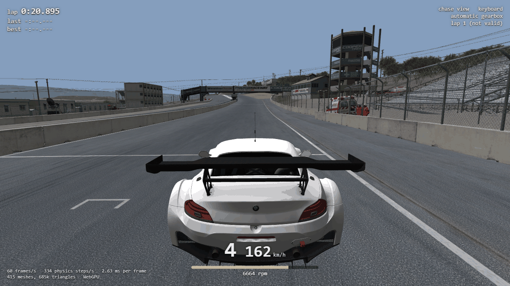
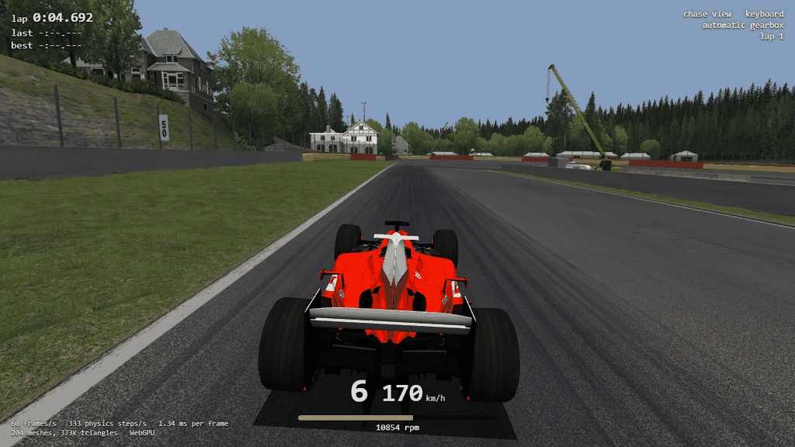

# rustyAC in the browser: a WASM preview (Task 20w)

## Resume here

State after the last commit (kept up to date with every commit):

- **Done.** Everything is on `master`, nothing is pushed. The version is 0.20.1 and the tag `v0.20.1` is on
  the last commit. Nothing is half done.
- What exists:
  - `crates/rustyac-math/src/pure.rs` + `pure_tables.rs`: MSVCR120's maths in plain Rust (`RUSTYAC_MATH=pure`;
    a wasm build always uses it), `tests/pure.rs`
  - `tools/math_proof` (`all`, `fma3-off`, `one <fn>`, `rcpps`, `parse <folders>`, `digest`)
  - `rustyac_content::vfs` (the disk, or files in memory), `install::set_ac_root`,
    `rustyac-ode/src/rcp_table.rs` (Intel's `rcpps` for non-x86), the Windows-only parts of `rustyac-game`
    behind `cfg(windows)` (`src/desktop.rs` is the old `main.rs`, `input/live.rs` the live devices),
    `crates/rustyac-game/src/bin/replay_hash.rs`
  - `crates/rustyac-web` (`content`, `session`, `driver`, `model`, `bc`, `pack`; `gpu` + `shader.wgsl` + `web`
    for wasm only; `examples/selftest.rs`, `examples/files.rs`, `tests/drive.rs`)
  - `web/` (`index.html`, `app.js`, `style.css`, `build.py`, `serve.py`, `check.mjs`, `preview.toml`),
    `tools/web_pack`
  - CI builds the site and lints both wasm targets; a release attaches `rustyAC-vX.Y.Z-web.zip`
- Checks to run again: section 9.
- On disk, git-ignored: `dist-web/site/` (the built site), `dist-web/preview/` (the preview pack, 1.46 GB of
  Kunos' files: never commit it, never release it), `target/wasm-sysroot/` and `target/web-tools/` (what
  `web/build.py` downloaded), `oracle/math/results*.md` (the maths proof), `re/scratch/task20w/` (the
  MSVCR120 disassembly tool `dlldis.py` and its listings in `asm/`, the `rcpps` probe in `rcp/`, the replay
  proof `replay_proof.py` with its table `proof/results_final.md` and the nine recorded drives `proof/ryin/`,
  the old-against-new exe check `desktop_same.py`, wasmtime 25.0.2 in `tools/`, three reader maps and three
  reviews `recon_*.md` / `review_*.md`).
- Notes for whoever goes on:
  - this PC has Rust from the stand-alone installer, **no rustup**: `web/build.py` handles that by itself; for
    a hand-typed wasm build give rustc the std it unpacked:
    `CARGO_TARGET_WASM32_UNKNOWN_UNKNOWN_RUSTFLAGS="--sysroot <repo>/target/wasm-sysroot"` (the same with
    `WASM32_WASIP1`; the WASI std has to be unpacked by hand, see section 9). Do not export a variable named
    `SYSROOT` in the same shell: clippy reads it
  - never start `chrome.exe` by itself to look at something: it joins the user's running browser.
    `web/check.mjs` starts it headless with its own profile and closes it
  - `rustyac-physics` and `rustyac-game` are **not** rustfmt-formatted (long lines): no `cargo fmt` on them
- Section 7 is the list of what does not work in the browser; section 8 the choices made without asking.

## 1. Plain-English summary

**rustyAC now also runs in a browser tab, and it computes exactly what the desktop game computes.** You open
a page, pick your own Assetto Corsa folder (or a small "preview pack" of two cars and two tracks that you host
yourself), pick a car and a track, and drive with the keyboard or an Xbox pad. The physics is the same Rust
code as `rustyac.exe`, compiled to WebAssembly, running at AC's 333 steps a second inside the page. The
picture is a small new renderer (WebGPU, or WebGL2 where the browser has no WebGPU) that draws what the old
debug view drew: the track and the car with their textures, the ground's layered textures, one sun, fog, and
a display with speed, gear, revs and lap time. No sound and not AC's own look: it is a preview.



What had to be solved, and what was found:

1. **AC's maths without AC's DLL.** The game takes `sin`, `cos`, `pow` and friends from Microsoft's
   `MSVCR120.dll`, and so does rustyAC on the desktop, because a different maths library gives different last
   digits. A browser cannot load a DLL. So the ten functions were read out of the DLL's machine code and
   written again in Rust, instruction by instruction. **Proof: for each of the seven one-argument functions,
   every one of the 4,294,967,296 possible inputs gives the same bits as the DLL**; the two-argument ones and
   the double-precision `sin` were tried on 59 billion more inputs. Not one difference, NaN results included.
2. **A surprise about the game itself.** The DLL has two versions of six of these functions and picks one by
   the processor: one for CPUs with the FMA3 instructions (everything since about 2013), one for older ones.
   They do not give the same results (44,232 of the 4.29 billion `sinf` inputs differ). So Assetto Corsa
   itself is not bit-identical between a 2012 and a 2014 processor. The Rust copy is the modern path, the one
   the game runs on this PC and on any current one.
3. **One more thing a browser lacks.** The physics engine (ODE) uses a processor instruction that computes
   an *approximate* `1/x` (`rcpps`). WebAssembly has no such thing. Intel's answers were measured and put in
   a table; the table gives the instruction's bits for all 4.29 billion inputs.
4. **The proof that the browser build is the same car.** 160 recorded drives (1,787,777 physics steps: every
   car type, every suspension type, 4WD, hybrids, crashes, loose cones, whole laps on Spa, Magione, Laguna
   Seca and others) were replayed by the desktop build and by the WebAssembly build. **After every single step
   the whole state of the car is the same, bit for bit, in all 160.** And inside Chrome itself, 10,000 steps
   of a drive end in the same state as on the desktop, on three cars and tracks.
5. **Big files.** Spa's main model is 441 MB, Laguna Seca needs 844 MB in all. The page streams them with a
   progress bar straight into the wasm memory, checks their hash, keeps them in the browser's own storage for
   the next visit, and gives the memory back once the track is built.

**The desktop game did not change.** `rustyac.exe` built before and after this task was run on 14 recorded
drives and three screenshots: byte-identical state dumps, identical pictures, identical `--help`. The
Windows-only code was put behind `cfg(windows)`, not removed. The desktop still uses the real `MSVCR120.dll`.

## 2. The maths: MSVCR120 in pure Rust

### 2.1 What was ported

`acs.exe` imports `sinf cosf tanf asinf acosf atanf powf` and the double `sin` from `MSVCR120.dll`
(12.0.21005.1, the Visual C++ 2013 runtime); rustyAC's input code also uses `expf` and `atan2f`. In that DLL:

- `sinf`, `cosf`, `tanf`, `expf`, `powf` and `sin` are AMD's LibM (hand-written assembly, computing in double
  precision). Each starts with `cmp [__use_fma3_lib], 0` and has **two bodies**: SSE2, and FMA3 (`vfmadd…`).
  The flag is set at load time when the processor has FMA3 and the OS saves the AVX state. `acs.exe` does not
  import `_set_FMA3_enable`, so it never turns the flag off. **On this PC (i9-9980HK) the flag is 1: the game
  runs the FMA3 bodies**, and those are what `pure.rs` ports. `powf`'s FMA3 body jumps into a piece of the
  SSE2 body for a base within 1/16 of 1; that piece is ported too.
- `asinf`, `acosf`, `atanf`, `atan2f` are compiled C (one path): rational approximations, `atanf` / `atan2f` in
  double precision, `atan2f` with a 241-entry table.
- The large-argument reduction multiplies the mantissa by 192 bits of 2/π picked from a table by the exponent
  (integer arithmetic). `cosf` and `sin` call a function for it, `sinf` and `tanf` have a shorter copy inline.
- Oddities that are copied as they are: `expf(-inf)` returns `-inf` (not 0); `expf` of a NaN returns it with
  the sign cleared; `powf(NaN, 0)` is NaN; `powf(-1, -inf)` is -1.

Where the DLL executes a fused multiply-add, the Rust calls `f64::mul_add`: one correctly rounded operation on
every target (an instruction where the build has one, exact software arithmetic otherwise, including in
wasm). Rule 4 of the task ("no FMA") is about the *compiler* fusing operations on its own, which changes
results; nothing is fused that the DLL does not fuse, and the build has no fast-math, no reassociation and no
SIMD flags.

The tables (2^(j/64), ln, 1/F, atan(j/256), the bits of 2/π) are copied from the DLL's data by a script.

### 2.2 The proof

`tools/math_proof all` (16 threads, 293 s), against the real `MSVCR120.dll` of this PC. Bits are compared, so
a NaN with another sign or payload would count as a difference.

| Function | Inputs | Count | Result |
|---|---|---|---|
| `sinf` | every 32-bit pattern | 4,294,967,296 | identical |
| `cosf` | every 32-bit pattern | 4,294,967,296 | identical |
| `tanf` | every 32-bit pattern | 4,294,967,296 | identical |
| `expf` | every 32-bit pattern | 4,294,967,296 | identical |
| `asinf` | every 32-bit pattern | 4,294,967,296 | identical |
| `acosf` | every 32-bit pattern | 4,294,967,296 | identical |
| `atanf` | every 32-bit pattern | 4,294,967,296 | identical |
| `atan2f` | 179,776 special pairs + random pairs drawn four ways | 1,600,179,776 | identical |
| `powf` | 179,776 special pairs + random pairs drawn four ways | 1,600,179,776 | identical |
| `sin` (double) | every float, widened to a double | 4,294,967,296 | identical |
| `sin` (double) | random 64-bit patterns | 400,000,000 | identical |
| `sin` (double) | uniform in -1e6 .. 1e6 (what the physics uses) | 400,000,000 | identical |
| `sin` (double) | 2^-30 .. 2^40, either sign | 400,000,000 | identical |

**No difference of any kind**, NaN sign and payload included.

- The special pairs are the cross product of 424 values: zeros, subnormals, the neighbours of 0.5, 1, 1.0625
  and 2, whole numbers up to 40 and their halves, 2^23, 2^24, 2^31, the largest floats, infinities, quiet and
  signalling NaNs, each with both signs.
- The random pairs come in four families of 400 million each: any bit patterns; the physics' range (`powf`:
  bases up to 20,000 with exponents -4 .. 8; `atan2f`: ±1000); values next to what the code branches on (a
  chosen exponent with a mantissa of zero, all ones or one bit); and targeted pairs (`powf`: results next to
  the overflow and underflow edges, negative bases with whole exponents, bases next to 1; `atan2f`: chosen
  exponent gaps between the two arguments).

**Sweeps for what random pairs reach too thinly** (`math_proof one edges`, 16 minutes; a reviewer's point:
both functions return a float computed from a double, so a wrong last bit of the double shows only in about
one result in 2^28, and the seams between two formulas need far more samples than chance gives them):

| Function | Inputs | Count | Result |
|---|---|---|---|
| `powf` | 6 bases on either side of 0.9375 and 1.0625 (where its two logarithms meet), each with every 32-bit exponent | 25,769,803,776 | identical |
| `powf` | every float base from 0.9375 to 1.0625 (the "near 1" logarithm, whose exponential has no fused operation), 4096 exponents each | 6,442,582,016 | identical |
| `atan2f` | `y` and `16 y` (where its table and its polynomial meet), both ways round, either sign, and one step beside, for every float | 17,179,869,184 | identical |
| `atan2f` | both sides of every exponent-gap threshold (26, -13, -26, -126, -150), random mantissas | 720,000,000 | identical |
| `powf`, `atan2f` | 36 chosen pairs (underflow edge, signed zero bases with huge odd and even exponents, subnormals) | 36 | identical |
| `sin` (double) | around its thresholds; next to 200,000 multiples of π/2 and those scaled up to 2^900; 6381956970095103 x 2^797, the double nearest of all to a multiple of π/2 | 1,600,568 | identical |

**Can the comparison fail?** `tools/math_proof fma3-off` switches the DLL to its SSE2 bodies
(`_set_FMA3_enable(0)`) and compares the same way:

| Function | Differ between the DLL's two bodies |
|---|---|
| `sinf` | 44,232 of 2^32 |
| `cosf` | 18,018 of 2^32 |
| `expf` | 1 of 2^32 |
| `powf` | 7,020 of 400 million pairs |
| `sin` (double) | 954,879 of 100 million in ±1e6; a third of them NaN handling for floats |
| `tanf`, `asinf`, `acosf`, `atanf`, `atan2f` | none (`tanf`'s two bodies agree; the others have one) |

That is also a fact about the game: **Assetto Corsa's maths depends on whether the processor has FMA3.** A
drive recorded on a pre-2013 CPU (or with AVX switched off in Windows) would not replay bit for bit on a
modern one, in the real game either.

Two more checks:

- **Numbers in files.** The game parses its ini files with the runtime's `wcstod` / `wcstol`; a wasm build
  uses Rust's parser behind the same rules. `tools/math_proof parse` ran both over every number-like token of
  every text file under `cardata/` and the install's `content/cars`, `content/tracks` and `system`:
  12,640 files, 71,657 distinct tokens, **0 parsed differently**.
- **`cargo test`** (`crates/rustyac-math/tests/pure.rs`) holds a sample (every 65,537th float, 150,000 pairs,
  150,000 doubles) against the DLL and against recorded hashes; the hash half needs no DLL and is what shows
  another target computes the same bits.

### 2.3 The backend, and whether the desktop should switch

`RUSTYAC_MATH=pure` selects the Rust functions on the desktop; a wasm build always uses them. **The desktop
default is unchanged: the DLL.** With `RUSTYAC_MATH=pure` the whole test suite passes (189 tests then, every
bit-exact golden test among them).

Recommendation: **the desktop could switch, and it would be an improvement in one respect and a risk in none
that was found.** Today a PC without the Visual C++ 2013 runtime falls back to Rust's own maths, which is not
proven equal; `pure` is. Switching the *default* is still not urgent: the DLL is by definition what the game
runs, including on an old CPU where the DLL takes its SSE2 path and `pure` would not. A sensible middle step
later: use `pure` instead of Rust's std as the fallback when the DLL is missing. Not done here.

## 3. The physics as WebAssembly

### 3.1 What had to change

`rustyac-math`, `rustyac-ode`, `rustyac-physics` and `rustyac-content` built for `wasm32-unknown-unknown` and
`wasm32-wasip1` as they were. What was added or moved:

- **`rustyac_content::vfs`**: every file access of the loaders goes through it. With nothing mounted (the
  desktop, always) each call is the `std::fs` call it replaced. The browser mounts a set of files held in
  memory. It can also log every path asked for, which is how the pack tool learns what a drive reads.
- **`rcpps`** (section 3.3).
- **`rustyac-game`**: the window, Direct3D, DirectInput, XInput, FMOD, the physics thread, the shared memory
  and the command line are compiled only on Windows (`cfg(windows)`, the `windows` crate and the audio and
  render crates became Windows-only dependencies). What is left elsewhere is the simulation (`sim`), the
  replay files, AC's keyboard and pad classes, the line follower, the camera and scene maths. The old
  `main.rs` is `desktop.rs`, unchanged but for `pub fn main`; the live devices moved from `input/mod.rs` to
  `input/live.rs`, unchanged.
- The track loader's stopwatch reads zero in a browser (`Instant::now` panics there).
- `replay_hash` (a second binary of `rustyac-game`): replays a `.ryin` and writes two hashes per step, of the
  exact bits and with every NaN made the same.

### 3.2 The proof

`python re/scratch/task20w/replay_proof.py`: every recorded drive through `replay_hash.exe` (desktop,
`MSVCR120.dll`) and `replay_hash.wasm` (`wasm32-wasip1`, pure maths, under wasmtime 25.0.2 with the game's
folder mounted at `/ac`). The per-step hash covers what `--dump-states` writes: bodies, joints, tyres, every
traced value of the powertrain, the aids, the telemetry page and the track (rays, lap timer, place on the
line), and the force tape.

**160 drives, 1,787,777 steps: every step's hash is equal in all 160.** No NaN-only differences either.

The ones the task asked for by name:

| Drive | Car | Track | Steps | wasm against desktop |
|---|---|---|---|---|
| line follower, 76 s | Ferrari F2004 | Spa | 25,459 | identical |
| line follower, 76 s | Ferrari F2004 | Magione | 25,458 | identical |
| line follower, 76 s | Ferrari F2004 | Laguna Seca | 25,454 | identical |
| line follower, 76 s | BMW M3 E30 (strut front, Task 17) | Spa | 25,461 | identical |
| line follower, 76 s | BMW M3 E30 | Magione | 25,458 | identical |
| line follower, 76 s | BMW M3 E30 | Laguna Seca | 25,453 | identical |
| line follower, 76 s | BMW Z4 GT3 (the pack's second car) | Spa, Magione, Laguna Seca | 76,371 | identical |
| `spa_autodrive_300s` (300 s) | Ferrari F2004 | Spa | 100,000 | identical |
| `lap_trk_lap` (a whole lap with the collider) | Ferrari F2004 | Spa | 50,444 | identical |
| `awd_sesto_wc_spirited` (4WD) | Lamborghini Sesto Elemento | flat road | 4,001 | identical |
| `awd2_r8_wc_stops` (4WD, second kind) | Audi R8 Plus | flat road | 4,334 | identical |
| `hy_ks_ferrari_sf15t_hy_deploy` (ERS) | Ferrari SF15-T | flat road | 10,001 | identical |
| `hy_ks_ferrari_f138_hy_deploy` (KERS) | Ferrari F138 | flat road | 10,001 | identical |
| Task 17 suspensions, 15 drives | E30 (strut), 250 GTO (axle), 812 Superfast (rear steer), Formula K (old tyre) | flat road | 65,849 | identical |
| `collide_spa_wall_high`, `_low`, `_slide`, `_gravel` (crashes) | Ferrari F2004 | Spa | 24,002 | identical |
| `e30_spa_wall_slide`, two more E30 crashes | BMW M3 E30 | Spa | 18,002 | identical |
| loose objects hit (`trk_object`), 8 drives | F2004, E30 | Laguna Seca, Nürburgring, Monza, Monza 66, Spa | 58,672 | identical |

And all of them by family:

| Recordings | Drives | Steps |
|---|---|---|
| Tasks 8 to 11: flat-road scenarios (chassis, powertrain, whole car, test cars) | 48 | 224,484 |
| Task 12: Spa (launch, Eau Rouge, kerbs, grass, a lap, 300 s of the line follower; the F40) | 7 | 149,358 |
| Task 13: walls, floor, kerbs, bottoming | 8 | 55,338 |
| Task 15: conditions (cold, hot, wind, green track) and saved setups | 6 | 41,673 |
| Task 16: 4WD, KERS, ERS, the VRC Formula Alpha | 5 | 30,346 |
| Task 17: strut, axle, multilink, rear steer, old tyre, and their crashes | 18 | 83,851 |
| Task 18: every track (laps, kerb strikes, loose objects, pit lanes, drag strips, the drift pad, point-to-point) | 57 | 960,278 |
| Task 19: the sound's end-to-end drives | 2 | 13,335 |
| recorded for this task: F2004, E30, Z4 GT3 on Spa, Magione, Laguna Seca | 9 | 229,114 |
| **all** | **160** | **1,787,777** |

The full table is `re/scratch/task20w/proof/results_final.md`.

**The first run did not pass, and why matters.** Seven drives differed, all of them where the car hits
something hard enough for eight or more contact rows (loose objects, a wall late in a long drive): the
`rcpps` of section 3.3. With Intel's table in place they are identical.

The NaN question of the task: no difference showed up. Where the car's values are NaN (the side velocity on
the AI line that the game divides by a zero time step), both builds produce the same NaN bits in every step
of every drive. That is observed, not guaranteed: WebAssembly leaves a NaN's payload open, so `replay_hash`
keeps its second, NaN-blind hash for the day it does differ.

### 3.3 `rcpps`: the instruction a browser does not have

ODE inside `acs.exe` was built with the fast floating-point model, and in `_dLDLTRemove` (the solver removing
a row from its factorisation) the compiler turned `L[i] / d[i]` into the processor's **approximate reciprocal**
`rcpps` plus one Newton step, for blocks of eight. `rcpps` is not an IEEE operation: it is a table lookup
inside the processor, 12 bits, and Intel and AMD answer differently. The port executes the instruction on
x86, as the game does. WebAssembly has no such instruction.

What Intel's does was measured on this PC: the result depends only on the sign, the exponent (negated) and
the top eleven bits of the mantissa; an operand below the smallest normal number gives an infinity, 2^126 and
above gives zero, a NaN comes back quiet. `crates/rustyac-ode/src/rcp_table.rs` is the 2048 answers, and
`matrix::rcpps_intel` the rule. **`tools/math_proof rcpps`: all 4,294,967,296 operands give the instruction's
bits** on this Intel processor. A non-x86 build uses the table; x86 keeps executing the instruction.

Consequence: **the browser computes what an Intel desktop computes.** On an AMD desktop the game itself, and
`rustyac.exe`, can differ from it in the rare step where that solver path runs with eight or more rows.

### 3.4 The same check in the browser itself

The WASI proof runs the physics crates as wasm, but not the browser build (another target, the files in
memory, Chrome's engine). So the page has a self test: with `?selftest=N` the line follower drives N steps
from the hot-lap start and the page reports the hash of the car's whole state; `--example selftest` does the
same on the desktop.

| Car, track (10,000 steps = 30 s) | Files from | Desktop (`MSVCR120.dll`) | Headless Chrome 155 (wasm, pure maths) |
|---|---|---|---|
| BMW Z4 GT3, Laguna Seca | the preview pack | `6fb6f38be9bf7692` | `6fb6f38be9bf7692` |
| Ferrari F2004, Spa | the preview pack (WebGL2 picture) | `7b766d57d1575d7f` | `7b766d57d1575d7f` |
| BMW M3 E30, Magione | the folder picker's test hook | `4239757a62aa1f0f` | `4239757a62aa1f0f` |

(The first try differed: the line follower's own `atan2` and `sin` came from Rust's maths library, which is
another one in wasm. On a non-Windows build it now uses `rustyac-math`. That was the driver's input, not the
physics; the desktop's follower is untouched.)

`cargo test -p rustyac-web` does the memory-file-system half on the desktop: the files a drive needs are
copied into memory, mounted in place of the disk, and the drive (5 s, two car and track pairs) ends in the
same state as from disk.

## 4. The web app

### 4.1 The loop

Physics at 333 Hz from a fixed-step accumulator inside `requestAnimationFrame`
(`crates/rustyac-web/src/session.rs`). The page hands in the time since its last frame; every whole 3 ms in the
accumulator is one physics step, run back to back inside the callback; the picture is drawn between the last
two steps, blended by what is left over, exactly as the desktop's window draws between the physics thread's
last two. No thread, no timer, so no COOP / COEP headers.

**When a frame is slow:** a frame that took longer than 100 ms (a tab that was hidden, a stall while shaders
compile) counts as 100 ms. At most 34 steps are caught up; the rest of the time is dropped, so the car falls
behind the wall clock instead of the page freezing while it catches up, and the display says how much was
dropped. It is the desktop physics thread's own rule (more than 100 ms late: start the schedule again). A
machine that cannot do 333 steps a second at all runs in slow motion. Every step is always a whole 3 ms step:
a slow frame never changes the physics, only how much of it happens.

The car is put down the desktop's way (470 unpaced steps of settling and selecting first gear; after R or N
they run inside the one frame, as the desktop's thread runs them without waiting), and the same watch puts a
car back that lies on its roof for three seconds, has left the world or has broken numbers.

### 4.2 The picture

`gpu.rs` + `shader.wgsl`: a `wgpu` 30 renderer, WebGPU where `navigator.gpu` gives an adapter, WebGL2
otherwise (or with `?backend=webgl`). It is the debug view's loader and shaders moved over rule for rule:

- every drawn kn5 mesh with its diffuse texture; `useDetail` materials with their detail texture; the
  multilayer ground (`ksMultilayer`, `_objsp`: four tiled detail textures weighted by a mask) and `ksGrass`
- the car's model posed by the physics: body, the four hubs, the four wheels turning, the steering wheel
- one sun with an ambient share (or `ksAmbient` / `ksDiffuse` where a material has them), distance fog, the
  shadow patch under the car, alpha blending, alpha-to-coverage for fences and trees with 4x MSAA
- the game's two passes (opaque in file order, then `isTransparent` far to near), culling by bounding
  sphere, each mesh's LOD range, the track's loose objects following their bodies
- AC's cameras from the debug view's code: F1 goes through chase, chase 2, bonnet, bumper, dash, cockpit
- the display is HTML over the canvas: gear, speed, revs with a bar, lap / last / best time, view, device,
  aids, and frames, physics steps and milliseconds per frame

Textures: block-compressed (DXT1/3/5) go to the card as they are where the device has the feature (desktop
GPUs); elsewhere they are unpacked to RGBA in Rust, at half the size cap. Blue-first uncompressed textures are
turned to red-first (WebGL2 has no BGRA; a mask stored that way made the road black there). An image with one
level gets a mip chain.



### 4.3 Input

AC's own classes, the ones the desktop uses: `KeyboardCarControl` (the steering speed by road speed, the
throttle ramp with its slip back-off, the brake that asks the car for its best pressure) and
`JoypadCarControl` (dead zone, gamma, speed sensitivity, filter), with rustyAC's built-in bindings.

- **Keyboard:** AC's default keys plus WASD: Up / W throttle, Down / S brake, Left / A and Right / D steer,
  Space / E and Left Ctrl / Q gears, Left Shift clutch, F DRS, K KERS, B or F9 handbrake, L lights. The page
  turns `KeyboardEvent.code` into the Windows key codes those classes speak.
- **Gamepad** (Gamepad API, standard layout, turned into XInput's units): RT gas, LT brake, left stick steer,
  Y up, X down, A clutch, LB DRS, B KERS / ERS, RB handbrake, D-pad TC and brake bias, Back reset (held: back
  onto the track), Start pause, right stick press next view. The pad's rumble plays through the browser's
  `vibrationActuator` where there is one. Whichever device was touched last drives, as on the desktop.
- **R** back to the pits (the car starts in its pit box by default), **Shift+R** back onto the track where it
  is, **N** a new car, **G** automatic gearbox, **F1 / C** view, **P** pause, **Esc** menu, **H** the key list.
- **`controls.ini`:** AC keeps it in `Documents\Assetto Corsa\cfg`, which is not inside the game's folder, so
  the page cannot reach it. The defaults stand; the menu says so and lists the keys, and a small key list is
  shown over the picture for the first seconds of a drive.

### 4.4 Content

- **Open your AC folder:** `showDirectoryPicker` (Chrome, Edge), or an `<input webkitdirectory>` elsewhere.
  The page walks only what a drive can need (each car's top folder and `data`, each track's folder without
  its skins, `system/data`), reads the small files that make the lists (each track's models file, menu entry
  and surfaces; each car's menu entry), and shows the cars and tracks. In the background every car's `data.acd`
  (a few hundred kB) is read and the car is built once by the real loader: a car that does not load is greyed
  out with the loader's reason. A chosen car's and track's files are read from the disk when Drive is
  pressed. The folder's handle is kept in IndexedDB: the next visit needs one click, or none where the browser
  kept the permission.
- **The preview pack:** `preview/manifest.json` next to the page (or `?pack=<url>`). Only the chosen car's
  and track's files are fetched; each is hashed while it streams, compared with the manifest, and kept in the
  browser's storage (OPFS) for the next visit.
- **Refusals** are the desktop's own, word for word, because it is the same code: on this install the page
  lists 123 cars and 54 track entries and refuses the same 4 cars (`urd_darche_992_23`: data encrypted for
  CSP; three `_csp` cars: CSP's `COSMIC` suspension) and the same 10 track entries (DLC layouts that are not
  owned, CSP-only tracks) as `acd_check --refused` and `track_survey`. A track's models are only opened when
  it is loaded, so a damaged or encrypted model is refused at Drive, not in the list.

### 4.5 The pack tool and the build

`tools/web_pack` reads `web/preview.toml`, refuses more than 2 cars or 2 tracks, loads every car on every
track once with the file log on and copies exactly the files that were read. `web/build.py` builds the site;
`web/serve.py` serves it locally; `web/check.mjs` drives it in a headless Chrome. The commands are in
[docs/web.md](../web.md).

### 4.6 Build it, try it, host it

The exact commands (the long version, with what each one fetches and writes, is [docs/web.md](../web.md)):

```
python web/build.py                                             # the site        -> dist-web/site/
cargo run --release --manifest-path tools/web_pack/Cargo.toml   # the preview pack -> dist-web/preview/
python web/serve.py                                             # http://127.0.0.1:8080/
```

- `web/build.py` needs Rust and Python and nothing else installed: it fetches Rust's wasm standard library
  (through rustup, or without it), `wasm-bindgen` 0.2.129 and `wasm-opt` (binaryen version_123) into
  `target/`, each checked against a hash. `--zip <file>` also makes the release's web zip.
- `tools/web_pack` reads `web/preview.toml` (default: `ks_ferrari_f2004`, `bmw_z4_gt3`, `spa`,
  `ks_laguna_seca`), finds the install (`AC_ROOT`, Steam's usual place, or `-- --ac <folder>`), copies only
  what the loaders read, writes `manifest.json`, prints the sizes. `-- --dry-run` only prints.
- `web/serve.py` serves the site and, if it is there, the pack at `/preview/`, to this computer only.
- **Hosting** is copying files: upload the content of `dist-web/site/` (or unpack a release's
  `rustyAC-vX.Y.Z-web.zip`) to any static web server with HTTPS; no special headers. For the pack, upload
  `dist-web/preview/` as a folder named `preview` next to `index.html` (or anywhere, and open the page with
  `?pack=<url>`), **somewhere only you can reach**: it is Kunos' content.

## 5. Sizes

1 MB = 1,000,000 bytes.

**The site** (what a release's `-web.zip` holds):

| File | Size |
|---|---|
| `pkg/rustyac_web_bg.wasm` after `wasm-opt -O3` | 4.07 MB (5.68 MB before) |
| `pkg/rustyac_web.js` (wasm-bindgen's glue) | 0.13 MB |
| `index.html`, `app.js`, `style.css`, the two licence files | 0.08 MB |
| **the whole site** | **4.28 MB** |
| as `rustyAC-v0.20.1-web.zip` | 1.59 MB |

**The preview pack** with the default four (`web/preview.toml`), 37 files:

| | Size | Files | The largest file |
|---|---|---|---|
| car `ks_ferrari_f2004` (Ferrari F2004) | 43.7 MB | 4 | `ferrari_f2004.kn5` 43.5 MB |
| car `bmw_z4_gt3` (BMW Z4 GT3) | 35.2 MB | 4 | `BMW_Z4_GT3.kn5` 35.0 MB |
| track `spa` (Spa) | 532.2 MB | 12 | `spa.kn5` 441.4 MB |
| track `ks_laguna_seca` (Laguna Seca) | 844.0 MB | 16 | `ks_laguna_seca.kn5` 359.4 MB |
| `system/data/surfaces.ini` (shared) | 923 bytes | 1 | |
| **total** | **1,455.1 MB** | 37 | |

Laguna Seca is the bigger one: ten model files, three of them over 100 MB. One drive fetches one car and one
track: 576 MB for the F2004 at Spa, 879 MB for the Z4 at Laguna Seca. How the page copes with files that
large is in [docs/web.md](../web.md), "How the page copes with a 441 MB file": streamed in pieces into one
buffer, a progress bar by bytes, hashed on the way, cached in the browser, freed after the load.

## 6. Performance in the browser

This PC (i9-9980HK, Radeon Pro 5500M, Windows 10), headless Chrome 155, 1280 x 720, 4x MSAA, the line
follower driving for 20 seconds; the first second is left out of the averages.

| Car, track | Picture | Frames/s | Physics steps/s | Work per frame (physics + drawing, CPU) | Drawn per frame |
|---|---|---|---|---|---|
| Z4 GT3, Laguna Seca | WebGPU | 59.9 | 333.3 | 2.3 ms | 415 meshes, 685k triangles |
| Z4 GT3, Laguna Seca | WebGL2 (ANGLE on Direct3D 11) | 59.9 | 333.4 | 5.1 ms | 412 meshes, 670k triangles |
| F2004, Spa | WebGPU | 59.9 | 333.3 | 1.6 ms | 204 meshes, 373k triangles |
| E30, Magione (from the folder) | WebGPU | 59.9 | 333.3 | 1.8 ms | 380 meshes, 441k triangles |

The frame rate is the display's 60 Hz (the browser paces `requestAnimationFrame`); the physics holds its 333
steps a second with a wide margin: 5.6 steps a frame take well under a millisecond. WebGL2 costs about twice
the CPU time per frame for the same picture (every draw is several GL calls).

How fast the physics alone goes, unpaced (the self test, steps a second; 333 is real time):

| Car, track | Desktop exe | Chrome (wasm) | wasm against real time |
|---|---|---|---|
| Z4 GT3, Laguna Seca | 5,950 | 4,510 | 13.5 x |
| F2004, Spa | 11,190 | 6,700 | 20 x |
| E30, Magione | 14,920 | 10,300 | 31 x |

So the wasm physics runs at 60 to 75 % of the desktop's speed, with the software fused multiply-add of the
maths included.

Loading (the local server, no cache): Laguna Seca's 879 MB arrive in 10 to 13 s and the track and car are
built in 3.3 to 4.6 s; Spa's 576 MB in 6.8 s, built in 4.6 s; Magione's 360 MB from the folder hook in 5.7 s,
built in 1.8 s. From the browser's storage on a second visit: Laguna Seca in 2.1 s. Listing the folder's 123
cars and 54 tracks and building every car once takes a few seconds in the background.

The lap timer in the 20-second drives, read from the page's display:

| Files from | Car, track | Lap timer after 20 s | Speed |
|---|---|---|---|
| the preview pack | Z4 GT3, Laguna Seca (WebGPU) | 0:20.4 to 0:20.8 (first lap's clock, from the hot-lap point) | 158 to 162 km/h |
| the preview pack | Z4 GT3, Laguna Seca (WebGL2) | 0:21.6 | 171 km/h |
| the preview pack | F2004, Spa | 0:04.6 into lap 1 (it had crossed the start line) | 174 km/h |
| the folder picker's test hook | Z4 GT3, Laguna Seca | 0:20.6 | 160 km/h |
| the folder picker's test hook | F2004, Spa | 0:04.6 into lap 1 | 173 km/h |
| the folder picker's test hook | E30, Magione | 0:21.3 | 103 km/h |

(The clock differs a little from run to run because the page starts counting frames at a slightly different
moment; the physics inside is the same, which the self test of section 3.4 shows with exact step counts.)

## 7. What works and what does not in the browser

Works:

- the whole Vanilla physics, bit for bit the desktop's: all 119 cars that load on the desktop, all 44 track
  layouts (the loaders are the same code; the browser was driven on three tracks with three cars)
- lap timing, pit lane, track limits, DRS zones, loose objects, damage, the aids, KERS / ERS, the cockpit keys
- keyboard and gamepad with rumble, AC's default keys
- the folder picker (Chrome, Edge, other Chromium browsers) and the preview pack, with the browser-side cache
- WebGPU and WebGL2

Does not, or not yet:

- **No sound** (FMOD is a native library) and **not AC's look** (its shaders are Direct3D bytecode): no
  shadows, no reflections, no sky, no skinned meshes (the driver), no car LOD switching (the first level is
  always drawn), no skins (the model's own textures)
- **No wheel and no force feedback**: browsers have no API for it. A wheel that shows up as a gamepad is read
  as a gamepad
- **No `controls.ini`**, no saved setups, no `race.ini` conditions: the session is the built-in one (26 °C
  air, 30 °C road, grip 100 %, no wind). No shared memory, no telemetry, no `.ryin` recording or replay
- **One car, one session**: picking another car or track reloads the page (a canvas cannot be handed to a
  second graphics device). With the folder picker the browser may then ask for the folder once more
- **Memory**: a big track needs about 1 to 1.5 GB in the tab while it loads; a 4 GB device may fail on Spa or
  Laguna Seca. The whole model file is held in memory to be parsed, although nine tenths of it is textures
- **Firefox and Safari**: the folder goes through `<input webkitdirectory>`, which lists every file of the
  install first (slow) and is not remembered; not tried here. Their WebGPU support varies; WebGL2 is the
  fallback. Only Chrome 155 was run
- the page **stands still for 2 to 5 seconds** while the track's collision trees are built (no worker thread)
- **The first frames** after a load compile the pipelines: a short stall, counted as dropped time
- The keyboard's steering has no AI-line look-ahead (as on the desktop: the debug-view shortcut)

## 8. Open questions (the choices made without asking)

1. **Which maths path.** The FMA3 bodies were ported, because that is what the game runs on any processor
   since 2013. The SSE2 bodies (a pre-2013 CPU, or AVX disabled) are not ported. Is that enough, or should
   `pure` grow the second path, so a replay from such a machine can be reproduced?
2. **`rcpps` is Intel's.** The browser matches an Intel desktop. On AMD the game's own instruction answers
   differently (this was known since Task 13). A second table for AMD would need an AMD machine to measure.
   Worth it?
3. **The desktop fallback.** Without the VC++ 2013 runtime the desktop still falls back to Rust's std maths,
   as before. `pure` would be the better fallback now. Not changed, because the desktop was to stay as it is.
4. **The preview pack is 1.46 GB.** Spa and Laguna Seca are among the largest tracks. For a Chromebook,
   Magione (350 MB) or Imola would be kinder; the default in `web/preview.toml` is what the task named.
5. **Hosting the pack.** `docs/web.md` says: for yourself only (behind a login or on your own network). The
   page fetches it with plain requests, so any access control of the server works. Nothing in the site
   enforces it.
6. **Read-only mount in the WASI proof.** wasmtime 25 and Node's WASI have no read-only switch for a mounted
   folder. The game's folder was mounted normally; `replay_hash` opens files for reading only (its one write
   is the hash file, into `re/scratch`). Nothing in the folder was written.
7. **The start point.** The car starts in its pit box (so R is "back to the pits", as the task says); the menu
   also offers the hot-lap point and the grid. The line follower (`?autodrive=1`) starts from the hot-lap
   point because it cannot find its way out of a pit box.
8. **The automatic gearbox is on by default** in the page (a checkbox, and G while driving). The desktop's
   default is off unless `assists.ini` says so; a preview on a keyboard seemed better with it on.
9. **`wgpu` 30** (the current one) rather than an older version: browsers' WebGPU changed through 2025 and an
   old `wgpu` would have met a newer Chrome. The wasm is 4.1 MB with both backends in it.
10. **The display is HTML**, not drawn on the graphics card as the desktop's is: sharper, and no font to
    ship.
11. **The build tools are downloaded** by `web/build.py` (pinned versions, SHA-256 checked) into `target/`.
    The alternative, `cargo install wasm-bindgen-cli`, compiles for minutes; binaryen has no cargo package
    that is quick. Rust's wasm std is fetched the same way where there is no rustup (this PC).
12. **A slip while working:** to learn Chrome's version, `chrome.exe --version` was started once without
    `--headless`; on Windows that hands the command to the running browser instead of printing a version.
    No new window was found afterwards (the one visible window was the user's own), nothing was closed.
    Every later start was headless with its own profile.
13. **`autodrive.rs` on non-Windows** takes its three trigonometric calls from `rustyac-math` (see 3.4). On
    Windows it is untouched.
14. **Number parsing** in a wasm build is Rust's, checked against the runtime's on all 71,657 numbers of the
    installed content; a mod with a number written in a way none of them is could still parse differently.
15. **The browser's file cache trusts a cached file by its size.** A file is hashed against the manifest when
    it is downloaded, and only a file that passed is kept (under its hash as its name). On the next visit it
    is taken if its size is right, without hashing 800 MB again. Nothing removes old pack versions from the
    browser's storage except the browser's own "clear site data".
16. **What three reviewers found** (Sonnet, read-only, at the end: one on "is the desktop unchanged", one on
    the maths, one on the web app). No desktop behaviour change was found. Fixed after their reports: the
    WebGL2 fallback could not work after a failed WebGPU attempt on the same canvas (the page now asks the
    browser for an adapter first); a new car (N) lost its collider model because the model files' memory had
    been given back (the small collider is kept now); Drive could be pressed twice while loading; R ran its
    settling steps paced; a NaN in the display's numbers would have stopped the frame loop; a broken download
    left its buffer and cache file behind; the background car check asked for every car's collider; the local
    server did not check the `Host` header; `web_pack` could be pointed into the game's folder; `build.py`
    took `RUSTFLAGS` from the environment; the four NaN returns of `powf` were additions (now bit operations:
    WebAssembly does not promise which NaN an addition gives); `math_proof` exited with 0 on a difference. The
    maths reviewer also asked for the sweeps of section 2.2 (the seams between `powf`'s and `atan2f`'s
    formulas, which random pairs reach thinly). Left as it is: a folder name that is not valid Unicode is
    not found through the new file layer (the old code found it; no such folder exists in an AC install).

## 9. How to check everything again

```
# the maths against the DLL (5 minutes; the result table goes to oracle/math/results.md)
cargo build --release --manifest-path tools/math_proof/Cargo.toml
tools/math_proof/target/release/math_proof all --out oracle/math/results.md
tools/math_proof/target/release/math_proof fma3-off --pairs 400000000
tools/math_proof/target/release/math_proof rcpps
tools/math_proof/target/release/math_proof parse cardata "<AC>/content/cars" "<AC>/content/tracks" "<AC>/system"

# the whole test suite with the pure maths
RUSTYAC_MATH=pure cargo test --release --workspace

# wasm against desktop, 160 drives (15 minutes). Needs wasmtime in re/scratch/task20w/tools, the WASI std
# (rust-std-<version>-wasm32-wasip1 from static.rust-lang.org unpacked into target/wasm-sysroot/lib/rustlib),
# copies of the two binaries in re/scratch/task20w/bin, and the recordings in oracle/game
CARGO_TARGET_WASM32_WASIP1_RUSTFLAGS="--sysroot <repo>/target/wasm-sysroot" cargo build --release -p rustyac-game --target wasm32-wasip1
cp target/release/replay_hash.exe target/wasm32-wasip1/release/replay_hash.wasm re/scratch/task20w/bin/
python re/scratch/task20w/replay_proof.py

# the browser build
python web/build.py
cargo run --release --manifest-path tools/web_pack/Cargo.toml
python web/serve.py --port 8137 --ac "<AC>"            # in another terminal
node web/check.mjs --url "http://127.0.0.1:8137/?go=1&autodrive=1&car=bmw_z4_gt3&track=ks_laguna_seca&nocache=1" --seconds 20 --screenshot shot.png
node web/check.mjs --url "http://127.0.0.1:8137/?go=1&autodrive=1&car=bmw_z4_gt3&track=ks_laguna_seca&nocache=1&backend=webgl" --seconds 20
node web/check.mjs --url "http://127.0.0.1:8137/?go=1&autodrive=1&car=ks_ferrari_f2004&track=spa&nocache=1" --seconds 20
node web/check.mjs --url "http://127.0.0.1:8137/?testfolder=/ac-test/&go=1&autodrive=1&car=bmw_m3_e30&track=magione" --seconds 20 --wait-checks
node web/check.mjs --url "http://127.0.0.1:8137/?go=1&autodrive=1&car=bmw_z4_gt3&track=ks_laguna_seca&selftest=10000&nocache=1"
cargo run --release -p rustyac-web --example selftest -- bmw_z4_gt3 ks_laguna_seca --steps 10000

# the desktop is what it was: v0.20.0's exe against this one (a worktree of the tag, built, then removed)
python re/scratch/task20w/desktop_same.py
```

**The desktop against v0.20.0** (`desktop_same.py`; `rustyac.exe` built from the tag in a temporary worktree
against this branch's):

| What | Compared | Result |
|---|---|---|
| 14 replays with `--dump-states`: flat-road random and stops, two Spa crashes, a Spa lap with the collider, 4WD, ERS, the E30's suspension, a loose object at Monza, a saved setup, a whole lap, three line-follower drives at Laguna Seca | the state dump of every step, 53 MB to 1.66 GB each | byte-identical, all 14 |
| `--screenshot` after 12 s of the line follower (Z4 GT3, Magione): AC's renderer from the chase and the cockpit camera, the debug view | the PNG and the car's pose file | identical, all three |
| `--help`, `--list-tracks`, `--list-devices` | the printed text | identical |
| `cargo test --release --workspace` | 201 tests (was 189: twelve new ones) | all pass |
| the release zip | `packaging/package.ps1` is untouched; it packs `rustyac.exe` and the same seven files | the same |
